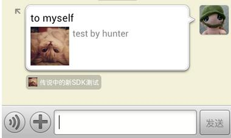
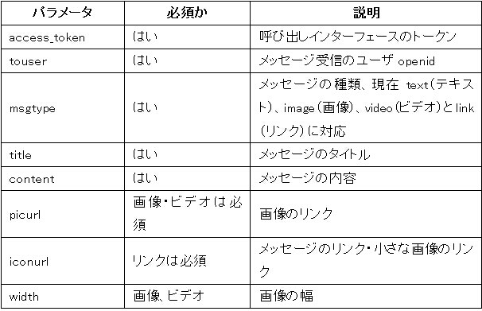
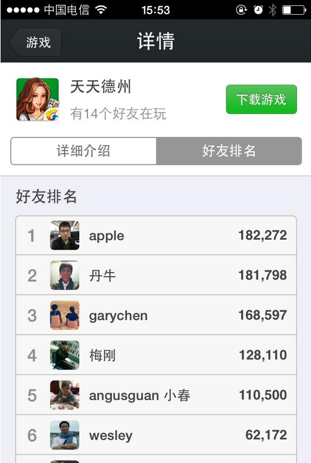

# 3.ウィーチャット・インターフェース #

## 3.1authサービス ##

　　ウィーチャットOauth授権ログインの関連機能を実現します

### 3.1.1 /auth/refresh_token ###

#### 3.1.1.1インターフェースの説明 ####

　　　access_tokenの有効期間が短く(2時間)、access_tokenがタイムアウトの場合、refresh_tokenを利用して更新できます。refresh_tokenの有効期間は30日間であり、refresh_tokenが無効となると、再ログインを必要とします。 
　　　urlにはmsdkExtInfo=xxx（リクエストのシリアル番号）を付け、コールバックの内容でmsdkExtInfoのオリジナル・データを戻し、純異常リクエストを実現できます。msdkExtInfoはオプションのパラメータです。

#### 3.1.1.2入力パラメータの説明 ####

| パラメータ名称| 種類|記述|
| ------------- |:-------------:|:-----|
| appid|string| アプリのプラットフォームでの唯一id |
| refreshToken|string|フロントエンドのログインで取得したrefreshTokenパラメータを記入します |

#### 3.1.1.3出力パラメータの説明 ####

| パラメータ名称| 記述|
| ------------- |:-----|
| ret|リターンコード  0：正確，その他：失敗 |
| msg|retが0以外の場合、「エラーコード、エラーメッセージ」が表示されます。詳細注釈は第5節を参照してください|
| accessToken|インターフェース呼び出しトークン |
| expiresIn|accessTokenインターフェース呼び出しトークンの期間切れ時間であり、単位は秒 |
| refreshToken|ユーザーによるaccessToken更新用 |
| openid|一般ユーザーの唯一標識（ウィーチャットプラットフォーム） |
| scope|ユーザー授権の動作領域であり、カンマ（,）で切り分け、動作領域の詳細情報は下表に示します。動作領域の名称	役割	デフォルトの状態 snsapi_friend	授権時にデフォルトでは選択しません	ユーザー友達の資料取得を授権します snsapi_message	授権時にデフォルトでは選択しません	　　ユーザーによるウィーチャット送信の資格取得を授権します snsapi_userinfo	授権時にデフォルトでは選択します　	ユーザーの個人資料の取得を授権します |

#### 3.1.1.4 インターフェース呼び出し説明 ####

| パラメータ名称| 記述|
| ------------- |:-----|
| url|http://msdktest.qq.com/auth/refresh_token/ |
| URI|?timestamp=**&appid=**&sig=**&openid=**&encode=1|
| 形式|JSON |
| リクエスト方式|POST  |

#### 3.1.1.5 リクエストサンプル ####

	POST /auth/refresh_token/?timestamp=*&appid=**&sig=***&openid=**&encode=1 HTTP/1.0
	Host:$domain
	Content-Type: application/x-www-form-urlencoded
	Content-Length: 198
	
	{
	    "appid": "wxcde873f99466f74a",
	    "refreshToken": "OezXcEiiBSKSxW0eoylIeLl3C6OgXeyrDnhDI73sCBJPLafWudG-idTVMbKesBkhBO_ZxFWN4zlXCpCHpYcrXFXf2RE2ETF5F7lhiPkxA9ewAu90r3JLXpM1T4nfr9Iz184ZB0G7br72EfycDenriw"
	}
	
	//戻り結果
	{
	    "ret": 0,
	    "msg": "success",
	    "accessToken": "OezXcEiiBSKSxW0eoylIeLl3C6OgXeyrDnhDI73sCBJYyBcXKXYWTlxU_BAMfu7Rzsr51Nu-CarhcPT6zYlD9FrWRzuA0ccQMgrTGqpao2AnzoP_nZ6CrBdwZ3VEQcqDPNZ-wLIvK998t3s2ecEM4Q",
	    "expiresIn": 7200,
	    "refreshToken": "OezXcEiiBSKSxW0eoylIeLl3C6OgXeyrDnhDI73sCBJYyBcXKXYWTlxU_BAMfu7Rzsr51Nu-CarhcPT6zYlD9D8IrNu9lm2w4XfMqS3j9OJgjv_8L1vvSkTjBt0q7X5foYiJOhVaNx6tDGzFkJw0vw",
	    "openid": "oGRTijrV0l67hDGN7dstOl8CphN0",
	    "scope": "snsapi_friend,snsapi_message,snsapi_userinfo,"
	}

### 3.1.2 /auth/check_token ###

#### 3.1.2.1インターフェースの説明 ####

ウィーチャットでは授権トークン(access_token)の有効・無効を確認します。
urlにはmsdkExtInfo=xxx（リクエストのシリアル番号）を付け、コールバックの内容でmsdkExtInfoのオリジナル・データを戻し、純異常リクエストを実現できます。msdkExtInfoはオプションのパラメータです。

#### 3.1.2.2入力パラメータの説明 ####

| パラメータ名称| 種類|記述|
| ------------- |:-------------:|:-----|
| accessToken|string|ログイン状態 |
| openid|string|ユーザーのあるアプリでの唯一標識 |

#### 3.1.2.3出力パラメータの説明 ####

| パラメータ名称| 記述|
| ------------- |:-----|
| ret|リターンコード  0：正確，その他：失敗 | 
| msg|retが0以外の場合、「エラーコード、エラーメッセージ」が表示されます。詳細注釈は第5節を参照してください|

#### 3.1.2.4 インターフェース呼び出し説明 ####

| パラメータ名称| 記述|
| ------------- |:-----|
| url|http://msdktest.qq.com/auth/check_token/ |
| URI|?timestamp=**&appid=**&sig=**&openid=**&encode=1|
| 形式|JSON |
| リクエスト方式|POST  |

#### 3.1.2.5 リクエストサンプル ####
	
	POST /auth/check_token/?timestamp=*&appid=**&sig=***&openid=**&encode=1 HTTP/1.0
	Host:$domain
	Content-Type: application/x-www-form-urlencoded
	Content-Length: 198
	
	{
	    "accessToken": "OezXcEiiBSKSxW0eoylIeLl3C6OgXeyrDnhDI73sCBJPLafWudG-idTVMbKesBkhBO_ZxFWN4zlXCpCHpYcrXNG6Vs-cocorhdT5Czj_23QF6D1qH8MCldg0BSMdEUnsaWcFH083zgWJcl_goeBUSQ",
	    "openid": "oGRTijiaT-XrbyXKozckdNHFgPyc"
	}
	
	//戻り結果
	{"ret":0,"msg":"ok"}

## 3.2 Shareサービス ##
ウィーチャットの指定共有の能力を提供します

### 3.2.1/share/upload_wx ###

#### 3.2.1.1 インターフェースの説明 ####

画像をウィーチャットにアップロードすることでmedia_idを取得し、/share/wxインターフェースの入力パラメータthumb_media_idに渡します。共有時にデフォルトの画像（app登録時にアップロードしたicon）を利用すると、このインターフェースを呼び出さず、thumb_media_id=""とします。（共有する毎にこのインターフェースを呼び出す必要がなく、共有時に画像を変更する時に呼び出し、media_idを取得します。これから/share/wxインターフェースを呼び出す時、直接に取得したmedia_idを記入します）

#### 3.2.1.2 入力パラメータの説明 ####

| パラメータ名称| 種類|記述|
| ------------- |:-------------:|:-----|
| flag|int| デフォルトでは1を記入します。Secretでログインします |
| appid|string|アプリの唯一標識 |
| secret|string|記入appkey |
| access_token|string|デフォルトでは空白です"" |
| type|string|メディアファイルの種類であり、デフォルトではサムネイル（thumb） |
| filename|string|ファイル名|
| filelength|int|ファイルのバイナリ・ストリームの長さであり、単位はバイト、最大64KBです|
| content_type|string|ファイルの種類であり、次のタイプを利用してください。"image/jpeg"又は"image/jpg" |
| binary|string|ファイルのバイナリ・ストリームであり、urlencodeでコード変換を行います。例(php言語)：
	$filename = 'b.jpg';
	$image = './image/'.$filename;
	$handle = fopen($image,'r');
	$filelength = filesize($image);//バイト数
	$contents=fread($handle,filesize($image));
	$binary = rawurlencode($contents);
	Javaのコードは「ISO-8859-1」です。例えばURLEncoder.encode(new String(bs, "ISO-8859-1"), "ISO-8859-1"); |

#### 3.2.1.3 出力パラメータの説明 ####

| パラメータ名称| 記述|
| ------------- |:-----|
| ret|リターンコード  0：正確，その他：失敗 |
| msg|retが0以外の場合、「エラーコード、エラーメッセージ」が表示されます。詳細注釈は第5節を参照してください|
| type|メディアファイルの種類であり、現在はサムネイル（thumb）です|
| media_id|メディアファイルをアップロードした後、取得した唯一標識です。このIDはウィーチャット共有インターフェースの参考となります|
| created_at|メディアファイルのアップロード時間|
| access_token|インターフェースの呼び出しトークン |
| expire|このパラメータを無視します|

#### 3.2.1.4 インターフェース呼び出し説明 ####

| パラメータ名称| 記述|
| ------------- |:-----|
| url|http://msdktest.qq.com/share/upload_wx/ |
| URI|?timestamp=**&appid=**&sig=**&openid=**&encode=1|
| 形式|JSON |
| リクエスト方式|POST  |

#### 3.2.1.5 リクエストサンプル ####

	POST /share/upload_wx/?timestamp=*&appid=**&sig=***&openid=**&encode=1 HTTP/1.0
	Host:$domain
	Content-Type: application/x-www-form-urlencoded
	Content-Length: 198
	
	{"flag":1,"appid":"wx6f15c6c03a84433d","secret":"bf159627552fa6bc8473d492c5b3e06d","access_token":"","type":"thumb","filename":"b.jpg","filelength":65050,"content_type":"image\/jpeg","binary":"%FF%D8%FF%E0%00%10JFIF%00%01%01%01%00%60%00%60%00%00%FF%DB%00C%00%03%02%02%03%02%02%03%03%03%03%04%03%03%04%05%08%05%05%04%04%05%0A%07%07%06%08%0C%0A%0C%0C%0B%0A%0B%0B%0D%0E%12%10%0D%0E%11%0E%0B%0B%10%16%10%11%13%14%15%15%15%0C%0F%17%18%16%14%18%12%14%15%14%FF%DB%00C%01%03%04%04%05%04%05%09%05%05%09%14%0D%0B%0D%14%14%14%...."}
	
	//戻り結果
	{
	    "ret": 0,
	    "msg": "success",
	    "type": "thumb",
	    "media_id": "CAUmtmwCq6jSGWaypYRzJRpErL-vUZj8UPeU8UupzyMFGGpmOnkeUDGLLI9RiTqN",
	    "created_at": "1379579554",
	    "access_token": "avl-4_K9aZ7MY88Tb-FKfCt3LNvsFkkCXGErRmX7tn19iqw0p45nGjB76tdRfhfi-7oWAQr8ZbvwC1EuWx_f8m5-A0kNNhEC7HAaePUokAtb6xGgRGyyAkoftjlk42sp4OSVJCgkuwWvithft4a00Q",
	    "expire": ’’
	}

### 3.2.2/share/wx ###

#### 3.2.2.1インターフェースの説明 ####
　　　共有メッセージをウィーチャット友達に送信します（同じゲームをインストールした友達にしか送信できません）。

#### 3.2.2.2入力パラメータの説明 ####

| パラメータ名称| 種類|記述|
| ------------- |:-------------:|:-----|
| openid|string|ユーザーのあるアプリでの唯一標識 |
| fopenid|string| 共有先の友達openid |
| access_token|string|ログイン状態 |
| extinfo|string|第三者プログラムの簡単な自己定義データです。ウィーチャットは第三者プログラムにコールバックして処理します。長さは2k以下とします。クライアントでこれをクリックすると、このフィールドを取得できます。|
| title|string|アプリメッセージのタイトル |
| description|string|アプリメッセージの記述 |
| media_tag_name|string|ゲームのメッセージ種類を区分し、データ統計に利用します。 |
| thumb_media_id|string|デフォルトは空白です。このパラメータは空白であり、共有時に使用する画像はウィーチャットプラットフォームで登録した時に使用した画像です。共有時の画像を変更する場合、このmedia_id は/share/upload_wxインターフェースを通じて取得できます|

#### 3.2.2.3出力パラメータの説明 ####

| パラメータ名称| 記述|
| ------------- |:-----|
| ret|リターンコード  0：正確，その他：失敗 |
| msg|retが0以外の場合、「エラーコード、エラーメッセージ」が表示されます。詳細注釈は第5節を参照してください|

#### 3.2.2.4 インターフェース呼び出し説明 ####

| パラメータ名称| 記述|
| ------------- |:-----|
| url|http://msdktest.qq.com/share/wx/ |
| URI|?timestamp=**&appid=**&sig=**&openid=**&encode=1|
| 形式|JSON |
| リクエスト方式|POST  |

#### 3.2.2.5 リクエストサンプル ####

	POST /share/wx/?timestamp=*&appid=**&sig=***&openid=**&encode=1 HTTP/1.0
	Host:$domain
	Content-Type: application/x-www-form-urlencoded
	Content-Length: 198
	{
	    "openid": "oGRTijrV0l67hDGN7dstOl8CphN0",
	    "fopenid": "oGRTijrV0l67hDGN7dstOl8CphN0",
	    "access_token": "OezXcEiiBSKSxW0eoylIeLl3C6OgXeyrDnhDI73sCBJYyBcXKXYWTlxU_BAMfu7Rzsr51Nu-CarhcPT6zYlD9FrWRzuA0ccQMgrTGqpao2BZMgzJc8KWgXT8uGw242GeNigmf9VQCouPmZ9ciBE4MA",
	    "extinfo": "extinfo",
	    "title": "to myself",
	    "description": "test by hunter",
	    "media_tag_name": "media_tag_name",
	    "thumb_media_id": ""
	}
	
	//戻り結果
	{"ret":0,"msg":"success"}

#### 3.2.2.6 共有画面キャプチャのサンプル####

### 3.2.3/share/wxgame（このインターフェースは暫く開放しません） ### ###

#### 3.2.3.1 インターフェースの説明 ####

メッセージを同じ開発者アカウントの友達に送信します。メッセージはゲームセンターで表示されます。
メッセージは表示モジュール（テキスト、画像、ビデオとリンクに対応）及びボタンモジュール（ゲーム実行、ランキング表示及びリンク表示に対応）。インターフェースでリクエストを通じてメッセージリクエストを構成できます。

#### 3.2.3.2入力パラメータの説明 ####

| パラメータ名称| 種類|記述|
| ------------- |:-------------:|:-----|
| appid|string| アプリのプラットフォームでの唯一id |
| openid|string|ユーザーのあるアプリでの唯一標識 |
| access_token|string|ログイン状態 |
| touser|string|受信側openid |
| msgtype|string|メッセージタイプであり、現在はtext（テキスト）、image（画像）、video（ビデオ）とlink（リンク）に対応します |
| title|string|ログイン状態 |
| content|string|メッセージ内容であり、text,image,video,linKの内容に対応します |
| type_info|struct|タイプパラメータ |
| button|struct|ボタン効果 |
リクエストサンプルのパラメータの説明：

#### 3.2.3.3出力パラメータの説明 ####

| パラメータ名称| 記述|
| ------------- |:-----|
| ret|リターンコード  0：正確，その他：失敗 |
| msg|retが0以外の場合、「エラーコード、エラーメッセージ」が表示されます。詳細注釈は第5節を参照してください|

#### 3.2.3.4 インターフェース呼び出し説明 ####

| パラメータ名称| 記述|
| ------------- |:-----|
| url|http://msdktest.qq.com/share/wxgame/ |
| URI|?timestamp=**&appid=**&sig=**&openid=**&encode=1|
| 形式|JSON |
| リクエスト方式|POST  |

3.2.3.5 リクエストサンプル

	POST /share/wxgame/?timestamp=*&appid=**&sig=***&openid=**&encode=1 HTTP/1.0
	Host:$domain
	Content-Type: application/x-www-form-urlencoded
	Content-Length: 198
	//テキストタイプのメッセージを送信し、ボタンはランキングへのジャンプとなります
	{
	    "access_token": "OezXcEiiBSKSxW0eoylIeLl3C6OgXeyrDnhDI73sCBJYyBcXKXYWTlxU_BAMfu7Rzsr51Nu-CarhcPT6zYlD9FrWRzuA0ccQMgrTGqpao2B9F0OYlWIOzWjd_GdcKvIZX4PQn0Qs651yNntCvTeIUg",
	    "openid": "oGRTijrV0l67hDGN7dstOl8CphN0",
	    "appid": "wxd477edab60670232",
	    "touser": "OPENID",
	    "msgtype": "text",
	    "title": "TITLE",
	    "content": "CONTENT",
	    "button": {
	        "type": "rank",
	        "name": "BUTTON_NAME",
	        "rankview": {
	            "title": "RANK_TITLE",
	            "button_name": "LAUNCH_GAME",
	            "message_ext": "MESSAGE_EXT"
	        }
	    }
	}
	//画像タイプのメッセージを送信し、ボタンはランキングへのジャンプとなります
	{
	    "access_token": "OezXcEiiBSKSxW0eoylIeLl3C6OgXeyrDnhDI73sCBJYyBcXKXYWTlxU_BAMfu7Rzsr51Nu-CarhcPT6zYlD9FrWRzuA0ccQMgrTGqpao2B9F0OYlWIOzWjd_GdcKvIZX4PQn0Qs651yNntCvTeIUg",
	    "openid": "oGRTijrV0l67hDGN7dstOl8CphN0",
	    "appid": "wxd477edab60670232",
	    "touser": "OPENID",
	    "msgtype": "image",
	    "title": "TITLE",
	    "content": "CONTENT",
	    "type_info": {
	        "picurl": "PICURL",
	        "width": 180,
	        "height": 180
	    },
	    "button": {
	        "type": "rank",
	        "name": "BUTTON_NAME",
	        "rankview": {
	            "title": "RANK_TITLE",
	            "button_name": "LAUNCH_GAME",
	            "message_ext": "MESSAGE_EXT"
	        }
	    }
	}
	//ビデオタイプのメッセージを送信し、ボタンはリンクを開きます
	{
	    "access_token": "OezXcEiiBSKSxW0eoylIeLl3C6OgXeyrDnhDI73sCBJYyBcXKXYWTlxU_BAMfu7Rzsr51Nu-CarhcPT6zYlD9FrWRzuA0ccQMgrTGqpao2B9F0OYlWIOzWjd_GdcKvIZX4PQn0Qs651yNntCvTeIUg",
	    "openid": "oGRTijrV0l67hDGN7dstOl8CphN0",
	    "appid": "wxd477edab60670232",
	    "touser": "OPENID",
	    "msgtype": "video",
	    "title": "TITLE",
	    "content": "CONTENT",
	    "type_info": {
	        "picurl": "PICURL",
	        "width": 300,
	        "height": 300,
	        "mediaurl": "http://v.youku.com/v_show/id_XNjc0NTA4MzM2.html?f=21949327&ev=2"
	    },
	    "button": {
	        "type": "web",
	        "name": "BUTTON_NAME",
	        "webview": {
	            "url": "http://www.qq.com/"
	        }
	    }
	}
	//リンクタイプのメッセージを送信し、ボタンはゲームを実行します
	{
	    "access_token": "OezXcEiiBSKSxW0eoylIeLl3C6OgXeyrDnhDI73sCBJYyBcXKXYWTlxU_BAMfu7Rzsr51Nu-CarhcPT6zYlD9FrWRzuA0ccQMgrTGqpao2B9F0OYlWIOzWjd_GdcKvIZX4PQn0Qs651yNntCvTeIUg",
	    "openid": "oGRTijrV0l67hDGN7dstOl8CphN0",
	    "appid": "wxd477edab60670232",
	    "touser": "ocfbNjkN8WfPRFlTx4cLU-jNiXKU",
	    "msgtype": "link",
	    "title": "Youkuのリンク",
	    "content": "これはすごいリンクです",
	    "type_info": {
	        "url": "http://www.youku.com/",
	        "iconurl": "http://tp4.sinaimg.cn/1949746771/180/5635873654/1"
	    },
	    "button": {
	        "type": "app",
	        "name": "起動",
	        "app": {
	            "message_ext": "ext"
	        }
	    }
	}
	
	//戻り結果
	{"ret":0,"msg":"success"}

## 3.3.Relationサービス ##

　ウィーチャットの個人及び友達アカウントの基本情報の検索サービスを提供します。

### 3.3.1 /relation/wxfriends_profile ###

#### 3.3.1.1インターフェースの説明 ####
　ウィーチャット個人及共遊び友達の基本情報を取得します。

***PS：このインターフェースは/relation/wxprofile&/relation/wxfriendsの2つのインターフェースを併合した新しいインターフェースです。1回リクエストするだけで、共遊び友達の基本情報を取得でき、友達リストを取得してから友達の個人情報をリクエストする必要がありません。併合前のインターフェースと互換性があり、このインターフェースで共遊び友達の情報を取得するよう提案します。***

#### 3.3.1.2入力パラメータの説明 ####

| パラメータ名称| 種類|記述|
| ------------- |:-------------:|:-----|
| accessToken|string|ログイン状態 |
| openid|string|ユーザーのあるアプリでの唯一標識 |

#### 3.3.1.3出力パラメータの説明 ####

| パラメータ名称| 記述|
| ------------- |:-----|
| ret|リターンコード  0：正確，その他：失敗 |
| msg|retが0以外の場合、「エラーコード、エラーメッセージ」が表示されます。詳細注釈は第5節を参照してください|
| lists|ウィーチャット共遊び友達の個人情報リストであり、タイプは`vector<WXInfo>`|
| privilege|ユーザーの特権情報であり、json アレイです。例えばウィーチャットの沃カードユーザーは（chinaunicom）であり、最初openidに対応する沃カード情報だけを戻し、その後のopenidでは沃カード情報を取得できません。 |
| country|国 |
| language|言語 |

	struct WXInfo {
		string          nickName;       //ニックネーム
		int             sex;            //性別1男2女
		string          picture;        //ユーザー顔写真URLであり、URLの後に/0，/132，/96，/64のようなパラメータを追加することで、規格の異なる画像を取得できます。オリジナル画像(/0)、132*132(/132)、96*96(/96)、64*64(/64)、46*46(/46)
		string          provice;        //省
		string          city;           //都市
		string          openid;        //ユーザー標識
	};

#### 3.3.1.4 インターフェース呼び出し説明 ####

| パラメータ名称| 記述|
| ------------- |:-----|
| url|http://msdktest.qq.com/relation/wxfriends_profile/ |
| URI|?timestamp=**&appid=**&sig=**&openid=**&encode=1|
| 形式|JSON |
| リクエスト方式|POST  |

#### 3.3.1.5 リクエストサンプル ####

	POST /relation/wxfriends_profile/?timestamp=1380018062&appid=wxcde873f99466f74a&sig=dc5a6330d54682c88846b1294fbd5fde&openid=A3284A812E%20CA15269F85AE1C2D94EB37&encode=1
	
	{
	    "accessToken": "OezXcEiiBSKSxW0eoylIeLl3C6OgXeyrDnhDI73sCBJYyBcXKXYWTlxU_BAMfu7Rzsr51Nu-CarhcPT6zYlD9FrWRzuA0ccQMgrTGqpao2DJrEqoT5SW76pqG7N3Mh6ZI79VLoFSM7wdVpS4bz61Vg",
	    "openid": "oGRTijrV0l67hDGN7dstOl8CphN0"
	}
	
	//戻り結果
	{
	    "country": "CN",
	    "language": "zh_CN",
	    "ret": 0,
	    "msg": "success",
	    "lists": [{
	        "nickName": "ufo",
	        "sex": 1,
	        "picture": "http:\/\/wx.qlogo.cn\/mmhead\/LwcbhAmMnZBAqZyUkv1z3qJibczZRdrZRkTgcNnqKqovicmDxLmyffdQ",
	        "provice": "",
	        "city": "Shenzhen",
	        "openid": "oy6-ljl-aYH1tl3L2clpVhhVXHtY"
	    },
	    {
	        "nickName": "\u8054\u901atest",
	        "sex": 2,
	        "picture": "",
	        "provice": "",
	        "city": "",
	        "openid": "oy6-ljtb1PKnNtRKlouJAj952hlg"
	    },
	    {
	        "nickName": "ila",
	        "sex": 2,
	        "picture": "http:\/\/wx.qlogo.cn\/mmhead\/Q3auHgzwzM5wrVe0CbkibUDWDvJpgzt1W4QicbXF09SPo1rLO8Glff5Q",
	        "provice": "",
	        "city": "",
	        "openid": "oy6-ljqJeurpVex1kyRAZl5blq3U"
	    },
	    {
	        "nickName": "KDS\u9648\u5c0f\u4eae\u5f88\u5c4c\u4e1d",
	        "sex": 1,
	        "picture": "http:\/\/wx.qlogo.cn\/mmhead\/HS9jXWzBezdQrNojlmPvvQlwhGJcrN923nrJCSmv2rk",
	        "provice": "",
	        "city": "Yangpu",
	        "openid": "oy6-ljrzoW6jjxS2jI2LHZvGdsqA"
	    },
	    {
	        "nickName": "Lewis",
	        "sex": 1,
	        "picture": "http:\/\/wx.qlogo.cn\/mmhead\/zreQPiaCicYfReYeU0sicsc92cfBdMejRFsicXK1fZibP7aM",
	        "provice": "",
	        "city": "Po",
	        "openid": "oy6-ljoHSdnupQFMgHNTWoqSXXVg"
	    }],
	    "privilege": []
	}

### 3.3.2/relation/wxprofile(精品ゲームのみに利用します) ###

#### 3.3.2.1インターフェースの説明 ####

ウィーチャットアカウントの個人基本資料を取得します。

#### 3.3.2.2入力パラメータの説明 ####

| パラメータ名称| 種類|記述|
| ------------- |:-------------:|:-----|
| accessToken|string|ログイン状態 |
| openids|`vector<string>`|`vector<string>`タイプであり、必須のopenidアカウントリストです(現在のログインユーザーの沃カード情報を取得したい場合、ユーザーopenidを最初に置いてください。最初openidだけが沃カード情報を取得できますが、その後のopenidでは沃カード情報を取得できません。) |

#### 3.3.2.3出力パラメータの説明 ####

| パラメータ名称| 記述|
| ------------- |:-----|
| ret|リターンコード  0：正確，その他：失敗 |
| msg|retが0以外の場合、「エラーコード、エラーメッセージ」が表示されます。詳細注釈は第5節を参照してください|
| lists|情報リスト`vector<WXInfo>`種類|
| privilege|ユーザーの特権情報であり、json アレイです。例えばウィーチャットの沃カードユーザーは（chinaunicom）であり、最初openidに対応する沃カード情報だけを戻し、その後のopenidでは沃カード情報を取得できません。|

	struct WXInfo {
		string          nickName;       //ニックネーム
		int             sex;           //性別1男2女。ユーザーが記入しない場合、デフォルトでは1男となります
		string          picture;        //ユーザー顔写真URLであり、URLの後に/0，/132，/96，/64のようなパラメータを追加することで、規格の異なる画像を取得できます。オリジナル画像(/0)、132*132(/132)、96*96(/96)、64*64(/64)、46*46(/46)
		string          provice;        //省
		string          city;           //都市
		string          openid;        //ユーザー標識
		string          country        //国
		string          language      //言語
	};

#### 3.3.2.4 インターフェース呼び出し説明 ####

| パラメータ名称| 記述|
| ------------- |:-----|
| url|http://msdktest.qq.com/relation/wxprofile/ |
| URI|?timestamp=**&appid=**&sig=**&openid=**&encode=1|
| 形式|JSON |
| リクエスト方式|POST  |

#### 3.3.2.5 リクエストサンプル ####

	POST /relation/wxprofile/?timestamp=*&appid=**&sig=***&openid=**&encode=1 HTTP/1.0
	Host:$domain
	Content-Type: application/x-www-form-urlencoded
	Content-Length: 198
	{
	    "accessToken": "OezXcEiiBSKSxW0eoylIeLl3C6OgXeyrDnhDI73sCBJYyBcXKXYWTlxU_BAMfu7Rzsr51Nu-CarhcPT6zYlD9FrWRzuA0ccQMgrTGqpao2Ccq_dcbciAvC8frI3gYk5d2p6pDFy-bOqyPTNysUxOQg",
	    "openids": ["oGRTijrV0l67hDGN7dstOl8CphN0", "oGRTijlTxQPrvr-H5-pgoZMhZgog"]
	}
	
	//戻り結果
	{
	    "country": "CN",
	    "language": "zh_CN",
	    "lists": [
	        {
	            "city": "Shenzhen",
	            "nickName": "ハント",
	            "openid": "oGRTijrV0l67hDGN7dstOl8CphN0",
	            "picture": "http://wx.qlogo.cn/mmhead/RpIhxf6qwjeF1QA6YxVvE8El3ySJHWCJia63TePjLSIc",
	            "provice": "",
	            "sex": 1
	        },
	        {
	            "city": "Zhongshan",
	            "nickName": "WeGameテスト",
	            "openid": "oGRTijlTxQPrvr-H5-pgoZMhZgog",
	            "picture": "",
	            "provice": "",
	            "sex": 2
	        }
	    ],
	    "msg": "success",
	    "privilege": [],
	    "ret": 0
	}

### 3.3.3/relation/wxfriends ###

#### 3.3.3.1 インターフェースの説明 ####

ウィーチャット共遊び友達のopenidリストを取得します。リストを取得してから、/relation/wxprofileインターフェースで友達の基本情報を一括検索できます。

#### 3.3.3.2入力パラメータの説明 ####

| パラメータ名称| 種類|記述|
| ------------- |:-------------:|:-----|
| accessToken|string|ログイン状態 |
| openid|string|ユーザーのあるアプリでの唯一標識 |

#### 3.3.3.3出力パラメータの説明 ####

| パラメータ名称| 記述|
| ------------- |:-----|
| ret|リターンコード  0：正確，その他：失敗 |
| msg|retが0以外の場合、「エラーコード、エラーメッセージ」が表示されます。詳細注釈は第5節を参照してください|
| openids|友達リスト vector<string>種類 |

#### 3.3.3.4 インターフェース呼び出し説明 ####

| パラメータ名称| 記述|
| ------------- |:-----|
| url|http://msdktest.qq.com/relation/wxfriends/ |
| URI|?timestamp=**&appid=**&sig=**&openid=**&encode=1|
| 形式|JSON |
| リクエスト方式|POST  |

#### 3.3.3.5 リクエストサンプル ####

	POST 
	/relation/wxfriends/?timestamp=*&appid=**&sig=**&openid=**&encode=1 HTTP/1.0
	Host:$domain
	Content-Type: application/x-www-form-urlencoded
	Content-Length: 198

	{
	    "openid": "oGRTijiaT-XrbyXKozckdNHFgPyc",
	    "accessToken": "OezXcEiiBSKSxW0eoylIeLl3C6OgXeyrDnhDI73sCBJPLafWudG-idTVMbKesBkhaKJhRmjhioMlDM_zBq_SxfYO2jdJKzAR6DSHL5-02O6oATRKHf57K-teO6bPsB1RHjH5Z0I1TzMn4DllSYrf3Q"
	}
	
	//戻り結果
	{
	    "ret": 0,
	    "msg": "success",
	    "openids": ["oy6-ljtb1PKnNtRKlouJAj952hlg", "oy6-ljrzoW6jjxS2jI2LHZvGdsqA", "oy6-ljqJeurpVex1kyRAZl5blq3U", "oy6-ljoHSdnupQFMgHNTWoqSXXVg", "oy6-ljl-aYH1tl3L2clpVhhVXHtY"]
	}

### 3.3.4/relation/wxuserinfo(精品サービス以外に利用します) ###

### 3.3.4.1 インターフェースの説明 ###

取得するウィーチャットの個人情報

#### 3.3.4.2入力パラメータの説明 ####

| パラメータ名称| 種類|記述|
| ------------- |:-------------:|:-----|
| appid|string| アプリのプラットフォームでの唯一id |
| accessToken|string|ログイン状態 |
| openid|string|ユーザーのあるアプリでの唯一標識 |

#### 3.3.4.3出力パラメータの説明 ####

| パラメータ名称| 記述|
| ------------- |:-----|
| ret|リターンコード  0：正確，その他：失敗 |
| msg|retが0以外の場合、「エラーコード、エラーメッセージ」が表示されます。詳細注釈は第5節を参照してください|
| nickname|ニックネーム |
| picture|`ユーザー顔写真URLであり、URLの後に/0，/132，/96，/64のようなパラメータを追加することで、規格の異なる画像を取得できます。オリジナル画像(/0)、132*132(/132)、96*96(/96)、64*64(/64)、46*46(/46) |
| province|省 |
| city|都市 |
| country|国|
| sex|性別1男2女。ユーザーが記入しない場合、デフォルトでは1男となります。0は未知です |
| unionid|ユーザーの統一標識です。1つのウィーチャット・オープン・プラットフォーム・アカウントのアプリに対して、1つのユーザーのunionidは唯一のものです。 |
| privilege|ユーザーの特権情報であり、json アレイです。例えばウィーチャットの沃カードユーザーは（chinaunicom）であり、最初openidに対応する沃カード情報だけを戻し、その後のopenidでは沃カード情報を取得できません。|
| language|言語(空白となることがあります)|
| gpsCity|GPSで取得した都市|
| openid|ユーザーのアプリでの唯一標識|

#### 3.3.4.4 インターフェース呼び出し説明 ####

| パラメータ名称| 記述|
| ------------- |:-----|
| url|http://msdktest.qq.com/relation/wxuserinfo/ |
| URI|?timestamp=**&appid=**&sig=**&openid=**&encode=1|
| 形式|JSON |
| リクエスト方式|POST  |

#### 3.3.4.5 リクエストサンプル ####

	POST /relation/wxuserinfo/?timestamp=*&appid=**&sig=***&openid=**&encode=1 HTTP/1.0
	Host:$domain
	Content-Type: application/x-www-form-urlencoded
	Content-Length: 198
	
	{
		"appid": "wxcde873f99466f74a",
		"openid": "oGRTijrV0l67hDGN7dstOl8CphN0",
		"accessToken": "OezXcEiiBSKSxW0eoylIeLl3C6OgXeyrDnhDI73sCBJYyBcXKXYWTlxU_BAMfu7Rzsr51Nu-CarhcPT6zYlD9FrWRzuA0ccQMgrTGqpao2C-TqXCXdT-DZ44iKkidglb5Q9jQbXnMPrSTck_DUdGMg"
	}
	
	//戻り結果
	{
		"city": "Shenzhen",
		"country": "CN",
		"msg": "success",
		"nickname": "ハント",
		"picture": "http://wx.qlogo.cn/mmopen/uQDECzzFUic3xMCxSqQwsgXZqgCB2MtscmicF20OGZiaKia6fMlqOLuGjlibiaUnVPk0GoGwkKWv2MIa8e4BSwXRHn7ia7zRn1bVz9E/0",
		"privilege": [],
		"province": "Guangdong",
		"ret": 0,
		"sex": "1",
		"unionid": "o1A_BjhwQHB2BUyasZ_Lb2rkkOpE"
	}

## 3.4.Profileサービス ##

### 3.4.1/profile/wxscore ###

#### 3.4.1.1インターフェースの説明 ####

プレイヤーの実績をウィーチャットプラットフォームに報告し、ウィーチャットゲームセンターで友達の点数ランキングを表示します。（リアルタイム動作）

#### 3.4.1.2入力パラメータの説明 ####

| パラメータ名称| 種類|記述|
| ------------- |:-------------:|:-----|
| appid|string| アプリのプラットフォームでの唯一id |
| openid|string|ユーザーのあるアプリでの唯一標識 |
| grantType|string|授権の種類であり、デフォルトでは「client_credential」を利用します |
| score|string|スコア |
| expires|string|タイムアウト時間、unixタイムスタンプです。0の時、永久にタイムアウトしません|
***（入力パラメータの種類を注意してください。1.5参照）***

#### 3.4.1.3出力パラメータの説明 ####

| パラメータ名称| 記述|
| ------------- |:-----|
| ret|リターンコード  0：正確，その他：失敗 |
| msg|retが0以外の場合、「エラーコード、エラーメッセージ」が表示されます。詳細注釈は第5節を参照してください|

#### 3.4.1.4 インターフェース呼び出し説明 ####

| パラメータ名称| 記述|
| ------------- |:-----|
| url|http://msdktest.qq.com/profile/wxscore/ |
| URI|?timestamp=**&appid=**&sig=**&openid=**&encode=1|
| 形式|JSON |
| リクエスト方式|POST  |

#### 3.4.1.5 リクエストサンプル ####

	POST http://msdktest.qq.com/profile/wxscore/?timestamp=1380018062&appid=wxcde873f99466f74a&sig=dc5a6330d54682c88846b1294fbd5fde&openid=A3284A812E%20CA15269F85AE1C2D94EB37&encode=1
	
	{
	    "appid": "wxcde873f99466f74a",
	    "grantType": "client_credential",
	    "openid": "oGRTijrV0l67hDGN7dstOl8CphN0",
	    "score": "1000000",
	    "expires": "12345612312"
	}
	
	//戻り結果
	{
	    "msg": "success",
	    "ret": 0
	}

#### 3.4.1.6 効果表示 ####

### 3.4.2/profile/wxbattle_report ###

#### 3.4.2.1インターフェースの説明 ####

戦闘情報をウィーチャットゲームセンターに報告します

#### 3.4.2.2入力パラメータの説明 ####

| パラメータ名称| 種類|記述|
| ------------- |:-------------:|:-----|
| appid|string| アプリのプラットフォームでの唯一id |
| openid|string|ユーザーのあるアプリでの唯一標識 |
| json|json対象|戦闘jsonデータ |

	//戦闘jsonデータ
	{
	    "baseinfo": { //ゲームの基本情報
	        "gamename": "xxx",//ゲーム名称;
	        "platid": 0,//プラットフォームid ios:0, android:1
	        "partitionid": 2,//ゾーンID、デフォルトでは0を記入します
	        "roleid": "",//キャラクタのID文字列
	        "level": 2 //ユーザーのゲームレベル
	    },
	    "battleinfo": {//対戦情報
	        "score": 1,//点数
	        "modeid": 0,//ゲームモード 1:ノーマルモード 2
	        "acttime": "2014-09-24 13:10:45"//対戦時間 2014-09-24 13:10:45
	    }
	}

***（入力パラメータの種類を注意してください。1.5参照）***

#### 3.4.2.3出力パラメータの説明 ####

| パラメータ名称| 記述|
| ------------- |:-----|
| ret|リターンコード  0：正確，その他：失敗 |
| msg|retが0以外の場合、「エラーコード、エラーメッセージ」が表示されます。詳細注釈は第5節を参照してください|

#### 3.4.2.4 インターフェース呼び出し説明 ####

| パラメータ名称| 記述|
| ------------- |:-----|
| url|http://msdktest.qq.com/profile/wxbattle_report/ |
| URI|?timestamp=**&appid=**&sig=**&openid=**&encode=1|
| 形式|JSON |
| リクエスト方式|POST  |

#### 3.4.2.5 リクエストサンプル ####

	POST http://msdktest.qq.com/profile/wxbattle_report/?timestamp=1380018062&appid=wxcde873f99466f74a&sig=dc5a6330d54682c88846b1294fbd5fde&openid=A3284A812E%20CA15269F85AE1C2D94EB37&encode=1
	
	{
	    "appid": "wxcde873f99466f74a",
	    "openid": "oGRTijrV0l67hDGN7dstOl8CphN0",
		"json":{
		    "baseinfo": { 
		        "gamename": "xxx",
		        "platid": 0,
		        "partitionid": 2,
		        "roleid": "hunter",
		        "level": 2 
		    },
		    "battleinfo": {
		        "score": 1,
		        "modeid": 0,
		        "acttime": "2014-09-24 13:10:45"
		    }
		}
	}
	
	//戻り結果
	{
	    "msg": "success",
	    "ret": 0
	}

### 3.4.3/profile/wxget_vip ###

#### 3.4.3.1インターフェースの説明 ####

ウィーチャット特権を取得します

#### 3.4.3.2入力パラメータの説明 ####

| パラメータ名称| 種類|記述|
| ------------- |:-------------:|:-----|
| appid|string| アプリのプラットフォームでの唯一id |
| openid|string|ユーザーのあるアプリでの唯一標識 |
| accessToken|string|リクエストユーザーログイン状態 |
| json|json対象|リクエストjsonであり、内容は{"optype":1}です。 "optype:1"：自分及び共遊び友達を取得します。他の値がありません |

***（入力パラメータの種類を注意してください。1.5参照）***

#### 3.4.3.3出力パラメータの説明 ####

| パラメータ名称| 記述|
| ------------- |:-----|
| ret|リターンコード  0：正確，その他：失敗 |
| msg|retが0以外の場合、「エラーコード、エラーメッセージ」が表示されます。詳細注釈は第5節を参照してください|
| data|特権情報 `vipinfo`|

	{
	    "vipinfo": [	//vipinfoアレイの最初レコードはデフォルトとして請求者であり、その後は友達です。データがなければ、dataは空白です
						//logo_url及びlogo_faceurlパラメータは一時的に利用不可ですから、無視してください。
	        {
	            "openid": "xxx",
	            "level": 1,			//レベル
	            "score": 310,		//点数
	            "nick": "VIP1",		//vip名称
	            "logo_url": "xxxx", //vip logo画像url
	            "logo_faceurl": "xxx" //顔写真を埋め込むためのvip logo画像url
	        },
	        {
	            "openid": "xxx",
	            "level": 0,
	            "score": 0,
	            "nick": "VIP0",
	            "logo_url": "xxxx",
	            "logo_faceurl": "xxx"
	        }
	    ]
	}

#### 3.4.3.4 インターフェース呼び出し説明 ####

| パラメータ名称| 記述|
| ------------- |:-----|
| url|http://msdktest.qq.com/profile/wxget_vip/ |
| URI|?timestamp=**&appid=**&sig=**&openid=**&encode=1|
| 形式|JSON |
| リクエスト方式|POST  |

#### 3.4.3.5 リクエストサンプル ####

	POST http://msdktest.qq.com/profile/wxget_vip?timestamp=1380018062&appid=wxcde873f99466f74a&sig=dc5a6330d54682c88846b1294fbd5fde&openid=A3284A812E%20CA15269F85AE1C2D94EB37&encode=1
	
	{
	    "appid": "wxcde873f99466f74a",
	    "openid": "oGRTijrV0l67hDGN7dstOl8CphN0",
	    "accessToken": "OezXcEiiBSKSxW0eoylIeLl3C6OgXeyrDnhDI73sCBJYyBcXKXYWTlxU_BAMfu7Rzsr51Nu-CarhcPT6zYlD9FrWRzuA0ccQMgrTGqpao2C-TqXCXdT-DZ44iKkidglb5Q9jQbXnMPrSTck_DUdGMg",
	    "json": {
	        "optype": 1
	    }
	}
	
	//戻り結果
	{
	    "msg": "success",
	    "ret": 0,
		"data":{
		    "vipinfo": [
		        {
		            "openid": "xxx",
		            "level": 1,			
		            "score": 310,		
		            "nick": "VIP1",		
		            "logo_url": "xxxx", 
		            "logo_faceurl": "xxx" 
		        },
		        {
		            "openid": "xxx",
		            "level": 0,
		            "score": 0,
		            "nick": "VIP0",
		            "logo_url": "xxxx",
		            "logo_faceurl": "xxx"
		        }
		    ]
		}
	}

