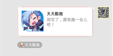

MSDK 다른계정 문제 모음
=======

다른계정이란
---

다른계정은: 현재 게임에 로그인한 계정과 플랫폼에 로그인한 계정이 일치하지 않는 경우를 말한다. 다음과 같은 2가지 경우가 있다

1. 플랫폼이 같지만 계정이 다름(예하면, 게임과 모바일QQ가 부동한 QQ계정으로 로그인)
2. 플랫폼이 다름(예하면, 게임은 위챗으로 로그인하고 게임 관련 조작은 모바일QQ에서 진행)

다른계정 scene
---

1. 게임이 메시지를 공유하려고 플랫폼을 실행할 때 계정이 일치하지 않으면 플랫폼이 팝업창으로 다른계정 제시. 현재 모든 플랫폼은 이 기능 지원

 

2. 유저가 플랫폼을 통해 게임을 실행할 때 계정이 일치하지 않으면 게임이 팝업창으로 다른계정 제시

 

`현재 게임 런칭 시 플랫폼이 게임에 요구하는 다른계정 처리, MSDK가 구현한 다른계정은 모두 두번째 경우에 속한다.`

다른계정 처리 로직(개발자 주목)
---
MSDK의 다른계정 처리 로직은 다른계정 판단, 유저가 계정 선택, 다른계정 로그인 등 3개 절차를 포함한다(자세한 내용은 MSDK 액세스 문서 참조). 간단히 설명하자면:

####1. 다른계정 판단:

외부 플랫폼에서 게임 실행시 MSDK는 handCallback에서 실행 플랫폼과 게임 로컬 계정에 다른계정 존재 여부를 판단하고 다른계정 판단 결과를 OnWakeupNotify(WakeupRet ret) 방법의 ret.flag를 통해 게임에 콜백한다. 게임은 콜백 결과에 따라 상응한 로그인 처리를 진행할 수 있다. 자세한 ret.flag 및 상응한 처리는 다음과 같다.

	eFlag_Succ: 다른계정이 존재하지 않고 로컬 계정으로 로그인 성공. 게임은 이 flag를 수신하면 직접 LoginRet 구조체 중 토큰을 획득하여 게임 인증 절차를 진행한다.

	eFlag_AccountRefresh: 다른계정이 존재하지 않고 MSDK가 이미 인터페이스 새로고침을 통해 로컬 계정 토큰을 새로 고침. 이 flag를 수신하면 직접 LoginRet 구조체 중 토큰을 획득하여 게임 인증 절차를 진행한다.

	eFlag_UrlLogin：다른계정이 존재하지 않고 게임이 계정을 이용하여 빠른 로그인 성공. 게임이 이 flag를 수신하면 직접 LoginRet 구조체 중 토큰을 획득하여 게임 인증 절차를 진행한다.

	eFlag_NeedLogin：게임 로컬 계정과 실행 계정이 모두 로그인 실패. 게임이 이 flag를 수신하면 로그인창을 팝업하여 유저를 로그인하게 해야 한다.

	eFlag_NeedSelectAccount：게임 로컬 계정과 실행 계정에 다른계정이 존재. 게임이 이 flag를 수신하면 대화창을 팝업하여 유저에게 로그인할 계정을 선택하게 해야 한다.

####2. 유저 선택:

다른계정 판단 ret.flag가 eFlag_NeedSelectAccount일 경우, 게임은 대화창을 팝업하여 유저에게 로컬 계정 또는 다른 계정으로 게임에 로그인할 지 문의한다. 게임은 유저가 선택한 결과에 따라 인터페이스 WGSwitchUser를 호출하여 로그인을 완료해야 한다.

		/**
		 *  외부에서 실행한 URL을 통해 로그인. 이 인터페이스는 다른계정 발생시 유저가 외부에서 계정 실행시 호출한다.
	 	*  로그인 성공 후 onLoginNotify를 통해 콜백
	 	*
	 	*  @param flag 가YES이면, 유저가 실행 계정으로 바꾸려 한다는 것을 표시한다. 이럴 경우, 이 인터페이스는 지난번에 저장한 실행 계정 로그인 데이터를 이용해 게임에 로그인하고 로그인에 성공한 후 onLoginNotify를 통해 콜백한다. 토큰이 없거나 토큰이 무효 함수이면 NO를 리턴하고 onLoginNotify 콜백이 발생하지 않는다.
	 	*              NO이면, 유저가 원래 계정을 계속 사용한다는 것을 표시한다. 이때 저장된 실행 계정 데이터를 삭제하여 혼동을 방지한다.
	 	*
	 	*  @return 토큰이 없거나 무효하면 NO 리턴; 다른 경우는 YES 리턴
		 */
		bool WGSwitchUser(bool flag);

####3. 로그인 콜백 리턴:

MSDK는 유저가 선택한 결과에 따라 로그인을 시도하고 onLoginNotify를 통해 로그인 결과를 게임에 콜백한다. 게임은 콜백 결과에 따라 로그인 결과를 처리한다.

플랫폼에서 게임으로 다른계정 9가지 경우
----

개발자와 무관하며, 개발자는 MSDK가 게임에 콜백한 flag만 관심하면 된다:

|           |완전한 토큰을 갖고 실행|완전한 토큰이 없이 실행|토큰이 없이 실행|
|: ------------- :|: ------------- :|: ------------- :|: ------------- :|
|로컬 토큰 유효|유저에게 다른계정 제시|유저에게 다른계정 제시|로컬 계정으로 로그인|
|로컬 토큰 무효|유저에게 다른계정 제시|유저에게 다른계정 제시|게임은 로그인 페이지에 돌아감|
|로컬에 토큰 없음|계정을 통해 로그인|게임은 로그인 페이지에 돌아감|게임은 로그인 페이지에 돌아감|

모바일QQ가 게임을 실행하는 Scene
---

모바일QQ의 구조화 메시지 공유와 백엔드 공유는 부동한 이동 링크가 있을 수 있다(tatgetURL). 각 게임은 부동한 이동 링크를 입력하여 메시지 공유를 통해 게임을 실현하는 Scene을 구현할 수 있다.

1. 모바일QQ 게임센터에서 실행을 클릭하여 게임 실행

	효과: 토큰을 갖고 게임 실행

	MSDK 대응 인터페이스: 없음

2. 모바일QQ 구조화 메시지 구조체를 통해 게임 실행

	효과: 기입한 targetURL에 따라 결정. 자세한 내용은 아래 부분 참조(모바일QQ 구조화 메시지의 이동 링크 설정)

	MSDK 대응 인터페이스: WGSendToQQGameFriend，WGSendToQQ，WGSendToQQWithMusic

   

3. 모바일QQ 구조화 메시지 또는 빅이미지 공유를 통해 게임 실행

	효과: 게임을 실행하지만 openID와 같은 토큰이 없음. 다른계정 제시를 할 수 없음

	MSDK 대응하는 인터페이스: WGSendToQQGameFriend，WGSendToQQ，WGSendToQQWithMusic，WGSendToQQWithPhoto

    

모바일QQ 구조화 메시지 이동 링크 설정
---
1. PR2 심사를 통과한 게임

	링크 설정: 이동 링크를 모바일QQ 게임센터의 게임 세부페이지로 설정할 수 있다(자세한 내용은 MSDK 액세스 문서 참조)

	대응 상황: 이런 경우는 게임센터에서 게임실행을 클릭하여 게임을 실행하는 것과 동일하다. 게임센터의 부동한 설정을 통해(설정 방법은 아래 내용 참조) 토큰을 갖고 게임 실행 또는 토큰 없는 게임 실현을 구현할 수 있다

2. PR2 심사를 통과하지 못한 게임

	링크 설정: 이동 링크를 마이앱 세부페이지로 설정할 수 있다(자세한 내용은 마이앱 vivianhui에게 문의)

	대응 상황: 게임 실행 또는 다운로드 가능

3. PR2를 통과하지 못하고 마이앱도 액세스하지 않은 게임

	링크 설정: 이동 링크는 반드시 다른 링크로 설정해야 한다

	대응 상황: 메시지를 클릭하면 대응하는 웹주소로 이동한다. 게임은 웹주소에서 스스로 게임 다운로드 또는 web을 실행할 수 있다

모바일QQ 게임센터 빠른로그인 설정
---

이 부분은 게임의 **`운영 및 기획PM`**이 모바일QQ 게임센터에 요구를 제출하고 게임센터 담당자가 설정을 진행한다.

1. openID 지원:

	openID 체크박스 선택, 아래 그림 참조

 
2. openID, accessToken, PayToken 운반 지원

	1.대응하는 옵션 선택

	2.게임이 다른계정을 지원하는 버전에 대응하는 versionCode 입력. 입력 후 해당 code 및 이후 버전은 토큰을 갖고 게임을 실행할 수 있다. 이전 버전은 openID만 갖고 게임을 실행하며 게임의 정상적인 로직에 영향을 주지 않는다.
 

3. 주의사항

	설정 시 일반적으로 앞 3개만 설정하면 된다. 뒤에 있는 몇개는 설정할 필요가 없다.

주의사항
-----
####게임에서 플랫폼으로 다른계정:

1. 1.3.0.11 아래 버전에서, 게임에서 위챗으로 다른계정은 이미 알려진 MSDK BUG가 자동 로그인 시 제시가 없는 문제를 초래할 수 있다. MSDK 버전을 1.3.0.11 이상으로 업데이트하여 이 문제를 해결하기 바란다.
2. 게임에서 위챗으로 다른계정은 위챗 5.0 및 이상 버전에서만 지원한다.

####플랫폼에서 게임으로 다른계정:
1. MSDK는 1.8.0부터 다른계정을 지원한다. 현재 모바일QQ만 토큰을 갖고 실행할 수 있다.
2. 모바일QQ4.6 아래 버전에서, 모바일QQ에서 게임으로 다른계정은 게임이 이미 실행된 상황에서 존재하지 않는다.

####모바일QQ가 빠른로그인을 지원하는 조건:
1. 게임이 메시지를 공유하는 이동 링크는 게임센터 세부페이지
2. 게임이 모바일QQ 게임센터에서 APP에 투과 전송하는 필드 설정(opened, accesstoken, paytoken)
