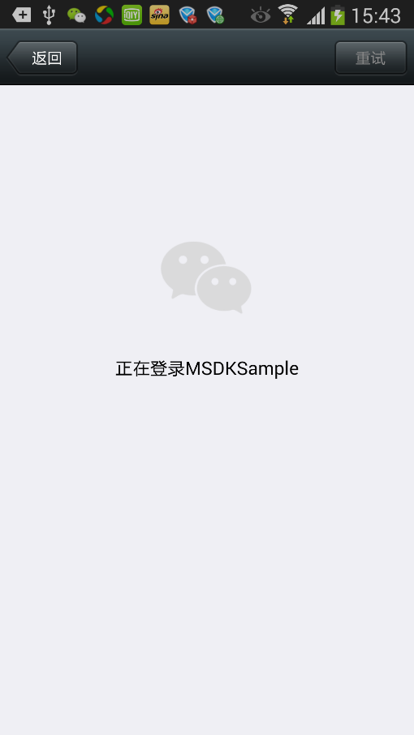

#MSDK 로그인 모듈

##개요

이 모듈은 MSDK 모든 인증 관련 모듈을 정리하고 인증 로그인, 자동 로그인, 빠른 로그인, 토큰 갱신, 읽기 등 모듈에 대한 자세한 설명 포함. 게임은 먼저 이 모듈을 참조하여 MSDK의 모든 인증 관련 모듈을 이해한 후 게임 자체 수요에 따라 상응한 인터페이스를 사용하여 인증 등 기능 구현 가능

##용어 해석, 인터페이스 설명
	
###로그인 관련 용어 해석:
| 명칭| 설명 |지원 플랫폼| 호출 인터페이스 |
|: ------------- :|
| 인증 로그인 | 플랫폼의 인증 화면을 불러와 유저가 게임에 인증하고 로그인에 필요한 토큰을 받도록 인도| 모바일QQ/Wechat | WGLogin |
| 빠른 로그인 | 유저의 조작은 플랫폼에서 게임 실행시 로그인 관련 토큰 정보를 투과 전송하여 게임에 로그인하게 함| 모바일QQ| 없음 |
| 자동 로그인 | 게임 시작시 유저의 최근 게임 로그인 토큰 정보를 직접 사용하여 게임에 로그인| MSDK가 기능 제공| WGLoginWithLocalInfo |
| 자동 갱신 | MSDK가 Wechat 토큰 자동 갱신 인터페이스 제공| MSDK가 기능 제공 | 없음 |
| 다른 계정 | 현재 게임에 로그인한 계정과 플랫폼에 로그인한 계정 불일치 | 플랫폼/MSDK 전부 지원| WGSwitchUser |

### 로그인 관련 인터페이스 개요

로그인과 관련된 호출 인터페이스 중 `WGGetLoginRecord`, `WGLogout`는 동기적 인터페이스이고 기타 인터페이스는 전부 비동기적으로 구현되기에 callback 형식을 이용하여 OnLoginNotify(LoginRet)를 통해 최종 결과를 게임에 콜백. 다른계정과 관련된 인터페이스는 MSDK의 다른계정 모듈에서 별도로 설명. 구체 내용:

| 명칭| 설명 |비고 |
|: ------------- :|
| WGGetLoginRecord | 로컬에 저장된 현재 유저의 로그인 토큰 획득 |  |
| WGSetPermission | 게임이 유저 인증을 통해 획득할 플랫폼 정보 설정 | |
| WGLogin | 플랫폼을 실행하여 인증 로그인 진행 |  |
| WGLogout | 현재 로그인한 계정의 로그인 정보 전부 제거 |  |
| WGLoginWithLocalInfo | 로컬에 저장된 로그인 토큰으로 로그인 시도|  |
| handleCallback | 각 플랫폼 호출 처리 |  |
| WGRefreshWXToken | WechatrefreshToken으로 갱신하여 accessToken 획득 |  MSDK 2.0부터 게임이 스스로 Wechat 토큰을 갱신하는 방식을 권장하지 않음 |

###로그인 관련 인터페이스 권장 사용법

1. 인증 로그인: 직접 `WGLogin`을 호출하여 상응한 플랫폼의 인증 획득
- 게임 시작 또는 게임이 백그라운드에서 포어그라운드로 전환시 토큰 유효성 검사: `WGLoginWithLocalInfo`를 호출하여 토큰 유효성 검사 진행
- 토큰 획득: 직접 `WGGetLoginRecord`를 호출하여 로컬에서 읽기
- 로그아웃: 직접 `WGLogout`를 호출하여 현재 유저의 로그인 정보 제거

## 로그인 액세스 구체 작업(개발자 필독)

**게임 개발자는 아래 제공한 절차에 따라 MSDK로그인 모듈의 액세스를 진행하여 액세스 비용과 누락된 처리 로직을 줄일 수 있다. 이 부분 내용을 숙지할 것을 강력히 권장!!**

1. 유저 인증이 필요한 권한 설정:
	- 게임은 MSDK 초기화 이후 모바일QQ 권한 설정 인터페이스를 호출하여 유저 인증이 필요한 게임 플랫폼 권한을 설정해야 한다. 구체 방법[클릭하여 보기](#유저 인증이 필요한 권한 설정 WGSetPermission).
- **인증 로그인 처리**：
	1. 로그인 버튼의 클릭 이벤트의 처리 함수에서 `WGLogin`을 호출하여 인증 로그인 진행. 구체 방법[클릭하여 보기](#인증 로그인 처리 WGLogin)
- **자동 로그인 처리**：
	1. 메인 Activity의 onCreate에서 MSDK 초기화 이후 `WGLoginWithLocalInfo`를 호출하여 게임 실행시 자동 로그인 진행. 구체 방법[클릭하여 보기](#자동 로그인 처리 WGLoginWithLocalInfo)
	- 메인 Activity의 onResume에서 게임이 백그라운드로 전환하는 시간 판단. 30분을 초과하면 자동으로 `WGLoginWithLocalInfo`를 호출하여 자동 로그인 진행
		- 게임이 백그라운드로 전환하는 시간의 판단에 있어, 게임은 MSDK의 demo 방식을 참조하여 전환시 타임 스탬프를 1개 기록하고 반환하여 시간차 계산 가능
- **유저 로그아웃 처리**:
	- 로그아웃 버튼의 클릭 이벤트의 처리 함수에서 WGLogout를 호출하여 인증 로그인 진행. 구체방법[클릭하여 보기](#유저 로그아웃 처리 WGLogout)
- **MSDK의 로그인 콜백 처리**:
	- 게임의 MSDK 콜백 처리 로직에 onLoginNotify에 대한 처리 추가. 구체방법[클릭하여 보기](#MSDK의 로그인 콜백 처리)
- **플랫폼의 실행 처리**:
	- 게임 메인 activity의 onCreate와 onNewIntent에서 handleCallback를 호출하여 플랫폼 실행에 대한 처리 진행. 구체방법[클릭하여 보기](#플랫폼 실행 처리 handleCallback)
- **MSDK의 실행 콜백 처리**:
	- 게임의 MSDK 콜백 처리 onWakeUpNotify에서 플랫폼 실행에 대한 처리 추가. 구체방법[클릭하여 보기](#MSDK의 실행 콜백 처리)
- **다른계정 처리 로직**:
	- 게임이 다른계정에 대한 처리 로직, 구체 내용은 [MSDK 다른계정 액세스](diff-account.md#다른계정 처리 로직(개발자 주목)) 참조
- **기타 특수 로직 처리**:
	- 저메모리 설비에서 인증 진행시 게임이 강제 종료된 후 로그인 방안. 구체 방법[클릭하여 보기](#모바일QQ가 저메모리 설비에서 인증 진행시 게임이 강제 종료된 후 로그인 방안)
	- MSDKWechat 토큰 기한 만료시 자동 갱신 메커니즘. 구체방법[클릭하여 보기](#Wechat 토큰 자동 갱신)
	- 로그인 데이터 업로드 인터페이스 호출 요구. 구체방법[클릭하여 보기](#로그인 데이터 업로드)

##유저 인증이 필요한 권한 설정 WGSetPermission

####개요

게임은 MSDK 초기화 이후 모바일QQ 권한 설정 인터페이스를 호출하여 유저 인증이 필요한 게임 플랫폼 권한을 설정해야 한다.

####인터페이스 선언

	/**
	 * @param permissions ePermission 열거값 또는 연산 결과, 필요한 인증 항 표시
	 * @return void
	 */
	void WGSetPermission(int permissions);

#### 인터페이스 호출:

	// QQ 실행시 필요한 유저 인증 항 설정
	WGPlatform.WGSetPermission(WGQZonePermissions.eOPEN_ALL); 

#### 주의사항:

1. 게임은 MSDK 초기화 이후에 이 인터페이스를 호출해야 하며 인터페이스 파라미터는 **`WGQZonePermissions.eOPEN_ALL`**을 입력할 것을 제안한다. 이 내용이 부족하면 게임이 일부 인터페이스 호출 시 권한이 없다고 통지할 수 있다.

##인증 로그인 처리 WGLogin

#### 개요:

**모바일QQ/Wechat 클라이언트 또는 web페이지(모바일QQ 미설치)를 실행하여 인증을 진행하고 유저가 인증한 후 onLoginNotify를 통해 openID, accessToken, payToken, pf, pfkey 등 로그인 정보를 획득했다고 게임에 통지**

#### 효과 보기:

####인터페이스 선언:

	/**
	 * @param platform 게임이 전송한 플랫폼 유형, 가능한 값: ePlatform_QQ, ePlatform_Weixin
	 * @return void
	 *   게임이 설정한 전역 콜백의 OnLoginNotify(LoginRet& loginRet) 메소드를 통해 데이트를 게임에 반환
	 */
	void WGLogin(ePlatform platform);

#### 인터페이스 호출:

	WGPlatform::GetInstance()->WGLogin(ePlatform_QQ); 

#### 주의사항:

- **통용**:
	- **Wechat와 모바일QQ 각자의 bug로 인하여 게임이 일부 시나리오에서 콜백을 받지 못하는 문제를 초래할 수 있다. 게임은 WGLogin을 호출한 후 초읽기를 시작하고 초읽기가 끝난 후에도 콜백을 받지 못하면 타임아웃으로 간주하여 유저를 로그인창에 돌아가게 할 수 있다. 초읽기 시간은 30s를 제안하지만 자체적으로 설정할 수 있다**콜백을 받지 못하는 일부 시나리오:
		- Wechat에 로그인하지 않은 상황에서 게임이 Wechat을 불러와 유저명과 비밀번호를 입력하고 로그인하면 로그인 콜백이 없을 수 있다. 이는 Wechat 클라이언트의 이미 알려진 BUG이다
		- Wechat 인증 과정에서 좌측 상단의  돌아가기 버튼을 클릭하면 인증 콜백이 없을 수 있다
		- openSDK 2.7 (MSDK 2.5) 이하 버전은 web 인증을 통해 인증 취소를 클릭한 후 콜백이 없다
- **모바일QQ 관련**：
	1. 모바일QQ가 설치되지 않은 경우, 프리미엄 게임은 Web페이지를 불러와 인증을 진행할 수 있다. AndroidMenifest.xml에서 AuthActivity 선언 중 반드시 intent-filter에서 <data android:scheme="***" />를 설정해야 한다. 자세한 내용은 본 장절 모바일QQ 관련 AndeoidMainfest 설정을 참조하면 된다. **해납(海納) 게임은 아직 페이지를 불러와 인증하는 방식을 지원하지 않는다**. WGIsPlatformInstalled 인터페이스를 통해 모바일QQ 설치 여부를 판단할 수 있으며, 모바일QQ가 설치되지 않았으면 유저에게 인증할 수 없다고 제시.
	- **간혹 OnLoginNotify 콜백을 받지 못하는 경우: **`com.tencent.tauth.AuthActivity`와 `com.tencent.connect.common.AssistActivity`는 `AndroidManifest.xml`에서 모바일QQ 액세스 권한 선언([클릭하여 보기]())과 반드시 일치해야 한다.
	- 게임 Activity가 Launch Activity이면 게임 Activity 선언에 android:configChanges="orientation|screenSize|keyboardHidden"를 추가해야 한다. 그렇지 않으면 로그인이 없고 콜백이 없는 문제를 초래할 수 있다.

- **Wechat 관련**:

	1. Wechat 인증은 Wechat 버전이 4.0보다 높아야 한다
	- Wechat 실행시 Wechat은 앱 서명과 Wechat 백그라운드 서명의 매칭 여부를 검사한다(이 서명은 WechatappId를 신청할 때 제출). 매칭되지 않으면 이미 인증된 Wechat 클라이언트를 실행할 수 없다.
	- `WXEntryActivity.java` 위치가 틀리면(반드시 패키지명 /wxapi 디렉토리에 위치) 콜백을 받을 수 없다.

##자동 로그인 처리 WGLoginWithLocalInfo

#### 개요:

이 인터페이스는 과거에 로그인했던 게임에 사용된다. 유저가 게임에 다시 들어갈 때 게임은 이 인터페이스를 먼저 호출하여 백그라운드에서 토큰을 검사한 후 OnLoginNotify를 통해 결과를 게임에 콜백한다. 게임은 Wechat 토큰 갱신, 모바일QQ/WechatAccessToken 검사 등 작업을 처리할 필요가 없다.

####인터페이스 선언:

	/**
	  *  @since 2.0.0
	  *  이 인터페이스는 과거에 로그인했던 게임에 사용된다. 유저가 게임에 다시 들어갈 때 게임은 이 인터페이스를 먼저 호출하여 백그라운드에서 토큰 검사를 시도한다
	   *  이 인터페이스는 OnLoginNotify를 통해 결과를 게임에 콜백하고 eFlag_Local_Invalid와 eFlag_Succ 등 2개 flag만 반환한다.
	  *  로컬에 토큰이 없거나 로컬 토큰 검사 실패시 반환하는 flag는 eFlag_Local_Invalid이다. 게임이 이 flag를 받으면 유저를 인증 페이지로 안내하여 인증을 진행하면 된다.
	  *  로컬에 토큰이 있고 검사에 성공하면 flag는 eFlag_Succ이다. 게임이 이 flag를 받으면 재차 검사할 필요가 없이 sdk가 제공한 토큰을 직접 사용할 수 있다.
	  *  @return void
	  *   Callback: 검사 결과는 OnLoginNotify를 통해 반환
	  */
 	void WGLoginWithLocalInfo();

####주의사항:

1. 게임이 `WGLoginWithLocalInfo`를 사용하여 로그인시 획득한 토큰은 게임 백그라운드에 전송하여 유효성 검사를 진행할 필요가 없이 MSDK가 검사한 후 게임에 콜백한다

##유저 로그아웃 처리 WGLogout

#### 개요:

이 인터페이스를 호출하면 현재 로그인 계정의 로그인 정보를 제거할 수 있다.

####인터페이스 선언:

	/**
	 * @return bool 리턴값을 이미 폐기, 전부 true 반환
	 */
	bool WGLogout();

####호출 예:

    WGPlatform.WGLogout();

####주의사항:

1. 게임이 **로그아웃 버튼을 클릭하거나 로그인창이 팝업되는 로직에서 반드시 WGLogout를 호출하여 로컬 로그인 정보를 전부 제거해야 한다**. 그렇지 않으면 인증 실패 등 문제를 초래할 수 있다

##MSDK의 로그인 콜백 처리

#### 개요:

MSDK의 로그인 콜백은 아래 몇개 시나리오에서 생긴다:

- WGLogin 인증에서 돌아옴
- WGLoginWithLocalInfo 로그인에서 돌아옴
- 플랫폼 실행을 처리한 후(토큰을 갖고 실행하면)

#### 구체적 처리:

	OnLoginNotify(LoginRet ret) {
        Logger.d("called");
        switch (ret.flag) {
            case CallbackFlag.eFlag_Succ:
				 CallbackFlag.eFlag_WX_RefreshTokenSucc
            	//인증 성공의 처리 로직
				break;
            case CallbackFlag.eFlag_WX_UserCancel:
				 CallbackFlag.eFlag_QQ_UserCancel
				//유저가 인증을 취소하는 로직
				break;
			case CallbackFlag.eFlag_WX_UserDeny
				//유저가 Wechat인증을 거절하는 로직
				break;
            case CallbackFlag.eFlag_WX_NotInstall:
				//유저 설비에 Wechat 클라이언트가 설치되지 않은 로직
				break;
			case CallbackFlag.eFlag_QQ_NotInstall:
				//유저 설비에 QQ 클라이언트가 설치되지 않은 로직
				break;
            case CallbackFlag.eFlag_WX_NotSupportApi:
				//유저 Wechat 클라이언트가 이 인터페이스 로직을 지원하지 않음
				break;
            case CallbackFlag.eFlag_QQ_NotSupportApi:
				//유저 모바일QQ 클라이언트가 이 인터페이스 로직을 지원하지 않음
				break;
            case CallbackFlag.eFlag_NotInWhiteList
				//유저 계정이 화이트리스트에 없는 로직
				break;
            default:
                // 기타 로그인 실패 로직
                break;
        }
    }

#### 주의사항:
**이곳에서는 중요한 loginNotify의 로직만 처리했을 뿐이고, 완전한 콜백 flag 정보는 [콜백표시eFlag](const.md#콜백표시eFlag)를 클릭하여 확인할 수 있다. 게임은 자체 수요에 따라 처리할 수 있다**

##플랫폼 실행 처리handleCallback

#### 개요:

플랫폼 실행은 플랫폼 또는 채널(모바일QQ/Wechat/게임로비/마이앱 등)을 통해 게임을 실행하는 방식을 말한다. 플랫폼은 일부 시나리오에서 토큰을 갖고 게임을 실행하여 게임에 직접 로그인할 수 있기에 게임은 플랫폼의 실행을 처리해야 한다.

#### 구체적 처리:
게임은 자신의 `launchActivity`의 `onCreat()`와 `onNewIntent()`에서 handleCallback를 호출해야 한다. 그렇지 않으면 로그인시 콜백이 없는 등 문제를 초래할 수 있다.

- **onCreate**:

        if (WGPlatform.wakeUpFromHall(this.getIntent())) {
        	// 실행 플랫폼은 게임 로비
        	Logger.d("LoginPlatform is Hall");
        } else {  
        	// 실행 플랫폼은 게임 로비가 아님
            Logger.d("LoginPlatform is not Hall");
            WGPlatform.handleCallback(this.getIntent());
        }

- **onNewIntent**

		if (WGPlatform.wakeUpFromHall(intent)) {
            Logger.d("LoginPlatform is Hall");
        } else {
            Logger.d("LoginPlatform is not Hall");
            WGPlatform.handleCallback(intent);
        }
#### 주의사항:

- 게임 로비를 불러오려면 게임 로비에 상응한 설정을 미리 추가해야 지원할 수 있기에 게임이 로비를 액세스하지 않으면 `WGPlatform.wakeUpFromHall`을 호출하여 이번 불러오기가 게임 로비에서 나왔는 지 판단해야 한다. 게임 로비에서 나왔으면 handleCallback를 호출하지 않는다. 게임 로비가 토큰을 갖고 불러오는 방식을 지원하는 내용은 [클릭하여 보기](qqgame.md)

##MSDK의 실행 콜백 처리

#### 개요

게임이 플랫폼 실행에 대한 처리는 주로 다른계정과 관련된 로직을 처리하는 것이다. 구체적 처리는 다음과 같다

#### 구체적 처리：

        if (CallbackFlag.eFlag_Succ == ret.flag
                || CallbackFlag.eFlag_AccountRefresh == ret.flag) {
            //실행 후 로컬 계정을 통해 게임에 로그인하는 것을 표시. 처리 로직은 onLoginNotify와 일치
            
        } else if (CallbackFlag.eFlag_UrlLogin == ret.flag) {
            // MSDK은 계정을 불러와 토큰을 갖고 인증 로그인 시도. 결과는 OnLoginNotify에서 콜백. 이때 게임은 onLoginNotify 콜백 대기

        } else if (ret.flag == CallbackFlag.eFlag_NeedSelectAccount) {
            // 현재 게임에 다른계정이 존재하기에 게임은 대화창을 팝업하여 유저에게 로그인할 계정을 선택하게 해야 한다

        } else if (ret.flag == CallbackFlag.eFlag_NeedLogin) {
            // 유효 토큰이 없어 게임 로그인 실패. 이때 게임은 WGLogout를 호출하여 로그아웃하여 유저가 다시 로그인하게 한다

        } else {
            //기본 처리 로직은 게임이 WGLogout를 호출하여 게임에서 로그아웃한 후 유저가 다시 로그인할 것을 제안한다
        }

##다른계정 처리 로직

다른계정 관련 모듈은 [MSDK 다른계정 액세스](diff-account.md#다른계정 처리 로직(개발자 주목）)을 참조할 수 있다

##기타 특수 로직 처리

### 모바일QQ가 저메모리 설비에서 인증 진행시 게임이 강제 종료된 후 로그인 방안

시중 대부분 게임이 메모리를 많이 점용하기에 인증 과정에서 모바일QQ를 불러와 인증 진행 시 android 메모리 복구 메커니즘이 백그라운드의 게임 프로세스를 강제로 종료시켜 게임 모바일QQ 인증이 게임에 들어가지 못하는 문제를 초래할 수 있다. 게임은 메인 Activity에서 아래 코드를 추가하여 프로세스가 종료된 후에도 토큰을 갖고 게임에 들어갈 수 있게 해야 한다.

	// TODO GAME 은 onActivityResult에서 WGPlatform.onActivityResult를 호출해야 한다
    @Override
	protected void onActivityResult(int requestCode, int resultCode, Intent data) {
		super.onActivityResult(requestCode, resultCode, data);
		WGPlatform.onActivityResult(requestCode, resultCode, data);
		Logger.d("onActivityResult");
	}

### 로그인 데이터 업로드

로그인 데이터를 정확히 업로드하기 위해 게임 액세스시 반드시 자신의 `launchActivity`의 `onResume`에서 `WGPlatform.onResume`를 호출하고 `onPause`에서 `WGPlatform.onPause`를 호출해야 한다.

### Wechat 토큰 자동 갱신

1. MSDK2.0.0부터 게임 운행 기간에 주기적으로 Wechat 토큰을 검사하고 갱신한다. 갱신이 필요할 경우 MSDK가 자동으로 갱신을 진행하고 OnLoginNotify를 통해 게임에 통지한다. flag는 eFlag_WX_RefreshTokenSucc와 eFlag_WX_RefreshTokenFail이다(이미 onLoginNotify의 콜백에 포함됨).
- **게임이 새로운 토큰을 받으면 게임 클라이언트에 저장된 토큰과 서버의 토큰을 동기적으로 갱신하여 새로운 토큰으로 후속적인 절차를 진행할 수 있게 해야 한다.**
- 게임에 Wechat 토큰 자동 갱신 기능이 필요하지 않으면 `assets\msdkconfig.ini`에서 `WXTOKEN_REFRESH`를 `false`로 설정하면 된다.

## 기타 인터페이스 리스트

###WGGetLoginRecord

#### 개요:

이 인터페이스를 호출하면 현재 계정의 로그인 정보를 획득할 수 있다.

####인터페이스 선언:

	/**
	 * @param loginRet 반환한 기록
	 * @return 반환 값은 플랫폼 id, 유형은 ePlatform, ePlatform_None을 반환하면 로그인 기록이 없음을 표시한다
	 *   loginRet.platform(유형 ePlatform) 플랫폼id 표시, 가능한 값은 ePlatform_QQ, ePlatform_Weixin, ePlatform_None.
	 *   loginRet.flag(유형 eFlag) 현재 로컬 토큰의 상태 표시, 가능한 값과 설명은 다음과 같다:
	 *     eFlag_Succ: 인증 토큰 유효
	 *     eFlag_QQ_AccessTokenExpired: 모바일QQ accessToken 기한 만료, 인증 인터페이스 표시, 유저가 다시 인증하도록 안내
	 *     eFlag_WX_AccessTokenExpired: WechataccessToken 토큰 기한 만료, WGRefreshWXToken을 호출하여 갱신해야 한다
	 *     eFlag_WX_RefreshTokenExpired: WechatrefreshToken, 인증 인터페이스 표시, 유저가 다시 인증하도록 안내
	 *   ret.token은 하나의 Vector<TokenRet>이고 그중에 저장된 TokenRet에 type와 value가 있다. Vector 순회를 통해 type를 판단하여 필요한 토큰을 읽는다.
     *
	 */
	int WGGetLoginRecord(LoginRet& loginRet);

####호출 예:

    LoginRet ret = new LoginRet();
    WGPlatform.WGGetLoginRecord(ret);

획득한 LoginRet 중 flag가 eFlag_Succ이면 로그인이 유효하다고 인정할 수 있으며 유효한 토큰 정보를 읽을 수 있다. 그중 token은 아래 방식으로 획득할 수 있다.

Wechat 플랫폼:

    std::string accessToken = "";
    std::string refreshToken = "";
    for (int i = 0; i < loginRet.token.size(); i++) {
             if (loginRet.token.at(i).type == eToken_WX_Access) {
                 accessToken.assign(loginRet.token.at(i).value);
             } else if (loginRet.token.at(i).type == eToken_WX_Refresh) {
                 refreshToken.assign(loginRet.token.at(i).value);
             }
    }

QQ 플랫폼:

    std::string accessToken = "";
    std::string payToken = "";
    for (int i = 0; i < loginRet.token.size(); i++) {
        if (loginRet.token.at(i).type == eToken_QQ_Access) {
            accessToken.assign(loginRet.token.at(i).value);
        } else if (loginRet.token.at(i).type == eToken_QQ_Pay) {
            payToken.assign(loginRet.token.at(i).value);
        }
    }

#### 주의사항:

없음

##자주 발생하는 문제

1. 결제시 paytoken 기한 만료를 제시하면 로그인 인터페이스를 불러와서 다시 인증해야 결제할 수 있다. paytoken 기한이 만료되면 반드시 다시 인증해야 한다.
