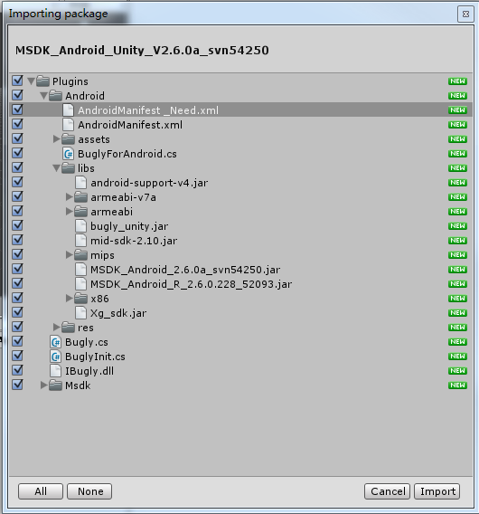
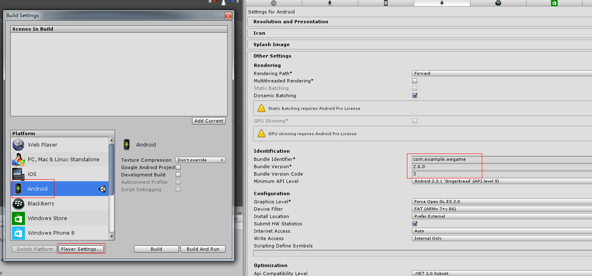
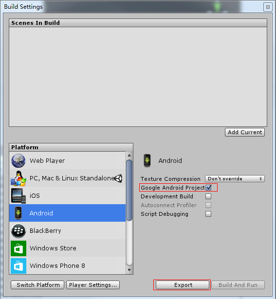
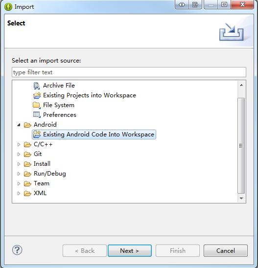
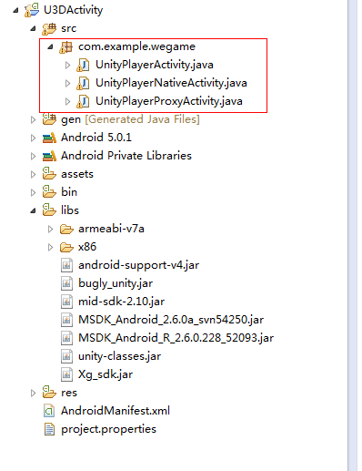
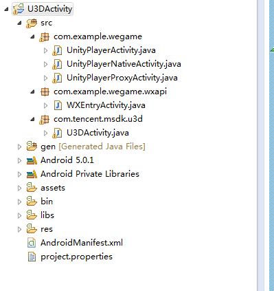
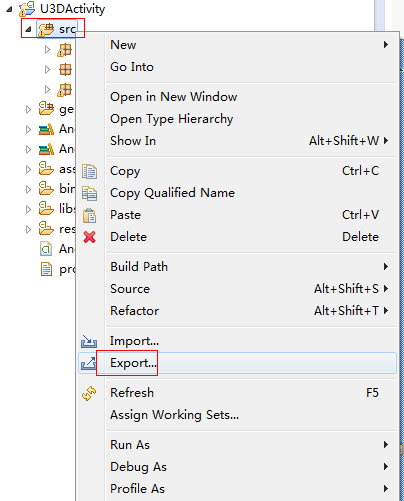
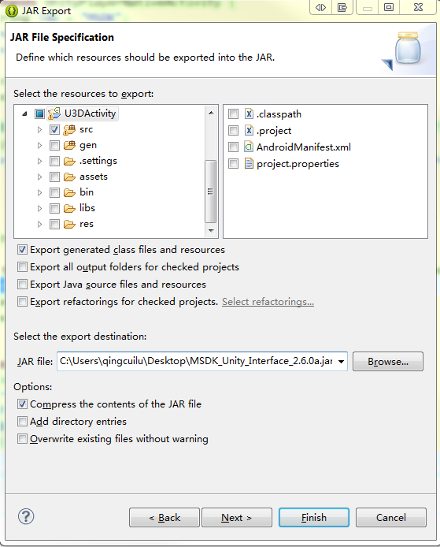
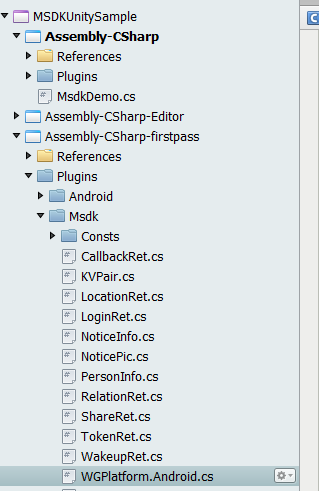

MSDK(Android) for Unity3D 연동	
===	
	
## 개요	
	
MSDK의 Unity3D 버전은 Unity3D 엔진을 이용하여 MSDK 인터페이스 C#에 대해 캡슐화를 진행한다. 이 버전을 사용하는 게임은 직접 C# 계층에서 MSDK 인터페이스를 호출할 수 있어 모바일 플랫폼의 관련 조작을 감소할 수 있다.	
	
MSDK(Android)의 Unity 릴리즈 패키지(zip)는 주로 `MSDKUnityLibrary`, `MSDKUnitySample` 및 `MSDK_Android_Unity_xxx.unityPackage`를 포함한다. 그중 `MSDKUnitySample`는 MSDK의 C# 인터페이스를 호출하는 Unity3D 샘플 프로젝트이다. `Assets\MsdkDemo.cs`를 참조하여 MSDK 인터페이스의 호출에 대해 알아볼 수 있다. `MSDKUnityLibrary`는 MSDK 인터페이스를 캡슐화한 Eclipse 안드로이드 라이브러리 프로젝트이다. 게임은 이 프로젝트의 소스 코드를 사용하고 적절히 변경한 후 jar로 만들어 Unity3D 프로젝트에 제공해야 한다.	
`MSDK_Android_Unity_xxx.unityPackage`는 이 버전의 unity 리소스팩이다. 게임은 이 팩을 도입하면 안드로이드 MSDK에 액세스할 수 있다.	
	
**주의 사항: **	
MSDKUnitySample 프로젝트를 이용하여 APK를 출력할 때 `./Assets/Plugins/Android` 디렉터리의 `debug.keystore` 서명을 사용해야 함(비밀번호는 android). 그렇지 않으면 위챗 인증을 실행하지 못하게 된다. 게임 프로젝트의 APK 생성시 게임 자신의 keystore를 사용해야 한다.	
	
## 연동 구성	
	
### Step1: MSDK 도입	
	
Unity3D의 IDE에서 게임 프로젝트를 열고 `MSDK_Android_Unity_xxx.unityPackage`를 더블클릭하여 필요한 파일을 선택하여 불러온다. 아래 그림 참조:	
	
	
	
**주의 사항: **	
1. 게임 프로젝트에 이미 Android 프로젝트가 있을 경우, `AndroidManifest.xml`를 불러오지 않고 `AndroidManifest_Need.xml`의 내용을 게임 **Plugins/Android** 디렉토리의 AndroidManifest.xml에 통합시킨다.	
2. 게임이 Unity가 아니라 Eclipse 등 유사 환경에서 Apk 패키지를 생성했으면 libs 폴더에서 **MSDK_Android_R_xxx.jar**를 제거하고 assets에는 `adconfig.ini, channel.ini, msdkconfig.ini` 이 몇개 파일만 남겨야 한다.	
	
### Step2:BuildSettings 및 AndroidManifest 수정	
	
#### 2.1BuildSettings 수정	
	
Unity의 IDE에서 **File -> Build Settings**를 클릭하고, 그림과 같이 Android 플랫폼을 선택한 후 **Player Settings**를 클릭하고, Inspector 창에서 게임 패키지명, 버전 번호, 화면 방향 등 속성 설정.	
	
	
	
#### 2.2 AndroidManifest 수정	
	
각 게임은 **Plugins/Android** 디렉터리의 AndroidManifest.xml을 개별화 수정해야 한다. 패키지명, appid, 화면 방향 등 포함.	
	
	
**package**를 게임 패키지명 및 versionCode, versionName으로 수정	
```	
<manifest	
    xmlns:android="http://schemas.android.com/apk/res/android"	
    package="com.example.wegame"	
    android:theme="@android:style/Theme.NoTitleBar"	
    android:versionCode="3"	
    android:versionName="2.6.0"> 	
    ......	
```	
	
label 값을 게임명으로 수정, 화면 방향 screenOrientation은 **Player Settings**의 화면 방향 **Defalult Orientation**와 일치해야 함. 게임 아이콘을 **Plugins/Android/res/** 디렉터리의 **drawable** 또는 **drawable-xxx** 폴더 아래에 놓고 `android:icon`에서 게임 아이콘 이름 입력.	
```	
<application	
    android:icon="@drawable/게임 아이콘"	
    android:label="게임명"	
    android:theme="@style/AppTheme" >	
	
    <activity	
        android:name="com.tencent.msdk.u3d.U3DActivity"	
        android:configChanges="orientation|keyboardHidden|screenLayout|screenSize"	
        android:launchMode="singleTop"	
        android:screenOrientation="landscape"	
        android:label="게임명">	
        <intent-filter>	
            <action android:name="android.intent.action.MAIN" />	
            <category android:name="android.intent.category.LAUNCHER" />	
        </intent-filter>	
    </activity>	
    ......	
</application>	
```	
	
`android:scheme`에서 값을 게임의 위챗 appid로 수정	
```	
<!-- TODO SDK액세스 위챗액세스구성 START -->	
<activity	
    android:name=".wxapi.WXEntryActivity"	
    android:excludeFromRecents="true"	
    android:exported="true"	
    android:label="WXEntryActivity"	
    android:launchMode="singleTop"	
    android:taskAffinity="com.example.wegame.diff" >	
    <intent-filter>	
        <action android:name="android.intent.action.VIEW" />	
        <category android:name="android.intent.category.DEFAULT" />	
        <data android:scheme="wxcde873f99466f74a" />	
    </intent-filter>	
</activity>	
<!-- TODO SDK액세스 위챗액세스구성 END -->	
```	
	
`android:scheme`에서 값을 "tencent+게임 모바일QQappid"으로 수정	
```	
<!-- TODO SDK액세스 QQ액세스구성 START -->	
<activity	
    android:name="com.tencent.tauth.AuthActivity"	
    android:launchMode="singleTask"	
    android:noHistory="true" >	
    <intent-filter>	
        <action android:name="android.intent.action.VIEW" />	
        <category android:name="android.intent.category.DEFAULT" />	
        <category android:name="android.intent.category.BROWSABLE" />	
        <data android:scheme="tencent100703379" />	
    </intent-filter>	
</activity>	
......	
<!-- TODO SDK액세스 QQ액세스구성 END -->	
```	
	
#### 2.3게임 Android 프로젝트를 출력하고 Eclipse 도입	
	
Unity의 IDE에서 **File -> Build Settings**를 클릭하고 **Google Android Project**를 선택한 후 **Export** 클릭. 아래 이미지 참조.	
	
	
	
Eclipse IDE를 열고 **File -> Import**를 선택.	
	
	
	
Import 패널에서 **Existing Android Code Into Workspace** 선택, **Next** 클릭, 위에서 출력된 게임 Android 프로젝트 폴더 선택, **Finish** 게임의 Android 프로젝트를 클릭하면 Eclipse 도입 가능. 구조는 다음 그림과 같음. Src 폴더에서 게임 패키지명에는 그림에서 표시한 java 코드를 포함해야 한다.	
	
	
	
**주의: **	
각 모듈 기능을 액세스할 때에는 wiki에서 대응하는 액세스 구성 부분을 읽어 파악하고 AndroidManifest.xml 구성 정확 여부를 확인해야 함.	
	
### Step3: Eclipse에서 MSDK 코드를 불러와 수정 및 캡슐화	
	
#### 3.1 캡슐화된 java 소스 코드 복사	
	
`MSDKUnityLibrary/src`에서 파일 `com/example/wegame/wxapi/WXEntryActivity.java`를 게임 Android 프로젝트 src 디렉터리의 `패키지명+wxapi` 위치에 복사하고, `com/tencent/msdk/u3d/U3DActivity.java`를 게임 Android 프로젝트 src 디렉터리에 복사하고 디렉터리 구조를 그대로 유지해야 한다. 이때 게임 Android 프로젝트는 다음과 일치해야 한다.	
	
	
	
#### 3.2 소스 코드 수정	
	
일부 정보는 알 수 없기에 수동으로 일부 패키징 소스 코드를 수정해야 한다.	
	
WXEntryActivity.java를 열고 package 에서 패키지명을 게임 패키지명으로 수정:	
	
```	
package com.example.wegame.wxapi;	
>>>	
package 게임 패키지명.wxapi;	
```	
	
U3DActivity.java를 열고 onCreate에서 게임의 qqAppId, wxAppId 등 초기화 정보 입력:	
	
```	
protected void onCreate(Bundle savedInstanceState) {	
    super.onCreate(savedInstanceState);	
    ......	
    //TODO SDK초기화 START 	
    /***********************************************************	
     *   GAME 연동시 획인 필수 상항이니, baseInfo 값은 게임에 따라 다르기에 기입시 아래 설명에 유의해야 한다:  *	
     *   baseInfo값을 게임에 잘못 기입하면 QQ, 위챗에서의 공유와 로그인 실패를 초래하게 될 수 있기에 특별히 주의해야 한다!!!       *	
     *  단일 플랫폼에만 연동하는 게임은 다른 플랫폼 정보를 임의로 기입하지 말아야 한다. 그렇지 않으면 일부 공지 획득시 실패를 초래할 수 있다  *	
     ***********************************************************/	
    MsdkBaseInfo baseInfo = new MsdkBaseInfo();	
    baseInfo.qqAppId = "100703379";	
    baseInfo.qqAppKey = "4578e54fb3a1bd18e0681bc1c734514e";	
    baseInfo.wxAppId = "wxcde873f99466f74a";	
    baseInfo.wxAppKey = "bc0994f30c0a12a9908e353cf05d4dea";	
    //주의: offerId는 필수기입	
    baseInfo.offerId = "100703379"; 	
    ......	
}	
```	
	
U3DActivity의 import의 `UnityPlayerNativeActivity` 패키지명을 게임 패키지명으로 수정:	
	
```	
import com.unity3d.player.UnityPlayerNativeActivity;	
>>>	
import 게임 패키지명.UnityPlayerNativeActivity;	
```	
	
그리고 게임은 그다음 TODO 표기의 SetMsdkObserver 메소드 안의 OnCrashExtMessageNotify에서 Crash 업로드용 메시지를 자체정의할 수 있음. `OnCrashExtMessageNotify` 인터페이스는 게임에 Crash가 발생할 때 게임 자체정의 메시지를 등탑에 업로드한다.	
	
```	
	@Override
	public String OnCrashExtMessageNotify() {
	   // TODO START 이곳에 게임은 crash시 업로드하는 추가 정보 추가, 예:
	    Logger.d(String.format(Locale.CHINA,"OnCrashExtMessageNotify called"));
	    Date nowTime = new Date();
	    SimpleDateFormat time = new SimpleDateFormat("yyyy-MM-dd hh:mm:ss");
	    return "new Upload extra crashing message for rqd1.7.8 on " + time.format(nowTime);
	}
```	
	
#### 3.3 중복 제거 코드 추가	
	
Android 운영체제에서 게임이 기타 APP(모바일QQ, 마이앱 등)와  상호 연동할 때 게임 인스턴스가 여러개 발생하여 비정상적인 동작으로 이어질 수 있기에 게임 패키지명에서 UnityPlayerNativeActivity.java를 수정하고 중복 인스턴스를 제거하는 메커니즘을 추가해야 함. onCreat의 super.onCreate() 뒤에 다음의 샘플 코드 추가:	
	
```	
@Override	
protected void onCreate (Bundle savedInstanceState)	
{	
	requestWindowFeature(Window.FEATURE_NO_TITLE);
	super.onCreate(savedInstanceState);
	
	// TODO 게임 자체의 중복 여부를 검사하여 게임 인스턴스를 중복 실행하는 문제 방지
    if (WGPlatform.IsDifferentActivity(this)) {	
        Logger.d("Warning!Reduplicate UnityPlayerNativeActivity was detected.");	
        return;	
    }	
	......
}	
```	
	
중복 제거시 게임 프로세스가 종료되는 것을 방지하기 위해 onDestroy 수정:	
	
```	
@Override	
protected void onDestroy ()	
{	
    if (mUnityPlayer != null ) {	
        Logger.d("Quit Unity");	
        mUnityPlayer.quit();	
    }	
	super.onDestroy();
}	
```	
	
### Step4: 게임 Apk 패키지 출력	
	
게임 Apk 패키지를 출력하는 2가지 방식: 하나는 Unity의 IDE에서 직접 Apk 패키지를 생성하는 것이고, 다른 하나는 직접 Eclipse 또는 유사한 안드로이드 환경을 이용하여 Apk 패키지를 생성한다. 다음에는 게임의 패키지 생성 방식에 따라 작업 절차를 선택한다.	
	
#### 4.1 Unity에서 Apk 패키지 출력	
	
Unity에서 Apk 패키지를 출력하려면 이전 단계에서 수정한 소스 코드를 jar 패키지로 출력하고 게임 Unity 프로젝트의 **Plugins/Android/libs** 아래에 놓아야 한다.	
	
Eclipse에서 게임 Android 프로젝트의 src를 선택하여 jar 패키지로 export한다. 절차:	
	
	
	
	
	
이곳에서 생성된 jar 패키지를 게임 Unity 프로젝트의 **Plugins/Android/libs**에 넣고 **Player Settings**에서 keystore 등 관련 항목을 설정하면 **Build Settings**에서 Apk 패키지를 내보낼 수 있다.	
	
#### 4.2 Eclipse에서 Apk 패키지 출력	
	
게임이 절차1의 주의사항에 따라 중복된 항목을 제거한 경우에는 바로 이 프로젝트를 이용하여 Apk 패키지를 출력할 수 있다. 그렇지 않으면 게임 Android 프로젝트에서 필요없는 파일을 삭제해야 한다.	
	
## 인터페이스 호출	
	
Unity3D에서 MSDK와 관련된 부분은 Assets/Plugins/Msdk 폴더에 위치:	
	
	
	
그중, MSDK API는 전부 WGPlatform 클래스에 캡슐화된다. "MSDKUnitySample"에서 `MsdkDemo.cs`는 MSDK의 C# 인터페이스 호출 샘플이다. 게임은 C# 인터페이스 호출에 이를 참조할 수 있다.	

### Bugly(Crash전송)

MSDK jar패키지에서 Bugly초기화를 완료했으며 게임은 최초시 C#층의 Crash전송 기능을 오픈 하여야 합니다. 즉 아래와 같은 코드를 추가：
```   
Bugly.EnableLog (true);
// C#스택 로그 획득 등급을 설정，디폴트로 Exception이고 Assert 및 Error 옵션으로 선택 가능.
Bugly.RegisterHandler (LogSeverity.Exception);
// Unity프로젝트에서 출력된 Android 혹 iOS공정에서 SDK 초기화를 진행했으면 해당 방법을 호출하여 C#스택 획득 기능을 오픈하면 됩니다. 
Bugly.EnableExceptionHandler();
```
	
QQ 로그인을 예로 들어 MSDK api 호출 및 콜백 처리 실연:	
	
    // Msdk 네임 스페이스	
    using Msdk;	
    // WGPlatform 클래스는 싱글턴 디자인 사용	
    WGPlatform.Instance.WGLoginQQ();      // QQ 로그인	
    	
그다음 로그인 콜백 처리(MsdkDemo에서 해당 로그인 콜백 매소드 이름은 OnLoginNotify)	
	
    /// <summary>	
    ///  로그인 콜백	
    /// </summary>	
    /// <param name="jsonRet">Json ret.</param>	
    void OnLoginNotify(string jsonRet)	
    {       	
        LoginRet ret = new LoginRet();	
       // java측에서 전달한 것은 json 문자열 메시지이기에 분석해야 한다	
       // 성공적으로 분석하고 true를 리턴하면 LoginRet 각 속성에 값을 부여한다	
        bool succ = ret.ParseJson (jsonRet);	
        if (succ == false) {	
            loginState = "로그인 실패";	
            return;	
        }	
        /*	
         *  loginRet.platform은 현재 인증 플랫폼을 표시함. 값 유형은 ePlatform, 가능한 값은 ePlatform_QQ, ePlatform_Weixin	
         *     loginRet.flag 값은 리턴 상태를 표시한다. 가능한 값(eFlag 열거)은 다음과 같다:	
         *       eFlag_Succ: 리턴 성공, 게임이 이 flag를 수신하면 LoginRet 구조체의 토큰을 직접 읽어 게임 인증 절차 진행.	
         *       eFlag_QQ_NoAcessToken: 모바일QQ 인증 실패, 게임이 이 flag를 수신하면 유저를 안내하여 다시 인증하면 된다(재 시도)	
         *       eFlag_QQ_UserCancel: 유저 인증 과정중	
         *       eFlag_QQ_LoginFail: 모바일QQ 인증 실패, 게임이 이 flag를 수신하면 유저를 안내하여 다시 인증하면 된다(재 시도)	
         *       eFlag_QQ_NetworkErr: 모바일QQ 인증 과정에서 네트워크 오류 발생, 게임이 이 flag를 수신하면 유저를 안내하여 다시 인증하면 된다(재 시도)	
         *     loginRet.token은 하나의 List<TokenRet>이고 그곳에 저장된 TokenRet는 type와 value가 있다. Vector 순회를 통해 type를 판단하여 필요한 토큰을 읽어온다. type(TokenType) 유형 정의:	
         *       eToken_QQ_Access,	
         *       eToken_QQ_Pay,	
         *       eToken_WX_Access,	
         *       eToken_WX_Refresh	
         */	
        switch (ret.flag)	
        {	
            case CallbackFlag.eFlag_Succ:               	
                // 로그인 성공, 각종 토큰을 읽을 수 있다	
                int platform= ret.platform;	
                if(EPlatform.ePlatform_Weixin == platform)	
                {	
                    loginState = "위챗 로그인 성공";	
                }else if(EPlatform.ePlatform_QQ == platform)	
                {	
                    loginState = "QQ 로그인 성공";	
                }else if(EPlatform.ePlatform_QQHall == platform)	
                {	
                    loginState = "로비 로그인 성공";	
                }	
                message = ret.ToString();	
                break;	
            case CallbackFlag.eFlag_WX_UserCancel:	
                loginState = "로그인 실패";	
                message = ret.desc;	
                break;	
            case CallbackFlag.eFlag_WX_NotInstall:	
                loginState = "로그인 실패";	
                message = ret.desc;	
                break;	
            case CallbackFlag.eFlag_WX_NotSupportApi:	
                loginState = "로그인 실패";	
                message = ret.desc;	
                break;	
            case CallbackFlag.eFlag_WX_LoginFail:	
                loginState = "로그인 실패";	
                message = ret.desc;	
                break;	
            case CallbackFlag.eFlag_Local_Invalid:	
                // 자동 로그인 실패, 재인증 필요, 로컬 토큰 만료, 갱신 실패 등 모든 오류 포함	
                loginState = "자동 로그인 실패";	
                message = ret.desc;	
                break;	
            default:	
                    break;	
        }	
    }	
	
MSDK Api에 대한 설명. WGPlatform 클래스에서 자세한 주석이 있다. MSDK 인터페이스와 MSDK 액세스 일반 문제를 더욱 자세히 알아보려면 MSDK Android 문서를 참조하기 바란다.	
