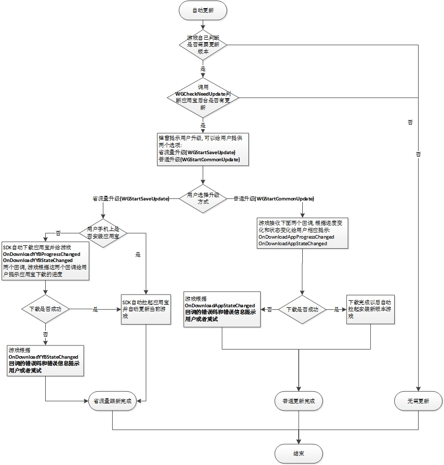
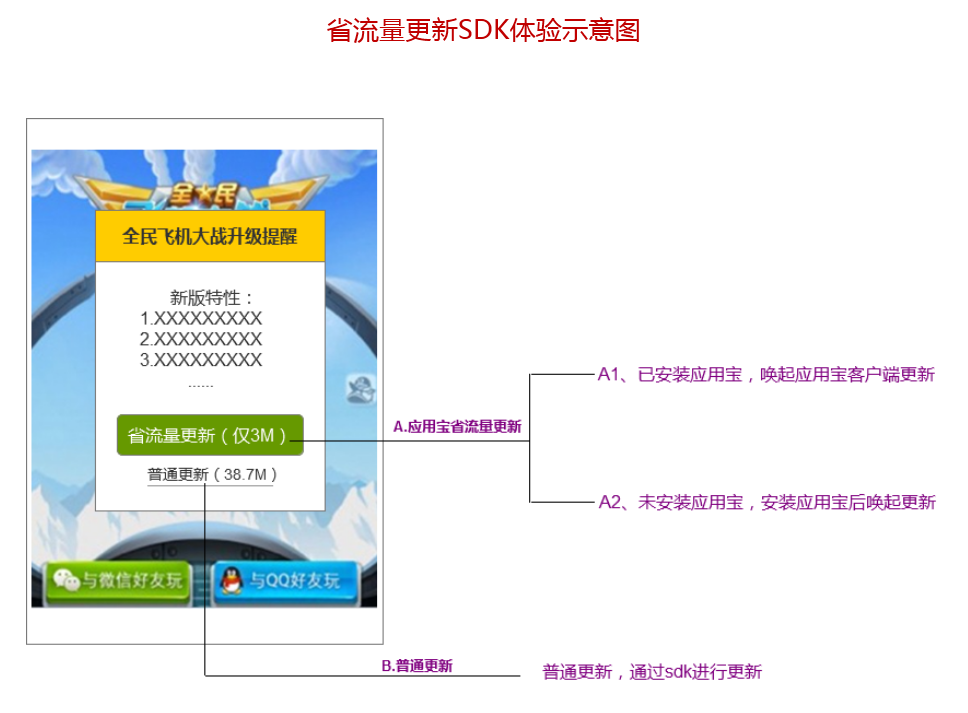
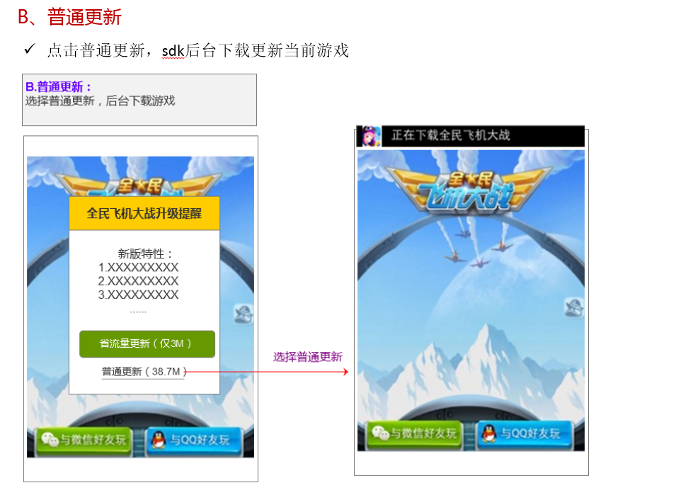

MSDK응용보 관련 모듈
==================

MSDK에서 응용보과 함께  OBT전의 계정 가챠와 미니패치 기능을 제공합니다. 여기에서 주로 응용보 계정 가챠와 미니패치 관련 내용에 대해 소개해 드리겠습니다.

## 개요

- **응용보의 미니패치 SDK는 MSDK 2.7 버전부터 많은 변경이 있습니다.MSDK2.7.0a 이전 버전을 연동한 게임은 미니패치 모듈을 연동할 경우 [MSDK2.7.0a이전 버전 미니패치 연동](myApp.md#MSDK2.7.0a이전 버전 미니패치 연동)파일을 참조 바랍니다. MSDK2.7.0a 및 그 이후 버전은 파일 내용대로 연동하면 되겠습니다.**

- **MSDK2.7.0a버전부터 응용보는 별도로 full업데이트 인터페이스를 제공하지 않습니다. 게임이 증량 패키지가 없을 경우 자동으로 full 패키지로 설치합니다.**

- **MSDK2.7.0a버전부터 응용보는 게임내에 증량 업데이트 인터페이스를 제공합니다.유저가 응용보를 설치하지 않을 경우에도 SDK를 통하여 증량 업데이트를 진행할 수 있습니다.**

## 계정 가챠 스위치 설정

계정 가챠 스위치 위치:
1. **assets/msdkconfig.ini**에서 클라이언트 계정 가챠 스위치를 설정할 수 있습니다.
2.응용보에서 계정 가챠 스위치를 설정할 수 있습니다. 
포그라운드에서 계정 가챠 기능을 사용하려면 아래와 같이 설정하면 되겠습니다.

	; MSDK 모듈 기능 on/off 선택 가능
	; 응용보 계정 가챠 스위치
	BETA=true

## 계정 가챠 연동 스텝

- **스텝1: **게임의 AndroidMenifest.xml에 Service 설명 추가

```
<service 
	android:name="com.tencent.tmassistantsdk.downloadservice.TMAssistantDownloadSDKService"
    android:exported="false"
    android:process=":TMAssistantDownloadSDKService" >
</service>
```

- **스텝2: **게임 메인 Acitivity의 onResume과 onDestroy에 각각 MSDK의 대응한 방법을 호출

```
@Override
protected void onResume() {
    super.onResume();
    WGPlatform.onResume();
}
@Override
protected void onDestroy() {
    super.onDestroy();
    WGPlatform.onDestroy(this);
}
```

- **스텝3: **계정 가챠 텍스트를 게임명에 대응하는 파일 경로로 수정: **MSDKLibrary\res\values\com_tencent_tmassistant_sdk_strings.xml**수정 방법: 아래의 **“Speed Up”**을 해당한 게임명으로 수정하면 됩니다.
	
```
<string name="white_list_dlg_body">Speed U의 소규모 CBT에 참가하고 싶으세요? 어서 응용보 계정 가챠를 사용해 주세요!</string>
```

플랫폼 로그인이 완료된 후 MSDK에 돌아가면 MSDK는 화이트리스트 확인 요청을 시작합니다. 이 요청이 리턴될 시 MSDK는 OnLoginNotify를 통하여 게임에 통보합니다. 유저가 화이트리스트에 있을 경우 이 flag는 eFlag_Succ이며 정상적인 로그인 스텝로 진행하면 되겠습니다. 유저가 화이트리스트에 없을 경우 flag는 eFlag_NotInWhiteList이며 게임에 리턴하는 동시에 MSDK는 팝업창을 통하여 유저들을 응용보 계정 가챠로 안내합니다.

**PS: 계정 가챠 기능 연동 성공 여부를 검증하는 방법**
임의의 신규 QQ 혹은 위챗 계정으로 게임을 접속하여 아래와 같은 대화창이 팝업될 경우 응용보 계정 가챠 기능이 연동되었음을 의미합니다. 

<div align=center>  </div>

## 미니 패치 기능 스위치 설정

미니 패치 기능을 사용하려면 **assets/msdkconfig.ini**에서 `SAVE_UPDATE`스위치를 설정하여 해당 기능 오픈 여부를 결정합니다. 예를 들면：
	
	; SAVE_UPDATE
	SAVE_UPDATE=true

####비고：
- **응용보 미니패치 SDK는 MSDK 2.7.0a버전부터 많은 변경이 있습니다. MSDK2.7.0a 이전 버전을 연동한 게임은 미니패치 모듈을 연동할 경우 [MSDK2.7.0a이전 버전 미치패치 연동](myApp.md#MSDK2.7.0a이전 버전 미치패치 연동)파일을 참조 바랍니다.**

## 미니패치 연동 설정

`AndroidManifest.xml`에서 미니패치 관련 설정을 추가：

	<service
        android:name="com.tencent.tmdownloader.TMAssistantDownloadService"
        android:exported="false"
        android:process=":TMAssistantDownloadSDKService" >
    </service>

####비고：
- **응용보 미니패치 SDK는 MSDK 2.7.0a버전부터 많은 변경이 있습니다. MSDK2.7.0a 이전 버전을 연동한 게임은 미니패치 모듈을 연동할 경우 [MSDK2.7.0a이전 버전 미치패치 연동](myApp.md#MSDK2.7.0a이전 버전 미치패치 연동)파일을 참조 바랍니다.**

## 미니패치 연동 프로세스

응용보 미니패치는 아래와 같은 프로세스가 있습니다.

### 스텝0: 스위치 설정

Wiki에 있는 [미니패치 스위치 설정](myApp.md#미니패치 스위치 설정) 및 [미니패치 연동 설정](myApp.md#미니패치 연동 설정) 관련 설명에 따라 해당 설정을 수정합니다.

### 스텝1: 게임 Activity 라이프사이클에서 MSDK라이프사이클 해당한 함수를 호출합니다. 

```
@Override
protected void onResume() {
    super.onResume();
    WGPlatform.onResume();
	……
}
@Override
protected void onDestroy() {
	super.onDestroy();
	WGPlatform.onDestory(this);
	……
}
```
### 스텝2: 초기화시 응용보 미니패치의 전반 콜백 오브젝트를 설정합니다.

- **응용보 미니패치 콜백류 구현**

	게임에서 자체 구현하여야 합니다.아래 내용을 참조 바랍니다.

	class SaveUpdateDemoObserver extends WGSaveUpdateObserver{
	    @Override
	    public void OnCheckNeedUpdateInfo(long newApkSize, String newFeature, long patchSize,
	            final int status, String updateDownloadUrl, final int updateMethod) {
	        Logger.d("called");
	        String statusDesc = "";
	        switch (status) {
	            case TMSelfUpdateUpdateInfo.STATUS_OK:
	                // 엡데이트 조회 성공
	                statusDesc = "Check success!";
	                break;
	            case TMSelfUpdateUpdateInfo.STATUS_CHECKUPDATE_RESPONSE_IS_NULL:
	                // 조회 응답이 null
	                statusDesc = "Response is null!";
	                break;
	            case TMSelfUpdateUpdateInfo.STATUS_CHECKUPDATE_FAILURE:
	                // 업데이트 조회 실패
	                statusDesc = "CheckNeedUpdate FAILURE!";
	                break;
	        }
	        if(status == TMSelfUpdateUpdateInfo.STATUS_OK) {
		        switch(updateMethod) {
		        	case TMSelfUpdateUpdateInfo.UpdateMethod_NoUpdate:
		        		// 업데이트 패키지 없음
		        		statusDesc += "But no update package.";
		        		break;
		        	case TMSelfUpdateUpdateInfo.UpdateMethod_Normal:
		        		// full 피키지가 있음
		        		statusDesc += "Common package is available.";
		        		break;
		        	case TMSelfUpdateUpdateInfo.UpdateMethod_ByPatch:
		        		// 미니패치 패키지가 있음
		        		statusDesc += "Save update package is available.";
		        		break;
		        	default :
		        	    statusDesc += "Happen error!";
		        	    break;
		        }
	        }
	        Logger.d(statusDesc);
	        MsdkCallback.sendResult(statusDesc);
	    }
	
	    @Override
	    public void OnDownloadAppProgressChanged(final long receiveDataLen, final long totalDataLen) {
	    	// 게임 다운로드 진도는 여기로부터 콜백 진행, 게임은 콜백 파라미터에 의하여 진도를 전시
	        Logger.d("totalData:" + totalDataLen + "receiveData:" + receiveDataLen);
	        MsdkCallback.mainActivity.runOnUiThread(new Runnable() {
	
				@Override
				public void run() {
					MainActivity.mProgressDialog.setMax((int)(totalDataLen/1024));
		            MainActivity.mProgressDialog.setProgress((int)(receiveDataLen/1024));
				}
	        });
	    }
	
	    @Override
	    public void OnDownloadAppStateChanged(int state, int errorCode, String errorMsg) {
	        // 다운로드 상태는 여기로부터 콜백
	        String result = "";
	        switch (state) {
	            case TMAssistantDownloadTaskState.DownloadSDKTaskState_SUCCEED:
	                // 응용보내 게임 다운로드 미션 완료, 업데이트 완료후 게임 접속
	                result = "state: succeed";
	            case TMAssistantDownloadTaskState.DownloadSDKTaskState_DOWNLOADING:
	                // 응용보내 게임 다운로드중,유저한테 대기 동영상 출력 혹은 OnDownloadAppProgressChanged와 결합하여 다운로드 진도를 표시
	                result = "state: downloading";
	                break;
	            case TMAssistantDownloadTaskState.DownloadSDKTaskState_WAITING:
	                // 응용보내 게임 다운로드 미션 대기중, 유저한테 대기 상태 안내
	                result = "state: waiting";
	                break;
	            case TMAssistantDownloadTaskState.DownloadSDKTaskState_PAUSED:
	                result = "state: paused";
	                break;
	            case TMAssistantDownloadTaskState.DownloadSDKTaskState_FAILED:
	                // 상세한 에러코드는 errorCode에 있고 에러코드의 정의는 TMAssistantDownloadSDKErrorCode에 DownloadSDKErrorCode로 시작한 속성에 있습니다.
	                result = "state: failed";
	                break;
	            case TMAssistantDownloadTaskState.DownloadSDKTaskState_DELETE:
	                result = "state: delete";
	                break;
	            default :
	                result = "state: " + state;
	        } 
	        result += "\nerrorCode:" + errorCode + "\nerrorMsg:" + errorMsg; 
	        Logger.d(result);
	        if(state != TMAssistantDownloadTaskState.DownloadSDKTaskState_DOWNLOADING &&
	                state != TMAssistantDownloadTaskState.DownloadSDKTaskState_WAITING &&
	                state != TMAssistantDownloadTaskState.DownloadSDKTaskState_PAUSED)
	            if (MainActivity.mProgressDialog != null && MainActivity.mProgressDialog.isShowing())
	                MainActivity.mProgressDialog.dismiss();
	            MsdkCallback.sendResult(result);
	    }
	    
	    /**
	     * 미니패치(WGStartSaveUpdate)，응용보를 설치하지 않았을 경우 우선 응용보 다운로드 할 것이며 아래는 응용보 패키지 다운로드의 진도 콜백입니다.
	     * @param url 현재 미션의 url
	     * @param receiveDataLen 이미 수신한 데이터 길이
	     * @param totalDataLen 수신 받을 모든 데이터의 길이（목표 파일의 총 길이를 획득할 수 없을 경우 해당 파라미터는 －1로 리턴.）
	     */
	    @Override
	    public void OnDownloadYYBProgressChanged(String url, final long receiveDataLen, final long totalDataLen) {
	    	// 응용보 다운 진도는 여기로부터 콜백, 게임은 콜백 파라미터에 의하여 진도 테이블 전시.
	    	Logger.d("totalData:" + totalDataLen + "receiveData:" + receiveDataLen);
	    }
	    
	    /**
	     * @param url 지정 미션의 url
	     * @param state 다운로드 상태: 값은 TMAssistantDownloadSDKTaskState.DownloadSDKTaskState_*
	     * @param errorCode 에러 코드
	     * @param errorMsg 에러 설명，null도 가능.
	     */
	    @Override
	    public void OnDownloadYYBStateChanged(final String url, final int state, final int errorCode, final String errorMsg) {
	         Logger.d("called");
	         String result = "OnDownloadYYBStateChanged " + "\nstate:" + state + 
	         		"\nerrorCode:" + errorCode + "\nerrorMsg:" + errorMsg; 
	         Logger.d(result);
	         MsdkCallback.sendResult(result);
	    }
	}

- **콜백 설정**
	
	게임이 MSDK초기화 완료 후, 콜백 설정시 응용보 미니패치에 대한 콜백 설정을 추가합니다.

		// 응용보 업데이트 콜백류, 게임 자체 구현.
		WGPlatform.WGSetSaveUpdateObserver(new SaveUpdateDemoObserver()); 

### 스텝3: 인터페이스를 호출하여 업데이트가 있는지 체크하며 콜백에 의하여 업데이트를 처리합니다. 

## 미니패치 업데이트 인터페이스 설명

### 응용보 설치 여부 검증

`WGCheckYYBInstalled`인터페이스를 호출하면 응용보 설정 여부 검증을 리턴합니다. 인터페이스 상세한 설명은 아래와 같습니다.

#### 인터페이스 성명：

	/**
     * @return 리턴 값  TMYYBInstallState(WGPublicDefine.h에서 정의)
     */
    int WGCheckYYBInstalled();

#### 인터페이스 호출：

	ret = WGPlatform.WGCheckYYBInstalled();
    if (ret == 0) {
        return "응용보 이미 설치";
    } else if (ret == 1) {
        return "응용보 미설치";
    } else {
        return "낮은 버전 응용보 설치";
    }

####비고：
- **응용보 미니패치 SDK는 MSDK 2.7.0a버전부터 많은 변경이 있습니다. MSDK2.7.0a 이전 버전을 연동한 게임은 미니패치 모듈을 연동할 경우 [MSDK2.7.0a이전 버전 미치패치 연동](myApp.md#MSDK2.7.0a이전 버전 미치패치 연동)파일을 참조 바랍니다.**

### 업데이트 컨텐츠가 있는지 검색

`WGCheckNeedUpdate`인터페이스를 호출하면 현재 게임에 업데이트 컨텐츠 있는지 검색할 수 있다.검색 결과는 `WGSetSaveUpdateObserver`인터페이스 설정한 콜백 오브젝트의 `OnCheckNeedUpdateInfo`방안으로 콜백. 인터페이스 상세한 설명은 다음과 같다:

#### 인터페이스 성명：

	/**
     * @return void
     * 	 검색 결과는 WGSetSaveUpdateObserver인터페이스에서 설정한 콜백 오브젝트의 OnCheckNeedUpdateInfo방법으로 콜백.
     */
    void WGCheckNeedUpdate();

#### 인터페이스 호출：

	WGPlatform.WGCheckNeedUpdate();

####비고：
- **응용보 미니패치 SDK는 MSDK 2.7.0a버전부터 많은 변경이 있습니다. MSDK2.7.0a 이전 버전을 연동한 게임은 미니패치 모듈을 연동할 경우 [MSDK2.7.0a이전 버전 미치패치 연동](myApp.md#MSDK2.7.0a이전 버전 미치패치 연동)파일을 참조 바랍니다.**

### 미니패치 시작

`WGStartSaveUpdate`인터페이스를 호출하면 미니패치를 진행할 수 있습니다. 단말에서 응용보를 설치하지 않았을 경우 이 인터페이스에서는 자동으로 응용보를 다운하며 `OnDownloadYYBProgressChanged`와`OnDownloadYYBStateChanged` 두 인터페이스를 통하여 콜백합니다. 응용보를 설치하였을 경우 해당 이 인터페이스는 파라미터 값에 따라 응용보를 호출하여 다운로드 진행 여부를 판단합니다. 다운 진도 및 상태 변화는 `OnDownloadAppProgressChanged`및`OnDownloadAppStateChanged`를 통하여 게임에 콜백합니다. 인터페이스 관련 상세 설명은 아래을 참조 바랍니다.

#### 인터페이스 성명：

	/**
    
     * 해당 인터페이스는 파라미터에 따라 응용보 호출하여 업데이트 진행 여부를 판단.프로그램의 
     * 		다운로드 진도 및 상태 변화는 OnDownloadAppProgressChanged 및 OnDownloadAppStateChanged를 통하여 게임에 콜백
 	 * isUseYYB가 true일 경우 단말기에서 응용보를 설치하지 않았을 경우 이 인터페이스에서 자동으로 응용보를 다운하며 OnDownloadYYBProgressChanged 와 OnDownloadYYBStateChanged 두 인터페이스를 통하여 각각 콜백합니다.
	 * @para  isUseYYB:응용보 호출하여 게임 업데이트 여부, no를 선택하면 게임내에서 업데이트를 진행할 것이다.
     */
    void WGStartSaveUpdate(bool isUseYYB);

#### 인터페이스 호출：

	WGPlatform.WGStartSaveUpdate(true);

####비고：
- **응용보 미니패치 SDK는 MSDK 2.7.0a버전부터 많은 변경이 있습니다. MSDK2.7.0a 이전 버전을 연동한 게임은 미니패치 모듈을 연동할 경우 [MSDK2.7.0a이전 버전 미치패치 연동](myApp.md#MSDK2.7.0a이전 버전 미치패치 연동)파일을 참조 바랍니다.**

## MSDK2.7.0a이전 버전 미니패치 

### 미니패치 스위치 설정

업데이트 기능을 사용하려면 **assets/msdkconfig.ini**에서 `SAVE_UPDATE` 스위치를 설정하여야 합니다. 
	
	; SAVE_UPDATE
	SAVE_UPDATE=true

### 미니패치 연동 설정

`AndroidManifest.xml` 설정
	
	<service 
		android:name="com.tencent.tmassistantsdk.downloadservice.TMAssistantDownloadSDKService"
        android:exported="false"
        android:process=":TMAssistantDownloadSDKService" >
    </service>

응용보 sdk를 통하여 게임을 업데이트하는 방법은 두가지 있습니다. 

- 일반 업데이트,게임내에서 응용보 백그라운드로부터 업데이트 패키지를 다운받습니다.
- 미니패치 혹은 증량 업데이트라고도 합니다. 이와 같은 업데이트 방식은 응용보 클라이언트가 필요합니다. 미니패치는 파일을 대조하는 방식으로 변동된 부분만 업데이트하므로 패치 패키지 크기가 작고 업데이트 성공률이 높은 장점이 있습니다.

게임에서 응용보 미니패치 기능을 연동하는 프로세스는 아래와 같습니다.



### 미니패치 디버깅

응용보 미니패치 기능을 사용할 경우 아래와 같은 프로세스가 있습니다.

- 스텝1: 게임 Activity 라이프사이클 데이터 모니터링

```
@Override
protected void onResume() {
    super.onResume();
    WGPlatform.onResume();
}
@Override
protected void onDestroy() {
	super.onDestroy();
	WGPlatform.onDestory(this);
}
```

- 스텝2: 초기화 시 응용보 미니패치 전역 콜백 객체를 설정합니다. 콜백에 관한 상세 내용:**MSDKLibrary/jni/CommonFiles/WGSaveUpdateObserver.h**

응용보 업데이터 콜백 유형,게임 자체 구현


    WGPlatform.WGSetSaveUpdateObserver(new SaveUpdateDemoObserver()); 

    class SaveUpdateDemoObserver extends WGSaveUpdateObserver{
        @Override
        public void OnCheckNeedUpdateInfo(long newApkSize, String newFeature, long patchSize,
                final int status, String updateDownloadUrl, final int updateMethod) {
            Logger.d("called");
            String statusDesc = "";
            switch (status) {
                case TMSelfUpdateSDKUpdateInfo.STATUS_OK:
                    // 업데이터 조회 성공
                    statusDesc = "Check success!";
                    break;
                case TMSelfUpdateSDKUpdateInfo.STATUS_CHECKUPDATE_RESPONSE_IS_NULL:
                    // 조회 응답은 null
                    statusDesc = "Response is null!";
                    break;
                case TMSelfUpdateSDKUpdateInfo.STATUS_CHECKUPDATE_FAILURE:
                    // 업데이트 조회 실패
                    statusDesc = "CheckNeedUpdate FAILURE!";
                    break;
            }
            if(status == TMSelfUpdateSDKUpdateInfo.STATUS_OK) {
                switch(updateMethod) {
                    case TMSelfUpdateSDKUpdateInfo.UpdateMethod_NoUpdate:
                        // 업데이트 패키지가 없음
                        statusDesc += "But no update package.";
                        break;
                    case TMSelfUpdateSDKUpdateInfo.UpdateMethod_Normal:
                        // 풀 용량 업데이트 패키지가 있음
                        // WGPlatform.WGStartCommonUpdate(); //게임 업데이트
                        statusDesc += "Common package is available.";
                        break;
                    case TMSelfUpdateSDKUpdateInfo.UpdateMethod_ByPatch:
                        // 미니 패치 패키지가 있음
                        // WGPlatform.WGStartSaveUpdate(); //게임 업데이트
                        statusDesc += "Save update package is available.";
                        break;
                    default :
                        statusDesc += "Happen error!";
                        break;
                }
            }
            Logger.d(statusDesc);
            MsdkCallback.sendResult(statusDesc);
        }

        @Override
        public void OnDownloadAppProgressChanged(final long receiveDataLen, final long totalDataLen) {
            // 게임 다운로드 진도는 여기에서 콜백. 게임은 콜백된 파라미터에 따라 진도 표시
            Logger.d("totalData:" + totalDataLen + "receiveData:" + receiveDataLen);
        }

        @Override
        public void OnDownloadAppStateChanged(int state, int errorCode, String errorMsg) {
            // 다운로드 진도는 여기에서 콜백
            switch (state) {
                    case TMAssistantDownloadSDKTaskState.DownloadSDKTaskState_SUCCEED:
                        // 응용보내 게임 다운로드 미션 완료. 업데이트 완료 후 계속 플레이
                    case TMAssistantDownloadSDKTaskState.DownloadSDKTaskState_DOWNLOADING:
                        // 응용보내 게임 다운로드 중. 게임은 대기 애니메이션을 출력 혹은 OnDownloadAppProgressChanged와 결합하여 다운로드 진도 표시
                        break;
                    case TMAssistantDownloadSDKTaskState.DownloadSDKTaskState_WAITING:
                        // 응용보내 게임 다운로드 미션 대기 중. 유저한테 대기 안내
                        break;
                    case TMAssistantDownloadSDKTaskState.DownloadSDKTaskState_PAUSED:
                        break;
                    case TMAssistantDownloadSDKTaskState.DownloadSDKTaskState_FAILED:
                        // 자세한 오류 코드는 errorCode에 존재, 오류 코드 정의는 TMAssistantDownloadSDKErrorCode 중 DownloadSDKErrorCode로 시작되는 속성에 존재
                        break;
                    case TMAssistantDownloadSDKTaskState.DownloadSDKTaskState_DELETE:
                        break;
            } 
            Logger.d(String.format("%d, %d, %s", state, errorCode, errorMsg));
        }
        
        /**
         * 미니패치(WGStartSaveUpdate), 응용보를 설치하지 않았을 경우 우선 응용보를 다운합니다. 이는 응용보 패키지 다운로드 진도 콜백입니다.
         * @param url 현재 미션의 url
         * @param receiveDataLen 수신된 데이터 길이
         * @param totalDataLen 수신받을 모든 데이터 길이(목표 파일의 총 길이를 획득할 수 없으면 이 파라미터는 －1 리턴)
         */
        @Override
        public void OnDownloadYYBProgressChanged(String url, final long receiveDataLen, final long totalDataLen) {
            // 응용보 다운로드 진행률은 이곳에서 콜백, 게임은 콜백된 파라미터에 따라 진행률을 표시할 수 있음
            Logger.d("totalData:" + totalDataLen + "receiveData:" + receiveDataLen);
        }
        
        /**
         * @param url 지정 미션의 url
         * @param state 다운로드 상태: 값 TMAssistantDownloadSDKTaskState.DownloadSDKTaskState_*
         * @param errorCode 오류 코드
         * @param errorMsg 오류 설명, null도 가능
         */
        @Override
        public void OnDownloadYYBStateChanged(final String url, final int state, final int errorCode, final String errorMsg) {
             Logger.d("OnDownloadYYBStateChanged " + "\nstate:" + state + 
                    "\nerrorCode:" + errorCode + "\nerrorMsg:" + errorMsg);
        }
    }


- 스텝3: `WGCheckNeedUpdate`를 호출하고 `OnCheckNeedUpdateInfo` 중 `updateMethod` 콜백에 따라 업데이트 방식을 선택합니다. 인터페이스는 아래와 같습니다.

	/**
	 * @param saveUpdateObserver 미니패치 전역 콜백. 업데이트와 관련된 모든 콜백은 이 객체를 통하여 콜백
	 */
	void WGSetSaveUpdateObserver(WGSaveUpdateObserver * saveUpdateObserver);
	
	/**
	 * @return void
	 *   조회 결과가 WGSetSaveUpdateObserver 인터페이스에서 설정한 콜백 객체에 콜백되는 OnCheckNeedUpdateInfo 방법
	 */
	void WGCheckNeedUpdate()
	
	/**
	 * 일반 업데이트 시작. 이와 같은 업데이트는 응용보 클라이언트에 의존하지 않으므로 다운로드 진도와 상태 변화는 OnDownloadAppProgressChanged와 OnDownloadAppStateChanged를 통하여 게임에 콜백합니다.
	 */
	void WGStartCommonUpdate();
	
	/**
	 * 휴대폰에 응용보가 설치되지 않았을 경우 이 인터페이스는 자동으로 응용보을 다운하며 OnDownloadYYBProgressChanged와 OnDownloadYYBStateChanged 인터페이스를 통하여 각각 콜백합니다.
	 * 휴대폰에 응용보가 설치되어 있을 경우 이 인터페이스는 응용보을 실행합니다. 다운로드 진도와 상태 변화는 OnDownloadAppProgressChanged와 OnDownloadAppStateChanged를 통하여 게임에 콜백합니다.
	 */
	void WGStartSaveUpdate()
	
### 미니패치 체험 이미지

미니패치 기능을 사용하는 환경을 시물레이션하였으며 그중 **UI는 게임에서 디자인**합니다. 응용보 콜백 함수는 상태와 다운로드 진도를 업데이트하며 상세한 내용은 미니패치 해당 파일을 참조 바랍니다. 미치패치 기능 디버깅 시 디버깅 휴대폰에 설치된 게임 버전은 응용보에 업로드된 버전보다 낮아야 합니다.







