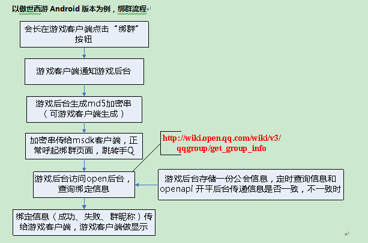


MSDK 모바일QQ 관련 모듈
=======

액세스 설정
------

### AndroidMainfest 설정

- 게임은 다음 사례에 따라 설정 정보를 입력한다.

		<!-- TODO SDK 액세스  QQ 액세스 설정 START -->
		<activity
		    android:name="com.tencent.tauth.AuthActivity"
		    android:launchMode="singleTask"
		    android:noHistory="true" >
		    <intent-filter>
		        <action android:name="android.intent.action.VIEW" />
		        <category android:name="android.intent.category.DEFAULT" />
		        <category android:name="android.intent.category.BROWSABLE" />
		        <data android:scheme="tencent게임의 모바일QQ appid" />
		    </intent-filter>
		</activity>
		<activity
		    android:name="com.tencent.connect.common.AssistActivity"
		    android:configChanges="orientation|screenSize|keyboardHidden"
		    android:screenOrientation="portrait"
		    android:theme="@android:style/Theme.Translucent.NoTitleBar" />
		<!-- TODO SDK 액세스 QQ 액세스 설정 END -->

- **주의사항:**

	1. **com.tencent.tauth.AuthActivity의 intent-filter 중```<data android:scheme="tencent게임의 모바일QQ appid" />```
	중 tencent 뒤에 게임의 모바일QQ appid 입력.**예: ```<data android:scheme="tencent100703379" />```

	- **게임 Activity의 launchMode는 singleTop으로 설정해야 한다**, singleTop으로 설정한 후 플랫폼에서 게임을 실행할 때 게임 Activity가 2개 실행되는 경우가 발생할 수 있기에 게임 Activity의 onCreate에서 현재 Activity가 중복된 게임 Activity인지 검사해야 한다. 중복되었으면 현재 게임 Activity를 종료해야 한다.

### Appid 설정:

- 이 부분 내용은 Java 계층 초기화 부분에서 이미 완료되었다.

		public void onCreate(Bundle savedInstanceState) {
			...
    		//게임은 반드시 자신의 QQ AppId를 사용하여 연동 테스트 진행
            baseInfo.qqAppId = "1007033***";
            baseInfo.qqAppKey = "4578e54fb3a1bd18e0681bc1c7345***";

            //게임은 반드시 자신의 위챗 AppId를 사용하여 연동 테스트 진행
            baseInfo.wxAppId = "wxcde873f99466f***"; 
            baseInfo.wxAppKey = "bc0994f30c0a12a9908e353cf05d4***";

            //게임은 반드시 자신의 결제 offerId를 사용하여 연동 테스트 진행
            baseInfo.offerId = "100703***";
    		...
    		WGPlatform.Initialized(this, baseInfo);
    		WGPlatform.handleCallback(getIntent());
    		...
		}
- **주의사항:**

	1. 게임에서 baseInfo 값을 틀리게 적으면 QQ, 위챗 공유, 로그인 실패를 초래하게 된다!!!

### 그룹 가입 그룹 바인딩 콜백 설정

- MGSDK2.7.0버전부터 MSDKQQ 그룹에 가입 및 그룹 바인딩에 별도의 전반 콜백을 추가한다：`WGQQGroupObserver`.해당 전반 콜백을 통해 게임은 그룹 바인딩, 그룹 정보 조회, 그룹 바인딩 해제 시 대응한 콜백 정보를 받을 수 있다.

#### Java 층 콜백：

- **콜백 구현 예시：**

		//그룹에 가입, 그룹 바인딩 콜백
		class MsdkQQGroupCallback implements WGQQGroupObserver {

			@Override
			public void OnQueryGroupInfoNotify(QQGroupRet groupRet) {
				//TODO GAME 그룹 정보 조회 콜백 추가
				Logger.d("flag:"+ groupRet.flag + ";errorCode："+ groupRet.errorCode + ";desc:" + groupRet.desc);
				if(CallbackFlag.eFlag_Succ == groupRet.flag){
					//게임은 회장의 길드 화면에서 바인딩 해제 버튼을 표시하여 길드회장이 아닐 경우 QQ그룹으로 이동 버튼 표시한다.
					MsdkCallback.sendResult("조회 성공\n그룹 닉네임："+groupRet.getGroupInfo().groupName 
							+"\n그룹openID:"+groupRet.getGroupInfo().groupOpenid 
							+"\n그룹 가입 Key는 "+groupRet.getGroupInfo().groupKey)이다;
				}else{
					if(2002 == groupRet.errorCode){
						//길드 회장의 길드 화면에는 그룹 바인딩 버튼 표시가능하며 회장이 아닐 경우는 미바인딩을 표시한다
						MsdkCallback.sendResult("조회 실패，현재 길드 바인딩 기록이 없다！");
					}else if(2003 == groupRet.errorCode){
						//유저 길드 화면에서 그룹 가입 버튼을 표시할 수 있다
						MsdkCallback.sendResult("조회 실패，현 유저 아직 QQ그룹에 가입하지 않아, 우선 QQ 그룹에 가입하기 바란다！");
					}else if(2007 == groupRet.errorCode){
						//유저 길드 화면에서 그룹 가입 버튼을 표시할 수 있다
						MsdkCallback.sendResult("죄회 실패，해당 QQ그룹은 해산되거나 존재하지 않는다！");
					}else{
						//유저 조회 재시도를 안내한다
						MsdkCallback.sendResult("조회 실패，시스템 에러, 다시 시도하기 바람！");
					}
				}
			}
		
			@Override
			public void OnBindGroupNotify(QQGroupRet groupRet) {
				//TODO GAME QQ그룹 바인딩 콜백 추가
				Logger.d("flag:"+ groupRet.flag + ";errorCode："+ groupRet.errorCode + ";desc:" + groupRet.desc);
				if(CallbackFlag.eFlag_Succ == groupRet.flag){
					//길드과 바인딩에 관련 정보를 게임에서 조회 가능
					//현 QQSDK에서 지원 불가능하기 때문에 바인딩 성공 여부이든 MSDK는 게임에게 성공 콜백을 발송한다. 해당 콜백을 받은 후 조회 인터페이스를 호출하여 바인딩 성공 여부를 확인
					MsdkCallback.sendResult("바인딩 성공");
				}else{
					//유저 재시도를 안내한다
					MsdkCallback.sendResult("바인딩 실패，시스템 에러, 다시 시도하기 바람！");
				}
			}
		
			@Override
			public void OnUnbindGroupNotify(QQGroupRet groupRet) {
				//TODO GAME QQ그룹 바인딩 해제의 콜백 추가
				Logger.d("flag:"+ groupRet.flag + ";errorCode："+ groupRet.errorCode + ";desc:" + groupRet.desc);
				if(CallbackFlag.eFlag_Succ == groupRet.flag){
					//바인딩 해제 성공, 게임은 유저에게 바인딩 해제 성공을 알려주며 길드회장의 길드 화면에서 그룹 바인딩 버튼을 노출하여 비 회장 화면에는 미바인딩 버튼을 노출하게 한다
					MsdkCallback.sendResult("바인딩 해제 성공");
				}else{
					if(2001 == groupRet.errorCode){
						//바인딩 해제에 사용된 openID는 그룹과의 바인딩 기록이 없어서 게임에서 다시 조회 인터페이스를 호출하여 바인딩 상황을 조회
						MsdkCallback.sendResult("바인딩 해제 실패，현 QQ그룹에 바인딩 기록이 없다！");
					}else if(2003 == groupRet.errorCode){
						//유저 로그인 상태 기간만료，재 로그인하기 바람
						MsdkCallback.sendResult("바인딩 해제 실패，유저 로그인 상태 기간만료이니, 재 로그인하기 바람！");
					}else if(2004 == groupRet.errorCode){
						//조작이 너무 빈범하여 유저로 하여금 잠시 후 다시 시도하기 바람
						MsdkCallback.sendResult("해제 실패,조작이 너무 빈범하여 유저로 하여금 잠시 후 다시 시도하기 바람！");
					}else if(2005 == groupRet.errorCode){
						//해제 파라미터 오류, 게임에 다시 조회 인터페이스를 호출하여 바인딩 상황을 조회
						MsdkCallback.sendResult("해제 실패, 해제 파라미터 오류！");
					}else{
						//유저로 하여금 다시 시도하게 안내한다
						MsdkCallback.sendResult("해제 실패, 시스템 오류, 다시 시도하기 바람！");
					}
				}
			}
		}

- **콜백 설정：**

		 //QQ 그룹 가입 및 그룹 바인딩 콜백
	     WGPlatform.WGSetQQGroupObserver(new MsdkQQGroupCallback());

#### C++ 층 콜백：

- **콜백 구현 예시（간단한 예시를 보여주며 상세한 내용은 java층의 콜백을 참조 바람）：**

		// 광고의 콜백，
		class QQGroupCallback: public WGQQGroupObserver {
		
			virtual void OnQueryGroupInfoNotify(QQGroupRet& groupRet){
				// 게임은 이 위치에서 그룹 정보 조회하여 리턴한 후의 로직을 추가
				LOGD("QQGroupCallback OnQueryGroupInfoNotify;flag:%d;errorCode:%d;desc:%s",groupRet.flag,groupRet.errorCode,groupRet.desc.c_str());
			}
			virtual void OnBindGroupNotify(QQGroupRet& groupRet){
				//게임은이 위치에서 그룹 바인딩한 후의 로직을 추가하며 현재 openSDK지원 불가, MSDK는 인터페이스 호출 성공으로만 리턴 가능한 것을 뜻한다
				LOGD("QQGroupCallback OnQueryGroupInfoNotify;flag:%d;errorCode:%d;desc:%s",groupRet.flag,groupRet.errorCode,groupRet.desc.c_str());
			}
			virtual void OnUnbindGroupNotify(QQGroupRet& groupRet){
				// 게임은 이 위치에서 바인딩 해제 인터페이스 호출한 후의 리턴 결과를 추가
				LOGD("QQGroupCallback OnQueryGroupInfoNotify;flag:%d;errorCode:%d;desc:%s",groupRet.flag,groupRet.errorCode,groupRet.desc.c_str());
			}
		};
		QQGroupCallback qqGroup_callback;

- **콜백 설정：**
	
		WGPlatform::GetInstance()->WGSetQQGroupObserver(&qqGroup_callback);
		
## 퀵 로그인

퀵 로그인이란 유저가 QQ 혹은 위챗 공유 메시지를 클릭하여 직접 게임 호출해서 게임 로그인할 때，플랫폼에서 관련 토큰정보를 투과전송 하여 로그인 실행. 해당 이런 스테이지에서 게임이 호출된 후 유저는 다시 인증할 필요없이 게임에 로그인 할 수 있다.

### QQ 게임 센터 킉 로그인 설정

QQ는 게임센터를 통해 시작을 클릭하여 직접 킉 로그인 할 수 있다.하지만 게임센터 상세 페이지를 통해 로그인할 때는 게임 설정에 달려 있다.구체적인 설정방법은 게임의**`운영 협조 기획PM`**가 해당 요청을 QQ게임센터에게 제출하고 게임 센터 담당자가 설정을 진행.설정은 아래와 같다：

1. openID 지원：

	openID 옵션을 선택한다.아래 그림처럼

	 

2. openID,accessToken,PayToken 지원

	1. 해당 옵션을 선택한다.

	2. 다른 계정을 지원 가능한 버전이 대응하는 versionCode를 작성. 작성한 뒤 이 code 및 그 이상 버전은 토큰을 가지고 게임 호출 가능하며 그 이전 버전은 openID만 가지고 게임 호출. 게임의 정상 로직에 영향을 주지 않는다.

	 

3. 주의 사항

	설정할 때는 일반적으로 앞에 3개 옵션만 설정하면 되고 뒤에 옵션은 설정하지 않아도 된다.

개인 정보 조회
------

유저가 모바일QQ 인증을 통과한 후 게임은 유저 닉네임, 아바타 등 기타 정보를 획득해야 한다. 개인 정보는 nickname, openId, gender, pictureSmall, pictureMiddle, pictureLarge를 포함한다. 이 기능의 구현에 필요한 인터페이스: WGQueryQQMyInfo, 인터페이스의 자세한 설명은 다음과 같다.
#### 인터페이스 선언:

	/**
	 * 자신의 QQ 정보 획득
	 * @return void
	 *   이 인터페이스의 호출 결과는 OnRelationCallBack(RelationRet& relationRet)콜백을 통해 게임에 데이터를 반환한다
	 *   RelationRet 객체의 persons 속성은 하나의 Vector<PersonInfo>이며 0번째가 바로 유저의 개인 정보이다.
	 *   모바일QQ 인증 유저가 획득할 수 있는 개인 정보:
	 *   nickname, openId, gender, pictureSmall(40*40), pictureMiddle(40*40), pictureLarge(100*100), 기타 필드는 비어 있음
	 */
	bool WGQueryQQMyInfo();

#### 인터페이스 호출:

인터페이스 호출 예시:

	WGPlatform::GetInstance()->WGQueryQQMyInfo();
콜백 접수 사례: 

	virtual void OnRelationNotify(RelationRet& relationRet) {
    switch (relationRet.flag) {
    case eFlag_Succ:
        // relationRet.persons.at(0) 에 저장된 것이 개인 정보이다
        break;
    default:
        break;
    	}
	}

게임친구 정보 조회
------

유저가 모바일QQ를 통해 게임 인증을 받은 후 게임내 친구 정보(친구 점수 랭킹 등)를 불러와야 한다. 이 기능의 구현에 필요한 인터페이스: WGQueryQQGameFriendsInfo, 인터페이스의 자세한 설명은 다음과 같다.
#### 인터페이스 선언:
	
	/**
	* QQ 친구 정보 획득, OnRelationNotify에 콜백
	* 그중 RelationRet.persons는 하나의 Vector이며 Vector 내용이 곧 친구 정보이다. QQ친구 정보의 province와 city는 비어 있다
	* @return void
	* 이 인터페이스의 호출 결과는 OnRelationNotify(RelationRet& relationRet)
	* 콜백을 통해 게임에 데이터를 반환한다. 객체의 persons 속성은 하나의 Vector<PersonInfo>이며,
	* 그중 각 PersonInfo 객체가 곧 친구 정보이다.
	* 친구 정보는 nickname, openId, gender, pictureSmall, pictureMiddle, pictureLarge를 포함한다.
	*/
	bool WGQueryQQGameFriendsInfo();
	
#### 인터페이스 호출:

인터페이스 호출 예시:

	WGPlatform::GetInstance()->WGQueryQQGameFriendsInfo();

콜백 접수 사례: 

	virtual void OnRelationNotify(RelationRet& relationRet) {
    	switch (relationRet.flag) {
    	case eFlag_Succ:
        // relationRet.persons 에 저장된 것이 모든 친구의 정보이다
       		break;
    	default:
        	break;
    	}
	}
구조화 메시지 공유
------

이런 메시지 공유를 진행하려면 모바일QQ를 실행하고 유저가 참여해야 전체 공유 과정을 완료할 수 있다. 게임 내외 친구에게 공유할 수 있고 일반적으로 게임밖 친구를 초대하는 데 사용된다

메시지를 공유한 후 수신자는 메시지를 클릭하면 인터페이스 호출 시 전송된 URL을 실행할 수 있다. 이 URL은 보통 게임센터 URL로 설정된다. 이런 방식을 통해 모바일QQ 게임센터에서 자동 실행을 설정하여 메시지 클릭만으로 게임을 실행하는 효과를 구현할 수 있다.

유저 휴대폰에 모바일QQ 가 설치되지 않았거나 모바일QQ 버전이 4.0보다 낮으면 이 인터페이스는 Web페이지를 불러와 공유 기능을 실현한다. 이 기능의 구현에 필요한 인터페이스: WGSendToQQ, 인터페이스의 자세한 설명은 다음과 같다. 
#### 사용 장면:
	초대, 자랑하기
#### 인터페이스 선언:

	/**
	 * @param scene 표시를 모바일QQ 대화 또는 Qzone에 전송
	 * 		eQQScene.QQScene_QZone: 공간에 공유(4.5 이상 버전 지원)
	 * 		eQQScene.QQScene_Session: 모바일QQ 대화에 공유
	 * @param title 구조화 메시지 제목
	 * @param desc 구조화 메시지 개요 정보
	 * @param url  내용 이동 url, 게임의 대응하는 게임센터 세부페이지 입력, 공유 메시지가 게임 실행 시 MSDK는 게임에 OnWakeup(WakeupRet& wr) 콜백, wr.extInfo에 key-value 방식으로 모둔 자체정의 파라미터 반환
	 * @param imgUrl 공유 메시지 썸네일 URL
	 * @param imgUrlLen 공유 메시지 썸네일 URL 길이
	 * @return void
	 *   게임이 설정한 전역 콜백의 OnShareNotify(ShareRet& shareRet)를 통해 리턴 데이터를 게임에 콜백한다. shareRet.flag 값은 반환 상태를 표시하고 가능한 값과 설명은 다음과 같다.
	 *     eFlag_Succ: 공유 성공
	 *     eFlag_Error: 공유 실패
	 *     
	 *     @return void
	 *	게임이 설정한 전역 콜백의 OnShareNotify(ShareRet& shareRet)를 통해 리턴 데이터를 게임에 콜백한다. shareRet.flag 값은 반환 상태를 표시하고 가능한 값과 설명은 다음과 같다.
	 *     eFlag_Succ: 공유 성공
	 *     eFlag_Error: 공유 실패
	 *   주의:
	 *     공유는 sd카드를 사용해야 한다. sd카드가 없으면 공유 실패를 초래할 수 있다
	 *     모바일QQ 클라이언트 4.6 이전 버전이 리턴한 콜백에 문제가 있기에 이 콜백에 의존하여 다른 로직을 처리하지 말아야 한다(현재 flag는 전부 eFlag_Succ 리턴)
	 *     
	 */ 
	void WGSendToQQ(
		const eQQScene& scene,
		unsigned char* title, 
		unsigned char* desc,
		unsigned char* url, 
		unsigned char* imgUrl,
		const int& imgUrlLen
		);
	
#### 인터페이스 호출:

인터페이스 호출 예시:

	int scene = 1; 
	std::string title = "title";
	std::string summary = "summary";
	std::string targetUrl = "http://www.qq.com";
	std::string imgUrl = "http://mat1.gtimg.com/erweimaNewsPic.png";
	WGPlatform::GetInstance()-> WGSendToQQ(
		1, 
		((unsigned char *) title.c_str()),
		((unsigned char *)summary.c_str()), 
		((unsigned char *)targetUrl.c_str()),
		((unsigned char *)imgUrl.c_str()),
		imgUrl.length()
	);

콜백 접수 사례: 

	virtual void OnShareNotify(ShareRet& shareRet) {
    	LOGD("OnShareNotify: platform:%d flag:%d",
            shareRet.platform, shareRet.flag);
    	// 공유 콜백 처리
    	if (shareRet.platform == ePlatform_QQ) {
        	switch (shareRet.flag) {
        		case eFlag_Succ:
            		// 공유 성공
            		break;
        		case eFlag_Error:
            		// 공유 실패
            		break;
        		}
    		} else if (shareRet.platform == ePlatform_Weixin) {
        	...
    	}
	}

#### 주의사항:

* QQ를 실행하고 디폴트로 Q존으로 공유의 팝업창을 팝업하는 기능은 QQ4.5 이상 버전에서야 지원 가능.
* `공유 이미지의 추천 크기는 200*200이며 이미지의 어느 한쪽이 <100일 경우 이미지는 정상으로 표시 못한다.`

음악 메시지 공유
------
음악 메시지 공유는 모바일QQ를 실행해야 하며 전체 공유 과정을 진행하려면 유저의 참여가 필요하다.

메시지를 공유한 후 수신자는 재생 버튼을 클릭하면 음악을 직접 재생할 수 있으며 대화를 종료해도 계속 재생할 수 있다. 메시지를 클릭하면 지정된 페이지로 이동한다.

유저 휴대폰에 모바일QQ가 설치되지 않았거나 설치된 모바일QQ 버전이 4.0보다 낮을 경우 이 인터페이스는 Web페이지를 불러와 공유 기능을 실현한다. 이 기능의 구현에 필요한 인터페이스: 
#### 사용 스테이지:
	초대, 자랑하기
#### 인터페이스 선언:

	/**
	 * 음악 메시지를 모바일QQ 대화에 공유
	 * @param scene eQQScene:
	 * QQScene_QZone : 공간에 공유
	 * QQScene_Session: 대화에 공유
	 * @param title 구조화 메시지 제목
	 * @param desc 구조화 메시지 개요 정보
	 * @param musicUrl  메시지 클릭시 이동하는 URL
	 * @param musicDataUrl  음악 데이터 URL(예하면 http:// ***.mp3)
	 * @param imgUrl 		공유 메시지 썸네일 URL
	 * @return void
	 *게임이 설정한 전역 콜백의 OnShareNotify(ShareRet& shareRet)를 통해 리턴 데이터를 게임에 콜백한다. shareRet.flag 값은 반환 상태를 표시하고 가능한 값과 설명은 다음과 같다.
	 *eFlag_Succ: 공유 성공
	 *eFlag_Error: 공유 실패
	 */
	void WGSendToQQWithMusic(
		const eQQScene& scene,
		unsigned char* title,
		unsigned char* desc,
		unsigned char* musicUrl,
		unsigned char* musicDataUrl,
		unsigned char* imgUrl
	);

#### 인터페이스 호출:

인터페이스 호출 예시:

	int scene = 1; 
	std::string title = "title";
	std::string desc = "desc";
	std::string musicUrl = "http://y.qq.com/i/song.html?songid=1135734&source=qq";
	std::string musicDataUrl = "http://wekf.qq.com/cry.mp3";
	std::string imgUrl = "http://imgcache.qq.com/music/photo/mid_album_300/g/l/002ma2S64Gjtgl.jpg";
	WGPlatform::GetInstance()->WGSendToQQWithMusic(
		1, 
		((unsigned char *) title.c_str()),
		((unsigned char *)desc.c_str()), 
		((unsigned char *)musicUrl.c_str()),
		((unsigned char *)musicDataUrl.c_str()),
		((unsigned char *)imgUrl.c_str()),
		imgUrl.length()
	);

콜백 접수 사례: 

	virtual void OnShareNotify(ShareRet& shareRet) {
    	LOGD("OnShareNotify: platform:%d flag:%d",
            shareRet.platform, shareRet.flag);
    	// 공유 콜백 처리
    	if (shareRet.platform == ePlatform_QQ) {
        	switch (shareRet.flag) {
        		case eFlag_Succ:
            		// 공유 성공
            		break;
        		case eFlag_Error:
            		// 공유 실패
            		break;
        		}
    		} else if (shareRet.platform == ePlatform_Weixin) {
        	...
    	}
	}

#### 주의 사항：

* `공유 이미지의 추천 크기는 200*200이고 이미지의 어느 한쪽이 <100일 경우, 이미지는 정상으로 표시하지 못할 것이다.`

	백엔드 공유
------

위 절차대로 친구 정보를 획득한 후 게임은 지정된 친구(지정된 친구의 openId)에게 메시지를 공유해야 한다. 이런 공유는 모바일QQ 클라이언트를 실행하지 않고 유저가 공유 과정에 참여할 필요가 없이 인터페이스만 호출하면 공유를 완료할 수 있지만 게임내 친구에게만 공유가 가능하다. 메시지를 공유한 후 수신자는 메시지를 클릭하면 공유시 전송한 URL을 실행할 수 있다. 이 URL은 보통 게임센터 URL로 설정된다. 이런 방식을 통해 모바일QQ 게임센터에서 자동 실행을 설정하여 메시지 클릭만으로 게임을 실행하는 효과를 구현할 수 있다. 이 기능의 구현에 필요한 인터페이스: WGSendToQQGameFriend, 인터페이스의 자세한 설명은 다음과 같다.
#### 사용 장면:
	하트 보내기 후 친구 통지
#### 인터페이스 선언:

	/**
	 * @param act 친구가 공유 메시지 클릭시 페이지 또는 게임 실행. 1은 게임 실행, 0은 targetUrl 실행
	 * @param fopenid 친구 openId
	 * @param title 공유 제목
	 * @param summary 공유 소개
	 * @param targetUrl 내용 이동 url, 게임의 대응하는 게임센터 세부페이지 입력, 공유 메시지가 게임 실행 시 MSDK는 게임에 OnWakeup(WakeupRet& wr) 콜백, wr.extInfo에 key-value 방식으로 모둔 자체정의 파라미터 반환.
	 * @param imageUrl 공유 썸네일 URL
	 * @param previewText 옵션, 문자 미리보기
	 * @param gameTag 옵션, 이 파라미터는 반드시 아래 값 중 하나를 입력해야必한다
				 MSG_INVITE                //초대
				 MSG_FRIEND_EXCEED       //초월 자랑하기
				 MSG_HEART_SEND          //하트 보내기
				 MSG_SHARE_FRIEND_PVP    //PVP 대전
	 */ 
		bool WGSendToQQGameFriend(
			int act, 
			unsigned char* fopenid,
			unsigned char *title, 
			unsigned char *summary,
			unsigned char *targetUrl, 
			unsigned char *imgUrl,
			unsigned char* previewText, 
			unsigned char* gameTag
		);

#### 인터페이스 호출:

인터페이스 호출 예시:

	int act = 1;
	std::string friendOpenId = "791AB3A5864670BB6E331986FB86582A";
	std::string title = "qq title";
	std::string summary = "qq summary";
	std::string targetUrl = "http://qq.com";
	std::string imageUrl = "http://mat1.gtimg.com//erweimaNewsPic.png";
	std::string previewText = "qq previewText";
	std::string gameTag = "qq gameTag";
	WGPlatform::GetInstance()->WGSendToQQGameFriend(
		1, 
		((unsigned char *) friendOpenId.c_str()), 
		((unsigned char *)title.c_str()), 
		((unsigned char *)summary.c_str()), 
		((unsigned char *)targetUrl.c_str()), 
		((unsigned char *)picUrl.c_str()), 
		((unsigned char *)previewText.c_str()), 
		((unsigned char *)game_tag.c_str())
	);

콜백 접수 사례:

	virtual void OnShareNotify(ShareRet& shareRet) {
    	LOGD("OnShareNotify: platform:%d flag:%d",
            shareRet.platform, shareRet.flag);
    	// 공유 콜백 처리
    	if (shareRet.platform == ePlatform_QQ) {
       		switch (shareRet.flag) {
        	case eFlag_Succ:
            	// 공유 성공
            	break;
        	case eFlag_Error:
            	// 공유 실패
            	break;
        	}
    	} else if (shareRet.platform == ePlatform_Weixin) {
        	...
    	}
	}

#### 주의사항:
이 공유 메시지는 PC QQ에서 출력되지 않고 수신자가 “QQ모바일게임” 공공계정을 팔로우해야 받을 수 있다. 같은 유저가 하루 동안 받을 수 있는 동일한 게임 메시지는 약 20개 좌우이다.

빅이미지 메시지 공유
------
이런 메시지 공유를 진행하려면 모바일QQ를 실행하고 유저가 참여해야 전체 공유 과정을 완료할 수 있다. 게임 내외 친구에게 공유할 수 있고 일반적으로 성적 자랑하기 또는 자세한 이미지가 필요한 기능에 사용된다

메시지를 공유한 후 수신자가 메시지 클릭시 게임을 실행하지 못한다.

유저 휴대폰에 모바일QQ 가 설치되지 않았거나 모바일QQ 버전이 4.5보다 낮으면 이 인터페이스는 Web페이지를 불러와 공유 기능을 실현한다. 이미지 최소 길이가 640px을 초과할 경우 백그라운드는 이미지에 대해 압축을 진행한다. 이 기능의 구현에 필요한 인터페이스: WGSendToQQWithPhoto, 인터페이스의 자세한 설명은 다음과 같다.
#### 사용 스테이지:
	자랑하기

#### 인터페이스 선언:

	/**
	 * @param scene 표시를 모바일QQ 대화 또는 Qzone에 전송
	 * 		eQQScene.QQScene_QZone: 공간에 공유
	 * 		eQQScene.QQScene_Session: 모바일QQ 대화에 공유
	 * @param imgFilePath 공유 이미지의 로컬 파일 경로. 이미지는 sd카드에 저장해야 하고 매번 공유한 이미지 경로는 같지 말아야 한다. 경로가 같으면 이미지 표시 오류를 초래할 수 있다. 게임은 매번 공유하는 이미지 주소가 같지 않도록 스스로 조치를 취해야 한다.
	 * @return void
	 *   게임이 설정한 전역 콜백의 OnShareNotify(ShareRet& shareRet)를 통해 리턴 데이터를 게임에 콜백한다. shareRet.flag 값은 반환 상태를 표시하고 가능한 값과 설명은 다음과 같다.
	 *     eFlag_Succ: 공유 성공
	 *     eFlag_Error: 공유 실패
	 * 주의: 모바일QQ 클라이언트 4.6 이전 버전이 리턴한 콜백에 문제가 있기에 이 콜백에 의존하여 다른 로직을 처리하지 말아야 한다(현재 flag는 전부 eFlag_Succ 리턴)
	 */
	void WGSendToQQWithPhoto(const eQQScene& scene, unsigned char* imgFilePath);
#### 인터페이스 호출:
인터페이스 호출 예시:

	//이미지는 png,jpg 지원. 반드시 sdcard 에 넣어야 함
	std::string filePath = "/mnt/sdcard/test.png";
	WGPlatform::GetInstance()->WGSendToQQWithPhoto(
	1, 
	((unsigned char *)filePath.c_str())
	);
		
콜백 접수 사례: 

	virtual void OnShareNotify(ShareRet& shareRet) {
    	LOGD("OnShareNotify: platform:%d flag:%d",
            shareRet.platform, shareRet.flag);
    	// 공유 콜백 처리
    	if (shareRet.platform == ePlatform_QQ) {
        	switch (shareRet.flag) {
        		case eFlag_Succ:
            		// 공유 성공
            		break;
        		case eFlag_Error:
            		// 공유 실패
            		break;
        		}
    		} else if (shareRet.platform == ePlatform_Weixin) {
        	...
    	}
	}

#### 주의사항:

1. 이 인터페이스는 로컬 이미지 경로만 지원하며 매번 공유한 이미지 경로는 같지 말아야 한다. 경로가 같으면 이미지 표시 오류를 초래할 수 있다. 게임은 매번 공유하는 이미지 주소가 같지 않도록 스스로 조치를 취해야 한다.
2. 모바일QQ를 실행하고 “공간에 공유”창을 기본적으로 팝업하는 기능은 모바일QQ 4.5 이상 버전에서만 지원된다
3. 빅이미지 메시지가 web를 통해 공유하지 못함


QQ그룹 바인딩
------
게임 길드/연맹 내에서 길드장은 “바인딩” 버튼을 클릭하여 길드장이 만든 그룹을 불러와 해당 길드의 길드 그룹으로 바인딩시킬 수 있다. 호출 인터페이스: WGBindQQGroup. 바인딩 정보는 콜백을 통해 게임에게 알려준다.콜백 설정 설정은 [그룹 가입 및 그룹 바인딩 콜백 설정]참조.(qq.md#그룹 가입 및 그룹 바인딩 콜백 설정)

####버전 상황：

- MSDK1.7.5 버전부터 해당 이 기능 제공하기 시작.
- **MSDK2.6버전 이전의 게임에 해당 인터페이스는 반드시 메인 스레드에서 호출해야 한다.**

#### 인터페이스 선언:
	
	/**
	 * 게임 그룹 바인딩: 게임 길드/연맹 내에서 길드장은 “바인딩” 버튼을 클릭하여 길드장이 만든 그룹을 불러와 해당 길드의 길드 그룹으로 바인딩시킬 수 있다
	 * 바인딩 결과는 WGQQGroupObserver의 OnBindGroupNotify를 통해 게임에 리턴.
	 * 현제 QQ SDK는 그룹 바인딩의 콜백을 지원하지 않기 때문에,MSDK2.7.0a버전부터 바인딩 성공 여부를 막론하고 MSDK는 게임에 성공의 콜백을 발송할 것이다.
	 * 게임이 콜백을 받은 후 조회 인터페이스를 호출하여 바인딩 성공 여부를 확인해야 한다
	 * @param cUnionid 길드ID, opensdk 숫자만 입력 가능, 문자는 바인딩 실패를 초래할 수 있음	 
	 * @param cUnion_name 길드명
	 * @param cZoneid 큰구역 ID, opensdk문자는 바인딩 실패를 초래할 수 있음	 
	 * @param cSignature 게임 맹주 신분 인증 서명, 생성 알고리즘은
					유저openid_게임appid_게임appkey_길드id_구역id 로md5 진행, 이 방법으로도 바인딩할 수 없으면 RTX을 통해 OpenAPIHelper에 문의
	 *
	 */
	void WGBindQQGroup(unsigned char* cUnionid, unsigned char* cUnion_name,
			unsigned char* cZoneid, unsigned char* cSignature);

#### 인터페이스 호출:
인터페이스 호출 예시:

	std::string cUnionid = "1";
	std::string cUnion_name = "union_name";
	std::string cZoneid = "1";
	//sigature unionid와 zoneid와 관련, 수정 시 동시에 수정해야 한다
	std::string cSignature = "5C336B37DBCDB04D183A3F4E84B2AB0E";
	WGPlatform::GetInstance()->WGBindQQGroup(
		(unsigned char *)cUnionid.c_str(),
		(unsigned char *)cUnion_name.c_str(), 
		(unsigned char *)cZoneid.c_str(),
		(unsigned char *)cSignature.c_str()
	);

	
#### 주의사항:

1.	**게임에서 그룹 바인딩 시 길드id와 큰구역 id는 반드시 숫자여야 한다** 문자를 사용하면 바인딩 실패를 초래할 수 있으며 보통 “파라미터 검증 실패”를 제시한다.

- 게임에서 그룹 바인딩 시 서명 생성 규칙: 유저openid\_게임appid\_게임appkey\_길드id\_구역id의 md5값, 이 규칙에 따라 생성한 서명을 사용할 수 없으면 RTX를 통해 OpenAPIHelper에 문의

- 게임에서 길드ID는 한 개 QQ그룹만 바인딩할 수 있다. 유저가 길드 QQ그룹을 해체해도 길드ID와 길드QQ그룹은 자동으로 바인딩이 해제되지 않기에 길드ID는 새로운 QQ그룹과 바인딩할 수 없게 된다. 이럴 경우, 앱은 바인딩 해제 인터페이스를 호출하여 길드ID와 QQ그룹의 바인딩을 해제하여 새로운 길드QQ그룹을 생성하거나 이미 있는 QQ그룹과 바인딩을 진행할 수 있다.

- **api 호출 변수는 되도록 임시 변수를 사용하지 말아야 한다**

- **현제 QQ SDK는 그룹 바인딩의 콜백을 지원하지 않기 때문에,MSDK2.7.0a버전부터 바인딩 성공 여부를 막론하고 MSDK는 게임에 성공의 콜백을 발송할 것이다. 게임이 콜백을 받은 후, [조회 인터페이스](qq.md#QQ그룹 바인딩 정보 조회)를 호출하여 바인딩 성공 여부를 확인해야 한다**

- 더 상세한 내용은 [게임내 그룹 가입 및 그룹 바인딩 FAQ]를 참고(qq.md#그룹 가입 및 그룹 바인딩 FAQ)

QQ그룹 바인딩 정보 조회
------
유저 길드 화면에 들어가거나 그룹 바인딩 한 다음에 바인딩 정보를 조회 필요 시, 인터페이스를 호출하면 현 길드와 그룹의 바인딩 정보를 조회할 수 있다.`WGQueryQQGroupInfo`인터페이스를 호출하면 된다. 조회 결과는 콜백을 통해 게임에 알려준다. 콜백 설정은 [그룹 가입 및 그룹 바인딩 콜백 설정](qq.md#그룹 가입 및 그룹 바인딩 콜백 설정)

####버전 상황：

- MSDK2.7.0 버전부터 이 기능을 제공하기 시작.
- **MSDK2.7버전 이전의 게임은 [그룹 가입 및 그룹 바인딩 FAQ](qq.md#그룹 가입 및 그룹 바인딩 FAQ)에서 해결 방안을 확인.**

#### 인터페이스 성명：
	
	/**
	 * 길드 바인딩한 그룹 정보를 조회, 조회 결과는 WGQQGroupObserver의 OnQueryGroupInfoNotify를 통해 게임에 콜백할 것이다.
	 * @param unionid 길드ID
	 * @param zoneid 월드ID
	 */
    void WGQueryQQGroupInfo(unsigned char* cUnionid,unsigned char* cZoneid);

#### 인터페이스 호출：
인터페이스 호출 예시：

	std::string cUnionid = "1";
	std::string cZoneid = "1";
	WGPlatform::GetInstance()->WGQueryQQGroupInfo(
		(unsigned char *)cUnionid.c_str(),(unsigned char *)cZoneid.c_str());

#### 에러 코드：

| 에러 코드| 설명 |
| ------------- |:-----|
|2002 	|바인딩 기록이 없다.현 길드는 바인딩 기록이 없어 기입한 길드ID 및 월드ID의 정확성을 확인하기 바란다.|
|2003 	|조회 실패，현 유저는 QQ그룹에 가입되지 않아, 우선 QQ그룹에 가입하기 바란다|
|2007 	|조회 실패，현 길드 바인딩한 QQ그룹은 해산되거나 존재하지 않는다.|
|기타 	|시스템 오류, 기업QQ를 통해 기술 지원 요청하여 문제 발생하는 원인을 파악하고 해결 방안을 획득.| 

QQ그룹 추가
------
유저는 게임에서 QQ그룹을 직접 추가할 수 있다. 호출 인터페이스: WGJoinQQGroup.

####버전 상황：

- MSDK1.7.5 버전부터 이 기능을 제공하기 시작.
- **MSDK2.6.0a버전 이전 게임에 해당 인터페이스는 반드시 메인 스레드에서 호출해야 한다.**

#### 인터페이스 선언:

	/**
	 * 게임에서 그룹 추가, 길드가 qq그룹을 성공적으로 바인딩한 후 길드원은 “그룹 추가” 버튼을 클릭하여 길드 그룹에 가입할 수 있다
	 * @param cQQGroupKey 추가해야 할 QQ그룹 key. 게임 server는 openAPI 인터페이스를 호출하여 획득할 수 있다. 호출 방법은 RTX를 통해 OpenAPIHelper에 문의
	 */
	void WGJoinQQGroup(unsigned char* cQQGroupKey);

#### 인터페이스 호출:
인터페이스 호출 예시:

	std::string cQqGroupKey = "xkdNFJyLwQ9jJnozTorGkwN30Gfue5QN";
	WGPlatform::GetInstance()->WGJoinQQGroup((unsigned char *)cQqGroupKey.c_str());


#### 주의사항:

1. 게임에서 그룹 추가시 사용하는 파라미터는 대응하는 QQ그룹 번호가 아니라 openAPI 백그라운드에서 생성한 특수한 Key 값이다. MSDK 2.7.0a 및 이후버전에 해당 값은 조회 인터페이스를 호출할 때 획득 가능.MSDK 2.7.0a이전 버전을 사용할 경우 openAPI인터페이스를 호출해야 획득 가능.호출 방법은 RTX 를 통해 OpenAPIHelper에게 문의할 수 있다. 연동 테스트 단계에는 [http://qun.qq.com](http://qun.qq.com)**(그룹 가입 모듈/Android 코드에서 확인할 수 있다)**아래 이미지 참고：

- **api 호출 변수는 되도록 임시 변수를 사용하지 말아야 한다**

- 더 상세한 내용은 [게임 내 그룹 가입 및 그룹 바인딩 FAQ]를 참고(qq.md#그룹 가입 및 그룹 바인딩 FAQ)


QQ 그룹 바인딩 해제
------
길드 회장은 길드와 QQ 그룹 간의 바인딩 관계를 해제할 수 있다. `WGUnbindQQGroup`인터페이스를 호출하면 된다. 해제 결과는 콜백을 통해 게임에 알려준다.콜백 설정은 [그룹 가입 및 그룹 바인딩 콜백 설정]참고.(qq.md#그룹 가입 및 그룹 바인딩 콜백 설정)

####버전 상황：

- MSDK2.7.0a 버전부터 이 기능을 제공하기 시작.
- **MSDK2.7.0a 이전 버전은 [그룹 가입 및 그룹 바인딩 FAQ](qq.md#그룹 가입 및 그룹 바인딩 FAQ)에서 바인딩 해제 방법을 확인할 수 있다.**

#### 인터페이스 성명：
	
	/**
	 * 현재 길드 바인딩하고 있는 QQ그룹을 해제하며 해제 결과는 WGQQGroupObserver의 OnUnbindGroupNotify를 통해 게엠에 콜백할 것이다.
	 * @param cGroupOpenid 길드와 바인딩한 그룹의 openid
	 * @param cUnionid 길드ID
	 */

    void WGUnbindQQGroup(unsigned char* cGroupOpenid,unsigned char* cUnionid);

#### 인터페이스 호출：
인터페이스 호출 예시：

	std::string cGroupOpenid = "5C336B37DBCDB04D183A3F4E84B2AB0E";
	std::string cUnionid = "1";
	WGPlatform::GetInstance()->WGUnbindQQGroup(
		(unsigned char *)cGroupOpenid.c_str(),(unsigned char *)cUnionid.c_str());

#### 에러 코드：

| 에러 코드| 설명 |
| ------------- |:-----|
|2001 	|해제 실패，해당 QQ그룹에 바인딩 기록이 없다！|
|2003 	|해제 실패，유저 로그인 상태 기간 만료, 다시 로그인하기 바람！|
|2004 	|해제 실패，조작이 너무 빈범하여 잠시 후 시도하기 바람！|
|2004 	|해제 실패，해제 파라미터 오류！|
|기타 	|시스템 오류, 기업QQ를 통해 기술 지원 요청하여 문제 발생하는 원인을 파악하고 해결 방안을 획득.| 

그룹 가입 및 그룹 바인딩 FAQ
---
### 신분 검증 실패의 알림이 노출한 이유？
- 게임내 그룹과 바인딩할 때, 길드id와 월드id는 반드시 숫자여야 한다. 만약, 문자기호로 사용할 경우 바인딩 실패를 일으킬 수 있다. 일반적으로 “파라미터 검증 실페”의 알림이 노출.
- 게임내 그룹 바인딩할 때 사인이 생성한 규칙은 아래와 같다：유저의 openid\_게임appid\_게임appkey\_길드id\_월드id의 md5값，위 규칙대로 생성된 사인이 사용 불가일 경우 직접 RTX로  OpenAPIHelper에게 문의하기 바란다.
- 월드id가 없을 경우, 0으로 표시.（demo에서 바인딩 실패의 원인은 사인에 오류가 있어, 사인에 대해 다시 계산하기 필요.appid、appkey、openid등은 logcat에서 확인할 수 있다）

### MSDK 2.7 이전 버전의 그룹 바인딩 프로세스：


### MSDK 2.7 이전 버전에는 모 그룹의 바인딩 정보를 조회하는 방법은？
[http://wiki.open.qq.com/wiki/v3/qqgroup/get_group_openid](http://wiki.open.qq.com/wiki/v3/qqgroup/get_group_openid)를 참고하기 바란다.리턴한 에러 코드가 2004일 경우，해당 그룹은 appid와 바인딩을 하지 않았다.

### MSDK 2.7 이전 버전에는 길드멤버가 그룹에 있는지를 조회하는 방법은？
[http://wiki.open.qq.com/wiki/v3/qqgroup/get_group_openid](http://wiki.open.qq.com/wiki/v3/qqgroup/get_group_openid)를 참고하기 바란다.리턴한 에러 코드가 2003일 경우，해당 그룹은 appid와 바인딩을 하지 않았다.

### MSDK 2.7 이전 버전에서 QQ그룹과 바인딩 성공 여부를 조회하는 방법은？
[http://wiki.open.qq.com/wiki/v3/qqgroup/get_group_openid](http://wiki.open.qq.com/wiki/v3/qqgroup/get_group_openid)를 참고하기 바란다.리턴 코드 0일 경우, group_openid는 QQ그룹의 group_openid를 표시하며 group_openid를 통해 그룹명을 조회.（제6조를 참고） 
**특별 설명，msdk와 qq는 바인딩 결과를 리턴하지 않아, 게임은 적극적으로 바인딩 성공 여부를 조회해야 한다**

### MSDK 2.7 이전 버전에서 그룹 바인딩 해제하는 방법은？
[http://wiki.open.qq.com/wiki/v3/qqgroup/unbind_qqgroup](http://wiki.open.qq.com/wiki/v3/qqgroup/unbind_qqgroup)를 참고하기 바란다.

### MSDK 2.7 이전 버전에서 바인딩 해제 프로세스：


### MSDK 2.7 이전 버전에 모 길드ID가 바인딩한 그룹을 조회하는 방법은？
[http://wiki.open.qq.com/wiki/v3/qqgroup/get_group_info](http://wiki.open.qq.com/wiki/v3/qqgroup/get_group_info)를 참고하기 바란다.

### MSDK 2.7 이전 버전의 그룹 가입 프로세스：


### 더 상세한 내용은 
[http://wiki.open.qq.com/wiki/API%E5%88%97%E8%A1%A8](http://wiki.open.qq.com/wiki/API%E5%88%97%E8%A1%A8)를 참고하기 바란다.
응용프로그램 홍보API----QQ능력 홍보----길드 QQ그룹


QQ친구 추가
------
유저는 게임에서 다른 게임 유저를 직접 qq 친구로 추가할 수 있다. 호출 인터페이스: WGAddGameFriendToQQ. 

####버전 상황：

- MSDK1.7.5 버전부터 이 기능을 제공하기 시작.
- **MSDK2.6.0a이전 버전의 게임은 해당 이 인터페이스는 반드시 메인 스레드에서 호출해야 한다.**

#### 인터페이스 선언:

	/**
	 * 인게임 친구 추가
	 * @param cFopenid 친구 openid를 추가해야 함
	 * @param cDesc 친구 비고를 추가해야 함
	 * @param cMessage 친구 축시 발송한 인증 정보
	 */
	void WGAddGameFriendToQQ(unsigned char* cFopenid, unsigned char* cDesc,
			unsigned char* cMessage);

#### 인터페이스 호출:
인터페이스 호출 샘플:

	std::string cFopenid = "66C7CFB0D5336EA1FABAD9B0FEECCE74";
	std::string cDesc = "apiWGAddGameFriendToQQ";
	std::string cMessage = "add";
	WGPlatform::GetInstance()->WGAddGameFriendToQQ(
		(unsigned char *)cFopenid.c_str(),
		(unsigned char *)cDesc.c_str(), 
		(unsigned char *)cMessage.c_str()
	);


모바일QQ 기능과 지원하는 버전
------
1. **개요**: 
	
	모바일QQ 기능은 모바일QQ 버전과 관계된다. 기능과 버전의 지원 상황은 다음과 같다.
	
| 기능명| 기능 설명|Android 모바일QQ 지원 상황|
|: ------------- :|: ------------- :|: ------------- :|
| 인증 로그인| web인증 실행 | 모바일QQ 4.0 및 이상 |
| 구조화 메시지 공유|공유|모바일QQ 4.5 및 이상 |
| 인증 |  |	4.1 및 이상 |
| 지향적 공유 |  | 4.1 및 이상 |
| 빅이미지 공유 |  | 4.1 및 이상 |
| QZone 공유 팝업창	| 모바일QQ 실행시 기본적으로 팝업창이 있음	| 4.5 및 이상 |
| 빠른인증 | 모바일QQ가 인증 상태로 게임 실행 | 4.6 및 이상 |
| Qzone&모멘트 공유 |  | 4.5 및 이상 |
| 다른계정 | 플랫폼에서 게임 실행시 openid를 게임에 전송 여부(다른계정) | 4.2 및 이상 |
| 인게임 그룹 추가 | 모바일QQ가 인증 상태로 게임 실행 | 4.7 및 이상 |
| 인게임 그룹 바인딩 | 모바일QQ가 인증 상태로 게임 실행 | 5.1 및 이상 |
| 인게임 친구 추가 | 모바일QQ가 인증 상태로 게임 실행 | 5.1 및 이상 |

게임센터 세부페이지
------
모바일QQ 게임센터 세부페이지는 모바일QQ가 프리미엄 게임에 제공한 모바일QQ 게임센터 링크이다(효과는 아래 그림 참조). 게임 메시지 공유시 목표 주소에 이 링크를 입력하면 메시지 클릭시 이 목표 링크로 이동하고 자동으로 토큰을 갖고 게임을 실행시켜 게임의 빠른로그인을 실현한다. (게임센터에서 시작 버튼을 클릭하는 것과 같음).

공유 URL 주소:

http://gamecenter.qq.com/gcjump

필드 표준	
					
| 필드| 필수여부 | 유형 | 설명 |
|: ------- :|: ------- :|: ------- :|: ------- :|
| appid | 필수 | Integer | 앱 고유 표시 ID |
| pf | 필수 | String | 역사적 이유로 “invite”로 고정, 게임센터에서 pf값 invite를 감지하면 직접 게임 실행 |
| plat | 필수 |	String | 소스 플랫폼, 값은 qq |
| from | 필수 | String | <p>메시지 소스 플랫폼, 가능한 값: </p><p>androidqq: 안드로이드 QQ</p><p>iphoneqq: iPhone QQ</p> |
| ADTAG | 필수 | String | <p>부동한 구조화 메시지 소스 표시, 가능한 값: </p><p>gameobj.msg_invite(초대 표시)</p><p>gameobj.msg_exceed(초월 표시)</p><p>gameobj.msg_heart(하트 보내기 표시)</p><p>gameobj.msg_pvp(도전 표시)</p><p>gameobj.msg_show(자랑하기 표시)</p> |
| originuin	| 필수 | String | 발기측 openID |
| platformdata | 옵션 | String | 게임에 투과전송한 데이터 |
| gamedata | 옵션 | String | 게임에 투과전송한 데이터 |

용례

http://gamecenter.qq.com/gcjump?appid={YOUR_APPID}&pf=invite&from=iphoneqq&plat=qq&originuin=111&ADTAG=gameobj.msg_invite

사용 장면:

클라이언트의 아래 몇개 인터페이스 사용: 

	WGSendToQQ: 대응하는 파라미터는 url
	WGSendToQQGameFriend: 대응하는 파라미터는 targetUrl
	WGSendToQQWithMusic: 대응하는 파라미터는 musicUrl