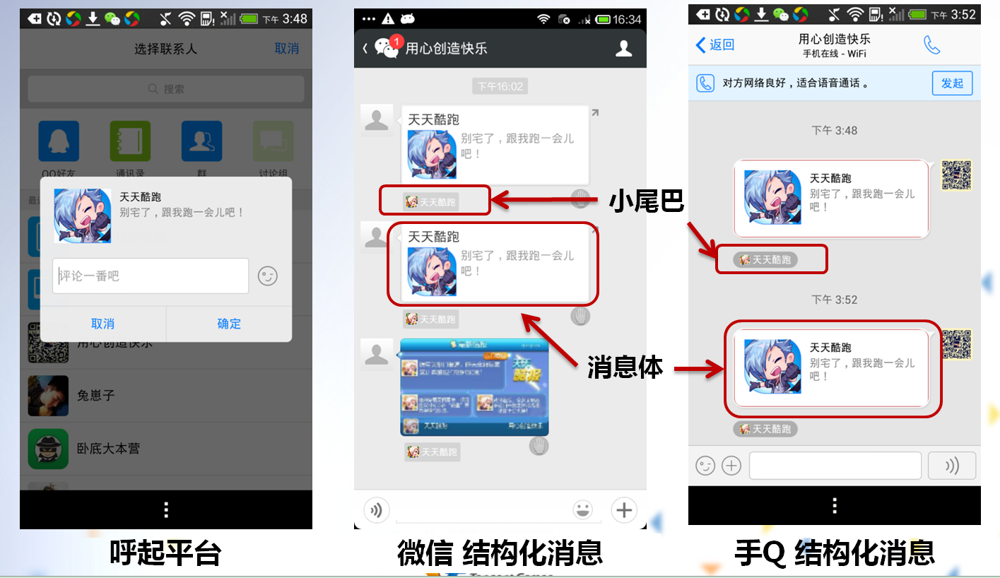

#MSDK 공유 모듈
##개요

### MSDK 권장 사용법:

- 친구 초대(회원가입 초대, 지정된 방 초대 등): 구조화 메시지, 음악 메시지
- 하트를 보낸 후 친구에게 통지 또는 게임 내에서 친구에게 통지: 백엔드 공유
- 게임 내에서 성적 자랑하기: 이미지 메시지 또는 구조화 메시지

### 각종 공유 메시지 비교

| 공유 유형 | 공유 위치 |비 게임친구에게 공유 가능 여부 | 클라이언트 실행 여부 | 인터페이스 호출 | 클릭 효과 | 자세한 설명 |
|: ----- :|
| QQ의 구조화 메시지 공유		| 대화/공간 		| 가능 | 필요 | WGSendToQQ | 구조체가 targetUrl로 이동하고 게임 실행 | 클릭하여 확인|
| 위챗의 구조화 메시지 공유 	| 대화 			| 가능 | 필요 | WGSendToWX | 구조체가 targetUrl로 이동하고 게임 실행 | 클릭하여 확인|
| 위챗의 링크 메시지 공유 		| 대화/모멘트 	| 가능 | 필요 | WGSendToWX | 구조체가 targetUrl로 이동하고 게임 실행 | 클릭하여 확인|
| QQ의 음악 메시지 공유 		| 대화/공간 		| 가능 | 필요 | WGSendToQQ | 구조체가 targetUrl로 이동하고 게임 실행 | 클릭하여 확인|
| 위챗의 음악 메시지 공유 		| 대화/모멘트		| 가능 | 필요 | WGSendToWX | 구조체가 targetUrl로 이동하고 게임 실행 | 클릭하여 확인|
| QQ의 이미지 공유 			| 대화/공간 		| 가능 | 필요 | WGSendToQQWithPhoto | 이미지를 열고 게임 실행 |클릭하여 확인|
| 위챗의 이미지 공유 			| 대화/모멘트 	| 가능 | 필요 | WGSendToWXWithPhoto  | 이미지를 열고 게임 실행 | 클릭하여 확인|
| QQ의 백엔드 공유 			| QQ 모바일 공공계정	| 불가능 | 불필요 | WGSendToQQGameFriend | 구조체가 targetUrl로 이동하고 게임 실행 |클릭하여 확인|
| 위챗의 백엔드 공유 			| 대화 			| 불가능 | 불필요 | WGSendToWXGameFriend | 구조체가 targetUrl로 이동하고 게임 실행 | 클릭하여 확인|

## 구조화 메시지 공유

### 사용 장면:

구조화 메시지는 임의 플랫폼의 친구에게 전송할 수 있고 구조화 메시지를 클릭하면 파라미터를 이용하여 게임을 실행할 수 있기에 구조화 메시지는 보통 초대, 자랑하기에 많이 사용된다.

### 공유 효과:

### 주의사항: 

1. 위챗의 구조화 메시지는 모멘트에 공유하지 못하고 친구에게만 공유할 수 있다.

### 인터페이스 설명:

- 모바일QQ구조화 메시지: 클릭하여 [WGSendToQQ](http://wiki.dev.4g.qq.com/v2/ZH_CN/android/#!qq.md#구조화 메시지 공유)인터페이스 설명 보기
- 위챗 구조화 메시지: 클릭하여 [WGSendToWeixin](http://wiki.dev.4g.qq.com/v2/ZH_CN/android/#!wechat.md#구조화 메시지 공유)인터페이스 설명 보기

## 링크 메시지 공유

링크 메시지도 구조화 메시지의 일종이다. 위챗 구조화 메시지가 구조체 클릭 이동을 지원하지 않기에 링크 메시지를 추가했다. 링크 메시지는 임의의 친구에게 발송할 수 있고 구조체를 클릭하면 링크를 열 수 있기에 초대, 자랑하기, 이벤트 페이지 공유 등에 많이 사용된다.

### 공유 효과:

### 주의사항:

### 인터페이스 설명:

##음악 메시지 공유

### 공유 효과:

### 주의사항:

### 인터페이스 설명:

## 이미지 메시지 공유

### 공유 효과:

### 주의사항:

### 인터페이스 설명:

## 백엔드 공유

### 공유 효과:

### 주의사항:

### 인터페이스 설명:
