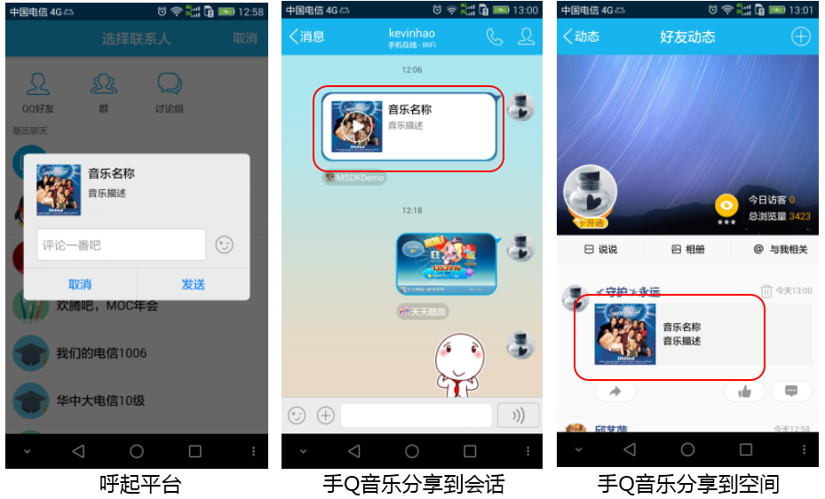

# MSDK 공유 모듈

##개요

이 모듈은MSDK의 공유관련 모든 기능을 정리하였다. 공유 유형에 따른 공유 방법, 사용 장면,  공유 효과, 클릭 효과, 주의사항, 이미 사용된 인터페이스 설명 등을 포함한다.
게임사는 우선 아래 내용에 따라 MSDK의 공유 관련된 인터페이스를 알아두시고, 게임자체의 특성에 맞게 필요한 인터페이스를 연동하여 유저간의 커뮤니티를 추진한다.

## MSDK권장 사용법

MSDK는 게임에서 자주 사용하는 개발을 참고하여 여러 상황에서 권장하는 공유메시지를 사용하였다. 게임사는 MSDK의 권장 사용법을 참고하여 각자 기능를 구현하도록 하면 된다.

- **친구 초대(친구초대로 회원가입등을 포함하나 다른 경우도 있음) ** : 구조화 메시지, 음악 메시지
- **게임내 유저끼리 초대（지정한 방으로 초대 등）**：조화 메시지, 음악 메시지, 백엔드 공유
- **하트를 보낸 후 친구에게 통지 또는 게임 내에서 친구에게 통지**: 백엔드 공유
- **게임 내에서 성적 자랑하기**：이미지 메시지 또는 구조화 메시지
- **게임 공식사이트 관련 이벤트 공유**：링크 메시지,구조화 메시지

## 공유하는 메시지 유형 비교

### 공유 메시지 구분

| 공유 유형 | 공유 위치 |비 게임친구에게 공유 가능 여부 | 클라이언트 실행 여부 | 인터페이스 호출 | 클릭 효과 | 자세한 설명 |
|: ----- :|: ----- :|: ----- :|: ----- :|: ----- :|: ----- :|: ----- :|
| QQ의 구조화 메시지 공유		| 대화/공간 		| 가능 | 필요 | WGSendToQQ | [클릭하여 확인](qq.md#구조화 메시지 공유)|
| 위챗의 구조화 메시지 공유 	| 대화 			| 가능 | 필요 |  WGSendToWX           | [클릭하여 확인](wechat.md#구조화 메시지 공유)|
| 위챗의 링크 메시지 공유 		| 대화/모멘트 | 가능 | 필요 | WGSendToWeixinWithUrl| [클릭하여 확인](wechat.md#링크 공유)|
| QQ의 음악 메시지 공유 		| 대화/공간 		| 가능 | 필요 | WGSendToQQWithMusic  | [클릭하여 확인](qq.md#음악 메시지 공유)|
| 위챗의 음악 메시지 공유 		| 대화/모멘트		| 가능 | 필요 | WGSendToWXWithMusic  | [클릭하여 확인](wechat.md#음악 메시지 공유)|
| QQ의 이미지 공유 			| 대화/공간 		| 가능 | 필요 | WGSendToQQWithPhoto  | [클릭하여 확인](qq.md#대형 이미지 메시지 공유)|
| 위챗의 이미지 공유 			| 대화/모멘트 	| 가능 | 필요 | WGSendToWXWithPhoto  | [클릭하여 확인](wechat.md#대형 이미지 메시지 공유)|
| QQ의 백엔드 공유 			| QQ 모바일 공공계정	| 불가능 | 불필요 |  WGSendToQQGameFriend | [클릭하여 확인](qq.md#백엔드 공유)|
| 위챗의 백엔드 공유 			| 대화 			| 불가능 | 불필요 | WGSendToWXGameFriend | [클릭하여 확인](wechat.md#백엔드 공유)|

### 공유메시지 클릭 효과

우선 모든 공유메시지의 공동으로 되는 특징과 클릭효과를 정리하였고, 메세지 마다의 차이점은 그 다음 설명내역을 참고 바란다.
### 모바일QQ

1. 메시지공유 중의 “작은 꼬리부분”을 클릭하여 게임을 시작, 이 경우에는 아무런 메시지도 필요하지 않으므로 계정이상 관련 판단 결과를 받아올수 없다. 즉 계정이상에 관련 아무런 대응도 할수 없고 할 필요도 없다. 
* **모바일QQ의 일부 인터페이스 변수중에 페이지 이동 링크가 포함되어 있고, 게임사는 아래 변수를 참고하여 페이지 이동 링크를 추가할수 있다. **：
	1. PR2심사를 통과한 게임
		- 링크 설정 : 페이지 이동 링크를 모바일QQ게임센터의 게임 상세페이지로 설정 가능함.（참고 [게임센터 상세 페이지](qq.md#게임센터 상세 페이지)）
		- 실제 상황：게임센터에서 게임연동 방법을 설정할수 있다. (변수설정에 따라 간편로그인인지를 판단.)（설정방법은 QQ간편로그인을 참고](qq.md#간편 로그인)）

	2. PR2심사통과 못한 게임
		- 링크 설정：이동페이지를Application of treasure
상세 페이지로 설정 (더 자세한 내용은Application of treasure
팀의vivianhui한테 연락）
		- 실제 상황：바로 게임을 연동 혹은 게임 다운로드可

	3.  PR2심사 미통과, 또한Application of treasure에 연동하지 않은 게임
		- 링크 설정：이동 페이지는 기타 페이지로만 설정 가능
		-실제 상황： 메시지를 클릭하면 설정된 사이트로 이동, 게임사는 이동된 페이지에서 게임 다운로드를 설정하거나 다운로드web에 연동시킬수 있다.
* **모바일QQ게임센터 상세 페이지**：모바일QQ게임센터 상세페이지는 모바일QQ가 제공하는 모바일QQ게임센터 링크이다. 링크 공유 이동페이지를 해당 주소로 설정했을시, 메시지를 클릭하여 바로 목표링크페이지로 이동하고 변수 설정에 따라 게임에 간편 로그인 할수 있다. (게임센터에서 실행 버튼을 클릭하는것과 같다)
모바일QQ게임센터의 사용방법과 설정은 [게임센터 상세 페이지](qq.md#게임센터 상세 페이지)를 참고 바란다.

### 위챗

* 공유 메시지의Payload를 클릭하여 게임에 연동( 운영담당자가 설정해주셔야 함), 꼬리부분을 클릭하여 게임 공식사이트에 연동( 운영담당자가 설정해주셔야 함).* 위챗은 간편로그인 지원이 안된다. 즉, 위챗에서 게임에 연동시 게임은 게정이상여부 판단 결과를 받을수 있으나, 연동된 계정으로 로그인 권한을 받을수 없다.

## 구조화 메시지 공유

###실제 상황：

구조화 메시지는 모든 친구에게 (타 플랫폼 회원포함) 발송 가능하므로 구조화 메시지는 변수에 따라 게임을 연동시킬수 있다. 때문에 구조화 메시지는 요청, 혹은 자랑하기에 많이 사용된다.

### 공유 효과：

### 클릭 효과：

#### 모바일QQ

* 공유 메시지의Payload를 클릭하면，targetUrl（인터페이스중 연동가능 변수）로 이동,  targetUrl가 해당 게임센터 상세페이지url（운영팀 담당자가 제공）로 설정되었으면 바로 게임을 연동한다. 게임센터의 설정된 조건에 따라 지정된 계정으로 권한부여하여 바로 게임에 로그인.

### 주의사항：

1. 모바일QQ의 Qzone 섬네일 이미지 사이즈는200*200，너무 크거나 작은 이미지는 오류가 뜰수 있다.。
2. 위챗의 구조화 메시지는 모멘트에 공유 불가, 친구에게만 공유 가능, 섬네일 이미지는32K이하여야만 한다.
3. 위챗에서 링크되는 게임은openid만 있음，때문에 위챗에 다시 로그인하여 권한 부여를 해야만이 연관된 계정으로 게임에 로그인 할수 있다.

### 인터페이스 설명：

- 모바일QQ구조화 메시지：클릭하여 확인[WGSendToQQ](qq.md#구조화 메시지 공유) 인터페이스 설명
- 위챗 구조화 메시지：클릭하여 확인[WGSendToWeixin](wechat.md#구조화 메시지 공유) 인터페이스 설명

##링크 메시지 공유 

링크 메시지는 사실상 구조화 메시지의 일종이다. 위챗 구조화 메시지가struct 페이지이동의 링크 설정을 지원하지 않기때문에 링크 메시지를 추가하였다. 
동일한 메시지 링크는 모든 친구한테 발송 가능하며struct를 클릭하면 링크 페이지를 볼수 있다. 때문에 링크 메시지는 요청, 자랑하기, 이벤트페이지공유보다 더 많이 사용된다.

### 공유 효과：

### 클릭 효과：

메시지를 클릭하면 위챗에서 `WGSendToWeixinWithUrl`인터페이스를 연동했을시 `url`변수가 지정한 사이트로 이동한다.

### 인터페이스 설명：

* 링크 메시지 공유：클릭하여 확인[WGSendToWeixinWithUrl](wechat.md#링크 공유) 인터페이스 설명

##음악 메시지 공유

음악 메시지와 구조화 메시지의 구현은 비슷하다, 공유할 메시지를 클릭하여 바로 모바일QQ 혹은 위챗에서 음악을 들을수 있다, 보통 게임 음악 공유에 많이 사용된다.

### 공유 효과：

### 클릭 효과

#### 모바일QQ

* **모바일QQ대화**에서 음악 메시지의 아이콘를 클릭하면 바로 음악이 나온다.，음악 메시지의 아이콘 오른쪽struct를 클릭하면 `WGSendToQQWithMusic`인터페이스 중`musicUrl`대응되는 사이트에 이동한다.
* **모바일QQ QZONE**에서，음악 메시지 아이콘을 클릭하면 바로 `musicUrl`변수가 지정한 사이트로 이동한다. 음악 메시지중의 아이콘 오른쪽 내역을 클릭하면 이 메시지의 상세페이지를 열수 있다.

#### 위챗

* 음악 메시지의 아이콘을 클릭시 바로 음악을 들을수 있고, 음악 메시지 아이콘 오른쪽 내역 클릭시`WGSendToWXWithMusic`인터페이스를 연동하여 `musicUrl`변수가 지정한 사이트로 이동한다.

### 주의사항：

1. 모바일QQ의 Qzone 섬네일 이미지 사이즈는200*200，너무 크거나 작은 이미지는 오류가 뜰수 있다.。
2. 위챗 음악 공유시 내 모바일내 파일을 사용해야만 한다.

### 인터페이스 설명：

* 모바일QQ음악 메시지：클릭하여 확인[WGSendToQQWithMusic](qq.md#음악 메시지分享)인터페이스 설명
* 위챗음악 메시지：클릭하여 확인[WGSendToWXWithMusic](wechat.md#음악 메시지分享)인터페이스 설명

## 순 이미지 메시지 공유

순 이미지 메시지는 대형이미지 메시지 라고도 한다. 즉, 한장의 이미지로 구성된 메시지를 말하는데 성적 자랑하기나 성과 공유시 사용된다.

### 공유 효과：

### 클릭 효과

- 순 이미지 메시지를 클릭하면 원본 이미지를 볼수 있다.

### 주의사항：

1. 위챗 대형이미지 공유는10MB이하여야만 한다.
2. 이미지는 모바일 기기에 저장된 이미지여만 하고, 이미지는 어플이 접근권한이 있는 위치여야 한다. 예를 들면sdcard내

### 인터페이스 설명：

* 모바일QQ이미지 메시지：클릭하여 확인[WGSendToQQWithPhoto](qq.md#대형이미지 메시지 공유) 인터페이스 설명
* 위챗이미지 메시지：클릭하여 확인[WGSendToWXWithPhoto](wechat.md#대형이미지 메시지 공유) 인터페이스 설명

## 백엔드 공유

백엔드 공유시 모바일QQ혹은 위챗을 연동하지 않아도 된다. 공유는 같은 게임에 가입된 유저여야만 하고，백엔드 공유는 하트 보내기, 친구 요청, 자랑하기 등에 사용된다.

### 공유 효과：

### 클릭 효과

#### 모바일QQ

모바일QQ 친구에게 백엔드 공유한 메시지는 **“QQ모바일게임”**서비스 ID에 남아있다.

* 메시지중의Payload를 클릭하면， targetUrl（인터페이스중 연동가능 변수）로 이동,  targetUrl가 해당 게임센터 상세페이지url（운영팀 담당자가 제공）로 설정되었으면 바로 게임을 연동한다.

#### 위챗

백엔드 대화에 공유한 메시지는 친구 채팅기록에 남아있다.
* 백엔드를 대화에 공유할시 공유할 메시지를 클릭하면 바로 게임을 연동한다.

### 주의사항：

1.	모바일QQ백엔드 공유 메시지는PC버전QQ와 해외버전QQ에서는 확인할수 없다. 모바일QQ의 백엔드 메시지는 일괄로 모바일QQ의 “QQ모바일게임” 서비스ID에 저장되니 받는 사람은 해당 서버스ID를 팔로우 해야하며 (기본으로 팔로우 설정되어 있음), 한명 유저당 하루에 한개 게임이 보내는 메시지는 20개정도이다.

2. 위챗이 백엔드 공유 주기(Period)에 대한 제한은 단일 게임내 단일 유저에 대한것이다.

### 인터페이스 설명：

* 모바일QQ백엔드 공유：클릭하여 확인[WGSendToQQGameFriend](qq.md#백엔드 공유)인터페이스 설명
* 위챗백엔드 공유：클릭하여 확인[WGSendToWXGameFriend](wechat.md#백엔드 공유)인터페이스 설명
