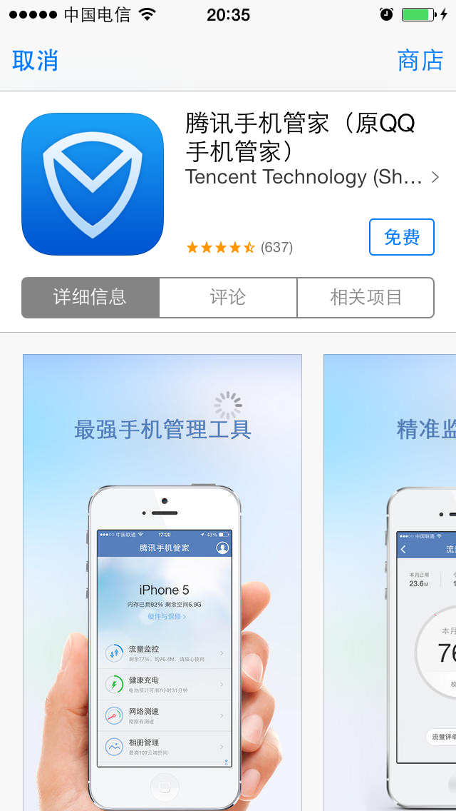

내장 브라우저
===

##개요
 - 이 기능은 버전 1.6.1 이후부터 제공되며 XCode5.0 이상 버전으로 컴파일해야 한다.
아래 코드를 호출하여 지정된 url 접속
```ruby
WGPlatform* plat = WGPlatform::GetInstance();
plat->WGOpenUrl((unsigned char*)[url UTF8String]);
```
	AMS 마케팅 활동 센터를 호출하려면 아래 코드를 호출할 수 있다.
```ruby
WGPlatform* plat = WGPlatform::GetInstance();
plat->WGOpenAmsCenter(NULL);
```
---

##사용시 주의사항
 - 브라우저 모듈은 xib를 통해 UI를 맞춤 제작한다. xib는 WGPlatformResources.bundle/디렉토리에 위치하고 xib가 사용하는 png 등 리소스 파일은 WGPlatformResources.bundle/WebViewResources 디렉토리에 위치한다. iOS7.0을 지원해야 하기에 Xcode5.0 및 이상 버전이 있어야 편집할 수 있다.
 - 모바일QQ가 공유하는 URL 최대 길이는 512바이트이다. URL이 너무 길면 짧은 주소로 전환해야 한다.
 - WGOpenAmsCenter()를 호출하여 AMS 활동 센터를 오픈해야 하며 프로젝트의 Info.plist에서 아래 항목을 설정해야 한다 (기본값은 http://apps.game.qq.com/ams/ame/gac.php?returntype=html ):

---

##로그인 상태 파라미터 암호화 전송
  - ### 전체 방안
게임에 로그인한 후 내장 브라우저를 통해 웹페이지를 방문하면 암호화된 로그인 상태 파라미터를 전송한다. 구체 절차:
1.MSDK가 이런 파라미터를 암호화하여 페이지에 전송;
2.페이지는 암호문을 획득한 후 MSDK 백그라운드 디코딩 인터페이스를 통해 평문 획득;
3.평문의 Token으로 로그인 인증 진행.

  - ### URL에 포함된 파라미터
  - MSDK는 URL 뒤에 다음과 같은 파라미터를 부가한다. 중복된 파라미터를 전송하면 디코딩 실패를 초래할 수 있다.

|파라미터명|	설명	|값|
|--|--|--|
|timestamp|	요청의 타임스탬프||	
|appid |	게임 ID|	　|
|algorithm|	암호화 알고리즘 식별자|	v1|
|msdkEncodeParam|	암호문|	　|
|version|	MSDK 버전 번호|	예, 1.6.2i|
|sig|	요청 자체 서명|	|
|encode|	코딩 파라미터|	1|
|openid|	유저 인증 후 플랫폼이 반환한 고유 식별자 | | 

 
  - ### 암호화된 데이터
  - 암호화할 로그인 상태 파리미터는 아래 표와 같다:

|파라미터명|	설명|	값|
|--|--|--|
|acctype |	계정 유형|	qq/wx|
|appid 	|게임 ID	　||
|openid |	유저 인증 후 플랫폼이 반환한 고유 식별자||
|access_token|	유저 인증 토큰|	　|
|platid 	|단말 유형|	0.iOS；1.Android|
 
    
   - 예를 들어, 내장 브라우저가 방문한 URL이 http://apps.game.qq.com/ams/gac/index.html이라면 실제로 스니핑하여 확인한 방문 URL은 다음과 같다.
http://apps.game.qq.com/ams/gac/index.html?sig=***&timestamp=**&appid=***&openid=***&algorithm=v1&msdkEncodeParam=***&version=1.6.2i&encode=1 
   - 그중 msdkEncodeParam이 실제로 전송한 것은 아래 파라미터를 암호화하여 얻은 암호문이다(url encode):
acctype=weixin&appid=100732256&openid=ol7d0jsVhIm3BQwlNG9g2f4puyUg&access_token=OezXcEiiBSKSxW0eoylIeCKi7qrm-
vXrr62qKiSw2otDBgCzzKZZfeBOSv9fplYsIPD844sNIDeZgG3IyarYcGCNe8XuYKHncialLBq0qj9-rVGhoQVkgSYJ8KXr9Rmh8IvdqK3zsXryo37sMJAa9Q&platid=0

- ### 디코딩 방법
- 업무 페이지는 상기 URL을 받은 후 MSDK 디코딩 인터페이스 호출을 요청한다. 현재 디코딩 인터페이스는 2가지 파라미터 전송 방식이 있다. 업무 백그라운드는 algorithm 파라미터에 따라 두가지 파라키터 암호화 전송 방식을 구현 및 지원해야 한다 – 방안:
- MSDK1.7.1i 및 이후부터 파라미터 암호화 전송 방안:(아래 URL이 방문한 것은 MSDK 테스트 환경)
http://msdktest.qq.com/comm/decrypv1/?sig=***&timestamp=**&appid=***&openid=***&algorithm=v2&version=1.7.1i&encode=1
	첫단계에서 얻은 msdkEncodeParam 안의 암호문 값을 Post 방식으로 body에 직접 넣어 Post 방식으로 전송해야 한다. key“msdkEncodeParam=”를 추가하지 않도록 주의해야 한다.
- MSDK1.7.1i 이전의 파라미터 암호화 전송 방안은 다음과 같다:(이 방안의 단말은 더이상 사용되지 않지만 백그라운드는 여전히 구현하여 낡은 버전을 지원해야 함)
http://msdktest.qq.com/comm/decrypv1/?sig=***&timestamp=**&appid=***&openid=***&algorithm=v1&version=1.6.2i&encode=1 
msdkEncodeParam 안의 암호문URL Decode를 body에 넣어 Post 방식으로 전송. key“msdkEncodeParam=”를 추가하지 않도록 주의해야 한다. 스니핑은 다음과 같다.

- ###암호문 디코딩 코드 예(php버전)
- 코드 예:
```php
<?php
//var_dump($argv);
$getparam = urldecode($argv[1]);
$postparam = $argv[2];
$algorithm = $argv[3];
//$sUrl = "http://msdktest.qq.com/comm/decrypv1/?" . $getparam;
$sUrl = "http://msdktest.qq.com/comm/decrypv1/?" . $getparam;
//var_dump($sUrl);
//var_dump($postparam);
$curl  =  curl_init();
curl_setopt( $curl, CURLOPT_URL, $sUrl );
curl_setopt( $curl, CURLOPT_RETURNTRANSFER,1 );
curl_setopt( $curl, CURLOPT_CUSTOMREQUEST, "POST" );
$str = $algorithm == "v2" ? $postparam : urldecode(urldecode($postparam));
curl_setopt( $curl, CURLOPT_POSTFIELDS, $str );
try{
	$data = curl_exec($curl);
} catch ( exception $e ){
	print $e->getMessage().$sUrl;
}
curl_close($curl);
print $data;
?>
```
- ###암호문 디코딩 코드 예(C코드):
1. 아래 2개 파일을 불러온다

```ruby
#ifndef URL_H
#define URL_H

#ifdef __cplusplus
extern "C" {
#endif
    int php_url_decode(const char *str, int len, char *out, int *outLen);
    char *php_url_encode(char const *s, int len, int *new_length);
    int php_url_decode_special(const char *str, int len, char *out, int *outLen);
#ifdef __cplusplus
}
#endif
#endif /* URL_H */
```
- 
```ruby
#include <stdlib.h>
#include <string.h>
#include <ctype.h>
#include <sys/types.h>
#include <stdio.h>
#include "UrlCoding.h"
static unsigned char hexchars[] = "0123456789ABCDEF";
static int php_htoi(const char *s)
{
	int value;
	int c;
    
	c = ((unsigned char *)s)[0];
	if (isupper(c))
		c = tolower(c);
	value = (c >= '0' && c <= '9' ? c - '0' : c - 'a' + 10) * 16;
    
	c = ((unsigned char *)s)[1];
	if (isupper(c))
		c = tolower(c);
	value += c >= '0' && c <= '9' ? c - '0' : c - 'a' + 10;
    
	return (value);
}
char *php_url_encode(char const *s, int len, int *new_length)
{
	register unsigned char c;
	unsigned char *to, *start;
	unsigned char const *from, *end;
	
	from = (unsigned char *)s;
	end  = (unsigned char *)s + len;
	start = to = (unsigned char *) calloc(1, 3*len+1);
    
	while (from < end)
	{
		c = *from++;
        
		if (c == ' ')
		{
			*to++ = '+';
		}
		else if ((c < '0' && c != '-' && c != '.') ||
				 (c < 'A' && c > '9') ||
				 (c > 'Z' && c < 'a' && c != '_') ||
				 (c > 'z'))
		{
			to[0] = '%';
			to[1] = hexchars[c >> 4];
			to[2] = hexchars[c & 15];
			to += 3;
		}
		else
		{
			*to++ = c;
		}
	}
	*to = 0;
	if (new_length)
	{
		*new_length = to - start;
	}
	return (char *) start;
}
int php_url_decode(const char *str, int len, char *out, int *outLen)
{
    const char *data = str;
    char *orgOut = out;
	while (len--)
	{
		if (*data == '+')
		{
			*out = ' ';
		}
		else if (*data == '%' && len >= 2 && isxdigit((int) *(data + 1)) && isxdigit((int) *(data + 2)))
		{
			*out = (char) php_htoi(data + 1);
			data += 2;
			len -= 2;
		}
		else
		{
			*out = *data;
		}
		data++;
		out++;
	}
//	*out = '/0';
    *outLen = out - orgOut;
	return *outLen;
}
//WGCommonMethods.h의 encodeForURL을 위해 전문 구현한 디코딩 방법  haywoodfu 2014-04-23
int php_url_decode_special(const char *str, int len, char *out, int *outLen)
{
    const char *data = str;
    char *orgOut = out;
	while (len--)
	{
		if (*data == '+')
		{
			*out = ' ';
		}
		else if (*data == '%' && len >= 2 && isxdigit((int) *(data + 1)) && isxdigit((int) *(data + 2)))
		{
            int value = 0;
            sscanf((data+1), "%2x", &value);
			*out = (char) value;
			data += 2;
			len -= 2;
		}
		else
		{
			*out = *data;
		}
		data++;
		out++;
	}
//	*out = '/0';
    *outLen = out - orgOut;
	return *outLen;
}
```

2. 수신된 문자열 encodeParam을 php_url_decode와 php_url_decode_special로 차례로 디코딩하여 얻은 것이 암호문이다


---


## App 설치 여부 판단
- 웹페이지에 다음 JS 코드를 추가하면 웹페이지에서 필요한 App가 설치되었는 지 판단할 수 있다.
```
document.addEventListener('WebViewJavascriptBridgeReady', onBridgeReady, false)
function onBridgeReady(event) {
var bridge = event.bridge
bridge.init(function(message, responseCallback) {
var data = { 'Javascript Responds':'Wee!' }
responseCallback(data)
})
bridge.callHandler('getInstallState', {'packageName':'com.tencent.news','packageUrl' :'qqnews://can_open_me_if_install_and_regeister_this_scheme'
}, function(msg) {
if(msg.indexOf("get_install_state:yes") > -1) {
log("install :텐센트 뉴스");} 
else {
log("not install :텐센트 뉴스");
}
})
```

---

##앱 안에서 App Store 세부페이지 열기
(iOS6.0 및 이상)웹페이지에서 itunes 링크(http://itunes.apple.com/cn/app/id439638720?mt=8)를 클릭하면 앱 안에서 해당 앱의 AppStore 세부페이지를 열 수 있다. 그림:


---

##공유
“공유” 버튼을 클릭하면 현재 페이지를 모멘트, QZone, 위챗 친구, QQ 친구에게 공유할 수 있다. 아래 그림 참조. 주의: 모바일QQ가 공유하는 URL 최대 길이는 512바이트이다. URL이 너무 길면 짧은 주소를 사용해야 한다.


---

##AMS 마케팅 활동 센터 오픈
 - WGOpenAmsCenter 인터페이스를 호출하면 AMS 마케팅 활동 센터를 오픈할 수 있다. 활동 센터의 URL은 info.plist의 AMS_URL에 배치되어 있다.
```ruby
eFlag WGOpenAmsCenter(unsigned char* params);
```
>설명: AMS 마케팅 활동 센터 오픈
파라미터:
Params는 URL 뒤에 부가된 파라미터를 전송할 수 있다. 길이 제한은 256, 형식은 "key1=***&key2=***", 그중 특수 문자는 urlencode가 필요하다. MSDK가 URL에 부가할 고정 파라미터와 중복될 수 없다. 리스트는 다음과 같다.
파라미터명	설명	값
  - timestamp	요청의 타임스탬프	
  - appid 	게임 ID	　
  - algorithm	암호화 알고리즘 식별자	v1
  - msdkEncodeParam	암호문	　
  - version	MSDK 버전 번호	예하면, 1.6.2i
  - sig	요청 자체 서명	
  - encode	코딩 파라미터	1
리턴:
  - eFlag 리턴값, 정상시 eFlag_Succ 리턴; params이 너무 길면 eFlag_UrlTooLong 반환

- 호출 코드 예:
```ruby
WGPlatform *plat = WGPlatform::GetInstance();
plat->WGOpenAmsCenter((unsigned char*)"a=1&d=2");
```
