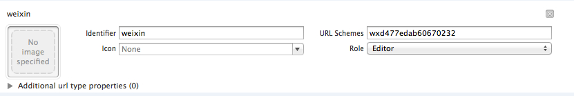

위챗 액세스
===

##위챗 액세스 설정
 
  * 프로젝트 설정의 ‘Target->Info->Custom iOS Target Properties’에서 구성 항목 추가, 주요 구성 항목:
  

| Key      |    Type | Value  |비고|관련 모듈|
| :-------- | --------:| :-- |:--|:---:|
| WXAppID  | String |  게임별로 다름 |위챗의 AppID|전부|
| WXAppKey  | String |  게임별로 다름 |위챗의 AppKey|전부|
  
  *	프로젝트 설정의 ‘Target->Info->URL Types’에서 다음과 같이 URL Scheme 설정:
  
  
| Identifier|    URL Scheme | 예시  | 비고  |
| :-------- | :--------| :--: | :--: |
| weixin  | 게임의 위챗 AppID |wxcde873f99466f74a |위챗 액세스 필수   |

---

##위챗 인증
 - ###개요
위챗 클라이언트를 불러와 인증을 진행하여 위챗 openId, accesstoken와 refreshtoken(부록A 토큰 유형), pf, pfKey 획득.
```
void WGLogin(ePlatform platform);
```
>설명: 통합 인터페이스에 로그인하고 _ePlatform. ePlatform_Weixin을 전송하여 위챗을 호출하여 인증을 진행한다.
파라미터:
   -  _ePlatform. ePlatform_Weixin를 전송하여 위챗 클라이언트를 호출하여 인증
Observer를 설정한 경우, 인증 또는 실패는 OnLoginNotify(LoginRet ret)를 통해 게임에 콜백한다. 콜백 결과 ret.flag 설명은 다음과 같다.
```
eFlag_WX_NotInstall     = 2000,     //위챗 미설치
eFlag_WX_NotSupportApi  = 2001,     //위챗 버전이 지원하지 않음
eFlag_WX_UserCancel     = 2002,     //유저가 위챗 인증 취소
eFlag_WX_UserDeny       = 2003,     //유저가 위챗 인증 거절
eFlag_WX_LoginFail      = 2004,     //위챗 인증 실패
```

- ###샘플 코드
호출 코드:
```
MyObserver* ob = new MyObserver(); 
plat->WGSetObserver(ob);//콜백 객체 설정
plat->WGLogin(ePlatform_Weixin);
```
콜백 코드:
```
void MyObserver::OnLoginNotify(LoginRet& loginRet)
{
	if(eFlag_Succ == loginRet.flag)
	{
    	…//login success
    	std::string openId = loginRet.open_id;
    	std::string refreshToken;
    	std::string accessToken;
    	if(ePlatform_Weixin == loginRet.Platform)
    	{
        	for(int i=0;i< loginRet.token.size();i++)
        	{
            	TokenRet* pToken = & loginRet.token[i];
            	if(eToken_WX_Access == pToken->type)
            	{
                	accessToken = pToken->value;
            	}
            	else if (eToken_WX_Refresh == pToken->type)
				{
     				refreshToken = pToken->value;
				}
        	}
    	}
		else if(ePlatform_QQ == loginRet.Platform)
		{
		}
	}
	else
	{
    	…//login fail
     	NSLog(@"flag=%d,desc=%s",loginRet.flag,loginRet.desc.c_str()); 
	}
}
```

- 2.4.0i 및 이후 버전에는 delegate방식을 사용할 수 있으며 코드는 아래와 같다：
```
[MSDKService setMSDKDelegate:self];
MSDKAuthService *authService = [[MSDKAuthService alloc] init];
[authService login:login:ePlatform_Weixin];
```
- 콜백 코드：
```
-(void)OnLoginWithLoginRet:(MSDKLoginRet *)ret
{
	//내부 실현 로직은 void MyObserver::OnLoginNotify(LoginRet& loginRet)와 일치한다.
}
```
- ### 주의사항
 - 위챗 버전 4.0 및 이상
 
---

## 위챗 관계사슬 인터페이스
 - ###위챗 개인정보 조회
 - WGQueryWXMyInfo를 호출하여 위챗 개인정보 조회. 포함: 닉네임, 성별, 아바타, 도시, 성 등 정보
```
bool WGQueryWXMyInfo();
```
>설명: 유저 위챗 계정 기본정보 획득
리턴 값:
   false:위챗 미인증 또는 AppID 등 설정 오류
   true:파라미터 정상
OnRelationNotify(RelationRet& relationRet)를 통해 게임에 콜백
RelationRet(부록B) 구조체 중 PersonInfo의 스몰, 일반, 빅이미지 사이즈는 46, 96, 132(픽셀)이다. 개인정보 중 국가와 언어 정보는 country와 lang을 통해 게임에 콜백한다. [1.7.0에 국가 언어 정보 신규 추가]

 - 코드 호출 사례:
```
WGPlatform *plat = WGPlatform::GetInstance();
plat->WGQueryWXMyInfo();
콜백 샘플 코드:
OnRelationNotify(RelationRet &relationRet)
{
    NSLog(@"relation callback");
    NSLog(@"count == %d",relationRet.persons.size());
    for (int i = 0; i < relationRet.persons.size(); i++)
    {
        PersonInfo logInfo = relationRet.persons[i];
        NSLog(@"nikename==%s",logInfo.nickName.c_str()]);
        NSLog(@"openid==%s",logInfo.openId.c_str());
    }
}
```

- 2.4.0i 및 이후 버전에는 delegate방식을 사용할 수 있으며 코드는 아래와 같다：
```
[MSDKService setMSDKDelegate:self];
MSDKRelationService *service = [[MSDKRelationService alloc] init];
[service queryMyInfo];
```
- 콜백 코드：
```
-(void)OnRelationWithRelationRet:(MSDKRelationRet *)ret
{
	//내부 실현 로직은 OnRelationNotify(RelationRet &relationRet)와 일치
}
```

- ###위챗 게임친구 정보 조회
WGQueryWXGameFriendsInfo를 호출하여 위챗 게임친구 정보 조회. 닉네임, 성별, 아바타, 도시, 성 등 정보를 포함한다.
```
bool WGQueryWXGameFriendsInfo();
```
>설명: 유저 위챗 게임친구 기본정보 획득
리턴 값:
   false:위챗 미인증 또는 AppID 등 설정 오류
   true:파라미터 정상
OnRelationNotify(RelationRet& relationRet)를 통해 게임 콜백
RelationRet(부록A) 구조체 중 PersonInfo의 스몰, 일반, 빅이미지 사이즈는 46, 96, 132(픽셀)이다. 개인정보에 국가와 언어가 없다

 - 호출 사례 코드:
```
WGPlatform *plat = WGPlatform::GetInstance();
plat->WGQueryWXGameFriendsInfo();
```
콜백 샘플 코드：
```
OnRelationNotify(RelationRet &relationRet)
{
    NSLog(@"relation callback");
    NSLog(@"count == %d",relationRet.persons.size());
    for (int i = 0; i < relationRet.persons.size(); i++)
    {
        PersonInfo logInfo = relationRet.persons[i];
        NSLog(@"nikename==%s",logInfo.nickName.c_str());
        NSLog(@"openid==%s",logInfo.openId.c_str());
    }
}
```

- 2.4.0i 및 이후 버전에는 delegate방식을 사용할 수 있으며 코드는 아래와 같다：
```
[MSDKService setMSDKDelegate:self];
MSDKRelationService *service = [[MSDKRelationService alloc] init];
[service queryMyGameFriendsInfo];
```
- 콜백 코드：
```
-(void)OnRelationWithRelationRet:(MSDKRelationRet *)ret
{
	//내부 실현 로직은 OnRelationNotify(RelationRet &relationRet)와 일치
}
```

###주의사항
 - 위챗의 정확한 인증

---

##위챗 구조화 공유
 - ###위챗 클라이언트를 불러와 친구에게 공유
게임은 위챗 클라이언트를 불러와서 공유를 진행하며 위챗에서 친구에게 공유를 선택한다. 이미지 용량은 32k를 초과할 수 없다. 32k를 초과하면 위챗은 이미지 한 장을 공유하는 것으로 간주한다. 위챗 모멘트에 공유할 수 없다.
```
void WGSendToWeixin(unsigned char* title, unsigned char* desc, unsigned char* mediaTagName, unsigned char* thumbImgData, const int& thumbImgDataLen, unsigned char* messageExt);
```
>설명: App 메시지를 위챗 친구에게 공유. 이 공유의 세부정보를 클릭하면 게임을 실행할 수 있다. 이 유형의 메시지는 모멘트에 공유하지 못한다. 모멘트 공유는 WGSendToWeixinWithPhoto 인터페이스를 사용해야 한다.
파라미터: 
- title 공유의 제목
  - desc 공유의 설명
  - mediaTagName 사용자가 스스로 설정하는 값. 이 값은 위챗에 전송되어 통계용으로 사용된다. 공유 리턴 시에도 이 값을 반환하며 공유 소스 구분용으로 사용된다
  - thumbImgData 공유시 표시하는 썸네일 데이터(32K 이하)
  - thumbImgDataLen 공유시 표시하는 썸네일 길이. thumbImgData와 매칭되어야 하며 비워둘 수 없다
  - messageExt messageExt 게임 공유시 이 필드 전송. 위챗에서 이 공유 대화를 클릭하면 게임을 실행하고 MSDK는 이 필드를 게임에 투과전송한다. 위챗5.1 및 이상 버전이 필요하다.
  공유 성공과 실패는 OnShareNotify(ShareRet ret)를 통해 게임에 콜백한다. Ret.flag는 부동한 공유 결과를 표시한다. 자세한 내용은 eFlag(부록A) 참조

 - 
```
void WGSendToWeixin(const eWechatScene& scene, unsigned char* title, unsigned char* desc, unsigned char* url, unsigned char* mediaTagName, unsigned char* thumbImgData, const int& thumbImgDataLen);
```
>설명: 이 인터페이스를 보류하는 목적은 MSDK 낡은 버전을 액세스한 게임을 지원하기 위해서이다. 새로 액세스한 게임은 이 인터페이스를 관심하지 않아도 된다.

 - 호출 코드 사례:
```
WGPlatform* plat = WGPlatform::GetInstance();
MyObserver* ob = new MyObserver();
plat->WGSetObserver(ob);
NSString* title=@"공유 제목";
NSString* desc=@"공유 내용";
char*  mediaTag = "MSG_INVITE";
NSString *path = "29.jpg";
NSData* data = [NSData dataWithContentsOfFile:path];
plat->WGSendToWeixin(
                         (unsigned char*)[title UTF8String],
                         (unsigned char*)[desc UTF8String],
                         (unsigned char*)mediaTag,
                         (unsigned char*)[data bytes],
                         [data length],
                         (unsigned char*)ext
                         ); 
```
 - 콜백 코드 사례:
```
void MyObserver::OnShareNotify(ShareRet& shareRet)
{
    if (eFlag_Succ == shareRet.flag)
	{
    	NSLog(@"공유 성공");
	}
    else if(eFlag_WX_NotInstall == shareRet.flag)
	{
    	NSLog(@"위챗 미설치");
    }
 	else if(eFlag_WX_UserCancel == shareRet.flag)
	{
    	NSLog(@"유저가 공유 취소");
    }
    else if(eFlag_WX_UserDeny == shareRet.flag)
	{
    	NSLog(@"유저가 공유 거절");
    }
}
```

- 2.4.0i 및 이후버전에는 delegate방식을 사용할 수 있으며 코드는 아래와 같다：
```
[MSDKService setMSDKDelegate:self];
UIImage *image = [UIImage imageNamed:@"4.jpg"];
NSData *data = UIImageJPEGRepresentation(image, 0.5);
MSDKShareService *service = [[MSDKShareService alloc] init];
[service WGSendToWeixin:(unsigned char*)"타이틀 공유"
desc:(unsigned char*)"내용 공유"
mediaTagName:(unsigned char*)"MSG_INVITE"
thumbImgData:(unsigned char*)[data bytes]
thumbImgDataLen:(int)[data length]
messageExt:(unsigned char*)"msdkwuwuwu"];
```
- 콜백 코드：
```
-(void)OnShareWithShareRet:(MSDKShareRet *)ret
{
    //내부 실현 로직은 void MyObserver::OnShareNotify(ShareRet& shareRet)와 일치한다.
}
```
 ###직접 위챗 친구에게 공유
 - WGSendToWXGameFriend를 호출하여 지정된 openid의 위챗 게임친구에게 공유하며 위챗 클라이언트를 불러오지 않는다.
 ```
WGSendToWXGameFriend(unsigned char *fOpenId, unsigned char *title, unsigned char *description, unsigned char *mediaId, unsigned char *extinfo, unsigned char *mediaTagName,  unsigned char *extMsdkInfo)[1.7.0i]
```
>설명: 공유 메시지를 위챗 친구에게 발송(같은 게임을 설치한 친구에게만 발송 가능). 위챗에서 이 메시지를 클릭하면 게임을 실행할 수 있다.
리턴 값:
      false:모바일QQ 미인증 또는 잘못된 파라미터
      true:파라미터 정상
파라미터: 
  - fopenid 필수 파라미터  친구의 대응하는 게임의 openid, 이 친구에게 공유
  - title필수 파라미터   공유 제목
  - description필수 파라미터   앱 메시지 설명
  - mediaId필수 파라미터  게임 아이콘, 백그라운드 인터페이스/share/upload_wx인터페이스를 통해 획득
  - extinfo비필수
제3자 프로그램 자체정의 간단한 데이터, 위챗은 제3자 프로그램에 반환하여 처리하며 길이 제한은 2k이다. 클라이언트 클릭시 이 필드를 획득할 수 있다.
  - mediaTagName 비필수
게임 메시지 유형을 구분하여 데이터 통계용으로 사용
  - extMsdkInfo 공유시 게임이 전송하며 ShareRet.extInfo를 통해 게임에 콜백한다.[1.7.0i]
공유가 끝나면 OnShareCallBack(ShareRet ret)를 통해 게임에 콜백한다. Ret.flag로 부동한 공유 결과를 표시한다. 자세한 내용은 eFlag(부록A) 참조

- 호출 코드 사례:
 ```
unsigned char* title = (unsigned char*)"msdk가 QQ 공유를 테스트하러 왔어요";
unsigned char* description = (unsigned char*)"Craz3 Match을 놀고 있어요";
unsigned char* media_tag_name = (unsigned char*)"MSG_INVITE";
unsigned char* fopenid = (unsigned char*)"oKdX1juRjuwIwIeSXRrTiq51kjc4";
unsigned char* mediaid = (unsigned char*)XXXXX";
unsigned char* extinfo = (unsigned char*)"balabalabalabala";
WGPlatform *plat = WGPlatform::GetInstance();
plat->WGSendToWXGameFriend(fopenid, title, description, mediaid, extinfo, media_tag_name);
```
- 콜백 코드 예시:
```
void MyObserver::OnShareNotify(ShareRet& shareRet)
{
    if (eFlag_Succ == shareRet.flag)
	{
        NSLog(@"공유 성공");
    }
    else 
	{
   NSLog(@"error message = %s",shareRet.desc.c_str()); 
    }
}
```

- 2.4.0i 및 이후버전에는 delegate방식을 사용할 수 있으며 코드는 아래와 같다：
```
[MSDKService setMSDKDelegate:self];
MSDKShareService *service = [[MSDKShareService alloc] init];
[service WGSendToWXGameFriend:(unsigned char*)"oGRTijiaT-XrbyXKozckdNHFgPyc"
title:(unsigned char*)"msdk 테스트 QQ 공유"
description:(unsigned char*)"매일매일 팡팡을 플레이하고 있다"
mediaId:(unsigned char*)""
messageExt:(unsigned char*)"balabalabalabala"
mediaTagName:(unsigned char*)"MSG_INVITE"];
```
- 콜백 코드：
```
-(void)OnShareWithShareRet:(MSDKShareRet *)ret
{
	//내부 실현 로직은 void MyObserver::OnShareNotify(ShareRet& shareRet)와 일치한다
}
```

### 주의사항
-  WGSendToWeixin 공유 이미지는 반드시 32K보다 작아야 한다
 - 이미지 용량은 10M를 초과할 수 없다

 ---
 
##위챗 빅이미지 공유
 - ### 개요
게임은 위챗 클라이언트를 불러와서 공유를 진행하며 위챗에서 친구에게 공유를 선택한다. 이미지 용량은 10M를 초과할 수 없다.
```
void WGSendToWeixinWithPhoto(const eWechatScene[Int 가 eWechatScene로 전환]& scene, unsigned char* mediaTagName, unsigned char* imgData, const int& imgDataLen, unsigned char* messageExt, unsigned char* messageAction);
```
>설명: 이미지 메시지를 위챗에 공유, 이 메시지는 대화와 모멘트에만 공유가 가능하다. 공유한 이미지를 클릭하면 빅사이즈로 이미지를 표시한다
파라미터: 
  - scene 모멘트 또는 대화에 공유할 지 식별 
WechatScene_Session：대화
WechatScene_Timeline：모멘트
  - mediaTagName 사용자가 스스로 설정하는 값. 이 값은 위챗에 전송되어 통계용으로 사용된다. 공유 리턴 시에도 이 값을 반환하며 공유 소스 구분용으로 사용된다
  - imgData공유한 이미지 데이터. png 포맷 이미지는 UIImagePNGRepresentation 방법으로 이미지 데이터를 획득해야 한다
  - imgDataLen 공유한 이미지 데이터 길이
  - messageExt 게임 공유는 문자열을 전송한다. 이 공유 메시지를 통해 게임을 웨이크업하면
OnWakeUpNotify(wakeupRet ret) 중 ret.messageExt를 통해 게임에 투과전송한다
  - messageAction 첫번째 파라미터 scene이 1인 경우에만 유효하며 모멘트에 공유하는 메시지에 버튼을 한 개 추가한다. 버튼을 클릭하면 게임 실행, 랭킹 또는 게임페이지로 이동할 수 있다. 값과 역할:
WECHAT_SNS_JUMP_SHOWRANK       랭킹 이동
WECHAT_SNS_JUMP_URL            링크 이동
WECHAT_SNS_JUMP_APP           APP 이동[모멘트 버튼은 네트워크 지연이 표시되며 반드시 위챗 5.1 및 이상 버전이어야 한다]
void WGSendToWeixinWithPhoto(const int& scene, unsigned char* mediaTagName, unsigned char* imgData, const int& imgDataLen);
설명: 이 인터페이스를 보류하는 목적은 MSDK 낡은 버전을 액세스한 게임을 지원하기 위해서이다. 새로 액세스한 게임은 이 인터페이스를 관심하지 않아도 된다.
공유 성공과 실패는 OnShareNotify(ShareRet ret)를 통해 게임에 콜백한다. Ret.flag는 부동한 공유 결과를 표시한다. 자세한 내용은 eFlag(부록A) 참조

 ### 코드 예시
호출 코드 예시：
```
WGPlatform* plat = WGPlatform::GetInstance();
MyObserver* ob = new MyObserver();
ob->setViewcontroller(self);
plat->WGSetObserver(ob);
char* mediaTag = "mediaTag";
UIImage *image = [UIImage imageNamed:@"356.png"];
NSData *data = UIImagePNGRepresentation(image);
plat->WGSendToWeixinWithPhoto(
                                  1,
                                  (unsigned char*)mediaTag,
                                  (unsigned char*)[data bytes],
                                  [data length],
                                  (unsigned char*)"msdkwuwuwu",
                                  (unsigned char*)"WECHAT_SNS_JUMP_APP"
                                  ); 
```
콜백 코드 사례:
```
void MyObserver::OnShareNotify(ShareRet& shareRet)
{
    if (eFlag_Succ == shareRet.flag)
	{
    	NSLog(@"공유 성공");
	}
    else if(eFlag_WX_NotInstall == shareRet.flag)
	{
    	NSLog(@"위챗 미설치");
	}
 	else if(eFlag_WX_UserCancel == shareRet.flag)
	{
    	NSLog(@"유저가 공유 취소");
	}
    	else if(eFlag_WX_UserDeny == shareRet.flag)
	{
    	NSLog(@"유저가 공유 거절");
    }
}
```

- 2.4.0i 및 이후 버전에는 delegate방식을 사용할 수 있으며 코드는 아래와 같다：
```
[MSDKService setMSDKDelegate:self];
UIImage *image = [UIImage imageNamed:@"356.png"];
NSData *data = UIImageJPEGRepresentation(image, 1.0);
MSDKShareService *service = [[MSDKShareService alloc] init];
[service WGSendToWeixinWithPhoto:WechatScene_Session
mediaTagName:(unsigned char*)"mediaTag"
imgData:(unsigned char*)[data bytes]
imgDataLen:(int)[data length]
messageExt:NULL
messageAction:NULL];
```
- 콜백 코드는 아래와 같다：
```
-(void)OnShareWithShareRet:(MSDKShareRet *)ret
{
	//내부 로직은 void MyObserver::OnShareNotify(ShareRet& shareRet)와 일치
}
```

###주의사항
 - 이미지 용량은 10M를 초과할 수 없다

---

##URL을 위챗에 공유
 - ###개요
WGSendToWeixin 기능과 마찬가지로 공유 URL의 파라미터를 추가하고 모멘트에 공유할 수 있다.
```
void WGSendToWeixinWithUrl(
                        const eWechatScene& scene,
                        unsigned char* title,
                        unsigned char* desc,
                        unsigned char* url,
                        unsigned char* mediaTagName,
                        unsigned char* thumbImgData,
                        const int& thumbImgDataLen,
                        unsigned char* messageExt
                        );
```
>설명: App 메시지를 위챗 친구에게 혹 모멘트에 공유. 이 공유의 세부정보를 클릭하면 URL 페이지 열릴 수 있다. 
파라미터: 
  - scene 공유 씬
  - title 공유 제목
  - desc 공유 설명
  - url 공유 URL
  - mediaTagName 사용자가 스스로 설정하는 값. 이 값은 위챗에 전송되어 통계용으로 사용된다. 공유 리턴 시에도 이 값을 반환하며 공유 소스 구분용으로 사용된다
  - thumbImgData 공유시 표시하는 썸네일 데이터(32K 이하)
  - thumbImgDataLen 공유시 표시하는 썸네일 길이. thumbImgData와 매칭되어야 하며 비워둘 수 없다
  - messageExt 게임 공유시 이 필드 전송. 위챗에서 이 공유 대화를 클릭하면 게임을 실행하고 MSDK는 이 필드를 게임에 투과전송한다. 위챗5.1 및 이상 버전이 필요하다.
  - 공유 성공과 실패는 OnShareNotify(ShareRet ret)를 통해 게임에 콜백한다. Ret.flag는 부동한 공유 결과를 표시한다. 자세한 내용은 eFlag(부록A) 참조

 - ###코드 예시
호출 코드 예시：
```
WGPlatform *plat = WGPlatform::GetInstance();
NSString* title=@"공유 타이틀";
NSString* desc=@"공유 내용";
NSString* url = @"http://www.baidu.com";
const char*  mediaTag = "MSG_INVITE";
const char*  ext = "msdkwuwuwu";
NSString *path = [[QQViewController testResourcePath] stringByAppendingPathComponent:@"4.png"];
NSData* data = [NSData dataWithContentsOfFile:path];
plat->WGSendToWeixinWithUrl(WechatScene_Session, (unsigned char*)[title UTF8String], (unsigned char*)[desc UTF8String],(unsigned char*)[url UTF8String], (unsigned char*)mediaTag,(unsigned char*)[data bytes],(int)[data length], (unsigned char*)ext);
```
콜백 코드 사례:
```
void MyObserver::OnShareNotify(ShareRet& shareRet)
{
    shareRet.extInfo = “xxx”;//게임 공유는 전송된 extMsdkInfo 필드
    if (eFlag_Succ == shareRet.flag)
	{
    	NSLog(@"공유 성공");
	}
    else if(eFlag_WX_NotInstall == shareRet.flag)
	{
    	NSLog(@"위챗 미설치");
    }
 	else if(eFlag_WX_UserCancel == shareRet.flag)
	{
    	NSLog(@"유저가 공유 취소");
    }
    else if(eFlag_WX_UserDeny == shareRet.flag)
	{
    	NSLog(@"유저가 공유 거절");
    }
}
```

- 2.4.0i 및 이후 버전에는 delegate방식을 사용할 수 있으며 코드는 아래와 같다：
```
[MSDKService setMSDKDelegate:self];
UIImage *image = [UIImage imageNamed:@"4.png"];
NSData* data = UIImageJPEGRepresentation(image, 1.0);
MSDKShareService *service = [[MSDKShareService alloc] init];
[service WGSendToWeixinWithUrl:WechatScene_Session
title:(unsigned char*)"공유 타이틀"
desc:(unsigned char*)"공유 내용"
url:(unsigned char*)"http://www.baidu.com"
mediaTagName:(unsigned char*)"MSG_INVITE"
thumbImgData:(unsigned char*)[data bytes]
thumbImgDataLen:(int)[data length]
messageExt:(unsigned char*)"msdkwuwuwu"];
```
- 콜백 코드는 아래와 같다：
```
-(void)OnShareWithShareRet:(MSDKShareRet *)ret
{
	//내부 실현 로직은 void MyObserver::OnShareNotify(ShareRet& shareRet)와 일치
}
```

###주의사항
 - 위챗 5.2 이상 필요

---

## 위챗 accesstoken 갱신
- 개요
위챗 accessToken 유효 기간은 2시간이고 refreshToken 유효 기간은 30일이다. refreshToken 기한이 만료되지 않으면 refreshToken을 통해 accessToken을 갱신할 수 있으며 갱신 후 새로운 accessToken과 refreshToken을 획득한다. 각 refreshToken은 한 번만 사용할 수 있다.
WGRefreshWXToken()인터페이스는 MSDK server의 /auth/wxexpired_login/ 서비스에 대응한다. 만일 게임이 WGRefreshWXToken()을 사용하여 위챗accessToken을 갱신하면 MSDK server의 /auth/wxexpired_login/을 호출하여 accessToken을 중복하여 갱신하지 말아야 한다. WGRefreshWXToken() 인터페이스를 사용하여 accessToken 기한을 연장할 것을 제안한다. 게임은 토큰을 저장할 필요가 없이 WGGetLoginRecord(loginRet ret)를 통해 토큰을 획득하기만 하면 된다.[1.7.0]
```
void WGRefreshWXToken();
```
>설명:　위챗 accessToken 기한 연장, WGGetLoginRecord(LoginRet ret) 호출 ，ret.flag가 eFlag_WX_AccessTokenExpired일 때 이 인터페이스 호출, 위챗 토큰 갱신.
갱신 결과는 OnLoginNotify(LoginRet ret)를 통해 게임에 콜백한다.
ret.flag = eFlag_WX_RefreshTokenSucc   token 갱신 성공
ret.flag = eFlag_WX_RefreshTokenFail    token 갱신 실패

- 샘플 코드
호출 코드 예시：
```
WGPlatform* plat = WGPlatform::GetInstance();
plat->WGRefreshWXToken()
```
콜백 코드 예시:
```
void MyObserver::OnLoginNotify(LoginRet& loginRet)
{
	if(eFlag_WX_RefreshTokenSucc == loginRet.flag)
	{
    	…//refresh success
    	std::string openId = loginRet.open_id;
    	std::string refreshToken;
    	std::string accessToken;
    	for(int i=0;i< loginRet.token.size();i++)
    	{
        	TokenRet* pToken = & loginRet.token[i];
        	if(eToken_WX_Access == pToken->type)
        	{
            	accessToken = pToken->value;
        	}
        	else if (eToken_WX_Refresh == pToken->type)
			{
				refreshToken = pToken->value;
			}
     	}
	}
	else
	{
    	…//login fail
     	NSLog(@"flag=%d,desc=%s",loginRet.flag,loginRet.desc.c_str()); 
	}
}
```
- 2.4.0i 및 이후 버전에는 delegate방식을 사용할 수 있으며 코드는 아래와 같다：
```
[MSDKService setMSDKDelegate:self];
MSDKAuthService *authService = [[MSDKAuthService alloc] init];
[authService refreshWXToken];
```
- 콜백 코드는 아래와 같다：
```
-(void)OnShareWithShareRet:(MSDKShareRet *)ret
{
//내부 실현 로직은 void MyObserver::OnShareNotify(ShareRet& shareRet)와 일치한다
}
```

###주의사항
- 갱신 콜백 flag는 eFlag_WX_RefreshTokenSucc와 eFlag_WX_RefreshTokenFail
- 각 refreshToken은 한 번만 갱신에 사용되면 만료된다

---

##위챗 각 버전이 지원하는 기능:
- ###위챗 기능 및 지원하는 버전

|기능	|설명|	위챗 버전|
|---|---|---|
|인증|	|	4.0 이상|
|지향적 공유|	친구가 친구에게 공유|	4.0 이상|
|빅이미지 공유|	이미지 공유 (WGSendToWeixinWithPhoto 인터페이스|	4.0 이상|
|모멘트 공유|	모멘트에 공유|	4.2 이상|
|다른계정 제시|	위챗 로그인 계정이 MSDK에 통지|	5.0 이상|
|모멘트 이동|	모멘트 메시지에 버튼이 1개 추가되어 랭킹, 게임 세부페이지로 이동하거나 게임을 직접 실행할 수 있다|	5.1 이상|
