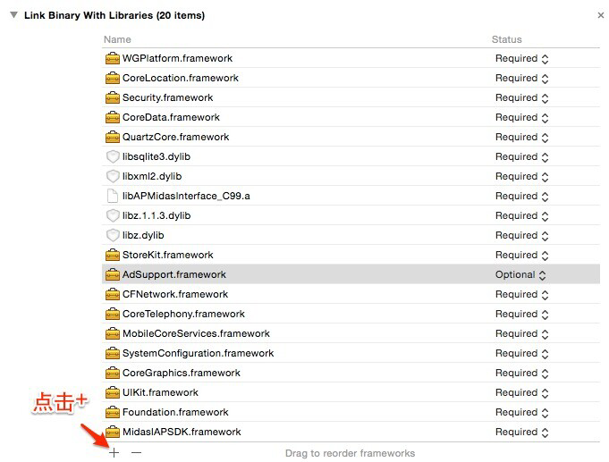

고속 액세스
======

### Let's Get Started!

> 반드시 최신 버전 Xcode（5.0+）와 iOS 5.1.1 이상 버전을 사용해야 하며, Xcode 5와  iOS 6 또는 이상 운영체제를 권장한다.

---
##Step1:의존 라이브러리 도입

 * 다음과 같이 ‘Target->Build Phases->Link Binary With Libraries’에 프로젝트가 의존하는 시스템 라이브러리 추가:
```ruby
libz.dylib
libstdc++.dylib
libz.1.1.3.dylib
libsqlite3.dylib
libxml2.dylib
libstdc++.6.0.9.dylib
CoreTelephony.framework
SystemConfiguration.framework
UIKit.framework
Foundation.framework
CoreGraphics.framework
MobileCoreServices.framewrok
StoreKit.framework
CFNetwork.framewrok
CoreData.framework
Security.framework
CoreLocation.framework
```
---	
##Step2:MSDK 도입
  - [SDK 다운로드](http://mcloud.ied.com/wiki/MSDK%E4%B8%8B%E8%BD%BD)
  - SDK 중 헤더 파일, 라이브러리 파일은 ‘WGPlatform.framework’에 위치하며 프로젝트가 설정한 ‘Target->Build Phases->>Link Binary With Libraries’에 불러와야 한다.
1. 
2. 
3. 
  - SDK 중 내장 브라우저, 공지에 필요한 리소스 파일은 ‘WGPlatformResources.bundle’에 위치하며 프로젝트가 설정한 ‘Target->Build Phases->Build Phases->Copy Bundle Resources’에 불러와야 한다.
1. 
2. 
3. 

---
##Step3:구성 항목
 
  * .plist 파일에 구성 항목을 추가한다. 주요 구성 항목은 다음과 같다.

| Key      |    Type | Value  |비고|관련 모듈|
| :-------- | --------:| :-- |:--|:---:|
| MSDK_URL  | String |  msdktest.qq.com |MSDK 테스트 환경, 공식 출시 전에 msdk.qq.com로 변경해야 함|전부|
| MSDK_PUSH_URL  | String |  pushtest.msdk.qq.com |MSDK 정보 전송 테스트 환경, 공식 출시 전에 push.msdk.qq.com로 변경해야 함|전부|
| QQAppID  | String |  게임별로 다름 |모바일QQ의 Appid|전부|
| QQAppKey  | String |  게임별로 다름 |모바일QQ의 AppKey|전부|
| WXAppID  | String |  게임별로 다름 |위챗의 Appid|전부|
| WXAppKey  | String |  게임별로 다름 |위챗의 AppKey|전부|
| CHANNEL_DENGTA  | String |  1001 |iOS 시스템 채널 번호|통계|
| MSDK_PUSH_SWITCH  | String |  ON |푸시 기능 스위치. MSDK 푸시를 사용하지 않으면 설정할 필요가 없음|푸시|
| MSDK_XGPUSH_URL  | String |  XG Push URL, 설정하지 않아도 됨 |XG Push URL, 설정하지 않으면 기본값 사용|푸시|
| MSDK_OfferId  | String |  게임별로 다름 |결제에 필요한 OfferId|결제|
| NeedNotice  | Boolean |  공지 기능 사용 여부 |Yes-사용 No(또는 구성하지 않음)-사용금지|공지|
| Noticetime  | Number |  공지 자동 실행의 시간 간격(초) |기본 15분|공지|  
| NSLocationWhenInUseUsageDescription  | NSString |  iOS8에서 LBS 위치추적 기능용 |값은 비워둘 수 있음|LBS| 
 
  *	프로젝트가 설정한 ‘Target->Info->URL Types’에서 다음과 같이 URL Scheme 설정:
  
| Identifier|    URL Scheme | 예시  | 비고  |
| :-------- | :--------| :--: | :--: |
| weixin  | 게임의 위챗 AppID |wxcde873f99466f74a | 위챗 액세스시 필수 입력   |
| tencentopenapi  | 포맷: tencent+게임의QQAppID |tencent100703379| 모바일QQ 액세스시 필수 입력, 중간에 공백 없음   |
| QQ  | 포맷: QQ+게임의QQAppID의16진수 |QQ06009C93 | 모바일QQ 액세스시 필수 입력, 중간에 공백 없음   |
| QQLaunch  | 포맷: tencentlaunch+게임의QQAppID |tencentlaunch100703379|  모바일QQ 액세스시 필수 입력, 중간에 공백 없음   |

   > **주: 게임별로 설정이 일치하지 않기에 자세한 내용은 게임과 MSDK 연락 담당 또는 RTX를 통해 “MSDK연락”에 문의하기 바란다.**
  
---
 ##Step4:콜백 객체 구현
 
  * 전역 콜백 객체는 게임 인증, 공유, 조회 및 플랫폼 실행 등 결과를 처리한다. 이 객체는 ‘WGPlatformObserver’ 클래스 중 모든 방법을 계승하고 구현해야 한다.
  * 예시: MyObserver로 명명한 전역 콜백 객체를 새로 만들고 다음과 같이 코드를 붙여 넣는다.
  ```ruby
//MyObserver.h
//C99를 사용하여 옵션을 컴파일하면
//C99를 사용하여 옵션을 컴파일하면
#import <WGPlatform/WGPlatform.h>
#import <WGPlatform/WGPublicDefine.h>
//C11를 사용하여 옵션을 컴파일하면
#import <WGPlatform_C11/WGPlatform.h>
#import <WGPlatform_C11/WGPublicDefine.h>
class MyObserver: public WGPlatformObserver,public APMidasInterfaceObserver
{
public:
    void OnLoginNotify(LoginRet& loginRet);//로그인 콜백
    void OnShareNotify(ShareRet& shareRet);//공유 콜백
    void OnWakeupNotify(WakeupRet& wakeupRet);//플랫폼 실행 콜백
    void OnRelationNotify(RelationRet& relationRet);//관계사슬 조회 관련 콜백
    void OnLocationNotify(RelationRet &relationRet);//위치추적 관련 콜백
    void OnLocationGotNotify(LocationRet& locationRet);//위치추적 관련 콜백
    void OnFeedbackNotify(int flag,std::string desc);//피드백 관련 콜백
    std::string OnCrashExtMessageNotify();//crash 처리
}
```
```ruby
//MyObserver.mm
#include "MyObserver.h"
void MyObserver::OnLoginNotify(LoginRet& loginRet){}
void MyObserver::OnShareNotify(ShareRet& shareRet){}
void MyObserver::OnWakeupNotify(WakeupRet& wakeupRet){}
void MyObserver::OnRelationNotify(RelationRet &relationRet){}
void MyObserver::OnLocationNotify(RelationRet &relationRet) {}
void MyObserver::OnLocationGotNotify(LocationRet& locationRet){}
void MyObserver::OnFeedbackNotify(int flag,std::string desc){}
std::string MyObserver::OnCrashExtMessageNotify(){return "message";}
```


---
## Step5:전역 콜백 객체 설정

 * ‘AppDelegate.mm’파일을 열고 다음 문장을 불러와 헤드에 추가:
 ```ruby
//C99를 사용하여 옵션을 컴파일하면
#import <WGPlatform/WGPlatform.h>
#import "WGPlatform/WGInterface.h"
#import <WGPlatform/WGPublicDefine.h>
//C11를 사용하여 옵션을 컴파일하면
#import <WGPlatform_C11/WGPlatform.h>
#import "WGPlatform_C11/WGInterface.h"
#import <WGPlatform_C11/WGPublicDefine.h>
#import "MyObserver.h"
```
 * 다음 코드를 ‘application:didFinishLaunchingWithOptions:’ 에 붙여 넣는다
 ```ruby
WGPlatform *plat = WGPlatform::GetInstance();
MyObserver  *pObserver =plat->GetObserver();
MyADObserver *adObserver =(MyADObserver *)plat->GetADObserver();
If(!pObserver){
        pObserver = new MyObserver(); 
        plat -> WGSetObserver(pObserver);
}
```
 * 다음 코드를 ‘application:openURL:sourceApplication:annotation:’에 붙여 넣는다
```ruby
WGPlatform* plat = WGPlatform::GetInstance();
MyObserver* ob =(MyObserver *) plat->GetObserver();
        if (!ob) {
            ob = new MyObserver();
            plat->WGSetObserver(ob);
        }
return  [WGInterface  HandleOpenURL:url];
```
>**객체를 생성한 후 이 객체는 한 번만 설정하면 된다. 중복 설정하면 덮어쓰며 가장 최근에 설정된 것만 콜백을 받을 수 있다. 게임 초기화시 전역 콜백 객체를 설정할 것을 권장한다.**

---
## Step:6 Good To Go!
###다음으로: [QQ 액세스](QQ.md) [위챗 액세스](WX.md)
