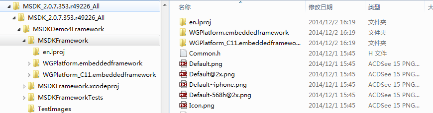
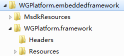
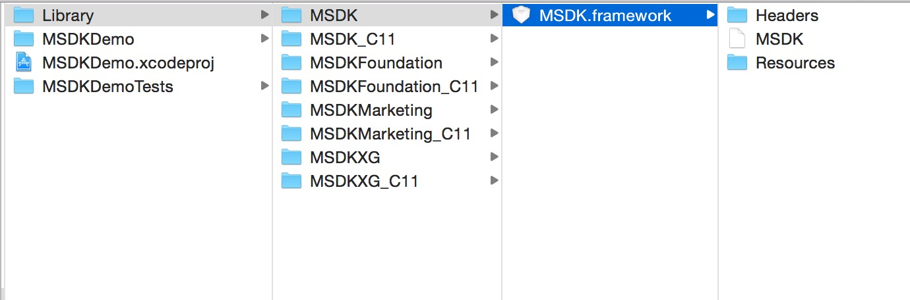


MSDK iOS 소개
=======

### [SDK 다운로드](http://mcloud.ied.com/wiki/MSDK%E4%B8%8B%E8%BD%BD) [빨리 숙달하기](iOSPlugin.md)

## 기능 소개
 
#### MSDK는 텐센트 IEG가 자체 개발 및 제3자 모바일 게임 개발팀에 제공하여 텐센트 각 주요 플랫폼에 빠르게 액세스하고 출시 및 운영할 수 있도록 도와주는 공통 컴포넌트 및 서비스 라이브러리이다.

## 설치 패키지 구조
* 2.3.4i 및 이전 버전:

	압축파일에 demo 프로젝트가 포함되고, 그중에 WGPlatform.embeddedframework/WGPlatform_C11.embeddedframework가 포함된다.
	전자는 “Build Setting->C++ Language Dialect”가 GNU++98, “Build Setting->C++ Standard Library”가 “libstdc++(GNU C++ standard library)”인 프로젝트에 적용된다;
	후자는 이 두개 구성 항목이 “GNU++11”과 “libc++(LLVM C++ standard library with C++11 support)”인 프로젝트에 적용된다.

    두개 embeddedframework 파일 구조는 일치하다. WGPlatform.embeddedframework를 예로 들면, 그중 폴더 용도는 [포함한 내용] 장절 참조. 업데이트시 기존 파일을 삭제하고 새 파일을 도입하면 된다.
 
WGPlatform.embeddedframework 부합 두 embeddedframework 파일 구조는, 예를 들어, 섹션 [콘텐츠가 포함] 참조 폴더를 사용한다. 업그레이드 원본 파일을 삭제, 새 파일을 가져올 수 있습니다.

* 2.4.0i 및 이후 버전:

    압축 파일에 demo공정을 포함한다. 그중에 아래 내용을 포함：
    1.MSDKFoundation.framework，기초 의뢰 라이브러리.
    2.MSDK.framework，기본적인 로그인 공유 기능 제공.
    3.MSDKMarketing.framework 크로스 마케팅,내장 브라우저 기능 제공.
    4.MSDKXG.framework 푸시 기능 제공.
    그 중에 MSDKFoundation.framework는 기초 의뢰 라이브러리이며 반드시 도입해야 하고 나머지 3개는 선택 가능한 라이브러리며 수요에 따라 도입하면 된다.
    MSDK.framework,MSDKFoundation.framework,MSDKMarketing.framework,MSDKXG.framework는 “Build Setting->C++ Language Dialect”설정이 GNU++98，그리고 “Build Setting->C++ Standard Library”가 “libstdc++(GNU C++ standard library)”인 공정에 적용한다；
    해당 _C11가 있는 framework는 이 두가지 설정이 각각 “GNU++11”와“libc++(LLVM C++ standard library with C++11 support)”가 된 공정에 적용한다.

    업데이트 방식은 2.3.4i버전과 일치하며 원래 있는 파일을 삭제하고 새로운 파일을 도입하면 된다.

## 포함한 내용

* 2.3.4i 및 이전 버전:
####　헤더 파일과 정적 라이브러리 파일은 ‘WGPlatform.framework’에 위치; 리소스 파일은 ‘WGPlatformResources.bundle에 위치(2.3.4i 이전 버전은 폴더 “MsdkResources”)
####　주요 인터페이스는 ‘WGPlatform.h’ 파일에 있고 MSDK 관련 구조체는 ‘WGCommon.h’ 파일에 있고 열거값은 ‘WGPublicDefine.h’에서 정의하고 푸시 인터페이스는 ‘WGApnInterface.h’ 파일에 있다. 메인 콜백 객체는 ‘WGObserver.h’ 파일에 있고 광고 콜백 객체는 ‘WGADObserver.h’ 파일에 있다.

* 2.4.0i 및 이후 버전:
#### 헤더 파일과 정적 라이브러리 파일은 각 framework에 있고；리소스 파일은 `/MSDKMarketing/WGPlatformResources.bundle`에 있다.
#### 주요 인터페이스는 `MSDK.framework/WGPlatform.h`파일에 있고 MSDK 관련 구조체는 `MSDKFoundation.framework/MSDKStructs.h`파일에 있다. 열거값은 `MSDKFoundation.framework/MSDKEnums.h`에서 자체정의하고 푸시 인터페이스는 `MSDKXG.framework/MSDKXG.h`파일에 있고 주요 콜백 객체는 `MSDK.framework/WGPlatformObserver.h`파일에 있고 광고 콜백 객체는 `MSDK.framework/WGADObserver.h`파일에 있다.

## 모듈 소개
 
| 모듈명 | 모듈 기능 | 액세스 조건 |
| ------------- |:-------------:|:----:|
| 플랫폼| 위챗, 모바일QQ를 통틀어 플랫폼이라 부른다||
|데이터 분석 모듈|데이터 보고, 오류 보고	||
|모바일QQ	 |로그인 및 모바일QQ에 공유하는 능력 제공	|모바일QQ AppID와 appKey 필요|
|위챗 |	위챗의 로그인과 공유 능력 제공	|위챗 AppID와 appKey 필요|
|QQ게임로비	| 게임로비의 게임 실행 능력 제공	||
|내장 브라우저	| 인앱 내장 브라우저 능력 제공	||
|공지	|롤링 팝업 공지 능력 제공	||
|LBS	|지리적 위치에 기반한 친구 불러오기 능력	||
|게스트 모드|게스트 로그인과 결제 능력 제공	|모바일QQ 또는 위챗 AppID와 appKey 필요|
|푸시|푸시 메시지 능력 제공|||

 ## 용어 설명

| 명칭 | 용어 개요 |
| ------------- |:-------------|
| 플랫폼| 위챗, 모바일QQ를 통틀어 플랫폼이라 부른다|
|openId|유저 인증 후 플랫폼이 반환하는 고유 식별자|
|accessToken|유저 인증 토큰, 이 토큰을 획득하면 유저가 인증했음을 표시한다. 공유/결제 등 기능은 이 토큰이 필요하다. 모바일QQ의 accessToken 유효 기간은 90일, 위챗의 accessToken 유효 기간은 2시간이다.|
|payToken|결제 토큰, 모바일QQ 결제용, 모바일QQ 인증은 이 토큰을 반환하고 위챗 인증은 이 토큰을 반환하지 않는다. 유효 기간은 6일이다.|
|refreshToken|위챗 플랫폼 특유 토큰, 유효 기간 30일, 위챗 accessToken 기한 만료시 accessToken 갱신용|
|다른계정|게임에서 인증한 계정과 모바일QQ/위챗에서 인증한 계정이 다른 경우|
|구조화 메시지|공유 메시지 중 일종, 이런 메시지의 공유시 표시 형식: 왼쪽은 썸네일, 오른쪽 상단은 메시지 제목, 오른쪽 하단은 메시지 개요|
|빅이미지 메시지|공유 메시지 중 일종, 이런 메시지는 이미지 한 장만 포함하며 이미지 한 장만 표시. 빅이미지 공유, 단순 이미지 공유라고 부르기도 한다.|
|게임친구|모바일QQ 또는 위챗 친구 중 같은 게임을 놀았던 친구|
|게임센터|모바일QQ 클라이언트와 위챗 클라이언트에 있는 게임센터를 통틀어 게임센터라고 부른다.|
|게임로비|QQ게임로비 지칭|
|플랫폼 실행|플랫폼 또는 채널(모바일QQ/위챗/게임로비/마이앱 등)을 통해 게임 시작|
|관계사슬|유저가 플랫폼에서 보유한 친구 관계|
|대화|모바일QQ 또는 위챗 채닝 메시지|
|설치 채널|info.plist 설정한 CHANNEL_DENGTA값은 현재 디폴트로 1001（AppStore）. |
|등록 채널|유저 최초 로그인시 게임 설치 채널은 MSDK 백그라운드에 기록되어 유저의 등록 채널로 간주된다.|
|Pf|결제에 필요한 필드, 데이터 분석용으로 사용된다. pf 구성: 플랫폼 실행_계정 체계-등록 채널-운영체제-설치 채널-사용자정의 필드|
|pfKey| 결제용|
|AMS|	인터랙티브 엔터테인먼트 고급 마케팅 시스템, 게임 마케팅 활동 기획과 개발 담당|
|빠른로그인|	모바일QQ 게임 리스트 또는 공유 링크에서 모바일QQ에 로그인된 계정 정보를 직접 게임에 전송하여 로그인 실현, 게임은 재인증이 필요하지 않음. 의존: MSDK 1.8.0i 이상, 모바일QQ4.6.2 이상|
|Guest 모드|	Apple은 iOS 모바일 게임이 모바일QQ/위챗 플랫폼 이외의 로그인 방식을 제공할 것을 요구. 직접 게임에 들어가서 완전한 게임 컨텐츠 체험 및 결제 가능|
|GuestID|	설비 정보를 통해 MSDK에 등록하여 생성된 게스트 신분 식별자, 형식은 "G_숫자/알파벳/_/@"로 구성된 34자리 문자열|
|Guest AppID|	게스트 모드를 식별하기 위해 Guest 모드에서 AppID는 “G_모바일QQAppID” 형식 사용. 게임에 모바일QQ AppID가 없을 경우 “G_위챗AppID” 사용|
|Guest AppKey|	Guest AppID와 짝을 이루며, 모바일QQ/위챗에 대응하는 AppKey를 사용한다|
|결제id|	별칭은 OfferId, info.plist의 MSDK_OfferId 항목에 배치. 내부 자체개발 게임: 직접 MIDAS 공홈 midas.qq.com에서 ios 앱을 등록하여 offered 생성 외부 대리 게임: 게임 제품이 RDM 공홈 rdm.oa.com에서 애플 정보를 신청한 후 정보를 협동기획팀 jiaganzheng에게 제공하여 dev 백그라운드에 입력. 그후 개발자는 관리센터에서 IAP 버전을 추가한 후 offerid 생성|

## 주의사항

결제는 MSDK와 별도로 존재한다. 관련 문서는 [MIDAS 공홈](http://midas.qq.com) 참조.
AppID, appKey, offerId는 관련 모듈 액세스 증빙이다. 신청 방법은 “MSDK 제품소개” 참조.

## 버전 역사

* [클릭하여 MSDK 버전 변경 역사 확인](version.md)

