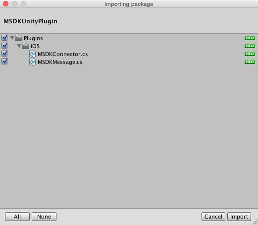
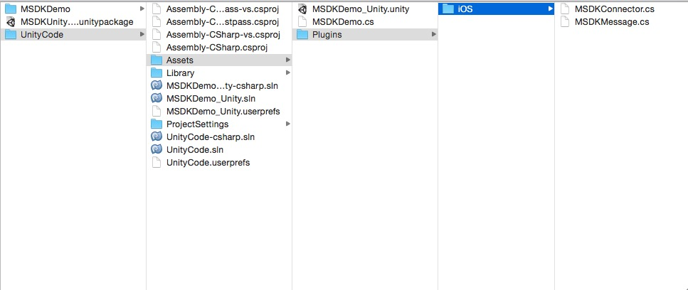
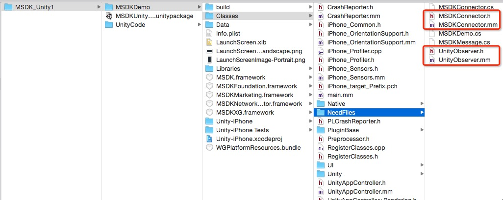

MSDK(iOS) for Unity3D 연동		
===		
		
## 개요		
		
MSDK Unity3D 버전은 Unity3D 엔진을 이용하여 MSDK 인터페이스 C#에 대해 캡슐화를 진행한다. 이 버전을 사용하는 게임은 직접 C# 계층에서 MSDK 인터페이스를 호출할 수 있어 모바일 플랫폼의 관련 조작을 감소할 수 있다.		
		
MSDK(iOS)의 Unity 릴리즈 패키지(zip)는 주로 `UnityCode`, `MSDKDemo` 및 `MSDKUnityPlugin.unityPackage`를 포함한다. 아래 이미지 참조:		
		
		
		
그중 `UnityCode`는 MSDK의 C# 인터페이스를 호출하는 Unity3D 샘플 프로젝트이다. `Assets\MSDKDemo.cs`를 참조하여 MSDK 인터페이스의 호출에 대해 알아볼 수 있다. `MSDKDemo`는 UnityCode를 Xcode 프로젝트로 출력한 후의 MSDK 샘플 프로젝트이다. `MSDKUnityPlugin.unityPackage`는 이 버전의 Unity 리소스팩이며 MSDK의 C# 인터페이스를 포함한다.		
		
## 연동 구성		
		
### Step1:C# 인터페이스 도입		
		
Unity3D의 IDE에서 게임 프로젝트를 열고 `MSDKUnityPlugin.unityPackage`를 더블클릭하여 필요한 파일을 도입한다. 아래 이미지 참조:		
		
		
		
**주의 사항:**		
도입하는 과정에서 파일이 이미 존재하면 덮어쓰지 않기에 버전 업데이트시 플러그인 내용을 먼저 삭제해야 한다.		
		
### Step2:스크립트 마운트		
		
첫번째 또는 메인 씬(Scene)을 선택하여 빈 게임 오브젝트(GameObject)를 새로 만들고 MSDKMessage로 이름을 부여한다. Plugins 디렉토리를 열고 MSDKMessage.cs 스크립트 파일을 새로 만든 게임 오브젝트에 드래그하여 스크립트를 마운트한다.		
		
### Step3:인터페이스 호출		
		
Unity3D에서 MSDK와 관련된 부분은 Assets/Plugins/iOS 폴더에 있다:		
		
		
		
MSDK API는 모두 MSDKConnector 클래스에 캡슐화되고, 콜백은 모두 MSDKMessage 클래스에 캡슐화된다. "UnityCode"에 있는 `MSDKDemo.cs`는 MSDK의 C# 인터페이스 호출 샘플이다. 게임은 C# 인터페이스 호출에 이를 참조할 수 있다.		
		
QQ 로그인을 예로 들어 MSDK API 호출 및 콜백 처리 실연:		
		
    // MSDKConnector 네임 스페이스		
    using MSDKConnector;		
    // MSDKConnector는 클래스는 싱글턴 디자인 사용		
    MSDKConector.Instance.Login(2);      // QQ 로그인		
    		
그다음 로그인 콜백 처리(MSDKMessage에서 이 로그인 콜백 메소드 이름은 OnLoginNotify)		
		
	/// 
	
	///  로그인 콜백	
	/// 
	
	/// <param name="jsonRet">Json ret.</param>	
	void OnLoginNotify(string jsonRet)	
	{	
		Debug.Log ("\n\nUnity Receive Message From iOS\n\n OnLoginNotify = " + jsonRet);
		//JSON 해석 후 flag에 따라 다음 절차 진행
	}	
		
### Step4:Xcode 프로젝트로 출력, 인터페이스 파일 copy		
		
Unity 프로젝트를 Xcode 프로젝트로 출력하고 MSDKDemo/Classes/NeedFiles/에서 아래 그림의 4개 파일을 복사하여 Xcode 프로젝트에 붙여넣는다.		
		
		
		
### Step5:MSDK 각 framework 액세스		
		
수요에 따라 MSDK 각 framework 액세스		
