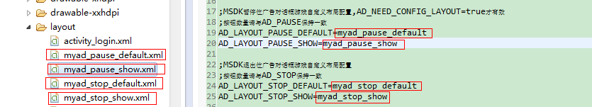

MSDK 广告 相关模块
===
一、概述
---
游戏设置有暂停按钮，当用户点击按钮时会弹出一个暂停对话框；按返回键的时候会弹出一个退出对话框。从MSDK2.1开始，MSDK添加显示暂停和退出的自定义对话框，如下图所示：

 

当该游戏有被投放的广告时，则界面如下图显示。当有多个广告时，图片间隔一段时间会自动调跳到下一则广告，用手指滑动也可以进入下一则广告。

 

其中，按扭的数目可以在__adconfig.ini__中配置，只能配置为__2__或者__3__个。如图3暂停位对话框有三个按钮，分别为“继续游戏”，“重新开始”，“终止闯关”。 按钮的文字可以更改，点击按钮后，对话框消失，MSDK回调接口OnADNotify通知到游戏端，游戏在此函数中实现具体逻辑，每个View均有__android:tag__这个属性，游戏通过不同的tag名称来区分响应的是哪个按钮，如果使用默认的布局，以图3为例，则“继续游戏”的viewTag为`FIRST_BTN_POSITION`，“重新开始”的viewTag为`SECOND_BTN_POSITION`，”终止闯关”的viewTag为`THIRD_BTN_POSITION`；当游戏按返回键时，MSDK回调接口`OnADBackPressedNotify`通知到游戏端。

另外，使用内置浏览器显示导航条广告，当有导航条广告时，内置浏览器底部导航条会出现推荐按扭如图5所示。点击打击导航条广告页。
 

二、游戏接入
---
###Step 1：接入配置
__请将MSDKSample/assets/adconfig.ini拷贝到游戏对应的工程assets目录下并设置。__

在assets/adconfig.ini中配置打开广告开关：

    MSDK_AD=true //为true时会开启广告

在assets/adconfig.ini中配置广告的按扭数目:

    ;MSDK暂停位广告按钮数量配置,只能填2,3，默认为2
    ;AD_PAUSE=2
    AD_PAUSE=3
    
    ;MSDK退出位广告按钮数量配置,只能填2,3，默认为2
    ;AD_STOP=3
    AD_STOP=2

###Step 2：游戏Activity生命周期埋点
在游戏主Acitivity的onResume和onPause分别调用MSDK对应方法。请务必调用。

    @Override
    protected void onResume() {
        super.onResume();
        WGPlatform.onResume();
    }
    @Override
    protected void onPause() {
        super.onPause();
        WGPlatform.onPause();
    }
    @Override
    protected void onDestroy() {
        super.onDestroy();
        WGPlatform.onDestory(this);
    }

###Step 3：回调函数的设置

3.1 点击按扭或按返回键后，msdk回调到游戏，由游戏添加处理逻辑。java调用方法按如下方式处理。在onCreate中添加调用逻辑，如MSDKSample中com.example.wegame.MainActivity所示。

    public class ADRet {
        // 默认布局的viewTag
        // FIRST_BTN_POSITION 
        // SECOND_BTN_POSITION 
        // THIRD_BTN_POSITION 
        // 游戏如果更改了按扭View的android:tag，则viewTag为相应的值
        public String viewTag = "";
        public eADType scene;
    }

    // 点击广告按钮的回调
    class MsdkADCallback implements WGADObserver {

        @Override
        public void OnADNotify(ADRet ret) {
            Logger.d("Java MsdkADCallback OnADNotify:" + ret.toString());
            // TODO: GAME 这里增加广告回调的处理
        }

        @Override
        public void OnADBackPressedNotify(ADRet ret) {
            Logger.d("Java MsdkADCallback OnADBackPressedNotify:" + ret.toString());
            // TODO GAME 如果按返回键关闭广告的话，则需要调用close方法
            WGPlatform.WGCloseAD(ret.scene);
        }
    }

    if (LANG.equals("java")) {
        WGPlatform.WGSetObserver(new MsdkCallback());
        // 广告的回调设置
        WGPlatform.WGSetADObserver(new MsdkADCallback());
    }

3.2 CPP方式回调的设置

添加全局回调对象，如MSDKSample中com_example_wegame_PlatformTest.cpp所示。

    // 广告的回调
    class ADCAllback: public WGADObserver {

        virtual void OnADNotify(ADRet& adRet) {
            // 游戏在此处添加显示广告点击button的处理逻辑
            LOGD("ADCAllback OnADNotify Tag:%s ", adRet.viewTag.c_str());
            if(adRet.scene == Type_Pause) {
                LOGD("ADCAllback OnADNotify scene:Type_Pause%s", "");
            } else if(adRet.scene == Type_Stop) {
                LOGD("ADCAllback OnADNotify scene:Type_Stop%s", "");
            }
        }

        virtual void OnADBackPressedNotify(ADRet& adRet) {
             // 游戏在此处添加显示广告后按返回键的处理逻辑
            LOGD("ADCAllback OnADBackPressedNotify Tag:%s ", adRet.viewTag.c_str());
            if(adRet.scene == Type_Pause) {
                LOGD("ADCAllback OnADBackPressedNotify scene:Type_Pause%s", "");
                // 游戏注意关闭广告对话框
                WGPlatform::GetInstance()->WGCloseAD(adRet.scene);
            } else if(adRet.scene == Type_Stop) {
                LOGD("ADCAllback OnADBackPressedNotify scene:Type_Stop%s", "");
                // 游戏注意关闭广告对话框
                WGPlatform::GetInstance()->WGCloseAD(adRet.scene);
            }
        }
    };

    // 广告全局回调对象
    ADCAllback ad_callback;

    // 初始化
    JNIEXPORT jint JNICALL JNI_OnLoad(JavaVM* vm, void* reserved) {
        //TODO GAME C++层初始化, 必须在游戏主Activity的onCreate之前被调用
        WGPlatform::GetInstance()->init(vm);
        WGPlatform::GetInstance()->WGSetObserver(&g_Test);
        // 设置广告回调
    WGPlatform::GetInstance()->WGSetADObserver(&ad_callback);
        
        WGPlatform::GetInstance()->WGSetSaveUpdateObserver(&callback);
        return JNI_VERSION_1_4;
    }

###Step 4：调用方法说明
在JAVA中调用显示和关闭暂停位和退出位广告对话框所使用函数

    /**
     * @param scene 广告场景ID，不能为空
     * Type_Pause(1) 表示暂停位广告
     * Type_Stop(2) 表示退出位广告
    */
    WGPlatform.WGShowAD(eADType scene); 
    WGPlatform.WGCloseAD (eADType scene);

在CPP中调用显示和关闭暂停位和退出位广告对话框所使用函数
全局枚举类型定义在WGPublicDefine.h

    typedef enum _eADType
    {
        Type_Pause  = 1, // 暂停位广告
        Type_Stop = 2, // 退出位广告
    }eADType;

显示和关闭暂停位和退出位广告对应的方法

    WGPlatform::GetInstance()->WGCloseAD(Type_Pause);
    WGPlatform::GetInstance()->WGCloseAD(Type_Stop);

###Step 5：资源文件说明

5.1 文件路径：

【1】MSDKLibrary\res\layout\msdk_ad_pause_three_default.xml

【2】MSDKLibrary\res\layout\msdk_ad_pause_three_show.xml

【3】MSDKLibrary\res\layout\msdk_ad_pause_two_default.xml

【4】MSDKLibrary\res\layout\msdk_ad_pause_two_show.xml

【5】MSDKLibrary\res\layout\msdk_ad_stop_three_default.xml

【6】MSDKLibrary\res\layout\msdk_ad_stop_three_show.xml

【7】MSDKLibrary\res\layout\msdk_ad_stop_two_default.xml

【8】MSDKLibrary\res\layout\msdk_ad_stop_two_show.xml

其中：

【1】msdk_ad_pause_three_default.xml对应图1的效果；

【2】msdk_ad_stop_three_default.xml效果也如此，只是文字不同，文字可在MSDKLibrary\res\values\msdk_ad_strings.xml中修改。

 

【3】msdk_ad_stop_two_default.xml和msdk_ad_pause_two_default.xml对应图2；

【4】msdk_ad_pause_three_show.xml和msdk_ad_stop_three_show.xml对应图3；

【5】msdk_ad_stop_two_show.xml和msdk_ad_pause_two_show.xml对应图4。

**说明：游戏可以直接MSDKLibrary\res中进行修改，广告相关的资源均以msdk_ad开头。实际上每个游戏只需要四个布局文件即可。因为对话框的按扭数目是确定的。其他限制请参照Step 7。**

###Step 6：游戏配置布局文件说明

6.1 MSDKLibrary可能修改，后续升级需要对比拷贝可能不太方便。因此msdk做了一些配置项的处理。游戏在自己的工程目录定义好布局文件，将xml文件的名称写入到assets/adconfig.ini中即可，当然这些布局文件需要做一定的限制。

6.2配置步骤

首先，打开可配置布局的开关

    ;MSDK广告布局文件配置开关，默认开关为false
    AD_NEED_CONFIG_LAYOUT=false

然后，在工程中定义好对话框布局文件。

最后，在配置文件中进行配置

    ;MSDK暂停位广告对话框游戏自定义布局配置,AD_NEED_CONFIG_LAYOUT=true才有效
    ;布局文件的按钮数量请与AD_PAUSE保持一致
    ;当没有广告时的显示对话框的布局文件
    AD_LAYOUT_PAUSE_DEFAULT=myad_pause_default
    ;当有广告时的显示对话框的布局文件
    AD_LAYOUT_PAUSE_SHOW=myad_pause_show

    ;MSDK退出位广告对话框游戏自定义布局配置
    ;布局文件的按钮数量请与AD_STOP保持一致
    ;当没有广告时的显示对话框的布局文件
    AD_LAYOUT_STOP_DEFAULT=myad_stop_default
    ;当有广告时的显示对话框的布局文件
    AD_LAYOUT_STOP_SHOW=myad_stop_show

例如MSDKSample/res/layout中定义了四个布局文件与配置文件中的写法。

 

###Step 7：修改资源和布局文件注意事项

**1、	请保证按钮的id为msdk_ad_btn_1，msdk_ad_btn_2， msdk_ad_btn_3，否则拉起对话框时会找不到按扭id**

**2、	有广告时图片滚动效果的布局请保留，即下面红线标注部分id名称ad_view_pager不要更改。尽量保持图片的大小为300dp*200dp**
