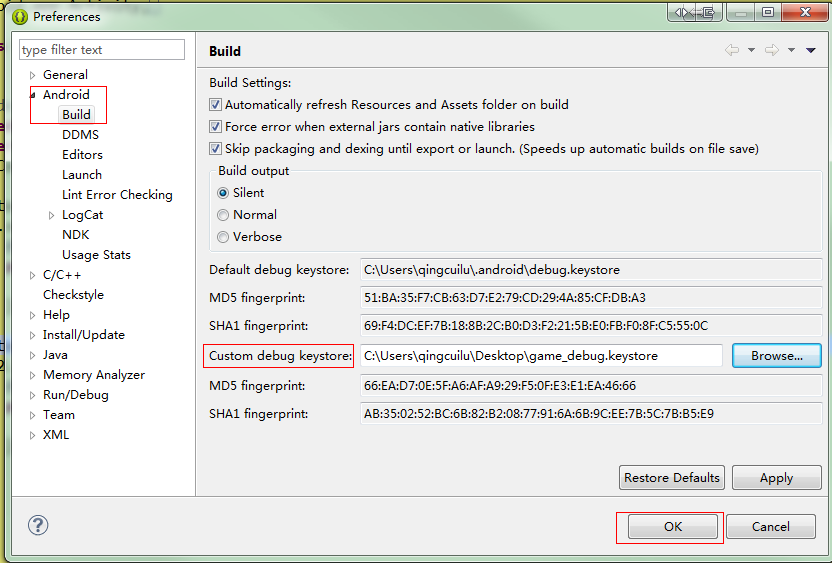

Android 接入
=======

## 包结构说明

MSDK的发布包(zip)主要包含两个重要部分`MSDKLibrary`和`MSDKSample`，前者为MSDK库，后者MSDK接口的使用示例。在MSDKLibrary/jni/CommonFiles/WGPlatform.h中包含了所有的接口说明(java与C++的接口是对应的)，一些不常用在接口的说明可在这个文件中查看。

`推荐`只使用`launchActivity`(游戏启动的第一个Activity)初始化MSDK并处理MSDK接口调用。若使用多个Activity处理MSDK接口调用，在接入微信时容易发生登录无回调的错误。

## Step1:引入MSDK包

### 使用Android Library Project的游戏

在Eclipse中引入`MSDKLibrary`项目，右击游戏项目->属性->Android->添加(库)->选择MSDKLibrary，完成对MSDKLibrary的引用。

### 不能使用Android Library Project的游戏

#### java接入

不能使用Android Library Project的游戏，需要复制MSDKLibrary下的libs，res两个目录到游戏工程相应目录。

#### C++接入

不能使用Android Library Project的游戏，需要复制MSDKLibrary下的libs，res目录到游戏工程相应目录，并复制jni目录下的 .cpp 和 .h 文件加到游戏工程，并添加到 Android.mk。

**注意事项：**

1. 引入`MSDKLibrary`以后编译发生包冲突(重复)，因为MSDK里面已经包含了 微信SDK(`libammsdk.jar`)，QQ互联sdk(`open_sdk.jar`)，MTA(`mta-xxx.jar`)，灯塔SDK(`beacon-xxx.jar`) 且上述sdk均是其最新稳定版，游戏如果以前有单独集成这些SDK，请删除之前集成的jar包。
2. MSDKSample/assets/msdkconfig.ini 是MSDK的配置文件，包括环境的选择，各部分功能模块的配置等，可以拷贝到游戏工程中按需修改使用。

## Step2:配置说明

### 权限配置

	<!-- TODO SDK接入必须权限模块 START -->
	<uses-permission android:name="android.permission.ACCESS_NETWORK_STATE" />
	<uses-permission android:name="android.permission.ACCESS_WIFI_STATE" />
	<uses-permission android:name="android.permission.ACCESS_FINE_LOCATION" />
	<uses-permission android:name="android.permission.ACCESS_COARSE_LOCATION"/>
	<uses-permission android:name="android.permission.CHANGE_WIFI_STATE" />
	<uses-permission android:name="android.permission.GET_TASKS" />
	<uses-permission android:name="android.permission.INTERNET" />
	<uses-permission android:name="android.permission.MOUNT_UNMOUNT_FILESYSTEMS" />
	<uses-permission android:name="android.permission.READ_PHONE_STATE" />
	<uses-permission android:name="android.permission.RESTART_PACKAGES" />
	<uses-permission android:name="android.permission.SYSTEM_ALERT_WINDOW" />
	<uses-permission android:name="android.permission.WRITE_EXTERNAL_STORAGE" />

	<!-- 登录上报时需要带设备名称, 通过蓝牙模块来获取设备名称 -->
    <uses-permission android:name="android.permission.BLUETOOTH" />
    <uses-permission android:name="android.permission.BLUETOOTH_ADMIN" />
	<!-- TODO SDK接入 必须权限模块 END -->

### 配置文件修改

在 assets/msdkconfig.ini 中配置访问的需要访问的MSDK后台环境(测试环境/正式环境)，联调阶段游戏需要使用测试环境，发布时需要切换到正式环境(公司内测，公测，正式上线)，切换环境时候需要注意，后台也要同时切换成对应的环境。下面是配置前端访问MSDK后台测试环境。

	;自研游戏或精品代理游戏请使用此组域名, 使用其中一个域名
	;带msdktest为测试环境域名, msdk为正式环境域名
	;MSDK_URL=http://msdk.qq.com
	MSDK_URL=http://msdktest.qq.com

**PS:** 为了防止游戏用测试环境上线, SDK内检测到游戏使用测试环境或者开发环境时, 会Toast出类似: **“You are using http://msdktest.qq.com”**这样的提示, 游戏切换成正式环境域名以后此提示自动消失.

## Step3:MSDK初始化

**自MSDK 2.8.1开始，游戏初始化MSDK时初始化参数中去除微信APPKEY，增加MSDKKey的初始化。**

MSDK初始化是使用SDK所提供功能可以执行的前提。游戏在应用启动时MainActivity的onCreate方法中调用MSDK初始化函数`WGPlatform.Initialized`初始化MSDK。
例如：

1. 设置游戏的基本信息：

2.8.1a以后版本：

	// TODO GAME 初始化MSDK
	/***********************************************************
	*  TODO GAME 接入必须要看， baseInfo值因游戏而异，填写请注意以下说明:      
	*  	baseInfo值游戏填写错误将导致 QQ、微信的分享，登录失败 ，切记 ！！！     
	* 		只接单一平台的游戏请勿随意填写其余平台的信息，否则会导致公告获取失败  
	*      offerId 为必填，一般为手QAppId
	***********************************************************/
	MsdkBaseInfo baseInfo = new MsdkBaseInfo();
	baseInfo.qqAppId = "100703379";
	baseInfo.qqAppKey = "4578e54fb3a1bd18e0681bc1c734514e";
	baseInfo.wxAppId = "wxcde873f99466f74a";
	baseInfo.msdkKey = "5d1467a4d2866771c3b289965db335f4";
	baseInfo.offerId = "100703379";
	// TODO GAME 自2.7.1a开始游戏可在初始化msdk时动态设置版本号，灯塔和bugly的版本号由msdk统一设置
	// 1、版本号组成 = versionName + versionCode
	// 2、游戏如果不赋值给appVersionName（或者填为""）和appVersionCode(或者填为-1)，
	// msdk默认读取AndroidManifest.xml中android:versionCode="51"及android:versionName="2.7.1"
	// 3、游戏如果在此传入了appVersionName（非空）和appVersionCode（正整数）如下，则灯塔和bugly上获取的版本号为2.7.1.271
	baseInfo.appVersionName = "2.8.0";
	baseInfo.appVersionCode = 280;

2.8.1a以前版本：

	//游戏必须使用自己的QQ AppId联调
	baseInfo.qqAppId = "1007033***";
	baseInfo.qqAppKey = "4578e54fb3a1bd18e0681bc1c7345***";

	//游戏必须使用自己的微信AppId联调
	baseInfo.wxAppId = "wxcde873f99466f***";
	baseInfo.wxAppKey = "bc0994f30c0a12a9908e353cf05d4***";

	//游戏必须使用自己的支付offerId联调
	baseInfo.offerId = "100703***";

    // 自2.7.1a开始游戏可在初始化msdk时动态设置版本号，灯塔和bugly的版本号由msdk统一设置
	// 2.7.1a之前的版本不要设置
	// 1、版本号组成 = versionName + versionCode
	// 2、游戏如果不赋值给appVersionName（或者填为""）和appVersionCode(或者填为-1)，
	// msdk默认读取AndroidManifest.xml中android:versionCode="51"及android:versionName="2.7.1"
	// 3、游戏如果在此传入了appVersionName（非空）和appVersionCode（正整数）如下，则灯塔和bugly上获取的版本号为2.7.1.271
	baseInfo.appVersionName = "2.7.1";
	baseInfo.appVersionCode = 271;

- 初始化MSDK

		public void onCreate(Bundle savedInstanceState) {
			...

			WGPlatform.Initialized(this, baseInfo);
			// 设置拉起QQ时候需要用户授权的项
			WGPlatform.WGSetPermission(WGQZonePermissions.eOPEN_ALL);

			// 必须保证handleCallback在Initialized之后
			// launchActivity的onCreat()和onNewIntent()中必须调用
        	// WGPlatform.handleCallback()。否则会造成微信登录无回调
			WGPlatform.handleCallback(getIntent());
			...
		}

    	protected void onResume() {
      		super.onResume();
       	 	WGPlatform.onResume();
    	}

    	@Override
    	protected void onRestart() {
    	    super.onRestart();
    	    WGPlatform.onRestart();
    	}

   		protected void onPause() {
     	   super.onPause();
     	   WGPlatform.onPause();
   	 	}

    	@Override
    	protected void onStop() {
   	    	super.onStop();
      	  	WGPlatform.onStop();
   	 	}

    	protected void onDestroy() {
        	super.onDestroy();
        	WGPlatform.onDestory(this);
    	}

    	protected void onNewIntent(Intent intent) {
        	super.onNewIntent(intent);
        	WGPlatform.handleCallback(intent);
    	}

此外，MSDK2.5以下版本需要在MainActivty中加载RQD的动态库，示例代码如下：

	// TODO GAME 要加载必要的动态库
    static {
        System.loadLibrary("NativeRQD"); // 游戏需要加载此动态库, 数据上报用
        System.loadLibrary("WeGameSample"); // 游戏不需要这个, 这是MSDKDemo自用的
    }

**注意：**

* MSDK2.5及以上版本已经将RQD替换为Bugly，接入2.5及以上版本时，如果游戏原工程下的libs文件平中存在`libNativeRQD.so`则需要将其删除。并且不需要加载“NativeRQD"动态库。

**C++类游戏除了在MainActivity的onCreate方法中初始化SDK外，还要在 **`JNI_OnLoad`**中初始化SDK相关的内容。**
所有WG开头的接口均提供了C++层和Java层接口。Java层通过`WGPlatform`调用, C++层通过`WGPlatform::GetInstance()`调用。这里调用方式可以参考 jni/PlatformTest.cpp 。

    GlobalCallback g_Test;
    JNIEXPORT jint JNICALL JNI_OnLoad(JavaVM* vm, void* reserved) {
        WGPlatform::GetInstance()->init(vm);// C++层初始化SDK
        WGPlatform::GetInstance()->WGSetObserver(&g_Test);
        return JNI_VERSION_1_4;
    }

#### **注意：**

**游戏一定要保证在`launchActivity`的`onCreat`和`onNewIntent`中调用`WGPlatform.handleCallback()`。否则会造成游戏在某些场景下无法收到回调。**

## Step4:设置全局回调

MSDK通过`WGPlatformObserver`抽象类中的方法将授权、分享或查询结果回调给游戏。游戏根据回调结果调正UI等。只有设置回调，游戏才能收到MSDK的响应。
设置Java 回调：

	WGPlatform.WGSetObserver(new WGPlatformObserver() {
		@Override
		public void OnWakeupNotify(WakeupRet ret) { }
		@Override
		public void OnShareNotify(ShareRet ret) { }
		@Override
		public void OnRelationNotify(RelationRet relationRet) { }
		@Override
		public void OnLoginNotify(LoginRet ret) { }
		@Override
		public void OnAddWXCardNotify(CardRet ret) { }
	});

设置C++ 回调(**设置了Java层回调会优先调用Java层回调, 如果要使用C++层回调则不能设置Java层回调**)：

	class GlobalCallback: public WGPlatformObserver {
	public:
	    virtual void OnLoginNotify(LoginRet& loginRet) { }
	    virtual void OnShareNotify(ShareRet& shareRet) { }
	    virtual void OnWakeupNotify(WakeupRet& wakeupRet) { }
	    virtual void OnRelationNotify(RelationRet& relationRet) { }
	    virtual void OnAddWXCardNotify(CardRet& ret) { }
	    virtual ~GlobalCallback() { }
	};
	GlobalCallback g_Test;

	JNIEXPORT jint JNICALL JNI_OnLoad(JavaVM* vm, void* reserved) {
		// C++层初始化, 必须在游戏主Activity的onCreate之前被调用
		WGPlatform::GetInstance()->init(vm);
		WGPlatform::GetInstance()->WGSetObserver(&g_Test);
		return JNI_VERSION_1_4;
	}

**注意：**
 如果游戏使用C++ API，则**不要再设置Java层的全局回调**，否则SDK会优先调用Java层的回调，忽略C++层回调。另外MSDK的回调在UI线程, 开发者需自己确保线程安全。

至此, MSDK包接入与初始化部分完成，游戏使用各模块的功能，还应阅读相应模块的接入配置与接口说明。

## 单步调试程序
由于 微信/手Q 登录时 微信/手Q 会对游戏的签名(keystore证书签名)做校验，如果不是平台存储的正式签名，游戏会无法拉起微信，QQ授权时会报 100044 错误。平台上储存的签名指纹是在open平台注册游戏时由游戏注册的同学上传的。

而 Eclipse 或其他 IDE 调试的 Android 程序，只能是用默认证书(Debug.keystore)签名的APK，这就会造成在调试模式下无法使用 QQ/微信 登录，造成了调试程序的不便。
下面介绍了一种解决 App 使用正式签名文件后，无法通过 Eclipse Run As 或 Debug As 调试 微信/手Q 登陆的问题。主要原理是通过修改证书的别名和密码，将正式的keystore证书修改为ADT认可的debug证书。

### 1.复制一份正式证书
假设游戏有正式证书，名为 game_release.keystore，复制该证书并命名为 game_debug.keystore（可随意取）。后面修改 game_debug.keystore 的alias（别名）和密码。
`之后游戏正式发布的APK用game_release.keystore签名，调试时使用game_debug.keystore签名，切记 keystore 不用外泄。`

### 2.修改keystore密码
在 JDK的bin目录下运行如下命令

	keytool -storepasswd -keystore game_debug.keystore

其中，game_debug.keystore是复制出来的证书文件，执行后会提示输入证书的当前密码，和新密码以及重复新密码确认。这一步需要将密码改为android。

### 3.修改keystore的alias：
在 JDK的bin目录下运行如下命令

	keytool -changealias -keystore game_debug.keystore -alias my_name -destalias androiddebugkey

这一步中，my_name是证书中当前的alias，它的值是 keytool -list -v -keystore game_debug.keystore 命令运行后的“别名” 或者 “Alias name”，这个命令会先后提示输入keystore的密码和当前alias的密码，
其中 keystore 的密码是上一步新修改的密码，当前alias的密码是签名文件之前的旧密码。

### 4.修改alias的密码：
在 JDK的bin目录下运行如下命令

	keytool -keypasswd -keystore game_debug.keystore -alias androiddebugkey

这一步执行后会提示输入keystore密码，alias密码，然后提示输入新的alias密码，同样，按规矩来，其中 keystore密码是上一步新修改的密码，alias密码是签名文件之前的旧密码， 新的alias密码要改为android。

### 5.将处理后的正式签名设置为Eclipse的默认签名
在Eclipse里的windows/preferences/Android/Build/里，将Custom debug keystore设置为game_debug.keystore 的路径

