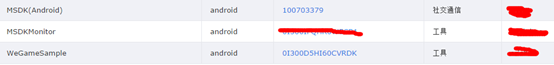

MSDK 灯塔 相关模块
===
灯塔接入配置
---
自msdk1.7以后，接入msdk的游戏不再需要向灯塔端申请灯塔appkey，而以qqAppId作为灯塔key来实现灯塔的接入。在用户分析->实时统计中会有数据显示，表明接入成功。

自版本1.7之后，已无需在AndroidManifest.xml中对灯塔进行配置如下图所示，部分游戏因为存在这段代码可能导致数据不正常，建议将此段代码删除之。

如果看不到数据，按以下步骤处理。

1、     首先，有可能是游戏申请了多个灯塔的应用，而灯塔只将其中的一个灯塔应用与qqAppId(100703379)进行关联，如msdk为了测试，申请了三个灯塔应用，而MSDK(Android)是与qqAppId相关联的应用，与WeGameSample没有关联，因此，在MSDK(Android)这里可以看到最新数据，但在WeGameSample看不到最新数据，游戏要首先确认这一点。

2、     游戏虽然接入了MSDK1.7或之后的版本，但灯塔并没有将其之前申请的appkey与qqAppid进行关联，这样也会看不到数据，联系灯塔同事@jiaganzheng确认，并告之其qqAppId

3、     首次接入请先确认是否有权限，这个可以联系灯塔同事@jiaganzheng确认，告之其qqAppId。

自定义数据上报
---
可以通过该事件接口来记录和上报用户关键事件到灯塔和MTA，从而对事件发生次数进行统计分析。要完成此功能需要用到的接口有: WGReportEvent, 接口详细说明如下: 

     /**自定义数据上报, 此接口仅支持一个key-value的上报, 从1.3.4版本开始, 建议使用void WGReportEvent(String name,       HashMap<String, String> params, boolean isRealTime) 
	 * @param name 事件名称
	 * @param body 事件内容
	 * @param isRealTime 是否实时上报
	 * @return void
	 */
     public static void WGReportEvent(String name, String body, boolean isRealTime);

另外接口是:
     
     /**
	 * @param eventName 事件名称
	 * @param params key-value格式的自定义事件
	 * @param isRealTime 是否实时上报
	 * @return void
	 */
    public static void WGReportEvent(String eventName, HashMap<String, String> params, boolean isRealTime);

其中参数约束如下：**eventName不要以MSDK_开头，因为这是msdk自定义事件的命名风格。**

应用场景
---

如果我想查看某个接口的调用次数如查询QQ用户个人信息，事件名称命名为queryQQUserInfo，调用方法如下：

    WGReportEvent("queryQQUserInfo", null, true);

如果成功上报的话可以在http://beacon.tencent.com/ 对应灯塔app的日志查询中。实时上报的话一般调用上面方法后五分钟内可查询到。

另外在事件质量列表中可以查看数量的统计：

具体可咨询RTX灯塔小秘。

另：灯塔自定义事件有成功率和时延的统计，目前尚未封装，游戏需要用时，可自行调用UserAction.onUserAction。使用方法可参看灯塔官网提供的参考文档。