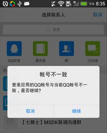
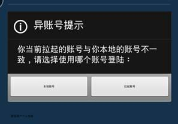
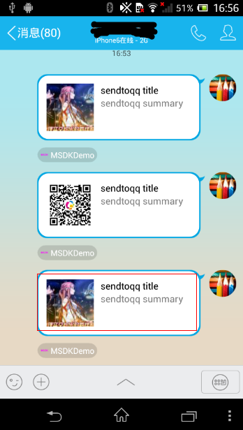

MSDK 异账号梳理
=======

何为异帐号
---

异帐号是指：当前游戏内登录的帐号和平台登录的帐号不一致。有以下两种情况：

1. 平台一样，帐号不同（例如游戏和手Q登录了不同的QQ号）
2. 平台不同（例如游戏用微信登录，游戏相关的操作是要到手Q）

异帐号的场景
---

 1. 游戏分享消息的时候拉起平台，因为账号不一致，平台会弹框提示异账号，目前平台都已经支持该功能。

	 
	

 2. 用户从平台拉起进入游戏，因为账号不一致，需要游戏弹框提示异账号

	 

`目前游戏上线时平台要求游戏处理的异账号、MSDK实现的异帐号都为第二种。`

异帐号处理逻辑（开发关注）
---
MSDK的异帐号处理逻辑包括异账号判断，用户选择账号，异账号登录三个步骤。（详见MSDK接入文档）。简单介绍如下：

####1. 异帐号判断：

当游戏从外部平台拉起的时候，MSDK会在handCallback判断拉起平台与游戏本地账号是否存在异账号，并将异账号判断的结果通过OnWakeupNotify(WakeupRet ret)方法的ret.flag回调给游戏。游戏可以根据回调结果完成对应的登陆处理。具体ret.flag及对应的处理如下：

	eFlag_Succ: 不存在异账号，使用本地账号登陆成功。 游戏接收到此flag以后直接读取LoginRet结构体中的票据进行游戏授权流程。

	eFlag_AccountRefresh: 不存在异账号，MSDK已通过刷新接口将本地账号票据刷新。接收到此flag以后直接读取LoginRet结构体中的票据进行游戏授权流程。

	eFlag_UrlLogin：不存在异账号，游戏通过拉起账号快速登陆。游戏接收到此flag以后需要等待onLoginNotify的回调后处理。

	eFlag_NeedLogin：游戏本地账号和拉起账号均无法登陆。游戏接收到此flag以后需要弹出登陆页让用户登陆。

	eFlag_NeedSelectAccount：游戏本地账号和拉起账号存在异账号，游戏接收到此flag以后需要弹出对话框让用户选择登陆的账号。

####2. 用户选择：

当异账号判断的ret.flag为eFlag_NeedSelectAccount时，游戏需要弹框提示用户，选择本地账号或者拉起账号登陆游戏，游戏需要根据用户选择的结果调用接口WGSwitchUser完成用户登陆。

		/**
		 *  通过外部拉起的URL登陆。该接口用于异帐号场景发生时，用户选择使用外部拉起帐号时调用。
	 	*  登陆成功后通过onLoginNotify回调
	 	*
	 	*  @param flag 为YES时表示用户需要切换到拉起帐号，此时该接口会使用上一次保存的拉起帐号登陆数据尝试登陆。登陆成功后通过onLoginNotify回调；如果没有票据，或票据无效函数将会返回NO，不会发生onLoginNotify回调。
	 	*              为NO时表示用户继续使用原本地帐号，此时删除保存的拉起帐号数据，避免产生混淆。
	 	*
	 	*  @return 如果没有票据，或票据无效将会返回NO；其它情况返回YES
		 */
		bool WGSwitchUser(bool flag);

####3. 返回登录回调：

当WGSwitchUser的参数为true的时候，MSDK会根据游戏拉起时的状态尝试登录，并把登录的结果通过onLoginNotify回调给游戏，游戏根据回调结果处理登录结果。

触发异账号说明
---

#### 从微信拉起游戏
从微信拉起游戏时，只携带 openid 而没有其它票据。即可以判断异账号，但用拉起的账号无法登录成功，如果要用拉起的账号登录需要重新点登录授权。

#### 从手Q拉起游戏
从手Q拉起游戏时，由不同的地方拉起会有不同的表现。

如图，在结构化消息分享中，点击红框中的消息体会先跳到游戏中心然后自动拉起游戏，此时只要配置了[快速登录](qq.md#快速登录)就可以携带登录票据拉起游戏。如果是点击图中分享的消息体下方的小尾巴拉起游戏，此时是不带任何票据的，即没有异账号，更无法用拉起账号登录。
这两种情况可以这样区分，点击后如果先跳转到游戏中心再拉起游戏，此时是带有全部票据可用拉起账号登录(配置了[快速登录](qq.md#快速登录))，具有触发异账号能力；点击后如果直接拉起游戏，此时是不带票据的，无法用拉起账号登录，没有触发异账号能力。

平台到游戏异帐号的九种情况
----

**开发无需关心，只需要关心MSDK给游戏回调中的flag。**：

|           |拉起带完整票据|拉起不带完整票据|拉起无票据|
|: ------------- :|: ------------- :|: ------------- :|: ------------- :|
|本地票据有效|提示用户异账号|提示用户异账号|通过本地帐号登陆|
|本地票据无效|提示用户异账号|提示用户异账号|游戏回到登录页|
|本地无票据|通过拉起账号登陆|游戏回到登录页|游戏回到登录页|

异帐号版本支持
-----
####游戏到平台异账号：

1. 1.3.0.11 以下版本，游戏到微信的异账号因为MSDK已知BUG会造成自动登录没有提示。建议更新MSDK版本到1.3.0.11以后解决此问题.
2. 游戏到微信的异账号只在微信5.0及以上版本才支持。

####平台到游戏异账号：
1. MSDK从1.8.0开始支持异账号，目前只有手Q可以完成带票据拉起。
2. 手Q4.6以下版本， 手Q到游戏的异账号在游戏已经启动的情况下没有。

##常见问题

1. 点击分享的消息没有异帐号：点击查看[分享消息点击效果](share.md#分享消息点击效果)确认当前的操作是否会触发异帐号。
2. 手Q拉起游戏无法登陆：[点击了解手Q支持快速登陆的条件](qq.md#快速登录)，根据内容确认当前游戏手Q是否支持快速登陆。