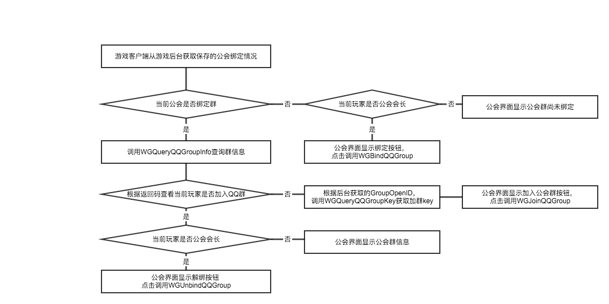

加群组件相关模块
=======

## 概述

该模块将会对MSDK加群组件相关的模块做一次梳理，包括手Q的绑定公会QQ群、查询公会绑定的QQ群、查询公会群加群Key、加入公会群、解绑公会群以及微信的相关群接口。游戏可以先参照该模块熟悉MSDK所有加群相关的模块，然后再根据游戏自己的需求使用对应接口完成功能调用。

### 变更说明：

1. 该功能从MSDK 1.7.5开始支持手Q加绑功能。

- 在MSDK 2.7 中增加查询QQ群绑定信息和解绑QQ群的接口以及三个回调。
- 在MSDK2.8.0中增加查询QQ群加群Key的接口，同时增加一个回调。并对整个结构进行调整，修改了全局回调以及部分结构体和接口

| 调整内容 | 调整前 | 调整后 |
|: ------------- :|
| 绑群回调 | WGQQGroupObserver | WGGroupObserver |
| 绑群回调设置 | WGSetQQGroupObserver | WGSetGroupObserver |
| 绑群回调结构体 | QQGroupRet | GroupRet |

##名词解释、接口说明

| 调用接口 | 名称| 描述 | 接口文档 |
|: ------------- :|
| WGBindQQGroup| 绑定QQ群 | 绑定游戏公会的QQ群 | [WGBindQQGroup](group.md#绑定QQ群) |
|WGQueryQQGroupInfo| 查询公会QQ群信息 | 查询公会绑定的QQ群的信息 | [WGQueryQQGroupInfo](group.md#查询QQ群绑定信息)|
| WGQueryQQGroupKey| 查询公会QQ群加群key | 查询公会绑定的QQ群的信息 | [WGQueryQQGroupKey](group.md#获取加入QQ群的key) |
| WGJoinQQGroup| 进入公会QQ群 | 加入公会QQ群 | [WGJoinQQGroup](group.md#加入QQ群) |
| WGUnbindQQGroup| 解绑公会QQ群 | 解绑公会与QQ群的绑定关系 | [WGUnbindQQGroup](group.md#加入QQ群) |

## 加群组件接入流程

1. 设置加群相关回调。

	MSDK加群组件使用独立于MSDK全局回调的单独回调实现，因此游戏需要单独设置加群相关回调，具体回调设置方法可以参照[加组件回调设置](group.md#加组件回调设置)

2. 游戏按照推荐流程调用接口实现功能。

## 手Q加群组件推荐使用方法

### 推荐流程

下面的流程图给出了游戏调用QQ相关的加群组件的流程。

### 注意事项

1. 公会在绑定QQ群的过程中，游戏需要保存以下内容：

	- 游戏绑定的是QQ群还是微信群（后续MSDK将会支持绑定微信群）
	- 游戏工会ID、大区ID与QQ群的group_openid的对应关系。

- 游戏内绑定群的时候公会id和大区id必须是数字，如果使用字符可能会导致绑定失败，一般提示为“参数校验失败”。

- 游戏内绑定群的时候签名生成的规则为：玩家openid\_游戏appid\_游戏appkey\_公会id\_区id的md5值，建议由游戏后台生成后传给客户端。如果按照此规则生成的签名不可用，直接联系MSDK。

- 手Q功能对应支持版本
	
	手Q的绑群功能与手Q版本相关，具体功能版本支持情况如下：
	
|功能名称|功能说明|Android 手Q支持情况|
|:|:|:|
| 游戏内加群 | 拉起手Q加QQ群 | 4.7及以上 |
| 游戏内绑定群 | 拉起手Q绑定QQ群 | 5.1及以上 |

## 微信加群组件推荐使用方法

（开发中，敬请期待）

## 加组件回调设置

- 从MGSDK2.8.0开始，MSDK将加群绑群的全局回调调整为：`WGGroupObserver`，同时支持手Q加群组件和即将推出的微信加群组件。设置方法[点击查看](group.md#MSDK2.8.0以上版本加群回调)

- 从MGSDK2.7.0开始，MSDK加群绑群增加了单独的全局回调：`WGQQGroupObserver`。通过该全局回调游戏可以在绑群、查询群信息、解绑群时收到对应的回调信息。设置方法[点击查看](group.md#MSDK2.8.0及以前版本加群回调)

### MSDK2.8.0以上版本加群回调

#### Java层回调：

- **回调实现事例：**

		class MsdkGroupCallback implements WGGroupObserver {

			@Override
			public void OnQueryGroupInfoNotify(GroupRet groupRet) {
				//TODO GAME 增加查询群信息的回调
				Logger.d("flag:"+ groupRet.flag + ";errorCode："+ groupRet.errorCode + ";desc:" + groupRet.desc);
				if(CallbackFlag.eFlag_Succ == groupRet.flag){
					//游戏可以在会长公会界面显解绑按钮，非工会会长显示进入QQ群按钮
					MsdkCallback.sendResult("查询成功。\n群昵称为："+groupRet.getGroupInfo().groupName 
							+"\n群openID:"+groupRet.getGroupInfo().groupOpenid 
							+"\n加群Key为："+groupRet.getGroupInfo().groupKey);
				}else{
					if(2002 == groupRet.errorCode){
						//游戏可以在会长公会界面显示绑群按钮，非会长显示尚未绑定
						MsdkCallback.sendResult("查询失败，当前公会没有绑定记录！");
					}else if(2003 == groupRet.errorCode){
						//游戏可以在用户公会界面显示加群按钮
						MsdkCallback.sendResult("查询失败，当前用户尚未加入QQ群，请先加入QQ群！");
					}else if(2007 == groupRet.errorCode){
						//游戏可以在用户公会界面显示加群按钮
						MsdkCallback.sendResult("查询失败，QQ群已经解散或者不存在！");
					}else{
						//游戏可以引导用户重试
						MsdkCallback.sendResult("查询失败，系统错误，请重试！");
					}
				}
				
			}

			@Override
			public void OnBindGroupNotify(GroupRet groupRet) {
				//TODO GAME 增加绑定QQ群的回调
				Logger.d("flag:"+ groupRet.flag + ";errorCode："+ groupRet.errorCode + ";desc:" + groupRet.desc);
				if(CallbackFlag.eFlag_Succ == groupRet.flag){
					//游戏可以去查询绑定的公会的相关信息。
					//由于目前手QSDK尚不支持，因此无论绑定是否成功，MSDK都会给游戏一个成功的回调，游戏收到回调以后需要调用查询接口确认绑定是否成功
					MsdkCallback.sendResult("绑定成功。");
				}else{
					//游戏可以引导用户重试
					MsdkCallback.sendResult("绑定失败，系统错误，请重试！");
				}
			}

			@Override
			public void OnUnbindGroupNotify(GroupRet groupRet) {
				//TODO GAME 增加解绑QQ群的回调
				Logger.d("flag:"+ groupRet.flag + ";errorCode："+ groupRet.errorCode + ";desc:" + groupRet.desc);
				if(CallbackFlag.eFlag_Succ == groupRet.flag){
					//解绑成功，游戏可以提示用户解绑成功，并在工会会长界面显示绑群按钮，非会长界面显示尚未绑定按钮
					MsdkCallback.sendResult("解绑成功。");
				}else{
					if(2001 == groupRet.errorCode){
						//解绑用的群openID没有群绑定记录，游戏重新调用查询接口查询绑定情况
						MsdkCallback.sendResult("解绑失败，当前QQ群没有绑定记录！");
					}else if(2003 == groupRet.errorCode){
						//用户登录态过期，重新登陆
						MsdkCallback.sendResult("解绑失败，用户登录态过期，请重新登陆！");
					}else if(2004 == groupRet.errorCode){
						//操作太过频繁，让用户稍后尝试
						MsdkCallback.sendResult("解绑失败，操作太过频繁，让用户稍后尝试！");
					}else if(2005 == groupRet.errorCode){
						//解绑参数错误，游戏重新调用查询接口查询绑定情况
						MsdkCallback.sendResult("解绑失败，操解绑参数错误！");
					}else{
						//游戏可以引导用户重试
						MsdkCallback.sendResult("解绑失败，系统错误，请重试！");
					}
				}
			}

			@Override
			public void OnQueryQQGroupKeyNotify(GroupRet groupRet) {
				//TODO GAME 增加查询群KEY的回调
				Logger.d("flag:"+ groupRet.flag + ";errorCode："+ groupRet.errorCode + ";desc:" + groupRet.desc);
				if(CallbackFlag.eFlag_Succ == groupRet.flag){
					//成功获取到加群用的key，可以进一步使用key加入QQ群
					MsdkCallback.sendResult("查询成功。\n加群Key为："+groupRet.getGroupInfo().groupKey);
				}else{
					//游戏可以引导用户重试
					MsdkCallback.sendResult("查询失败，请重试！");
				}
			}
		}

- **回调设置：**

		 //QQ 加群绑群回调
	     WGPlatform.WGSetGroupObserver(new MsdkGroupCallback());
	     
#### C++层回调：

- **回调实现事例（这里只是简单事例，详细请参考java层回调）：**	     
	     
	     class GroupCallback: public WGGroupObserver {

			virtual void OnQueryGroupInfoNotify(GroupRet& groupRet){
				// 游戏在此处添加查询群信息返回以后的逻辑
				LOGD("QQGroupCallback OnQueryGroupInfoNotify;flag:%d;errorCode:%d;desc:%s",groupRet.flag,groupRet.errorCode,groupRet.desc.c_str());
			}
			virtual void OnBindGroupNotify(GroupRet& groupRet){
				//游戏在此处添加绑定群以后的逻辑,目前openSDK不支持，MSDK只能返回接口调用成功
				LOGD("QQGroupCallback OnQueryGroupInfoNotify;flag:%d;errorCode:%d;desc:%s",groupRet.flag,groupRet.errorCode,groupRet.desc.c_str());
			}
			virtual void OnUnbindGroupNotify(GroupRet& groupRet){
				// 游戏在此处添加调用解绑接口以后的返回结果
				LOGD("QQGroupCallback OnQueryGroupInfoNotify;flag:%d;errorCode:%d;desc:%s",groupRet.flag,groupRet.errorCode,groupRet.desc.c_str());
			}
			virtual void OnQueryGroupKeyNotify(GroupRet& groupRet){
				// 游戏在此处添加查询群信息返回以后的逻辑
				LOGD("QQGroupCallback OnQueryGroupInfoNotify;flag:%d;errorCode:%d;desc:%s",groupRet.flag,groupRet.errorCode,groupRet.desc.c_str());
			}
		};

- **回调设置：**
	
			WGPlatform::GetInstance()->WGSetGroupObserver(&qqGroup_callback);		
		
### MSDK2.8.0及以前版本加群回调

#### Java层回调：

- **回调实现事例：**

		//加群绑群回调
		class MsdkQQGroupCallback implements WGQQGroupObserver {

			@Override
			public void OnQueryGroupInfoNotify(QQGroupRet groupRet) {
				//TODO GAME 增加查询群信息的回调
				Logger.d("flag:"+ groupRet.flag + ";errorCode："+ groupRet.errorCode + ";desc:" + groupRet.desc);
				if(CallbackFlag.eFlag_Succ == groupRet.flag){
					//游戏可以在会长公会界面显解绑按钮，非公会会长显示进入QQ群按钮
					MsdkCallback.sendResult("查询成功。\n群昵称为："+groupRet.getGroupInfo().groupName 
							+"\n群openID:"+groupRet.getGroupInfo().groupOpenid 
							+"\n加群Key为："+groupRet.getGroupInfo().groupKey);
				}else{
					if(2002 == groupRet.errorCode){
						//游戏可以在会长公会界面显示绑群按钮，非会长显示尚未绑定
						MsdkCallback.sendResult("查询失败，当前公会没有绑定记录！");
					}else if(2003 == groupRet.errorCode){
						//游戏可以在用户公会界面显示加群按钮
						MsdkCallback.sendResult("查询失败，当前用户尚未加入QQ群，请先加入QQ群！");
					}else if(2007 == groupRet.errorCode){
						//游戏可以在用户公会界面显示加群按钮
						MsdkCallback.sendResult("查询失败，QQ群已经解散或者不存在！");
					}else{
						//游戏可以引导用户重试
						MsdkCallback.sendResult("查询失败，系统错误，请重试！");
					}
				}
			}
		
			@Override
			public void OnBindGroupNotify(QQGroupRet groupRet) {
				//TODO GAME 增加绑定QQ群的回调
				Logger.d("flag:"+ groupRet.flag + ";errorCode："+ groupRet.errorCode + ";desc:" + groupRet.desc);
				if(CallbackFlag.eFlag_Succ == groupRet.flag){
					//游戏可以去查询绑定的公会的相关信息。
					//由于目前手QSDK尚不支持，因此无论绑定是否成功，MSDK都会给游戏一个成功的回调，游戏收到回调以后需要调用查询接口确认绑定是否成功
					MsdkCallback.sendResult("绑定成功。");
				}else{
					//游戏可以引导用户重试
					MsdkCallback.sendResult("绑定失败，系统错误，请重试！");
				}
			}
		
			@Override
			public void OnUnbindGroupNotify(QQGroupRet groupRet) {
				//TODO GAME 增加解绑QQ群的回调
				Logger.d("flag:"+ groupRet.flag + ";errorCode："+ groupRet.errorCode + ";desc:" + groupRet.desc);
				if(CallbackFlag.eFlag_Succ == groupRet.flag){
					//解绑成功，游戏可以提示用户解绑成功，并在公会会长界面显示绑群按钮，非会长界面显示尚未绑定按钮
					MsdkCallback.sendResult("解绑成功。");
				}else{
					if(2001 == groupRet.errorCode){
						//解绑用的群openID没有群绑定记录，游戏重新调用查询接口查询绑定情况
						MsdkCallback.sendResult("解绑失败，当前QQ群没有绑定记录！");
					}else if(2003 == groupRet.errorCode){
						//用户登录态过期，重新登陆
						MsdkCallback.sendResult("解绑失败，用户登录态过期，请重新登陆！");
					}else if(2004 == groupRet.errorCode){
						//操作太过频繁，让用户稍后尝试
						MsdkCallback.sendResult("解绑失败，操作太过频繁，让用户稍后尝试！");
					}else if(2005 == groupRet.errorCode){
						//解绑参数错误，游戏重新调用查询接口查询绑定情况
						MsdkCallback.sendResult("解绑失败，操解绑参数错误！");
					}else{
						//游戏可以引导用户重试
						MsdkCallback.sendResult("解绑失败，系统错误，请重试！");
					}
				}
			}
		}

- **回调设置：**

		 //QQ 加群绑群回调
	     WGPlatform.WGSetQQGroupObserver(new MsdkQQGroupCallback());

#### C++层回调：

- **回调实现事例（这里只是简单事例，详细请参考java层回调）：**

		// 广告的回调，
		class QQGroupCallback: public WGQQGroupObserver {
		
			virtual void OnQueryGroupInfoNotify(QQGroupRet& groupRet){
				// 游戏在此处添加查询群信息返回以后的逻辑
				LOGD("QQGroupCallback OnQueryGroupInfoNotify;flag:%d;errorCode:%d;desc:%s",groupRet.flag,groupRet.errorCode,groupRet.desc.c_str());
			}
			virtual void OnBindGroupNotify(QQGroupRet& groupRet){
				//游戏在此处添加绑定群以后的逻辑,说明目前openSDK不支持，MSDK只能返回接口调用成功
				LOGD("QQGroupCallback OnQueryGroupInfoNotify;flag:%d;errorCode:%d;desc:%s",groupRet.flag,groupRet.errorCode,groupRet.desc.c_str());
			}
			virtual void OnUnbindGroupNotify(QQGroupRet& groupRet){
				// 游戏在此处添加调用解绑接口以后的返回结果
				LOGD("QQGroupCallback OnQueryGroupInfoNotify;flag:%d;errorCode:%d;desc:%s",groupRet.flag,groupRet.errorCode,groupRet.desc.c_str());
			}
		};
		QQGroupCallback qqGroup_callback;

- **回调设置：**
	
		WGPlatform::GetInstance()->WGSetQQGroupObserver(&qqGroup_callback);
		

## 绑定QQ群

游戏公会/联盟内，公会会长可在游戏内拉取会长自己创建的群，绑定某个群作为该公会的公会群。调用接口：WGBindQQGroup。绑定信息通过回调告知游戏。回调设置请参考[加群绑群回调设置](group.md#加群绑群回调设置)

####版本情况：

- 自MSDK1.7.5 开始提供此功能。
- **MSDK2.6版本以下的游戏，该接口游戏必须需要在主线程调用。**

#### 接口声明：
	
	/**
	 * 游戏群绑定：游戏公会/联盟内，公会会长可通过点击“绑定”按钮，拉取会长自己创建的群，绑定某个群作为该公会的公会群
	 * 绑定结果结果会通过WGQQGroupObserver的OnBindGroupNotify回调给游戏。
	 * 由于目前手Q SDK尚不支持绑群的回调，因此从MSDK2.7.0a开始无论绑定是否成功，MSDK都会给游戏一个成功的回调。
	 * 游戏收到回调以后需要调用查询接口确认绑定是否成功
	 * @param cUnionid 公会ID，opensdk限制只能填数字，字符可能会导致绑定失败	 
	 * @param cUnion_name 公会名称
	 * @param cZoneid 大区ID，opensdk限制只能填数字，字符可能会导致绑定失败	 
	 * @param cSignature 游戏盟主身份验证签名，生成算法为
					玩家openid_游戏appid_游戏appkey_公会id_区id 做md5如果按照该方法仍然不能绑定成功，可RTX 咨询 OpenAPIHelper
	 *
	 */
	void WGBindQQGroup(unsigned char* cUnionid, unsigned char* cUnion_name,
			unsigned char* cZoneid, unsigned char* cSignature);

#### 接口调用：
接口调用示例：

	std::string cUnionid = "1";
	std::string cUnion_name = "union_name";
	std::string cZoneid = "1";
	//sigature 跟unionid和zoneid，相关，修改的时候要同步改动
	std::string cSignature = "5C336B37DBCDB04D183A3F4E84B2AB0E";
	WGPlatform::GetInstance()->WGBindQQGroup(
		(unsigned char *)cUnionid.c_str(),
		(unsigned char *)cUnion_name.c_str(), 
		(unsigned char *)cZoneid.c_str(),
		(unsigned char *)cSignature.c_str()
	);

#### 注意事项：

1.	**游戏内绑定群的时候公会id和大区id必须是数字**，如果使用字符可能会导致绑定失败，一般提示为“参数校验失败”。

- 游戏内绑定群的时候签名目生成的规则为：玩家openid\_游戏appid\_游戏appkey\_公会id\_区id的md5值，如果按照次规则生成的签名不可用，直接RTX 咨询 OpenAPIHelper

- 游戏一个公会ID只能和一个QQ群进行绑定。如果用户解散了公会QQ群，公会ID和公会QQ群不会自动解绑，这样公会ID就无法绑定新的QQ群。此时，应用需要调用解绑接口将公会ID与QQ群解绑，以便创建新的公会QQ群，或与其他已有的QQ群进行绑定。

- **调用api的变量最好不要是临时变量**

- **由于目前手Q SDK尚不支持绑群的回调，因此从MSDK2.7开始无论绑定是否成功，MSDK都会给游戏一个成功的回调，游戏收到回调以后需要调用[查询接口](group.md#查询QQ群绑定信息)确认绑定是否成功**

- 更多内容参考[游戏内加群绑群常见问题](group.md#QQ加群绑群常见问题)

## 查询QQ群绑定信息

当玩家打开公会界面的时候，或者绑定群以后，需要查询绑定信息，调用接口可以查询到当前工会绑定群的基本信息。调用接口`WGQueryQQGroupInfo`。查询结果通过回调告知游戏。回调设置请参考[加群绑群回调设置](group.md#加群绑群回调设置)

####版本情况：

- 自MSDK2.7.0 开始提供此功能。
- **MSDK2.7版本以下的游戏，在[QQ加群绑群常见问题](group.md#QQ加群绑群常见问题)了解解决方法**

#### 接口声明：
	
	/**
	 * 查询公会绑定的群的信息，查询结果会通过WGQQGroupObserver的OnQueryGroupInfoNotify回调给游戏
	 * @param unionid 公会ID
	 * @param zoneid 大区ID
	 */
    void WGQueryQQGroupInfo(unsigned char* cUnionid,unsigned char* cZoneid);

#### 接口调用：
接口调用示例：

	std::string cUnionid = "1";
	std::string cZoneid = "1";
	WGPlatform::GetInstance()->WGQueryQQGroupInfo(
		(unsigned char *)cUnionid.c_str(),(unsigned char *)cZoneid.c_str());

#### 错误码：

| 错误码 | 含义说明 |
|:|
|2002|没有绑定记录，当前公会没有绑定记录！请检查传入的公会ID和分区ID是否正确。|
|2003|查询失败，当前用户尚未加入QQ群，请先加入QQ群。|
|2007|查询失败，当前公会绑定的QQ群已经解散或者不存在。|
|其他 	|系统错误，请通过企业QQ联系技术支持，调查问题原因并获得解决方案。| 

## 获取加入QQ群的key

当玩家打开公会界面的时候，非工会群玩家查询工会群信息失败以后，可以调用该接口获取假如工会群的groupKey。调用接口`WGQueryQQGroupKey`。查询结果通过回调告知游戏。回调设置请参考[加群绑群回调设置](group.md#加群绑群回调设置)

####版本情况：

- 自MSDK2.8.0a 开始提供此功能。
- **MSDK2.8.0a版本以下的游戏，在[QQ加群绑群常见问题](group.md#QQ加群绑群常见问题)了解解决方法**

#### 接口声明：
	
	/**
   	 * 查询公会绑定群加群时的GroupKey的信息，查询结果会通过WGQQGroupObserver的OnQueryGroupKeyNotify回调给游戏
   	 * @param cGroupOpenid 群openID
   	 */
   	 
   	void WGQueryQQGroupKey(unsigned char* cGroupOpenid);

#### 接口调用：
接口调用示例：

	std::string cGroupOpenid = "xkdNFJyLwQ9jJnozTorGkwN30Gfue5QN";
	WGPlatform::GetInstance()->WGQueryQQGroupInfo((unsigned char *)cGroupOpenid.c_str());

## 加入QQ群

玩家在游戏中直接加入QQ群调用接口：WGJoinQQGroup。

####版本情况：

- 自MSDK1.7.5 开始提供此功能。
- **MSDK2.6.0a版本以下的游戏，该接口游戏必须需要在主线程调用。**

#### 接口声明：

	/**
	 * 游戏内加群,公会成功绑定qq群后，公会成员可通过点击“加群”按钮，加入该公会群
	 * @param cQQGroupKey 需要添加的QQ群对应的key，游戏可通过调用WGQueryQQGroupKey获取
	 */
	void WGJoinQQGroup(unsigned char* cQQGroupKey);

#### 接口调用：
接口调用示例：

	std::string cQqGroupKey = "xkdNFJyLwQ9jJnozTorGkwN30Gfue5QN";
	WGPlatform::GetInstance()->WGJoinQQGroup((unsigned char *)cQqGroupKey.c_str());

#### 注意事项：

1. 游戏内加群时使用的参数不是对应的QQ群的群号码，而是openAPI后台生成的一个特殊Key值。游戏使用的时候需要调用openAPI的接口获取，调用方法可RTX 咨询 OpenAPIHelper，联调阶段可以在[http://qun.qq.com](http://qun.qq.com)**(加群组件/Android代码处查看)**，如下图：

- **调用api的变量最好不要是临时变量**

- 更多内容参考[游戏内QQ加群绑群常见问题](group.md#QQ加群绑群常见问题)

## 解绑QQ群

公会会长可以解除公会与QQ群的绑定。调用接口`WGUnbindQQGroup`。解绑结果通过回调告知游戏。回调设置请参考[加群绑群回调设置](group.md#加群绑群回调设置)

####版本情况：

- 自MSDK2.7.0a 开始提供此功能。
- **MSDK2.7.0a 可以在[QQ加群绑群常见问题](group.md#QQ加群绑群常见问题)了解解绑方法**

#### 接口声明：
	
	/**
	 * 解绑公会当前绑定的QQ群，结果会通过WGQQGroupObserver的OnUnbindGroupNotify回调给游戏
	 * @param cGroupOpenid 公会绑定的群的群openid
	 * @param cUnionid 公会ID
	 */

    void WGUnbindQQGroup(unsigned char* cGroupOpenid,unsigned char* cUnionid);

#### 接口调用：
接口调用示例：

	std::string cGroupOpenid = "5C336B37DBCDB04D183A3F4E84B2AB0E";
	std::string cUnionid = "1";
	WGPlatform::GetInstance()->WGUnbindQQGroup(
		(unsigned char *)cGroupOpenid.c_str(),(unsigned char *)cUnionid.c_str());

#### 错误码：

| 错误码 | 含义说明 |
|:|
|2001 	|解绑失败，当前QQ群没有绑定记录！|
|2003 	|解绑失败，用户登录态过期，请重新登陆！|
|2004 	|解绑失败，操作太过频繁，让用户稍后尝试！|
|2006 	|解绑失败，操解绑参数错误！|
|其他 	|系统错误，请通过企业QQ联系技术支持，调查问题原因并获得解决方案。| 

## QQ加群绑群常见问题

### 为什么提示身份验证失败？

- 游戏内绑定群的时候公会id和大区id必须是数字，如果使用字符可能会导致绑定失败，一般提示为“参数校验失败”。
- 游戏内绑定群的时候签名生成的规则为：玩家openid\_游戏appid\_游戏appkey\_公会id\_区id的md5值，如果按照此规则生成的签名不可用，直接RTX 咨询 OpenAPIHelper。
- 如果区id没有，则用0表示。（demo里面绑定不成功的原因是里面的签名是写死的，不对，需要自己重新算一下签名，appid、appkey、openid都可以在logcat里面找到）

### MSDK 2.7 以下版本绑群流程：

### MSDK 2.7 版本以下怎么查询某个群是已经被绑定？
请参考：[http://wiki.open.qq.com/wiki/v3/qqgroup/get_group_openid](http://wiki.open.qq.com/wiki/v3/qqgroup/get_group_openid)。返回码错误码为2004，该群与appid没有绑定关系

### MSDK 2.7 版本以下怎么如何查询公会成员是否在群中？
请参考：[http://wiki.open.qq.com/wiki/v3/qqgroup/get_group_openid](http://wiki.open.qq.com/wiki/v3/qqgroup/get_group_openid)。返回码错误码为2003，该群与appid没有绑定关系

### MSDK 2.7 版本以下怎么判断绑定QQ群是否成功？
请参考：[http://wiki.open.qq.com/wiki/v3/qqgroup/get_group_openid](http://wiki.open.qq.com/wiki/v3/qqgroup/get_group_openid)。返回码为0，group_openid则表示QQ群的group_openid。再通过group_openid查询群名称（参考第六条） 
**特别说明，msdk和手q不会返回绑定结果，需要游戏主动去查询是否绑定成功**

### MSDK 2.7 版本以下怎么解绑群？
请参考：[http://wiki.open.qq.com/wiki/v3/qqgroup/unbind_qqgroup](http://wiki.open.qq.com/wiki/v3/qqgroup/unbind_qqgroup)

### MSDK 2.7 以下版本解绑流程：

### MSDK 2.7 版本以下怎么查询某个公会ID绑定了哪个群？
请参考：[http://wiki.open.qq.com/wiki/v3/qqgroup/get_group_info](http://wiki.open.qq.com/wiki/v3/qqgroup/get_group_info)

### MSDK 2.7 版本以下加群流程：

### 更多问题
请参考：[http://wiki.open.qq.com/wiki/API%E5%88%97%E8%A1%A8](http://wiki.open.qq.com/wiki/API%E5%88%97%E8%A1%A8)
应用推广类API----QQ能力推广----公会QQ群