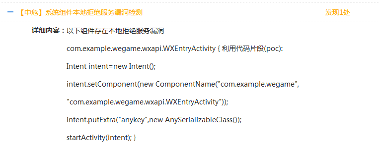
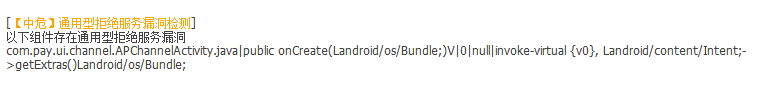
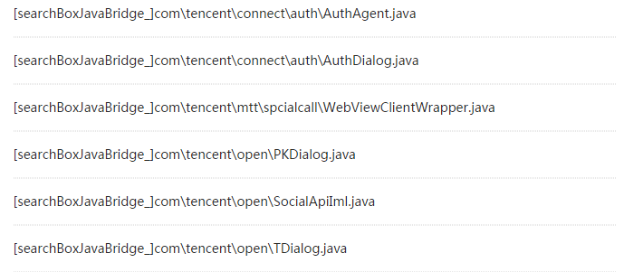
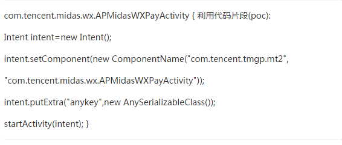
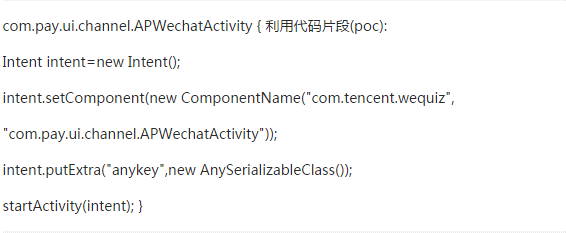
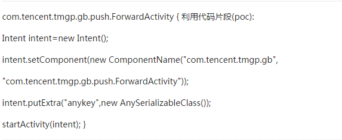
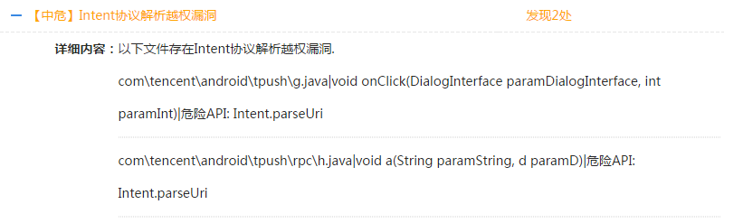

金刚审计问题
==============

## 概述

MSDK在版本发布前都会做金刚检测，确认当前版本无漏洞才会发出版本。然而随着不断有新类型的漏洞爆出，游戏接入较早的版本依然会遇到各种漏洞相关问题。MSDK团队与金刚团队交流后对于MSDK已经发布版本再次检测出的风险漏洞将在这里汇总梳理给出最终的解决方案。

## QMI 网络传输安全漏洞

####MSDK修复建议：升级MSDK到2.3.2a及以上版本

## openSDK本地拒绝服务漏洞

####MSDK修复建议：升级MSDK到2.6.0a及以上版本

## MSDK系统组件本地拒绝服务漏洞

####MSDK修复建议：非紧急漏洞，将会在MSDK2.7.0a解决

## 米大师通用型拒绝服务漏洞

####MSDK修复建议：升级Midas到1.3.9b及以上版本（对应MSDK 2.4.0a及以上）

## MSDK Web组件远程代码执行漏洞

####MSDK修复建议：升级MSDK到2.6.0a及以上版本

## Open SDK Web组件远程代码执行漏洞

####MSDK修复建议：升级MSDK到2.6.0a及以上版本

## 米大师系统组件本地拒绝服务漏洞

####MSDK修复建议：升级Midas到1.3.9.e及以上版本解决

## 信鸽拒绝服务漏洞

####MSDK修复建议：升级MSDK到2.7.0a版本

## 信鸽 Intent协议解析越权漏洞

####MSDK修复建议：已经与信鸽同事确认，尚未提供解决方案版本
