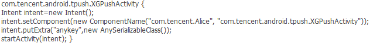

金刚审计问题
==============

## 概述

MSDK在发布版本时会做金刚检测，无漏洞才会发出版本。但后续由于金刚升级会导致已发出的版本会检测出漏洞，这里统一给出漏洞详情及修复版本。

## 漏洞修复

1、QMI漏洞：

修复版本：升级ＭＳＤＫ2.3.2a及以后版本中包含的QMI版本

2、QQ平台漏洞：

修复版本：ＭＳＤＫ2.6.0a

3、ＭＳＤＫ漏洞：

修复版本：预计在ＭＳＤＫ2.7.0a

４、米大师漏洞：

说明：米大师的漏洞，据了解1.3.9b及以后版本已修复，建议直接找米大师接入联调

5、信鸽漏洞

修复方案：

正在联系信鸽同事给解决方案

