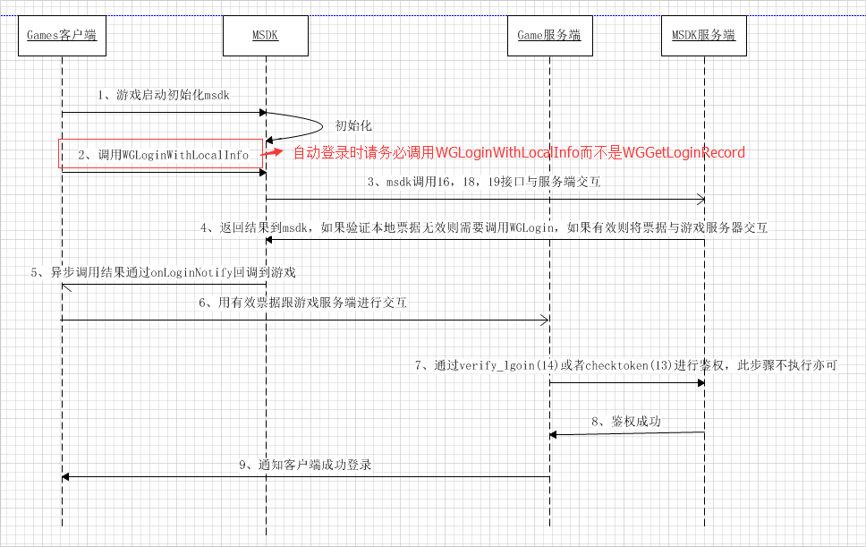
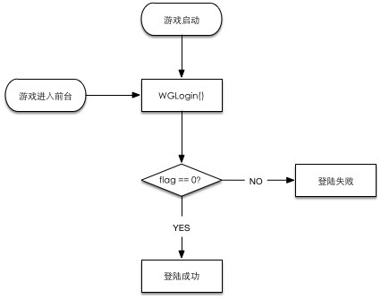
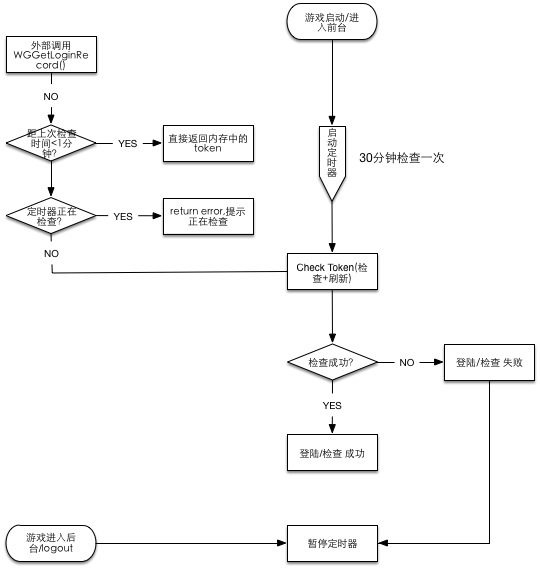

#MSDK登录模块

##概述

该模块将会对MSDK所有授权相关的模块做一次梳理，包括授权登录、自动登录、快速登录、票据刷新、读取等模块的详细说明。游戏可以先参照该模块熟悉MSDK所有授权相关的模块，然后再根据游戏自己的需求使用对应接口完成授权等功能。

## 接入登录具体工作（开发必看）

**游戏开发可以按照下面提供的步骤完成MSDK登录模块的接入，降低接入成本和遗漏的处理逻辑。强烈推荐认真了解，并且所有逻辑都要处理到！！！**

1. 设置需要用户授权的权限：
	- 游戏在MSDK初始化以后要调用手Q权限设置的接口设置需要用户授权给游戏的平台权限。具体方法[点击查看](#设置需要用户授权的权限WGSetPermission)。
- **处理授权登录**：
	1. 在登录按钮的点击事件的处理函数中调用`WGLogin`完成授权登录。具体方法[点击查看](#处理授权登录WGLogin)。
- **处理自动登录**：
	1. 在主Activity的onCreate里面MSDK初始化以后调用`WGLoginWithLocalInfo`完成游戏被拉起时的自动登录。具体方法[点击查看](#处理自动登录WGLoginWithLocalInfo)。
	- 处理唤醒后的自动登录。
		
		- MSDK 2.7.0a以前的版本，游戏需要在主Activity的onResume里面判断游戏切换到后台的时间，如果超过30分钟，自动调用`WGLoginWithLocalInfo`完成自动登录。对于如何判断游戏切换到后台的时间，游戏可以参考MSDK的demo的做法，在切换的时候记录一个时间戳，返回以后计算时间差。
	
		- MSDK 2.7.0以后版本游戏不再需要在onResume里面做特殊处理。只需要在onResume调用WGPlatform对应的OnResume即可。

- **处理用户注销**：
	- 在注销按钮的点击事件的处理函数中调用WGLogout完成授权登录。具体方法[点击查看](#处理用户注销WGLogout)
- **处理MSDK的登录回调**：
	- 在游戏对MSDK回调处理的逻辑中增加对于对onLoginNotify的处理。具体方法[点击查看](#处理MSDK的登录回调)
- **处理平台的拉起**：
	- 在游戏的主activity的onCreate和onNewIntent里调用handleCallback完成对平台拉起的处理。具体方法[点击查看](#处理平台唤起handleCallback)
- **处理MSDK的拉起回调**：
	- 在游戏对MSDK回调处理的onWakeUpNotify中增加对平台拉起的处理。具体方法[点击查看](#处理MSDK的拉起回调)
- **处理异帐号逻辑**：
	- 游戏对于异帐号的处理逻辑，具体内容参照[MSDK异帐号接入](diff-account.md#异帐号处理逻辑（开发关注）)
- **其余特殊逻辑处理**：
	- 低内存机器授权过程游戏被杀后的登录方案。具体方法[点击查看](#手Q授权在低内存机器授权过程游戏被杀后的登录方案)
	- **`MSDK微信票据过期自动刷新机制。`**具体方法[点击查看](#微信票据自动刷新)
	- 登录数据上报接口调用要求。具体方法[点击查看](#登录数据上报)
	
**`自MSDK2.7.0a以后对登录流程进行了改造，部分调用作了调整，特殊需要注意的地方罗列如下，强烈推荐认真了解！！！`**

- `特别强调：`2.7.0a以上的版本**`返回到游戏登录界面之前一定要调用 WGLogout`** 方法，清除本地票据否则会造成各种登录异常。

- **处理自动登录**：

   - 1、MSDK2.7.0a及以后，调用WGLoginWithLocalInfo()地方改为WGLogin(EPlatform.ePlatform_None)，当然目前仍旧兼容WGLoginWithLocalInfo，但后续会将该接口去掉。

   - 2、MSDK2.7.0a及以后，在游戏启动和回到前台MSDK会进行定时刷新票据，因此游戏只需要在初始化结束以后调用自动登陆接口，从后台切换到前台时由MSDK处理。具体可以查看票据自动刷新流程[点击查看](#MSDK2.7.0a及以后的票据自动刷新流程)

- **MSDK微信票据过期自动刷新机制**：

   - MSDK2.7.0a以后，在支持之前版本登录流程的基础上，优化新流程，对票据进行定时刷新，请务必将assets/msdkconfig.ini中WXTOKEN_REFRESH按如下设置WXTOKEN_REFRESH=true或者删除不填（即默认是开启的）。
   
  
- **登录数据上报接口调用要求**：
  - 请务必调用在自己的launchActivity的onRestart调用WGPlatform.onRestart,同理依次调用onResume,onPause,onStop,onDestroy。
  
- **WGGetLoginRecord调用特别说明**：
  - 自2.7.0a以后，如果'WGGetLoginRecord'返回eFlag_Checking_Token（5001）即正在检查票据，eFlag_WX_AccessTokenExpired（2007）即微信票据过期，此时调用WGLogin(EPlatform.ePlatform_None)，然后在onLoginNotify处理票据异步刷新后的结果

	
##名词解释、接口说明
	
###登录相关名词解释：
| 名称| 描述 |支持平台| 调用接口 |
|: ------------- :|
| 授权登录 | 游戏通过拉起平台的授权界面，引导用户授权游戏获得登录所需票据| 手Q/微信 | WGLogin |
| 快速登录 | 玩家的操作使平台拉起游戏时会透传登录相关的票据信息从而登录进入游戏。| 手Q| 无 |
| 自动登录 | 游戏启动的时候，直接使用用户上次登录游戏的票据信息登录进入游戏| MSDK 提供功能| WGLoginWithLocalInfo |
| 自动刷新 | MSDK提供自动刷新微信票据接口 | MSDK 提供功能 | 无 |
| 异帐号 | 当前游戏内登录的帐号和平台登录的帐号不一致 | 平台/MSDK均支持| WGSwitchUser |

### 登录相关接口概述

与登录相关的调用接口中`WGGetLoginRecord`，`WGLogout`是同步接口，其他接口都是异步实现，因此通过callback的形式将最终的结果通过OnLoginNotify（LoginRet）来回调给游戏。异帐号相关的接口单独在MSDK的异帐号模块说明。具体如下:

| 名称| 描述 |备注 |
|: ------------- :|
| WGGetLoginRecord | 获取本地保存的当前用户登录票据 |  |
| WGSetPermission | 设置游戏需要用户授权获取的平台信息 | |
| WGLogin | 拉起平台授权登录 |  |
| WGLogout | 清空当前登录帐号的登录信息 |  |
| WGLoginWithLocalInfo | 通过本地保存的登录票据尝试登录|  |
| handleCallback | 处理各个平台唤起 |  |
| WGRefreshWXToken | 通过微信refreshToken刷新获取accessToken |  从MSDK 2.0开始不建议游戏自己刷新微信票据 |

### 推荐登录流程

### 登录相关接口推荐用法

1. 授权登录：直接调用`WGLogin`拉起对应平台的授权
- 游戏启动、游戏从后台切换会前台检查票据是否有效：调用`WGLoginWithLocalInfo`完成票据有效性的验证
- 获取票据：直接调用`WGGetLoginRecord`从本地读取
- 注销登录：直接调用`WGLogout`清空当前用户的登录信息

**特别说明：**
WGGetLoginRecord只是用来获取本地票据的接口，如果从未登录需要调用WGLogin，成功后MSDK会保存票据在本地。之后再次启动游戏可采用自动登录WGLoginWithLocalinfo，自动登录逻辑建议游戏按此种方式调用，其调用时序图如下所示。

存在部分游戏在刚启动游戏时通过调用WGGetLoginRecord来判断本地票据是否有效，如果本地票据有效，直接将票据与Game服务器进行交互。`请不要如此使用！！！请使用自动登录接口WGLoginWithLocalinfo`

##设置需要用户授权的权限WGSetPermission

####概述

游戏在MSDK初始化以后要调用手Q权限设置的接口设置需要用户授权给游戏的平台权限。

####接口声明

	/**
	 * @param permissions ePermission枚举值 或 运算的结果, 表示需要的授权项目
	 * @return void
	 */
	void WGSetPermission(int permissions);

#### 接口调用：

	// 设置拉起QQ时候需要用户授权的项
	WGPlatform.WGSetPermission(WGQZonePermissions.eOPEN_ALL); 

#### 注意事项：

1. 游戏需要在MSDK初始化之后调用该接口，建议接口参数就填**`WGQZonePermissions.eOPEN_ALL`**。缺少该项会导致游戏调用部分接口时提示没有权限。

##处理授权登录WGLogin

#### 概述：

**拉起手Q/微信客户端或web页面(手Q未安装)授权，在用户授权以后通过onLoginNotify通知游戏获取到openID、accessToken、payToken、pf、pfkey等登录信息**

#### 效果展示：

####接口声明：

	/**
	 * @param platform 游戏传入的平台类型, 可能值为: ePlatform_QQ, ePlatform_Weixin
	 * @return void
	 *   通过游戏设置的全局回调的OnLoginNotify(LoginRet& loginRet)方法返回数据给游戏
	 */
	void WGLogin(ePlatform platform);

#### 接口调用：

	WGPlatform::GetInstance()->WGLogin(ePlatform_QQ); 

#### 注意事项：

- **通用**：
	- **因为微信和手Q各自的bug，会导致游戏在多个场景下收不到回调。游戏在调用WGLogin后可以开始一个倒计时, 倒计时完毕如果没有收到回调则算作超时, 让用户回到登录界面。倒计时推荐时间为30s，游戏也可以自己设置**其中收不到回调的场景包括但不限于：
		- 在微信未登录的情况下, 游戏拉起微信输入用户名密码以后登录, 可能会没有登录回调, 这是微信客户端已知BUG
		- 微信授权过程中, 点击左上角的 返回 按钮, 可能会导致没有授权回调
		- openSDK 2.7 （MSDK 2.5）以下版本通过web授权点击取消授权以后没有回调
- **手Q 相关**：
	1. 没有安装手Q的时，精品游戏可以拉起Web页面授权,请确保AndroidMenifest.xml中AuthActivity的声明中要在intent-filter中配置<data android:scheme="***" />, 详见本节手Q相关AndeoidMainfest配置处。 **海纳游戏现在不支持拉起页面授权**。可以通过WGIsPlatformInstalled接口判断是否安装手Q，未安装手Q则提示用户不能授权。
	- **偶尔收不到OnLoginNotify回调：**请确保`com.tencent.tauth.AuthActivity`和`com.tencent.connect.common.AssistActivity`在`AndroidManifest.xml`与手Q接入权限申明（[点击查看]()）一致。
	- 如果游戏的Activity为Launch Activity, 则需要在游戏Activity声明中添加android:configChanges="orientation|screenSize|keyboardHidden", 否则可能造成没有登录没有回调。

- **微信相关**：

	1. 微信授权需要保证微信版本高于4.0
	- 拉起微信时候, 微信会检查应用程序的签名和微信后台配置的签名是否匹配(此签名在申请微信appId时提交过), 如果不匹配则无法唤起已经授权过的微信客户端.
	- `WXEntryActivity.java` 位置不正确（必须在包名/wxapi 目录下）则不能收到回调.

##处理扫码登录WGQrCodeLogin

#### 概述：

**拉起登录二维码显示界面，玩家可以通过另外一个已经登录对应社交帐号的手机扫描二维码，根据提示授权后，游戏即可获得登录票据信息**
**在未安装微信情况下，可用已在其它设备上的微信帐号扫码登录游戏 （可以使用WGIsPlatformInstalled 判断微信是否安装）**

#### 效果展示：

参见demo

####接口声明：

	/**
	 * @param platform 游戏传入的平台类型, 可能值为: ePlatform_QQ, ePlatform_Weixin
	 * @return void
	 *   通过游戏设置的全局回调的OnLoginNotify(LoginRet& loginRet)方法返回数据给游戏
	 */
	void WGQrCodeLogin(ePlatform platform);

#### 接口调用：

	WGPlatform::GetInstance()->WGQrCodeLogin(ePlatform_Weixin); 

#### 注意事项：

- **目前只支持微信扫码登录**
- **需要在AndroidManifest文件中声明WXQrCodeActivity**

        <activity
        android:name="com.tencent.msdk.weixin.qrcode.WXQrCodeActivity"
        android:excludeFromRecents="true"
        android:exported="true"
        android:label="WXQrCodeActivity"
        android:launchMode="singleTop"
        android:taskAffinity="com.example.wegame.diff" 
        android:configChanges="orientation|screenSize|keyboardHidden"
        android:theme="@android:style/Theme.Light.NoTitleBar"
        android:screenOrientation="portrait">
        </activity>
- **关于扫码登录权限：非精品的游戏统一由游戏邮件向微信申请，精品的游戏由协同统一接入处理
- **拉取到的二维码图片有效期5分钟，过期扫码无法登录成功

##处理自动登录WGLoginWithLocalInfo

#### 概述：

此接口用于已经登录过的游戏, 在用户再次进入游戏时使用, 游戏启动时先调用此接口, 此接口会尝试到后台验证票据并通过OnLoginNotify将结果回调给游戏。

####接口声明：

	/**
	  *  @since 2.0.0
	  *  此接口用于已经登录过的游戏, 在用户再次进入游戏时使用, 游戏启动时先调用此接口, 此接口会尝试到后台验证票据
	   *  此接口会通过OnLoginNotify将结果回调给游戏, 本接口会返回flag, eFlag_Local_Invalid和eFlag_Succ,及eFlag_WX_RefreshTokenSucc。
	  *  如果本地没有票据或者本地票据验证失败返回的flag为eFlag_Local_Invalid, 游戏接到此flag则引导用户到授权页面授权即可.
	  *  如果本地有票据并且验证成功, 则flag为eFlag_Succ, 游戏接到此flag则可以直接使用sdk提供的票据, 无需再次验证.
	  *  @return void
	  *   Callback: 验证结果通过我OnLoginNotify返回
	  */
 	void WGLoginWithLocalInfo();

####注意事项：

1. 游戏在使用`WGLoginWithLocalInfo`登录以后，获得的票据在无需传到游戏后台去验证有效性，MSDK会验证以后才回调给游戏
2. **自2.7.0a后调用WGLoginWithLocalInfo()地方改为WGLogin(EPlatform.ePlatform_None)，当然目前仍旧兼容WGLoginWithLocalInfo，但后续会将该接口去掉**。

##处理用户注销WGLogout

#### 概述：

调用该接口可以清空当前登录帐号的登录信息。

####接口声明：

	/**
	 * @return bool 返回值已弃用, 全都返回true
	 */
	bool WGLogout();

####调用示例：

    WGPlatform.WGLogout();

####注意事项：

1. 游戏**点击注销按钮或者其余弹出登录框的逻辑中都必须要调用WGLogout来清空本地的登录信息**。否则会导致授权失败等问题

##处理MSDK的登录回调

#### 概述：

MSDK的登录回调来自以下几个场景：

- WGLogin授权回来
- WGLoginWithLocalInfo登录回来
- 处理平台拉起以后（如果是带票据拉起）

#### 具体处理：

	OnLoginNotify(LoginRet ret) {
        Logger.d("called");
        switch (ret.flag) {
            case CallbackFlag.eFlag_Succ:
				 CallbackFlag.eFlag_WX_RefreshTokenSucc
            	//授权成功的处理逻辑
				break;
            case CallbackFlag.eFlag_WX_UserCancel:
				 CallbackFlag.eFlag_QQ_UserCancel
				//用户取消授权逻辑
				break;
			case CallbackFlag.eFlag_WX_UserDeny
				//用户拒绝微信授权逻辑
				break;
            case CallbackFlag.eFlag_WX_NotInstall:
				//玩家设备未安装微信客户端逻辑
				break;
			case CallbackFlag.eFlag_QQ_NotInstall:
				//玩家设备未安装QQ客户端逻辑
				break;
            case CallbackFlag.eFlag_WX_NotSupportApi:
				//玩家微信客户端不支持此接口逻辑
				break;
            case CallbackFlag.eFlag_QQ_NotSupportApi:
				//玩家手Q客户端不支持此接口逻辑
				break;
            case CallbackFlag.eFlag_NotInWhiteList
				//玩家账号不在白名单中逻辑
				break;
            default:
                // 其余登录失败逻辑
                break;
        }
    }

#### 注意事项：
**这里仅仅处理了重要的loginNotify的逻辑，完整的回调flag信息请点击查看[回调标识eFlag](const.md#回调标识eFlag)，游戏可以根据自己需要处理**

##处理平台唤起handleCallback

#### 概述：

平台唤起是指通过平台或渠道（手Q/微信/游戏大厅/应用宝等）启动游戏。平台在有些场景下会带票据拉起游戏实现游戏的直接登录。因此游戏需要处理平台的拉起。

#### 具体处理：
游戏需要在自己的`launchActivity`的`onCreat()`和`onNewIntent()`中调用handleCallback，否则会造成登录无回调等问题。

- **onCreate**:

        if (WGPlatform.wakeUpFromHall(this.getIntent())) {
        	// 拉起平台为大厅 
        	Logger.d("LoginPlatform is Hall");
        } else {  
        	// 拉起平台不是大厅
            Logger.d("LoginPlatform is not Hall");
            WGPlatform.handleCallback(this.getIntent());
        }

- **onNewIntent**

		if (WGPlatform.wakeUpFromHall(intent)) {
            Logger.d("LoginPlatform is Hall");
        } else {
            Logger.d("LoginPlatform is not Hall");
            WGPlatform.handleCallback(intent);
        }
#### 注意事项：

- 对于游戏大厅的拉起，需要预先在大厅增加对应的配置才能支持，因此如果游戏不接入大厅，需要调用`WGPlatform.wakeUpFromHall`来判断本次拉起是否来自大厅，如果是则不调用handleCallback。对于大厅如何支持带票据拉起可以[点击查看](qqgame.md)

##处理MSDK的拉起回调

#### 概述

游戏对于平台拉起的处理，主要是处理异帐号相关的逻辑。具体的处理如下

#### 具体处理：

        if (CallbackFlag.eFlag_Succ == ret.flag
                || CallbackFlag.eFlag_AccountRefresh == ret.flag) {
            //代表拉起以后通过本地帐号登录游戏，处理逻辑与onLoginNotify的一致
            
        } else if (CallbackFlag.eFlag_UrlLogin == ret.flag) {
            // MSDK会尝试去用拉起账号携带票据验证登录，结果在OnLoginNotify中回调，游戏此时等待onLoginNotify的回调

        } else if (ret.flag == CallbackFlag.eFlag_NeedSelectAccount) {
            // 当前游戏存在异账号，游戏需要弹出提示框让用户选择需要登录的账号

        } else if (ret.flag == CallbackFlag.eFlag_NeedLogin) {
            // 没有有效的票据，无法登录游戏，此时游戏调用WGLogout登出游戏让用户重新登录

        } else {
            //默认的处理逻辑建议游戏调用WGLogout登出游戏让用户重新登录
        }

##处理异帐号逻辑

异帐号相关的模块可以参照[MSDK异帐号接入](diff-account.md#异帐号处理逻辑（开发关注）)

##其余特殊逻辑处理

### 手Q授权在低内存机器授权过程游戏被杀后的登录方案

由于目前大部分游戏占用内存很大，因此在授权过程中，当拉起手Q授权时，会触发android的内存回收机制将后台的游戏进程杀掉导致游戏手Q授权没有没有进入游戏。游戏需要在主Activity中增加以下代码来保证被杀以后依然可以带票据拉起进入游戏。

	// TODO GAME 在onActivityResult中需要调用WGPlatform.onActivityResult
    @Override
	protected void onActivityResult(int requestCode, int resultCode, Intent data) {
		super.onActivityResult(requestCode, resultCode, data);
		WGPlatform.onActivityResult(requestCode, resultCode, data);
		Logger.d("onActivityResult");
	}

**注意：此接口在2.5.0a及以上版本才添加，之前的版本请不要调用。**

### 登录数据上报

为了保证登录数据上报正确, 游戏接入时候必须在在自己的`launchActivity`的`onResume`中调用`WGPlatform.onResume`, `onPause`中调用`WGPlatform.onPause`,`onRestart`可调用`WGPlatform.onRestart`,`onStop`中调用`WGPlatform.onStop`,	`onDestroy`中调用`WGPlatform.onDestroy`

## 微信票据自动刷新

1. MSDK2.0.0版本开始, 会再游戏运行期间定时验证并刷新微信票据, 如果需要刷新,MSDK会自动刷新完成(时间间隔为30分钟), 并通过OnLoginNotify通知游戏, flag为eFlag_WX_RefreshTokenSucc和eFlag_WX_RefreshTokenFail（已经包含在onLoginNotify的回调中）。
- `游戏接到新的票据以后需要同步更新游戏客户端保存的票据和服务器的票据, 以保证之后能使用新票据完成后续流程。`
- **在MSDK2.7.0a以前，如果游戏不需要微信票据自动刷新功能，在`assets\msdkconfig.ini`中，将`WXTOKEN_REFRESH`设为`false`即可。此时游戏需要自行处理微信票据过期的逻辑。具体可以参考：**[微信票据刷新接口](login.md#微信票据刷新：WGRefreshWXToken)
- **MSDK2.7.0a以后，在支持之前版本登录流程的基础上，优化新流程，对票据进行定时刷新，请务必将assets/msdkconfig.ini中WXTOKEN_REFRESH按如下设置WXTOKEN_REFRESH=true或者删除不填（即默认是开启的）。**

## 微信票据刷新：WGRefreshWXToken

#### 概述：

- 微信accessToken只有两个小时的有效期，refreshToken的有效期为30天。只要refreshToken不过期就可以通过refreshToken刷新accessToken。刷新后会得到新的accessToken和refreshToken。如果游戏没有使用MSDK提供的票据自动刷新接口，需要使用WGRefreshWXToken()接口来进行accessToken续期。
- 当游戏调用`WGGetLoginRecord`收到的flag为`eFlag_WX_AccessTokenExpired`时调用此接口刷新微信票据。刷新结果通过`OnLoginNotify`回调给游戏。`eFlag_WX_RefreshTokenSucc` 刷新token成功。`eFlag_WX_RefreshTokenFail` 刷新token失败。

####接口声明：

	/**
	 * 此接口用于刷新微信的accessToken
	 * refreshToken的用途就是刷新accessToken, 只要refreshToken不过期就可以通过refreshToken刷新accessToken。
	 * 有两种情况需要刷新accessToken,
	 * @return void
	 *   通过游戏设置的全局回调的OnLoginNotify(LoginRet& loginRet)方法返回数据给游戏
	 *     因为只有微信平台有refreshToken, loginRet.platform的值只会是ePlatform_Weixin
	 *     loginRet.flag值表示返回状态, 可能值(eFlag枚举)如下：
	 *       eFlag_WX_RefreshTokenSucc: 刷新票据成功, 游戏接收到此flag以后直接读取LoginRet结构体中的票据进行游戏授权流程.
	 *       eFlag_WX_RefreshTokenFail: WGRefreshWXToken调用过程中网络出错, 刷新失败, 游戏自己决定是否需要重试 WGRefreshWXToken
	 */
	void WGRefreshWXToken();

####调用示例：

	WGPlatform::GetInstance()->WGRefreshWXToken()

#### 注意事项：

1. 每个refreshToken只能用一次，刷新时会获得新的refresh。

##读取本地票据：WGGetLoginRecord

#### 概述：

调用该接口可以获取到当前的帐号登录信息。

####接口声明：

	/**
	 * @param loginRet 返回的记录
	 * @return 返回值为平台id, 类型为ePlatform, 返回ePlatform_None表示没有登录记录
	 *   loginRet.platform(类型为ePlatform)表示平台id, 可能值为ePlatform_QQ, ePlatform_Weixin, ePlatform_None.
	 *   loginRet.flag(类型为eFlag)表示当前本地票据的状态, 可能值及说明如下:
	 *     eFlag_Succ: 授权票据有效
	 *     eFlag_QQ_AccessTokenExpired: 手Q accessToken已经过期, 显示授权界面, 引导用户重新授权
	 *     eFlag_WX_AccessTokenExpired: 微信accessToken票据过期，需要调用WGRefreshWXToken刷新
	 *     eFlag_WX_RefreshTokenExpired: 微信refreshToken, 显示授权界面, 引导用户重新授权
	 *   ret.token是一个Vector<TokenRet>, 其中存放的TokenRet有type和value, 通过遍历Vector判断type来读取需要的票据. 
     *
	 */
	int WGGetLoginRecord(LoginRet& loginRet);

####调用示例：

	    LoginRet lr = new LoginRet();
        WGPlatform.WGGetLoginRecord(lr);
	    if(lr.flag == CallbackFlag.eFlag_Succ) {
	        // 获取票据
	    } 
	    // TODO Game 自MSDK2.7.0a后，需要对eFlag_Checking_Token和eFlag_WX_AccessTokenExpired按如下方式调用
	    else if(lr.flag == CallbackFlag.eFlag_Checking_Token || lr.flag == CallbackFlag.eFlag_WX_AccessTokenExpired) {
	        // eFlag_Checking_Token（5001）正在检查票据，eFlag_WX_AccessTokenExpired（2007）微信票据过期，再检查并刷新一次
            WGPlatform.WGLogin(EPlatform.ePlatform_None);
        } else {
            // 登录态失效，引导用户重新登录授权
        }

如果获取的LoginRet中的flag为eFlag_Succ则可认为登录有效，可读取有效的票据信息。**自MSDK2.7.0a后，如果'WGGetLoginRecord'返回5001和2007，此时调用WGLogin(EPlatform.ePlatform_None)，然后在onLoginNotify处理票据异步刷新后的结果。** 其中token可以按如下方式获取：

微信平台：

    std::string accessToken = "";
    std::string refreshToken = "";
    for (int i = 0; i < loginRet.token.size(); i++) {
             if (loginRet.token.at(i).type == eToken_WX_Access) {
                 accessToken.assign(loginRet.token.at(i).value);
             } else if (loginRet.token.at(i).type == eToken_WX_Refresh) {
                 refreshToken.assign(loginRet.token.at(i).value);
             }
    }

QQ平台：

    std::string accessToken = "";
    std::string payToken = "";
    for (int i = 0; i < loginRet.token.size(); i++) {
        if (loginRet.token.at(i).type == eToken_QQ_Access) {
            accessToken.assign(loginRet.token.at(i).value);
        } else if (loginRet.token.at(i).type == eToken_QQ_Pay) {
            payToken.assign(loginRet.token.at(i).value);
        }
    }

#### 注意事项：

无

##MSDK2.7.0a及以后的票据自动刷新流程
**概述**

MSDK2.7.0a以后，在支持之前版本登录流程的基础上，优化新流程，对票据进行定时刷新，请务必将msdkconfig.ini中WXTOKEN_REFRESH按如下设置`WXTOKEN_REFRESH=true`或者不设置（即默认是开启的），具体可咨询msdk连线。游戏只需要关注'WGLogin'即可完成登录和票据处理：

* 游戏需要登录票据时的调用逻辑：
  

  `如果'WGGetLoginRecord'返回5001和2007，此时调用WGLogin(EPlatform.ePlatform_None)，然后在onLoginNotify处理票据异步刷新后的结果`

* 在需要使用本地票据登录时，不再需要调用'WGLoginWithLocalInfo'，改为调用WGLogin(EPlatform.ePlatform_None) ,然后等待onLoginNotify的结果。
* MSDK内部的票据定时刷新逻辑：
  
  

## 登录常见问题

1. `未装手Q时用webQQ登录一直提示"网络异常"，在webQQ登录页面(或提示下载手Q页面)返回游戏时Crash。`
如果游戏是用Unity直接打出Apk包，出现此问题，需要把MSDK的jar包中的assets中的内容解压放入Android/assets中。如果使用其他方式打包，需要注意打包脚本中适当处理MSDK的jar包中的so文件和资源文件，如果还有问题可尝试把MSDK的jar包中的assets中的内容解压放入游戏工程中的assets目录。