MSDK(Android) for Unity3D 接入
===

## 概述

MSDK的Unity3D版本是使用Unity3D引擎对MSDK的接口的C#封装。使用此版本游戏可直接在C#层调用MSDK的接口，减少手机平台相关的操作。

MSDK(Android)的Unity发布包(zip)主要包含`MSDKUnityLibrary`、`MSDKUnitySample`及`MSDK_Android_Unity_xxx.unityPackage`。其中`MSDKUnitySample`是调用MSDK的C#接口的Unity3D示例工程，可参考`Assets\MsdkDemo.cs`了解MSDK接口的调用。`MSDKUnityLibrary`是封装了MSDK接口的Eclipse安卓库工程，游戏需要使用此工程的源代码，并做相应的修改，然后打成jar供Unity3D工程使用。
`MSDK_Android_Unity_xxx.unityPackage`是此版本的unity资源包，游戏导入此包即可接入安卓MSDK。

**注意：**
使用 MSDKUnitySample 工程导出APK时请使用`./Assets/Plugins/Android`目录下的`debug.keystore`签名(密码是android)，否则无法拉起微信授权。导出游戏工程的APK时请使用游戏自己的keystore。

## 接入配置

### Step1:引入MSDK

在Unity3D的IDE中打开游戏工程，双击`MSDK_Android_Unity_xxx.unityPackage`（请确保完整路径下没有中文，否则可能导入出错），选择需要的文件导入，如下图：

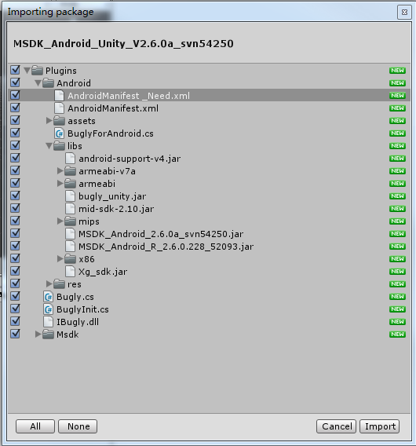

**注意：**

1. 如果游戏工程中已有Android项目，则不导入`AndroidManifest.xml`，之后再将`AndroidManifest_Need.xml`中的内容合并到游戏**Plugins/Android**目录下的 AndroidManifest.xml 中。
2. 如果游戏并非用Unity导出Apk包，而是用Eclipse等类似环境出包，则需要去掉assets中的部分资源文件只保留`adconfig.ini, channel.ini, msdkconfig.ini`这几个文件。

### Step2:MSDK C#层初始化

应在游戏刚开始时调用MSDK C#层初始化接口，如下：

```
void Start () {
    Debug.Log("Start()");
    //TODO GAME 初始化MSDK的C#层
    WGPlatform.Instance.Init ();
    ...
}
```

**注意：**
如果使用 Unity4.6.1 打出APK，会存在 native crash 无法上报的bug！需要使用非4.6.1的 Unity 版本(低于或高于此版本)打出Apk包。

### Step3:修改BuildSettings及AndroidManifest

#### 3.1修改BuildSettings

在Unity的IDE中，依次点击**File -> Build Settings**, 如图选择Android平台点**Player Settings**，在Inspector面板中设置游戏包名，版本号，屏幕方向等属性。

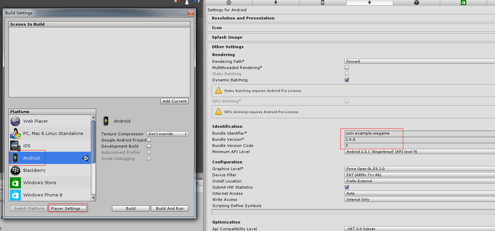

#### 3.2修改AndroidManifest

每个游戏都需要个性化修改**Plugins/Android**目录下的 AndroidManifest.xml ，包括包名，appid，屏幕方向等。


修改**package**为游戏包名，及 versionCode，versionName。
```
<manifest
    xmlns:android="http://schemas.android.com/apk/res/android"
    package="com.example.wegame"
    android:theme="@android:style/Theme.NoTitleBar"
    android:versionCode="3"
    android:versionName="2.6.0"> 
    ......
```

修改 label 的值为游戏名称，屏幕方向 screenOrientation 应与**Player Settings**中的屏幕方向**Defalult Orientation**保持一致，将游戏图标放到**Plugins/Android/res/**目录下的**drawable**或**drawable-xxx**文件夹下并在`android:icon`中填入游戏图标名称。
```
<application
    android:icon="@drawable/游戏图标"
    android:label="游戏名称"
    android:theme="@style/AppTheme" >

    <activity
        android:name="com.tencent.msdk.u3d.U3DActivity"
        android:configChanges="orientation|keyboardHidden|screenLayout|screenSize"
        android:launchMode="singleTop"
        android:screenOrientation="landscape"
        android:label="游戏名称">
        <intent-filter>
            <action android:name="android.intent.action.MAIN" />
            <category android:name="android.intent.category.LAUNCHER" />
        </intent-filter>
    </activity>
    ......
</application>
```

修改`android:scheme`中的值为游戏的微信appid。
```
<!-- TODO SDK接入 微信接入配置 START -->
<activity
    android:name=".wxapi.WXEntryActivity"
    android:excludeFromRecents="true"
    android:exported="true"
    android:label="WXEntryActivity"
    android:launchMode="singleTop"
    android:taskAffinity="com.example.wegame.diff" >
    <intent-filter>
        <action android:name="android.intent.action.VIEW" />
        <category android:name="android.intent.category.DEFAULT" />
        <data android:scheme="wxcde873f99466f74a" />
    </intent-filter>
</activity>
<!-- TODO SDK接入 微信接入配置 END -->
```

修改`android:scheme`中的值为"tencent+游戏手Qappid"
```
<!-- TODO SDK接入 QQ接入配置 START -->
<activity
    android:name="com.tencent.tauth.AuthActivity"
    android:launchMode="singleTask"
    android:noHistory="true" >
    <intent-filter>
        <action android:name="android.intent.action.VIEW" />
        <category android:name="android.intent.category.DEFAULT" />
        <category android:name="android.intent.category.BROWSABLE" />
        <data android:scheme="tencent100703379" />
    </intent-filter>
</activity>
......
<!-- TODO SDK接入 QQ接入配置 END -->
```

#### 3.3导出游戏Android工程并导入Eclipse

在Unity的IDE中，依次点击**File -> Build Settings**，勾选**Google Android Project**，并点击**Export**，如下图示。


打开Eclipse IDE，依次选择**File -> Import**。


在Import面板选择**Existing Android Code Into Workspace**，点击**Next**，再选择上面导出的游戏Android工程文件夹，点**Finish**游戏的Android工程即可导入Eclipse，其结构如下图，src文件夹中游戏的包名下应包含图中标出的java代码。

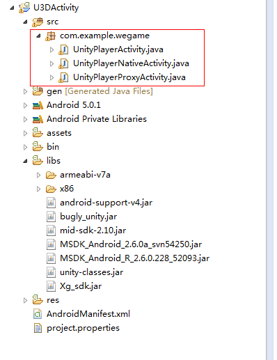

**注意：**
接入各模块功能时请阅读wiki中对应的接入配置部分，并检查 AndroidManifest.xml 的配置是否有误。

### Step4:在Eclipse中引入并修改封装MSDK代码

在`MSDKUnityLibrary/src`目录中，**com.example.wegame.wxapi**中包含微信登录需要的**WXEntryActivity.java**；**com.tencent.msdk.u3d**包下包含对安卓MSDK封装代码；**com.example.wegame**包下为供游戏参考的 MSDKUnity示例工程中安卓部分示例代码。

#### 4.1拷贝封装的java源码

在`MSDKUnityLibrary/src`目录中，将`com/example/wegame/wxapi/WXEntryActivity.java`拷贝到游戏Android工程src目录下`用包名+wxapi`位置；`com/tencent/msdk/u3d` 保持目录结构不变，拷贝到游戏Android工程src目录下。此时游戏Android工程应类似如下

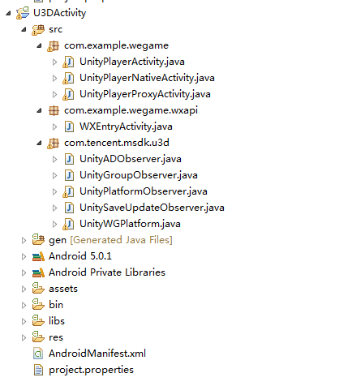

#### 4.2修改源码

因部分信息无法得知，需要手动修改部分封装源码。

打开WXEntryActivity.java将 package 处的包名修改为游戏包名：

```
package com.example.wegame.wxapi;
>>>
package 游戏包名.wxapi;
```

参考`MSDKUnityLibrary/src/com/example/wegame/U3DActivity.java`新建个游戏安卓工程的主Activity，或直接拷贝到游戏包名目录下。

打开类似U3DActivity的游戏主Activity，在onCreate里面填写游戏的qqAppId，wxAppId等初始化信息：

```
protected void onCreate(Bundle savedInstanceState) {
    super.onCreate(savedInstanceState);
    ......
    // TODO GAME 初始化MSDK
    /***********************************************************
     *  TODO GAME 接入必须要看， baseInfo值因游戏而异，填写请注意以下说明:      
     *  	baseInfo值游戏填写错误将导致 QQ、微信的分享，登录失败 ，切记 ！！！     
     * 		只接单一平台的游戏请勿随意填写其余平台的信息，否则会导致公告获取失败  
     *      offerId 为必填，一般为手QAppId
     ***********************************************************/

    MsdkBaseInfo baseInfo = new MsdkBaseInfo();
    baseInfo.qqAppId = "100703379";
    baseInfo.qqAppKey = "4578e54fb3a1bd18e0681bc1c734514e";
    baseInfo.wxAppId = "wxcde873f99466f74a";
    baseInfo.msdkKey = "5d1467a4d2866771c3b289965db335f4";
    //订阅型测试用offerId
    baseInfo.offerId = "100703379"; 
    // TODO GAME 自2.7.1a开始游戏可在初始化msdk时动态设置版本号，灯塔和bugly的版本号由msdk统一设置
    // 1、版本号组成 = versionName + versionCode
    // 2、游戏如果不赋值给appVersionName（或者填为""）和appVersionCode(或者填为-1)，
    // msdk默认读取AndroidManifest.xml中android:versionCode="51"及android:versionName="2.7.1"
    // 3、游戏如果在此传入了appVersionName（非空）和appVersionCode（正整数）如下，则灯塔和bugly上获取的版本号为2.7.1.271
    baseInfo.appVersionName = "2.8.1";
    baseInfo.appVersionCode = 281;
    ......
}
```

初始化代码处，设置回调到U3D需要绑定的 **GameObject** 即C#层绑定回调代码的场景名称。如，示例工程中 MSDKDemo.cs 脚本调用了回调方法(OnLoginNotify等)，它绑定的 GameObject 名称为 "Msdk"，则设置为：

```
// TODO GAME 此处填写游戏需要回调的脚本绑定的GameObject的名称
String ObserverGameObject = "Msdk";
// 全局回调类
WGPlatform.WGSetObserver(new UnityPlatformObserver(ObserverGameObject));   
// 应用宝更新回调类
WGPlatform.WGSetSaveUpdateObserver(new UnitySaveUpdateObserver(ObserverGameObject));
// 广告的回调设置
WGPlatform.WGSetADObserver(new UnityADObserver(ObserverGameObject));
//QQ 加群加好友回调
WGPlatform.WGSetGroupObserver(new UnityGroupObserver(ObserverGameObject));
```

#### 4.3加入去重代码

在Android系统中游戏与其他APP(如手Q，应用宝)交互时可能会产生多个游戏实例，导致行为异常。因此需要修改游戏包名下的UnityPlayerNativeActivity.java，加入去除重复实例的机制。在onCreat中的super.onCreate()后加入示例代码：

```
@Override
protected void onCreate (Bundle savedInstanceState)
{
	requestWindowFeature(Window.FEATURE_NO_TITLE);
	super.onCreate(savedInstanceState);

	// TODO 检测游戏自身是否重复,避免重复拉起游戏实例的问题
    if (WGPlatform.IsDifferentActivity(this)) {
        Logger.d("Warning!Reduplicate UnityPlayerNativeActivity was detected.");
        return;
    }
	......
}
```

为了避免去重时把游戏杀掉，修改onDestroy为：

```
@Override
protected void onDestroy ()
{
    if (mUnityPlayer != null ) {
        Logger.d("Quit Unity");
        mUnityPlayer.quit();
    }
	super.onDestroy();
}
```

### Step5:导出游戏Apk包

导出游戏Apk包有两种方式，一种是在Unity的IDE中直接导出Apk包，另一种是直接用Eclipse或类似的安卓环境导出Apk包。接下来需要根据游戏的出包方式选择不同的操作。

#### 5.1在Unity中导出Apk包

要在Unity中导出Apk包，需要将前面步骤中修改得的源码导成jar包并放入游戏Unity工程的**Plugins/Android/libs**下。

在Eclipse中选中游戏Android工程的 src ，并export成jar包。步骤如下：

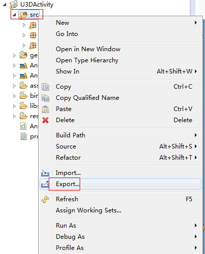

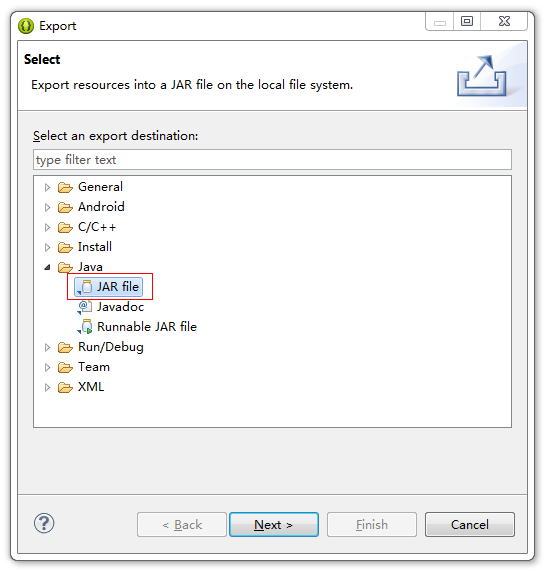

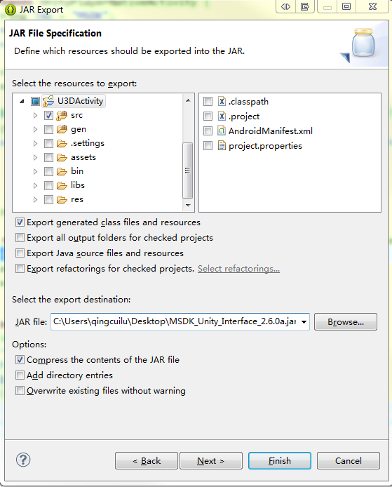

还需要将自动生成的R文件打成jar包，同样放入游戏Unity工程的**Plugins/Android/libs**下。如果不这样做可能会导致应用宝抢号时崩溃。
单击游戏工程，再依次点击 **Project -> Build Project**。此时工程的**gen**目录下应生成了 `R.java` 文件。如下导出为jar包。

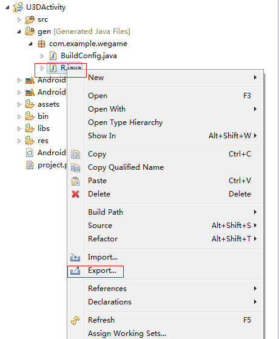

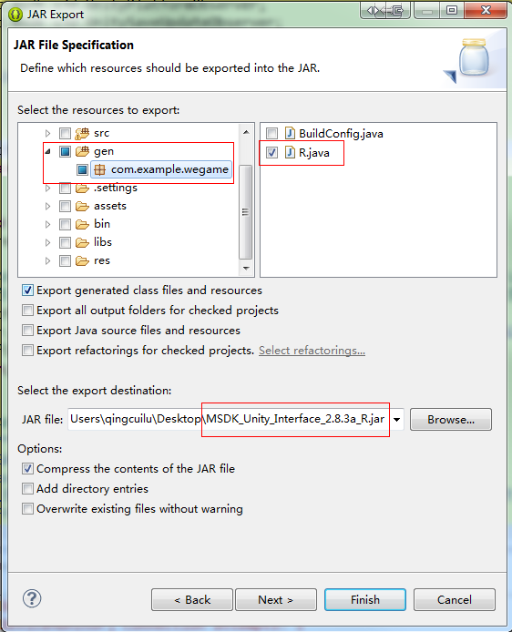


将此处生成的jar包放入游戏Unity工程的**Plugins/Android/libs**下，在**Player Settings**中配置好keystore等相关项即可在**Build Settings**中导出Apk包。

#### 5.2在Eclipse中导出Apk包

如果游戏并非用Unity导出Apk包，而是用Eclipse等类似环境出包，则需要去掉assets中的部分资源文件只保留`adconfig.ini, channel.ini, msdkconfig.ini`这几个文件。

删除了多余项后可直接用此工程在Eclipse中导出Apk包。

## 接口调用

在Unity3D中，与MSDK有关的部分放在Assets/Plugins/Msdk 文件夹下：

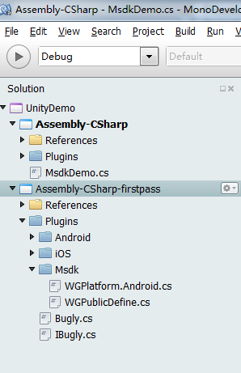

其中，MSDK API都封装在WGPlatform类，其中对接口的详细的注释，其中接口是wiki的上的接口是一致的，可参考wiki来调用。在"MSDKUnitySample"中`MsdkDemo.cs`是对MSDK的C#接口的调用示例，游戏可参考此类时行C#接口调用。


### 登录及回调

以QQ登陆为例，演示如何调用MSDK api与处理回调：

    // Msdk的命名空间
    using Msdk;
    // WGPlatform类采用单例设计
    WGPlatform.Instance.WGLoginQQ();      // 登陆QQ
    
接下来处理登陆回调（在MsdkDemo里，该登陆回调方法命名为OnLoginNotify)

    /// <summary>
    ///  登陆回调
    /// </summary>
    /// <param name="jsonRet">Json ret.</param>
    void OnLoginNotify(string jsonRet)
    {       
        LoginRet ret = new LoginRet();
       // java端传递过来的是一个json串的消息，需要先解析
       // 解析成功返回true并会将LoginRet各属性赋值
        bool succ = ret.ParseJson (jsonRet);
        if (succ == false) {
            loginState = "登陆失败";
            return;
        }
        /*
         *  loginRet.platform表示当前的授权平台, 值类型为ePlatform, 可能值为ePlatform_QQ, ePlatform_Weixin
         *     loginRet.flag值表示返回状态, 可能值(eFlag枚举)如下：
         *       eFlag_Succ: 返回成功, 游戏接收到此flag以后直接读取LoginRet结构体中的票据进行游戏授权流程.
         *       eFlag_QQ_NoAcessToken: 手Q授权失败, 游戏接收到此flag以后引导用户去重新授权(重试)即可.
         *       eFlag_QQ_UserCancel: 用户在授权过程中
         *       eFlag_QQ_LoginFail: 手Q授权失败, 游戏接收到此flag以后引导用户去重新授权(重试)即可.
         *       eFlag_QQ_NetworkErr: 手Q授权过程中出现网络错误, 游戏接收到此flag以后引导用户去重新授权(重试)即可.
         *     loginRet.token是一个List<TokenRet>, 其中存放的TokenRet有type和value, 通过遍历Vector判断type来读取需要的票据. type(TokenType)类型定义如下:
         *       eToken_QQ_Access,
         *       eToken_QQ_Pay,
         *       eToken_WX_Access,
         *       eToken_WX_Refresh
         */
        switch (ret.flag)
        {
            case CallbackFlag.eFlag_Succ:               
                // 登陆成功, 可以读取各种票据               
                int platform= ret.platform;
                if(EPlatform.ePlatform_Weixin == platform)
                {
                    loginState = "微信登陆成功";
                }else if(EPlatform.ePlatform_QQ == platform)
                {
                    loginState = "QQ登陆成功";
                }else if(EPlatform.ePlatform_QQHall == platform)
                {
                    loginState = "大厅登陆成功";
                }
                message = ret.ToString();
                break;
            case CallbackFlag.eFlag_WX_UserCancel:
                loginState = "登陆失败";
                message = ret.desc;
                break;
            case CallbackFlag.eFlag_WX_NotInstall:
                loginState = "登陆失败";
                message = ret.desc;
                break;
            case CallbackFlag.eFlag_WX_NotSupportApi:
                loginState = "登陆失败";
                message = ret.desc;
                break;
            case CallbackFlag.eFlag_WX_LoginFail:
                loginState = "登陆失败";
                message = ret.desc;
                break;
            case CallbackFlag.eFlag_Local_Invalid:
                // 自动登录失败, 需要重新授权, 包含本地票据过期, 刷新失败登所有错误
                loginState = "自动登陆失败";
                message = ret.desc;
                break;
            default:
                    break;
        }
    }

## MSDKUnitySample工程使用说明

点击**MSDKUnitySample\Assets\msdk.unity**可打开MSDKUnitySample工程，需要作以下修改即可打包Sample的Apk包。

1. MSDKUnitySample工程中只包含Assets资源，如果场景绑定有问题，需要手动将 **MsdkDemo.cs** 脚本绑定到 **msdk.unity** 中。
1. 在 Player Settings 面板的Android设置的 Other Settings 中修改包名、版本号，如图示：
    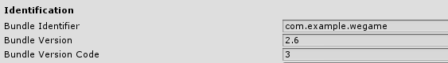
1. 在 Player Settings 面板的Android设置的 Publishing Settings 中设置签名文件 keystore，选择 `MSDKUnitySample/Assets/Plugins/Android`目录下的 debug.keystore，Alias为 androiddebugkey，Password 都为 android。如下图示：
	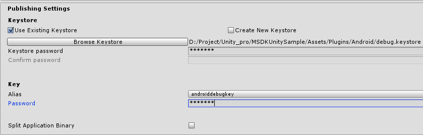

在"MSDKUnitySample"中`MsdkDemo.cs`是对MSDK的C#接口的调用示例，游戏可参考此类时行C#接口调用。
 