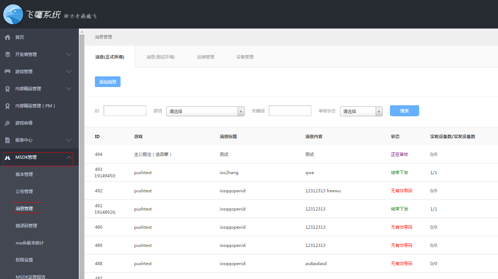

接入SDK推送功能
======
从MSDK2.2a开始接入了信鸽推送模块，推送功能可以实现在游戏未运行的情况下给用户手机推送游戏相关的信息。
接入配置
------
第一步：配置项设置

assets/msdkconfig.ini中配置打开消息推送开关：

    PUSH=true //为true时会开启消息推送

第二步: 配置AndroidManifest.xml

在MSDK2.6.0a(含)及之前版本请按如下设置。

    <!-- 【必须】 信鸽SDK所需权限 -->
    <uses-permission android:name="android.permission.INTERNET" />
    <uses-permission android:name="android.permission.READ_PHONE_STATE" />
    <uses-permission android:name="android.permission.ACCESS_WIFI_STATE" />
    <uses-permission android:name="android.permission.ACCESS_NETWORK_STATE" />
    <uses-permission android:name="android.permission.RECEIVE_BOOT_COMPLETED" />
    <uses-permission android:name="android.permission.RESTART_PACKAGES" />
    <uses-permission android:name="android.permission.BROADCAST_STICKY" />
    <uses-permission android:name="android.permission.WRITE_SETTINGS" />
    <uses-permission android:name="android.permission.RECEIVE_USER_PRESENT" />
    <uses-permission android:name="android.permission.WRITE_EXTERNAL_STORAGE" />
    <uses-permission android:name="android.permission.WAKE_LOCK" />
    <uses-permission android:name="android.permission.KILL_BACKGROUND_PROCESSES" />
    <uses-permission android:name="android.permission.GET_TASKS" />
    <uses-permission android:name="android.permission.READ_LOGS" />
    <uses-permission android:name="android.permission.VIBRATE" />
    <!-- 【可选】 信鸽SDK所需权限 -->
    <uses-permission android:name="android.permission.BLUETOOTH" />
    <uses-permission android:name="android.permission.BATTERY_STATS" />
    
    <!-- 信鸽配置START -->
    <!-- 【必须】 信鸽通知栏 -->
    <activity
        android:name="com.tencent.android.tpush.XGPushActivity"
        android:exported="true" >
        <intent-filter>
            <action android:name="" />
        </intent-filter>
    </activity>
    
    <!-- 【必须】 信鸽receiver广播接收 -->
    <receiver
        android:name="com.tencent.android.tpush.XGPushReceiver"
        android:process=":xg_service_v2" >
        <intent-filter android:priority="0x7fffffff" >
            <!-- 【必须】 信鸽SDK的内部广播 -->
            <action android:name="com.tencent.android.tpush.action.SDK" />
            <action android:name="com.tencent.android.tpush.action.INTERNAL_PUSH_MESSAGE" />
        </intent-filter>
        <intent-filter android:priority="0x7fffffff" >
            <!-- 【必须】 系统广播：开屏和网络切换 -->
            <action android:name="android.intent.action.USER_PRESENT" />
            <action android:name="android.net.conn.CONNECTIVITY_CHANGE" />
        </intent-filter>
    </receiver> 
    
    <!-- 【必须】 信鸽service -->
    <service
     android:name="com.tencent.android.tpush.service.XGPushService"
        android:exported="true"
        android:persistent="true"
        android:process=":xg_service_v2" />
    <!-- 信鸽配置END -->

在MSDK2.6.0a之后(如MSDK2.6.1a和MSDK2.7.1a)版本还需要添加如下配置。`注意改下包名。`

        <!-- 【必须】 通知service，此选项有助于提高抵达率 -->
        <service
            android:name="com.tencent.android.tpush.rpc.XGRemoteService"
            android:exported="true" >
            <intent-filter>
               <!-- 【必须】 请修改为当前APP包名.PUSH_ACTION-->
               <action android:name="com.example.wegame.PUSH_ACTION" />
           </intent-filter>
        </service>
        <!-- 信鸽配置END -->

另外，MSDK2.6.0a之后版本注册XGPushActivity也做了调整，游戏需添加配置项android:theme="@android:style/Theme.NoDisplay"。

    <!-- 信鸽配置START -->
    <!-- 【必须】 信鸽通知栏 -->
    <activity
        android:name="com.tencent.android.tpush.XGPushActivity"
        android:theme="@android:style/Theme.NoDisplay"
        android:exported="true" >
        <intent-filter>
            <action android:name="" />
        </intent-filter>
    </activity>

第三步，登陆http://dev.ied.com/在消息管理模块中进行推送消息设置，请使用 **消息（正式环境）发送消息**

**如果看不到"消息管理"菜单，请联系marsrabelma(马腾)添加。**

联调测试
------

1、按上面步骤配置好，启动游戏过滤log，如果出现以下log则说明注册设备成功，可以在飞鹰系统进行全量推送了

2、登陆成功后如果看到以下log则说明绑定用户成功，可以在飞鹰系统进行号码包推送了

已接入信鸽的应用解决方案
------
如果游戏原本已接入了信鸽推送，则可以选择保留自己以前接入信鸽的逻辑。这时候导入MSDKLibrary可能存在包冲突，

i)	推荐游戏按MSDK的方式接入信鸽，删除自己已接入的信鸽sdk，按MSDK方式推送

ii)	也可以选择删除MSDK使用的信鸽sdk，完全使用旧的接入信鸽的方式，其中信鸽sdk的保存位置在：

    MSDKLibrary\libs\armeabi\libtpnsSecurity.so
    MSDKLibrary\libs\armeabi-v7a\libtpnsSecurity.so
    MSDKLibrary\libs\mips\libtpnsSecurity.so
    MSDKLibrary\libs\x86\libtpnsSecurity.so 
    MSDKLibrary\libs\armeabi\Xg_sdk.jar

另外，如果删除这些libs，游戏需关闭MSDK的push功能，按如下操作。在assets/msdkconfig.ini中配置消息推送开关：

    PUSH=false 

iii)	删除自己从信鸽官网下载的sdk，但不删除MSDK使用的信鸽sdk(MSDK2.2使用的是Xg_sdk_v2.341.jar)，验证旧的接入信鸽功能是否正常即可，如果使用旧的接入信鸽功能，建议关闭msdk推送开关

信鸽及MTA混淆代码注意事项
------
Android APP开发者通常会利用proguard工具做代码混淆，由于MTA的对外接口和NDK接口是需要公开的，因此需要在混淆时注意保留以下代码，否则可能导致功能不可用或异常。

    -keep public class * extends android.app.Service
    -keep public class * extends android.content.BroadcastReceiver
    -keep class com.tencent.android.tpush.**  {* ;}
    -keep class com.tencent.mid.**  {* ;}

SO库拷贝注意事项
------
不能使用Android Library Project的游戏，需要复制MSDKLibrary下的libs。在MSDK2.6.1a（含）及之后注意拷贝libtpnsWatchdog.so