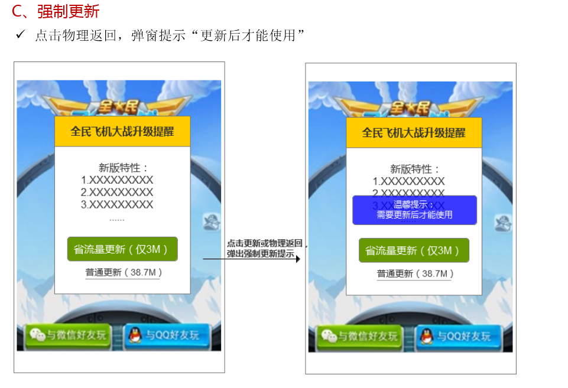

MSDK应用宝相关模块
==================


# 应用宝抢号

## 抢号开关配置

抢号开关有两处，一可以在**assets/msdkconfig.ini**中配置客户端抢号开关，二需要在应用宝设置抢号开关。要从前端开启抢号功能只需要此项设置即可.如下：

	; MSDK可选模块功能开关
	; 应用宝抢号开关
	BETA=true

## 抢号接入步骤

- **第一步：**在游戏的AndroidMenifest.xml中添加Service声明

```
<service 
	android:name="com.tencent.tmassistantsdk.downloadservice.TMAssistantDownloadSDKService"
    android:exported="false"
    android:process=":TMAssistantDownloadSDKService" >
</service>
```

- **第二步：**在游戏主Acitivity的onResume和onDestroy分别调用MSDK对应方法

```
@Override
protected void onResume() {
    super.onResume();
    WGPlatform.onResume();
}
@Override
protected void onDestroy() {
    super.onDestroy();
    WGPlatform.onDestroy(this);
}
```

- **第三步：**修改抢号文案为对应游戏名文件路径：**MSDKLibrary\res\values\com_tencent_tmassistant_sdk_strings.xml**修改方法：将下面的**“天天飞车”**改成对应的游戏名即可。
	
```
<string name="white_list_dlg_body">您还没有天天飞车限量内测的资格，快去应用宝抢号吧！</string>
```

平台登陆完成以后回到MSDK, MSDK会发起白名单验证请求, 此请求返回时候. MSDK会通过OnLoginNotify通知游戏, 如果用户在白名单内, 这flag为eFlag_Succ, 此种情况更正常登陆一致; 如果用户不在白名单内, 则flag为eFlag_NotInWhiteList, 返回给游戏同时, MSDK会弹窗引导用户到应用宝抢号.

**PS：验证抢号功能接入成功的方法**
当使用任何一个新的QQ号或微信号登录游戏弹出如下弹框则表示应用宝抢号功能已接入完成：

<div align=center>  </div>


# 省流量更新

## 省流量更新开关配置

使用更新功能需要在**assets/msdkconfig.ini**中配置开关`SAVE_UPDATE`,如：
	
	; SAVE_UPDATE
	SAVE_UPDATE=true

## 省流量更新接入配置

配置`AndroidManifest.xml`
	
	<service 
		android:name="com.tencent.tmassistantsdk.downloadservice.TMAssistantDownloadSDKService"
        android:exported="false"
        android:process=":TMAssistantDownloadSDKService" >
    </service>

通过应用宝sdk更新游戏包含两种方式: 

- 普通更新, 直接在游戏内从应用宝后台的下载更新包。
- 省流量更新, 也叫增量更新, 这种更新方式需要有应用包客户端。省流量更新是通过文件对比，只给用户更新有变化的部分，进而减小更新包的大小，提高更新成功率。

游戏接入应用宝省流量更新的流程图如下:


## 省流量更新调试

使用应用宝省流量更新有以下几步：

- 第一步: 游戏Activity生命周期埋点  

```
@Override
protected void onResume() {
    super.onResume();
    WGPlatform.onResume();
}
@Override
protected void onDestroy() {
	super.onDestroy();
	WGPlatform.onDestory(this);
}
```

- 第二步: 初始化时设置应用宝省流量更新的全局回调对象,涉及到的回调详细说明见: **MSDKLibrary/jni/CommonFiles/WGSaveUpdateObserver.h**。

应用宝更新回调类，游戏自行实现


    WGPlatform.WGSetSaveUpdateObserver(new SaveUpdateDemoObserver()); 

    class SaveUpdateDemoObserver extends WGSaveUpdateObserver{
        @Override
        public void OnCheckNeedUpdateInfo(long newApkSize, String newFeature, long patchSize,
                final int status, String updateDownloadUrl, final int updateMethod) {
            Logger.d("called");
            String statusDesc = "";
            switch (status) {
                case TMSelfUpdateSDKUpdateInfo.STATUS_OK:
                    // 查询更新成功
                    statusDesc = "Check success!";
                    break;
                case TMSelfUpdateSDKUpdateInfo.STATUS_CHECKUPDATE_RESPONSE_IS_NULL:
                    // 查询响应为空
                    statusDesc = "Response is null!";
                    break;
                case TMSelfUpdateSDKUpdateInfo.STATUS_CHECKUPDATE_FAILURE:
                    // 查询更新失败
                    statusDesc = "CheckNeedUpdate FAILURE!";
                    break;
            }
            if(status == TMSelfUpdateSDKUpdateInfo.STATUS_OK) {
                switch(updateMethod) {
                    case TMSelfUpdateSDKUpdateInfo.UpdateMethod_NoUpdate:
                        // 无更新包
                        statusDesc += "But no update package.";
                        break;
                    case TMSelfUpdateSDKUpdateInfo.UpdateMethod_Normal:
                        // 有全量更新包
                        // WGPlatform.WGStartCommonUpdate(); //更新游戏
                        statusDesc += "Common package is available.";
                        break;
                    case TMSelfUpdateSDKUpdateInfo.UpdateMethod_ByPatch:
                        // 有省流量更新包
                        // WGPlatform.WGStartSaveUpdate(); //更新游戏
                        statusDesc += "Save update package is available.";
                        break;
                    default :
                        statusDesc += "Happen error!";
                        break;
                }
            }
            Logger.d(statusDesc);
            MsdkCallback.sendResult(statusDesc);
        }

        @Override
        public void OnDownloadAppProgressChanged(final long receiveDataLen, final long totalDataLen) {
            // 下载游戏进度由此回调，游戏可根据回调的参数做进度表展示
            Logger.d("totalData:" + totalDataLen + "receiveData:" + receiveDataLen);
        }

        @Override
        public void OnDownloadAppStateChanged(int state, int errorCode, String errorMsg) {
            // 下载进度由此回调
            switch (state) {
                    case TMAssistantDownloadSDKTaskState.DownloadSDKTaskState_SUCCEED:
                        // 应用宝内的游戏下载任务完成, 更新完成继续游戏
                    case TMAssistantDownloadSDKTaskState.DownloadSDKTaskState_DOWNLOADING:
                        // 应用宝内的游戏下载中, 游戏提示等待动画或者结合OnDownloadAppProgressChanged显示下载进度
                        break;
                    case TMAssistantDownloadSDKTaskState.DownloadSDKTaskState_WAITING:
                        // 应用宝内的游戏下载任务等待中, 提示用户等待
                        break;
                    case TMAssistantDownloadSDKTaskState.DownloadSDKTaskState_PAUSED:
                        break;
                    case TMAssistantDownloadSDKTaskState.DownloadSDKTaskState_FAILED:
                        // 详细错误码在errorCode中, 错误码定义在TMAssistantDownloadSDKErrorCode中以DownloadSDKErrorCode开头的属性中
                        break;
                    case TMAssistantDownloadSDKTaskState.DownloadSDKTaskState_DELETE:
                        break;
            } 
            Logger.d(String.format("%d, %d, %s", state, errorCode, errorMsg));
        }
        
        /**
         * 省流量更新(WGStartSaveUpdate)，当没有安装应用宝时，会先下载应用宝, 此为下载应用宝包的进度回调
         * @param url 当前任务的url
         * @param receiveDataLen 已经接收的数据长度
         * @param totalDataLen 全部需要接收的数据长度（如果无法获取目标文件的总长度，此参数返回 －1）
         */
        @Override
        public void OnDownloadYYBProgressChanged(String url, final long receiveDataLen, final long totalDataLen) {
            // 下载应用宝进度由此回调，游戏可根据回调的参数做进度表展示
            Logger.d("totalData:" + totalDataLen + "receiveData:" + receiveDataLen);
        }
        
        /**
         * @param url 指定任务的url
         * @param state 下载状态: 取值 TMAssistantDownloadSDKTaskState.DownloadSDKTaskState_*
         * @param errorCode 错误码
         * @param errorMsg 错误描述，有可能为null
         */
        @Override
        public void OnDownloadYYBStateChanged(final String url, final int state, final int errorCode, final String errorMsg) {
             Logger.d("OnDownloadYYBStateChanged " + "\nstate:" + state + 
                    "\nerrorCode:" + errorCode + "\nerrorMsg:" + errorMsg);
        }
    }


- 第三步: 调用`WGCheckNeedUpdate`，并根据回调`OnCheckNeedUpdateInfo`中的`updateMethod`选择可用的更新方式，几个接口如下

```
/**
 * @param saveUpdateObserver 省流量更新全局回调, 和更新相关的所有回调都会通过此对象回调
 */
void WGSetSaveUpdateObserver(WGSaveUpdateObserver * saveUpdateObserver);

/**
 * @return void
 *   查询结果回调到由WGSetSaveUpdateObserver接口设置的回调对象的OnCheckNeedUpdateInfo方法
 */
void WGCheckNeedUpdate()

/**
 * 开始普通更新, 此种更新不依赖应用宝客户端, 下载进度和状态变化会通过OnDownloadAppProgressChanged和OnDownloadAppStateChanged回调给游戏
 */
void WGStartCommonUpdate();

/**
 * 如果手机上没有安装应用宝则此接口会自动下载应用宝, 并通过OnDownloadYYBProgressChanged和OnDownloadYYBStateChanged两个接口分别回调
 * 如果手机上已经安装应用宝则此接口会拉起应用宝下载有, 下载进度和状态变化会通过OnDownloadAppProgressChanged和OnDownloadAppStateChanged回调给游戏
 */
void WGStartSaveUpdate()

```

## 省流量更新体验图

体验图只是模拟省流量的应用场景，其中**界面由游戏自定义**。应用宝回调函数会更新状态和下载进度，具体可参看省流量接入章节。调试省流量更新，调试手机上的游戏版本要低于上传到应用宝的版本。



