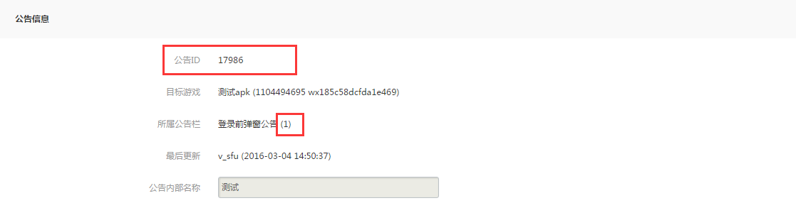

MSDK公告模块
===

模块介绍
---

### 概述
公告系统是SDK提供的游戏内信息通知系统。通过web端可视化操作，实现活动、大区数据不通等信息的通知，有效提高信息的触达率。目前可以提供给游戏：

- 不同场景下发送不同公告（例如：登录前公告、登录后公告）
- 多用用户范围选择：全员公告、分大区分操作系统、指定号码（微信号、微信号）
- 多种公告样式：弹窗公告、滚动公告
- 丰富的公告内容：文本、图片、网页等

### 名次解释

|  名词 | 解释 |
| ------------- |:-------------:|
| 公告栏 | SDK公告模块标示不同位置的公告的字段。游戏在配置公告时选择，是客户端调用展示公告的接口时的scene参数 |
| 弹出公告 |以弹出框的形式展示公告，支持文本、图片、网页三种形式。多条公告会在用户关闭当前公告后弹出下一个， 弹出公告可以增加跳转链接，点击后会用内置浏览器打开对应链接 |
| 滚动公告 | 以在游戏界面最上方滚动形式展示公告，目前只支持文本。当多条公告时，会拼接在一起滚动展示 |

## 接入须知（重要，接入必看）

- 公告模块会在SDK初始化和玩家登录以后去系统后台拉取该APP的有效公告。此外，公告模块还有定时拉取机制（默认10分钟拉取一次）
- 调用展示公告的接口和获取公告数据的接口时，均是从本地数据库获取该应用当前有效的公告，建议游戏直接使用SDK自带公告UI，可以减轻游戏的接入成本。
- **该功能在MSDK 1.7.0a 版本以后提供，公告分滚动公告、弹出公告两种形式。**从MSDK 2.0.0a 开始，公告内容从文字增加到图片和网页三种形式。
- **`SDK对于不同位置展示的公告，用公告栏来区分。例如常见的游戏登陆前公告和登陆后公告对应SDK的公告模块只是相当于不同的公告栏`**
- **MSDK从2.8.0a开始增加公告置顶功能。**

推荐用法
---

### 方案概述

这部分内容将提供一个游戏接入SDK公告模块的推荐方案。模拟某款游戏接入SDK公告模块：

- 接入登陆前、登陆后多个位置的弹出公告和一个游戏中的任意位置的滚动公告。
- 游戏使用SDK公告模块提供的UI风格 

### 接入流程

**MSDK公告管理端地址:**
外网：[http://open.qq.com](http://open.qq.com)
内网：[http://dev.ied.com](http://dev.ied.com)

1. 在SDK公告管理端[http://dev.ied.com/](http://dev.ied.com/)增加游戏对应的公告栏，如下图为SDK的Demo对应的公告栏信息：

		

	外网开发者请参考详细的[MSDK公告管理端使用说明](http://wiki.mg.open.qq.com/index.php?title=MSDK%E5%85%AC%E5%91%8A%E7%AE%A1%E7%90%86)。

- 客户端接入：

	1. 在`AndroidMainfest`和`assets/msdkconfig.ini`中添加MSDK公告相关的配置，添加查看本页文档[接入配置](notice.md#接入配置)和[开关配置](notice.md#开关配置)模块。

	- 客户端公告调用（仅供参考）：
		- 在游戏初始化结束，停留在登陆界面的时候展示登陆前公告。使用接口[展示公告接口](notice.md#展示公告接口)，参数为对应公告栏ID，即可展示登陆前公告
		- 游戏收到loginNotify的成功回调并进入游戏主界面的时候展示登陆后公告。使用接口[展示公告接口](notice.md#展示公告接口)，参数为对应公告栏ID，即可展示登陆后公告
		- 游戏在想要展示滚动公告的地方（比如登陆后游戏主界面等)调用接口展示滚动公告。使用接口[展示公告接口](notice.md#展示公告接口)，参数为对应公告栏ID。一般开始展示以后设置一个定时器，时间到了以后隐藏滚动公告

### 联调测试
	
1. 确认客户端`assets/msdkconfig.ini`配置的域名为`http://msdktest.qq.com`
2. 产品人员在公告管理端选择公告（测试环境）添加公告
3. 客户端根据产品配置的公告的类型（登陆前后，滚动弹出，是否号码包等测试），如果公告无法显示，请点击[游戏公告不能正常展示检查步骤](notice.md#游戏公告不能正常展示检查步骤)，按照步骤排查。

接入配置
---
#### 公告初始化：
	
公告模块无需单独的初始化工作，只需要完成MSDK的初始化就好。**如果游戏只接入手Q或者微信平台，请在初始化（onCreate）时只设置对应平台的appid，不要随意填写其余游戏其余平台的appid。否则会导致游戏登录前公告拉取失败。**

#### 公告AndroidMainfest配置：

这部分内容主要是MSDK公告界面相关的权限设置。

	<!-- TODO Notice 公告 配置 START -->
    <!--  MSDK弹出公告相关配置 -->
   	<activity
       	android:name="com.tencent.msdk.notice.AlertMsgActivity"
       	android:configChanges="orientation|screenSize|keyboardHidden"
       	android:screenOrientation="sensor"
       	android:theme="@style/NoticeAlertTheme" >
    </activity>
	<!--  MSDK滚动公告相关配置 -->
    <service android:name="com.tencent.msdk.notice.RollFloatService" >
    </service>
    <!-- TODO Notice 公告 配置  END -->

**备注：游戏可以根据屏幕的方向设置公告activity的屏幕方向（android:screenOrientation的值）。**

开关配置
---
MSDK 提供开关供游戏控制是否开启MSDK公告以及公告定时拉取的时间频率。
#### 是否开启公告
	
公告模块默认关闭, 需要使用公告模块的游戏需要在assets/msdkconfig.ini中将needNotice一项的值设置为true.
#### 设置公告定时拉取时间

公告模块默认自动拉取时间为十分钟, 游戏可以根据需要在assets/msdkconfig.ini中将noticeTime一项的值设置为对应的时间。**（游戏可以设置的最短拉取时间为5分钟）**

        
        
##展示公告接口

调用WGShowNotice将使用MSDK配置的一套界面显示当前有效的公告。对于弹出公告，还可以设置是否带有跳转链接，对于带有跳转链接的公告，点击详情会拉起MSDK内置浏览器打开对应的详情URL。

#### 接口声明：
	
	/**
	 * 展示对应类型指定公告栏下的公告
	 * @param scene 公告栏ID，不能为空, 这个参数和公告管理端的“公告栏”设置对应
	 */

  	void WGShowNotice(unsigned char *scene);

#### 接口调用：

	String sceneString = "1";
	WGPlatform.WGShowNotice(sceneString);
	
#### 注意事项：
1. 在调用接口时使用的公告栏id(scene)公告管理端**设置的“公告栏”ID对应，请不要使用公告ID(msgid)代替公告栏ID**	
2. 2.4.0开始该接口有调整，接入2.4.0以前版本的游戏可以参照下面的接口文档：
	
###原展示公告接口（该接口自2.4.0起弃用，改用[展示公告接口](notice.md#展示公告接口)）

调用WGShowNotice将使用MSDK配置的一套界面显示当前有效的公告。对于弹出公告，还可以设置是否带有跳转链接，对于带有跳转链接的公告，点击详情会拉起MSDK内置浏览器打开对应的详情URL。

#### 接口声明：
	
	/**
	 * 展示对应类型指定公告栏下的公告
	 * @param type   要显示的公告类型
	 * 	  eMSG_NOTICETYPE_ALERT: 弹出公告
	 * 	  eMSG_NOTICETYPE_SCROLL: 滚动公告
	 * 	  eMSG_NOTICETYPE_ALL: 弹出公告&&滚动公告
	 * @param scene 公告栏ID，不能为空, 这个参数和公告管理端的“公告栏”设置对应
	 */
  	void WGShowNotice(eMSG_NOTICETYPE type, unsigned char *scene);
#### 接口调用：
	eMSG_NOTICETYPE noticeTypeID = eMSG_NOTICETYPE.eMSG_NOTICETYPE_ALERT;
	String sceneString = "1";
	WGPlatform.WGShowNotice(noticeTypeID, sceneString);
	
#### 注意事项：
在调用接口时使用的公告栏id(scene)公告管理端**设置的“公告栏”ID对应，请不要使用公告ID(msgid)代替公告栏ID**

隐藏滚动公告接口
---

调用WGHideScrollNotice会隐藏正在展示的滚动公告。

#### 接口声明：

	/**
	 * 隐藏正在展示的滚动公告
	 */

	 void WGHideScrollNotice();

#### 接口调用：

	WGPlatform.WGHideScrollNotice();

## 获取公告数据接口

调用WGGetNoticeData会返回一个指定类型的当前有效的公告数据的列表。
#### 接口声明：

	/**
	 * 从本地数据库读取指定scene下指定type的当前有效公告
	 * @param sence 这个参数和公告管理端的“公告栏”对应
	 * @return NoticeInfo结构的数组，NoticeInfo结构如下：
		typedef struct
		{
			std::string msg_id;			//公告id
			std::string open_id;		//用户open_id
			std::string msg_url;		//公告跳转链接
			eMSG_NOTICETYPE msg_type;	//公告类型，eMSG_NOTICETYPE
			std::string msg_scene;		//公告展示的公告栏，管理端后台配置
			std::string start_time;		//公告有效期开始时间
			std::string end_time;		//公告有效期结束时间
			eMSG_CONTENTTYPE content_type;	//公告内容类型，eMSG_CONTENTTYPE

			//网页公告特殊字段
			std::string content_url;     //网页公告URL
			//图片公告特殊字段
			std::vector<PicInfo> picArray;    //图片数组
			//文本公告特殊字段
			std::string msg_title;		//公告标题
			std::string msg_content;	//公告内容
			}NoticeInfo;
	 */
		 
	 std::vector<NoticeInfo> WGGetNoticeData(unsigned char *scene);

#### 接口调用：
	
	String sceneString = "1";
	Vector<NoticeInfo> noticeInfos = new Vector<NoticeInfo>();
    noticeInfos = WGPlatform.WGGetNoticeData(sceneString);

#### 注意事项：
1. 在调用接口时使用的公告栏id(scene)公告管理端**设置的“公告栏”ID对应，请不要使用公告ID(msgid)代替公告栏ID**  
2. **2.4.0开始该接口有调整，接入2.4.0以前版本的游戏可以参照下面的接口文档**：  

###原获取公告数据接口（该接口自2.4.0起弃用，改用[获取公告数据接口](notice.md#获取公告数据接口)）

调用WGGetNoticeData会返回一个指定类型的当前有效的公告数据的列表。
#### 接口声明：
	/**
	 * 从本地数据库读取指定scene下指定type的当前有效公告
	 * @param type 需要展示的公告类型。类型为eMSG_NOTICETYPE，具体值如下:
	 * 	  eMSG_NOTICETYPE_ALERT: 弹出公告
	 * 	  eMSG_NOTICETYPE_SCROLL: 滚动公告
	 * @param sence 这个参数和公告管理端的“公告栏”对应
	 * @return NoticeInfo结构的数组，NoticeInfo结构如下：
		typedef struct
		{
			std::string msg_id;			//公告id
			std::string open_id;		//用户open_id
			std::string msg_url;		//公告跳转链接
			eMSG_NOTICETYPE msg_type;	//公告类型，eMSG_NOTICETYPE
			std::string msg_scene;		//公告展示的公告栏，管理端后台配置
			std::string start_time;		//公告有效期开始时间
			std::string end_time;		//公告有效期结束时间
			eMSG_CONTENTTYPE content_type;	//公告内容类型，eMSG_CONTENTTYPE
			//网页公告特殊字段
			std::string content_url;     //网页公告URL
			//图片公告特殊字段
			std::vector<PicInfo> picArray;    //图片数组
			//文本公告特殊字段
			std::string msg_title;		//公告标题
			std::string msg_content;	//公告内容
			}NoticeInfo;
	 */
		 
	 std::vector<NoticeInfo> WGGetNoticeData(eMSG_NOTICETYPE type,unsigned char *scene);
#### 接口调用：
	
	eMSG_NOTICETYPE noticeTypeID = eMSG_NOTICETYPE.eMSG_NOTICETYPE_ALERT;
	String sceneString = "1";
	Vector<NoticeInfo> noticeInfos = new Vector<NoticeInfo>();
    noticeInfos = WGPlatform.WGGetNoticeData(noticeTypeID, sceneString);
    
#### 注意事项：
在调用接口时使用的公告栏id(scene)公告管理端**设置的“公告栏”ID对应，请不要使用公告ID(msgid)代替公告栏ID**        

游戏公告不能正常展示检查步骤
---
1. 公告模块是否开启：
	**检查游戏assets/msdkconfig.ini中needNotice一项的值是否为true。如果不是，改为true再调试；如果是继续往下检查。**检查方法：
	- 查看MSDK日志，如果存在下面一行日志，则说明公告模块处于关闭状态：
	
			WeGame NoticeManager.init	 notice module is closed!

		如果存在下面一行日志，则说明公告模块已经打开：

			WeGame NoticeManager.init	 notice module init start!

	- 反编译游戏包，查找assets目录下的msdkconfig.ini文件，检查是否配置needNotice一项，并确认needNotice的值是否为true.

- 查看调用接口是否有有效内容：

	**查看MSDK的日志，看调用接口的日志里是否有公告。如果不是0，找MSDK相关开发确认；如果是0，则继续往下检查。**检查方法：

	在MSDK日志中看**noticeVector size**的值：

		WeGame NoticeDBModel.getNoticeRecordBySceneAndType	 query result:0
		WeGame NoticeManager.getNoticeFromDBBySceneAndType	 noticeVector size:0

- 查看获取公告的appid是否正确：

	**查看MSDK的日志，看获取公告时的appid是否正确，登陆前公告为手Q和微信appid的组合，登陆后公告为对应平台appid。，如果不正确，请在初始化的地方修改以后再尝试如果正确，请继续往下检查。**检查方法：

	在MSDK日志中看调用**NoticeManager.getNoticeInfo**的时候的appid的值，然后与dev后台、请求公告的时机（是否登陆）对比，看是否正确。**尤其常见只接单一平台的游戏随意填写其余平台的信息，导致公告获取失败**：

		WeGame NoticeManager.getNoticeInfo	 appid：100703379|wxcde873f99466f74a;openid:
		WeGame NoticeManager.getNoticeInfo	 Notice Model:mat_id may be null:860463020910104;mMatId:860463020910104
- 查看公告是否从管理段下发到客户端：

	**清空游戏本地数据，然后重新启动游戏，然后查看MSDK的日志，看后台下发的公告列表是否包含配置的公告。如果没有，找MSDK后台确认；如果有，继续往下看。**检查方法：
	
	在MSDK日志中看请求/notice/gather_data/的返回内容，事例如下：
		
		strResult:{"appid":"100703379|wxcde873f99466f74a","invalidMsgid":[{"invalidMsgid":"499"},{"invalidMsgid":"500"},{"invalidMsgid":"483"},{"invalidMsgid":"509"},{"invalidMsgid":"513"}],"list":[{"appid":"100703379|wxcde873f99466f74a","beginTime":"1403614800","contentType":2,"contentUrl":"http://www.qq.com","endTime":"1412168400","msgContent":"","msgUrl":"http://www.baidu.com","msgid":"528","noticeType":0,"openid":"","picUrlList":[],"scene":"10","title":""},{"appid":"100703379|wxcde873f99466f74a","beginTime":"1403614800","contentType":1,"contentUrl":"","endTime":"1412168400","msgContent":"","msgUrl":"","msgid":"527","noticeType":0,"openid":"","picUrlList":[{"hashValue":"7a7ac418fb79917875cfd80c81ee4768","picUrl":"http://img.msdk.qq.com/notice/527/20140624211729_610X900.jpg","screenDir":1},{"hashValue":"2243f401734483f09ceeffd86006262d","picUrl":"http://img.msdk.qq.com/notice/527/20140624211739_1080X440.jpg","screenDir":2}],"scene":"10","title":""},{"appid":"100703379|wxcde873f99466f74a","beginTime":"1403573435","contentType":0,"contentUrl":"","endTime":"1412127095","msgContent":"& &&兼容测试用例,2& && 关于特殊字符","msgUrl":"","msgid":"490","noticeType":0,"openid":"","picUrlList":[],"scene":"10","title":"& &&兼试2&"},{"appid":"100703379|wxcde873f99466f74a","beginTime":"1396575095","contentType":0,"contentUrl":"","endTime":"1412127095","msgContent":"滚动公告在配置的时候不能输入换行符。为咩？\r\n\r\n","msgUrl":"","msgid":"491","noticeType":1,"openid":"","picUrlList":[],"scene":"11","title":""},{"appid":"100703379|wxcde873f99466f74a","beginTime":"1396575095","contentType":0,"contentUrl":"","endTime":"1412127095","msgContent":"下面是个换行符\r\n一个换行符，\r\n又一个换行符\r\n哎呀，还有一个\r\n好吧，我想这应该是最后一个了\r\n我去，竟然还有一个\r\n这个真是最后一个了","msgUrl":"","msgid":"492","noticeType":0,"openid":"","picUrlList":[],"scene":"10","title":"换行符测试"},{"appid":"100703379|wxcde873f99466f74a","beginTime":"1396575095","contentType":0,"contentUrl":"","endTime":"1412127095","msgContent":"下面是个换行符\r\n一个换行符，\r\n又一个换行符\r\n哎呀，还有一个\r\n好吧，我想这应该是最后一个了\r\n我去，竟然还有一个\r\n这个真是最后一个了\r\n下面点击详情我该跳转了，我跳\r\n","msgUrl":"http://im.qq.com","msgid":"493","noticeType":0,"openid":"","picUrlList":[],"scene":"10","title":"换行符+跳转测试"},{"appid":"100703379|wxcde873f99466f74a","beginTime":"1396575095","contentType":0,"contentUrl":"","endTime":"1412127095","msgContent":"滚动公告在配置的时候不能输入换行符。为咩？\r\n\r\n","msgUrl":"","msgid":"494","noticeType":1,"openid":"","picUrlList":[],"scene":"11","title":""},{"appid":"100703379|wxcde873f99466f74a","beginTime":"1396575095","contentType":0,"contentUrl":"","endTime":"1412127095","msgContent":"& &&兼容测试用例,2& && 关于特殊字符*&……￥%……@#——+（）？》《，我应该出现在滚动公告栏里，我旁边应该还有一个滚动公告，在我前面还是后面呢？","msgUrl":"","msgid":"495","noticeType":1,"openid":"","picUrlList":[],"scene":"11","title":""},{"appid":"100703379|wxcde873f99466f74a","beginTime":"1403229600","contentType":0,"contentUrl":"","endTime":"1404011100","msgContent":"发送给全部用户有跳转的公告，结束时间距离当前时间非常近","msgUrl":"http://www.qq.com","msgid":"487","noticeType":0,"openid":"","picUrlList":[],"scene":"1","title":"结束时间，有跳转"},{"appid":"100703379|wxcde873f99466f74a","beginTime":"1403748000","contentType":0,"contentUrl":"","endTime":"1403834400","msgContent":"微信+手Q+android+滚动","msgUrl":"","msgid":"514","noticeType":1,"openid":"","picUrlList":[],"scene":"4","title":""}],"msg":"success","ret":0,"sendTime":"1403777179"}

	里面会包含所有公告的内容，游戏可以根据后台配置公告的id等缩小搜索范围，查看公告是否下发。
		
- 检查公告是否在本地时间的有效期：

	**检查MSDK的日志，查看调用展示公告的时候的本地时间，如果本地时间不在公告有效期内，请修改本地时间后再调试；如果本地时间在有效期，请继续往下看。**检查方法：

	在上一步中一定找到公告的开始结束时间等相关信息，在MSDK日志中查看调用NoticeDBModel.getNoticeRecordBySceneAndType时currentTimeStamp的值：

		WeGame MsdkThreadManager.showNoticeByScene	 showNotice
		WeGame NoticeManager.setAppinfo	 mAppId：wxcde873f99466f74a;mOpenId:oGRTijsKcz0dOi__dwJTZmINGfx0
		WeGame NoticeDBModel.getNoticeRecordBySceneAndType	 appId:wxcde873f99466f74a,openid:oGRTijsKcz0dOi__dwJTZmINGfx0,scene:10,noticetype:eMSG_NOTICETYPE_ALERT,currentTimeStamp:1403835077
		WeGame NoticeDBModel.getNoticeRecordBySceneAndType	 query result:5
		
	对比获取公告的时候取得本地时间，然后对比产看本地时间是否在公告有效期内（公告的开始与结束时间的区间内）。
	
- 检查调用接口参数是否正确

	**对比MSDK日志和游戏在公告管理端的配置，看公告接口调用的配置与后台是否一致。如果不一致，修改以后再调试；如果一致，继续往下看。**检查方法：

	在MSDK日志中看类似下面的日志：

		WeGame NoticeDBModel.getNoticeRecordBySceneAndType	 appId:100703379|wxcde873f99466f74a,openid:,scene:11,noticetype:eMSG_NOTICETYPE_SCROLL,currentTimeStamp:1409632268

	查看调用公告的时候传递的scene值和noticetype是否和游戏在公告管理段配置的一致，**尤其scene值对应的是管理段配置公告的公告栏ID。**
	
- 检查游戏的appid配置是否正确

	**对比游戏在onCreate里面配置的appid是否和在dev平台注册的一样，如果不一致，修改一致以后再调试，如果一致，找MSDK开发解决。**
	
	
