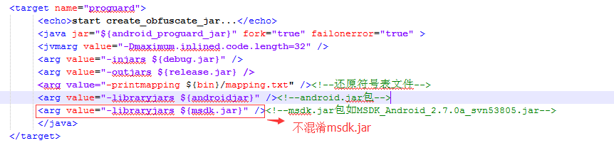
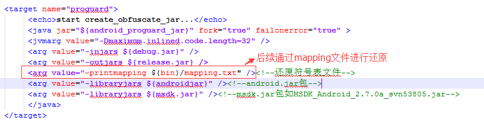
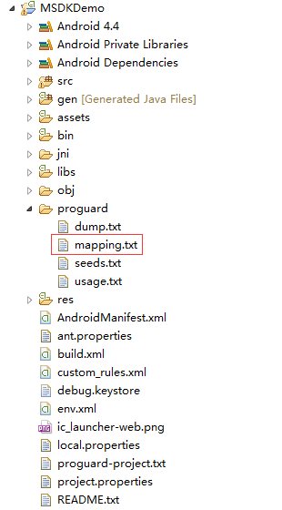
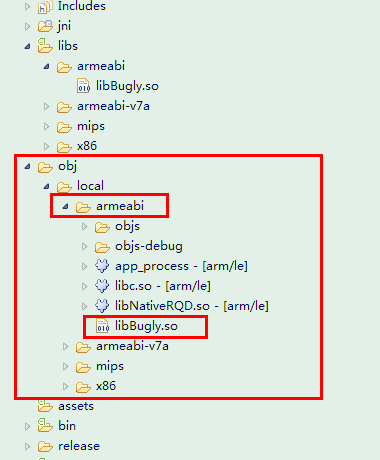
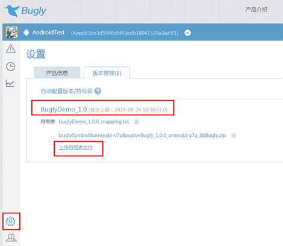
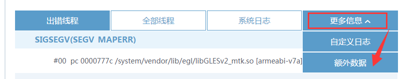
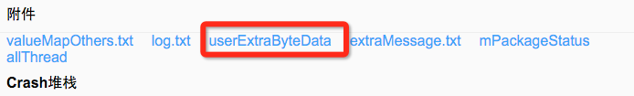

MSDK Crash上报模块
===
概述
---
Crash上报在MSDK2.5a之前（不包括MSDK2.5a)使用的是RQD上报，上报成功后具体crash详细堆栈只能在 http://rdm.wsd.com/ 上查看，必须是腾讯公司员工用RTX登录进行查看，非自研游戏查看起来非常不方便。自MSDK2.5及以后使用的bugly上报，此时可以在 http://bugly.qq.com/ 上进行查看。可使用QQ账号绑定相关应用，这样，非自研游戏可以方便的查看。当然，在 http://rdm.wsd.com/ 同样是可以查看的。游戏无需额外操作，只是关闭crash上报的开关不一致而已，具体请参照**RQD上报开关设置**和**Bugly上报开关设置**。

MSDK2.5a之前版本升级到2.5a之后版本注意事项
---
对于不能使用Android Library Project的游戏要特别注意，需要复制MSDKLibrary下的libs到游戏工程相应的目录。在2.5a之前是将armeabi、armeabi-v7a、mips和x86目录下libNativeRQD.so拷贝到游戏工程相应的目录; 在2.5a及以后是将libBugly.so拷贝到游戏工程相应的目录，如果之前已将libNativeRQD.so已存在，可将其删除。

RQD上报开关设置
---
打开和关闭rdm数据上报的设置函数:

     public static void WGEnableCrashReport(boolean bRdmEnable, boolean bMtaEnable)

在WGPlatform里面有这个函数，如果将bRdmEnable设为false（bMtaEnable可设为false），则关闭rdm crash上报，默认情况下crash上报是开启的，因此无需调用该函数。

在RDM平台上查看Crash数据
---
####1、注册绑定

如果是DEV注册的游戏会自动注册RDM，不需要手动注册; 手动注册，直接登录RDM，点击异常上报模块，配置一下产品 BoundID 即可。

步骤：登录[http://rdm.wsd.com/](http://rdm.wsd.com/), 进入你们的产品 -> 异常上报，如果未注册会提醒如图：

其中，boundID 就是你的AndroidManifest中的packageName。未注册的产品，数据上报时直接丢弃。

具体请咨询rdm小秘书，android问题可联系spiritchen

####2、如何查看上报数据
- 网址:[http://rdm.wsd.com/](http://rdm.wsd.com/)->异常上报->问题列表

Bugly上报开关设置
---
打开和关闭bugly上报的开关需要在/assets/msdkconfig.ini中设置

      ;关闭bugly上报开关，默认应将其设为false，设为true即关闭了crash上报功能
      CLOSE_BUGLY_REPORT=false

在Bugly平台上查看Crash数据
---
- 网址:[http://bugly.qq.com/](http://bugly.qq.com/)->用QQ账号登录->选择相应的App

App Proguard混淆相关处理
---
出于安全考虑，App发布前都会对Java代码进行混淆，混淆时需要注意避免把Bugly中的不允许混淆的类或方法给混淆了！

**方案一：不混淆msdk*.jar（推荐）**

bugly.jar已经集成在MSDK*.jar中，建议用户在混淆时不要对MSDK*.jar（如MSDK_Android_2.7.0a_svn53805.jar）进行混淆。
用户可以直接通过-libraryjars把MSDK*.jar引用进去。

**方案二：混淆MSDK*.jar时添加SDK的keep信息**

用户如果需要混淆MSDK*.jar，请把下面的keep信息添加到App的混淆配置中：

    -keep class * extends android.app.Activity{*;}
    -keep class * extends android.app.Service{*;}

    #Bugly接口
    -keep public class com.tencent.bugly.crashreport.crash.jni.NativeCrashHandler{public *; native <methods>;}
    -keep public interface com.tencent.bugly.crashreport.crash.jni.NativeExceptionHandler{*;}

App 还原符号表配置
---
**符号还原表配置相关推荐先查看http://www.jikexueyuan.com/course/406.html?hmsr=bugly_androidcrash 中共八章视频教程**，可以很好对符号还原表进行掌握。

**符号表工具**可在 http://bugly.qq.com/whitebook 中下载。

**1、生成Java Progurad还原符号表：**

通过progurad工具混淆时，可以输出还原符号表文件mapping.txt，Bugly根据mapping.txt文件对Java堆栈进行还原。

eclipse下开启了progurad后，release编译后会在progurad目录下生成符号表文件mapping.txt。

**2、生成Native symbol文件：**

通过SymbolTool.jar符号表工具可以提取出SO文件中的debug信息生成symbol文件，Bugly根据symbol文件对Native堆栈进行还原。

**3、NDK build结果中：**

libs目录->cpu架构目录->XX.so 是不带debug信息的用于发布的SO，体积小。
obj目录->cpu架构目录->XX.so 是带debug信息(debug_info , debug_line)的用于debug的SO，体积大。

Bugly符号表工具需要在debug的SO中提取出函数的符号信息，进行堆栈还原。

    <cmd>
    java -jar AndroidSymbolTools.jar -i debugSoPath -a armeabi
    </cmd>

将会在debugSo的同目录下，生成一个buglySymbol&cpu架构&SO名.zip的符号表文件。

**4、配置符号表：**

在bugly平台上进入产品->设置->版本管理，根据版本直接上传符号表就可以了！

符号表配置是根据版本配置的：

一个版本只有一个Java符号表（mapping.txt）

一个版本+Cup架构只有一个Native符号表（bulgySymbol&cpu架构&SO名.zip）

重复配置将会是覆盖操作。

Crash上报添加额外业务日志
---

当程序Crash时，有时需要添加一些额外的业务日志，随crash日志一起上报到http://rdm.wsd.com/ 和 http://bugly.qq.com/ 平台，这样可以更好的定位造成crash的原因。

最终可以在rdm以及bugly平台上查看错误详情：

1. 在rdm上额外业务日志保存在extraMessage.txt中。

	

2. 在bugly上额外业务日志可在“额外数据”栏下查看

	

点击“更多信息”，选择“额外数据”栏查看

要完成此功能只需要在全局observer(即WGPlatformObserver)中添加回调函数OnCrashExtMessageNotify，crash额外上报字符串限制 10KB。java按如下方式调用：

    @Override
    public String OnCrashExtMessageNotify() {
      // 此处游戏补充crash时上报的额外信息,用于帮忙分析产生crash的原因
      // 例如，String str = "test extra crash upload!";
      // 如果不需要，请填写为String str = ""
      String str = "test extra crash upload!";
      return str;
    }

cpp按如下方式调用：

    virtual std::string OnCrashExtMessageNotify() {
    	// 此处游戏补充crash时上报的额外信息,用于帮忙分析产生crash的原因
    	// 例如，std::string str = "test extra crash upload!";
    	// 如果不需要，请填写为std::string str = ""
    	std::string str = "test extra crash upload!";
    	LOGD("OnCrashExtMessageNotify test %s", str.c_str());
    	return str;
    }

## Crash上报添加额外二进制数据

当程序Crash时，有时需要添加一些额外的二进制数据，随crash日志一起上报到http://rdm.wsd.com/ 平台，这样可以更好的定位造成crash的原因。最终可以在rdm平台上查看错误详情，其中额外业务日志保存在userExtraByteData中。bugly暂未开放查看userExtraByteData的功能，目前正在开发中。

要完成此功能只需要在全局observer(即WGPlatformObserver)中添加回调函数OnCrashExtDataNotify。java按如下方式调用：

    @Override
	public byte[] OnCrashExtDataNotify() {
		return "OnCrashExtDataNotify test crash java".getBytes();
	}

cpp按如下方式调用：

    virtual unsigned char* OnCrashExtDataNotify() {
    	// 此处游戏补充crash时上报的额外信息
    	LOGD("OnCrashExtDataNotify %s", "");
    	std::string str="OnCrashExtDataNotify CPP";
    	unsigned char *extData = (unsigned char *)str.c_str();
    	return extData;
    }

Crash上报添加业务自定义日志
---

在某些native crash的场景下，注册给bugly的OnCrashExtMessageNotify 和 OnCrashExtDataNotify 可能无法得到执行，推荐业务使用自定义日志的接口：用于记录一些开发者关心的调试日志，可以更全面地反应App异常时的前后文环境。使用方式与android.util.Log一致。用户传入TAG和日志内容。该日志将在Logcat输出，并在发生异常时上报，上报日志最大30K。
在bugly页面上可以在 "更多信息" -> "自定义日志" 查看上报的自定义日志

    	/**
	    * 上报日志到bugly
	    * @param level 日志级别:
	    *  eBuglyLogLevel_S (0), //Silent
	    *  eBuglyLogLevel_E (1), //Error
	    *  eBuglyLogLevel_W (2), //Warning
	    *  eBuglyLogLevel_I (3), //Info
	    *  eBuglyLogLevel_D (4), //Debug
	    *  eBuglyLogLevel_V (5); //Verbose
	    *
	    * @param log 日志内容
	    */
          void WGBuglyLog (eBuglyLogLevel level, unsigned char* log);
