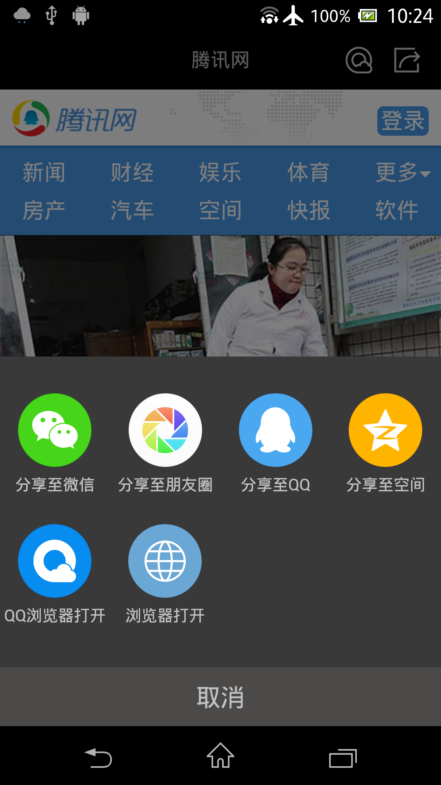
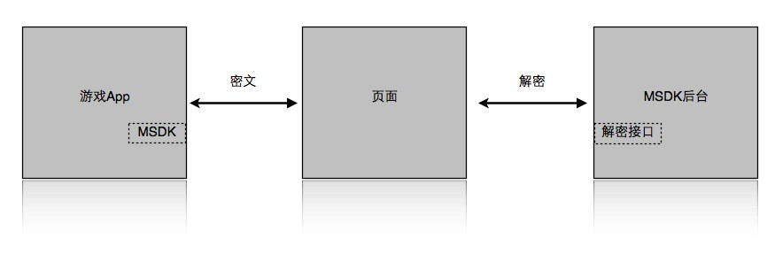
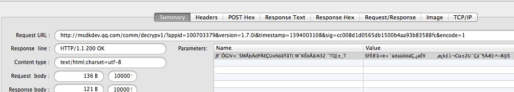

MSDK 内置浏览器相关模块
======
MSDK提供了内置浏览器的支持, 此内置Webview从安全性, 性能各方面优于系统内置Webview, 此Webview中提供了分享到QQ和微信的功能. 游戏需要在游戏内拉起Web页面时, 例如拉起营销活动页面, 论坛, 攻略等页面时. 接入内置浏览器需要完成两步。
接入配置
------
MSDK2.0.0a以前按如下方式配置。

    <activity
       android:name="com.tencent.mtt.spcialcall.SpecialCallActivity"
       android:configChanges="orientation|keyboardHidden|navigation|fontScale|locale|screenSize"
       android:screenOrientation="unspecified"
       android:theme="@style/ThrdCallActivity"
       android:exported="false"
       android:windowSoftInputMode="adjustPan" >
    <intent-filter>
       <action android:name="com.tencent.QQBrowser.action.VIEWLITE" />
       <category android:name="android.intent.category.DEFAULT" />
       <category android:name="android.intent.category.BROWSABLE" />
       <data android:scheme="http" />
       <data android:scheme="https" />
       <data android:scheme="file" />
    </intent-filter>
    </activity>
MSDK2.0.0a及以后按如下方式配置。

    <activity
       android:name="com.tencent.msdk.webview.WebViewActivity"
       android:configChanges="orientation|screenSize|keyboardHidden|navigation|fontScale|locale"
       android:theme="@android:style/Theme.NoTitleBar"
       android:screenOrientation="unspecified"
       android:windowSoftInputMode="adjustPan">
    </activity>

如果需要内置浏览器始终保持横屏，则将`android:screenOrientation="unspecified"`改成如下：
`android:screenOrientation="landscape"`

如果需要内置浏览器始终保持竖屏，则将`android:screenOrientation="unspecified"`改成如下：
`android:screenOrientation="portrait"`

如果是升级到1.9.0版本的，可删除1.9.0以前的配置再添加新的配置。

打开浏览器
------
调用WGOpenUrl接口传入URL即可使用SDK提供的Webview, WGOpenUrl接口说明如下: 

    /**
      *打开内置浏览器,此内置Webview从安全性, 性能各方面优于系统内置Webview, 如果手机上安装了QQ浏览器则会使用QQ浏览器的内核, 性能更优. 同时还提供了在内置浏览器中分享到QQ和微信的功能.
      *@param openUrl 要打开的url
      */
    void WGOpenUrl(unsigned char * openUrl);

调用示例代码如下:

    WGPlatform::GetInstance()->WGOpenUrl(cOpenUrl);

展示效果如下:

 

透传参数说明
------
###1、加密传输登录态
如果游戏登录，通过内置浏览器访问网页时会携带加密后的登录态参数。具体是这么做的：

1.MSDK加密这些参数，传递到页面；

2.页面获取密文后调MSDK后台解密接口获得明文；

3.通过明文中的Token做登录验证。

###2、被加密的数据
要加密的登录态参数如下表：

| 参数名  | 参数说明  |
| ------------- |:-------------:|
| acctype| 账号类型，取值为qq或wx |
| appid| 游戏ID |  
| openId | 用户授权后平台返回的唯一标识|  
| access_token| 用户授权票据 | 
| platid| 终端类型，取值为0表示ios，1表示android |

MSDK会在URL后附加的参数如下，__请勿传入重复的参数，会导致解密失败：

| 参数名  |         参数说明  |  
| ------------- |:-------------:|
| timestamp| 请求的时间戳 |
| appid| 游戏ID |
| algorithm | 加密算法标识，值为v1或者v2 | 
| msdkEncodeParam | 密文 |
| version | MSDK版本号，例如：1.6.2a |
| sig | 请求本身签名 |
| encode | 编码参数，如1 |
| openid | 用户授权后平台返回的惟一标识 |

###3、举例说明
假设浏览器拉起URL：http://apps.game.qq.com/ams/gac/index.html， 实际截包会看到访问的URL如下：

`http://apps.game.qq.com/ams/gac/index.html?sig=***&timestamp=**&appid=***&openid=***&algorithm=v1&msdkEncodeParam=***&version=1.6.2i&encode=1`

其中msdkEncodeParam 传输的实际上是下面参数加密得到的密文（url encode）：

`acctype=weixin&appid=100732256&openid=ol7d0jsVhIm3BQwlNG9g2f4puyUg&access_token=OezXcEiiBSKSxW0eoylIeCKi7qrm-
vXrr62qKiSw2otDBgCzzKZZfeBOSv9fplYsIPD844sNIDeZgG3IyarYcGCNe8XuYKHncialLBq0qj9-rVGhoQVkgSYJ8KXr9Rmh8IvdqK3zsXryo37sMJAa9Q&platid=0`

加解密登录态
------
###1、如何解密
业务页面获得上述URL，组装请求调用MSDK解密接口。目前解密接口有两种传参方案，业务后台需根据algorithm参数实现并兼容两种加密参数传输方案：

1、在MSDK1.8.1a及之后，加密传参的方案为：（下面URL访问的是MSDK测试环境）

`http://msdktest.qq.com/comm/decrypv1/?sig=***&timestamp=**&appid=***&openid=***&algorithm=v2&version=1.8.1i&encode=1`

直接将第一步中得到msdkEncodeParam 里的密文值以Post方式，放在body以Post方式传输，注意不需要加key“msdkEncodeParam=”。

2、MSDK1.8.1a之前，加密传参方案如下：（该方案终端已不再使用，但后台需实现以兼容老版本）

`http://msdktest.qq.com/comm/decrypv1/?sig=***&timestamp=**&appid=***&openid=***&algorithm=v1&version=1.6.2i&encode=1`
 
将msdkEncodeParam 里的密文URL Decode，放在body以Post方式传输，注意不需要加key“msdkEncodeParam=”。截包如下：

###2、密文解码代码示例（php版本）

###3、密文解码代码示例（C代码）
1、引入下面文件UrlCoding.h：

    #ifndef URL_H
    #define URL_H

    #ifdef __cplusplus
       extern "C" {
          #endif
    
          int php_url_decode(const char *str, int len, char *out, int *outLen);
          char *php_url_encode(char const *s, int len, int *new_length);
          int php_url_decode_special(const char *str, int len, char *out, int *outLen);
    
          #ifdef __cplusplus
       }
    #endif

    #endif /* URL_H */

2、引入下面文件UrlCoding.c：

    #include <stdlib.h>
    #include <string.h>
    #include <ctype.h>
    #include <sys/types.h>
    #include <stdio.h>
    #include "UrlCoding.h"
    
    static unsigned char hexchars[] = "0123456789ABCDEF";
    
    static int php_htoi(const char *s)
    {
        int value;
        int c;
        
        c = ((unsigned char *)s)[0];
        if (isupper(c))
            c = tolower(c);
        value = (c >= '0' && c <= '9' ? c - '0' : c - 'a' + 10) * 16;
        
        c = ((unsigned char *)s)[1];
        if (isupper(c))
            c = tolower(c);
        value += c >= '0' && c <= '9' ? c - '0' : c - 'a' + 10;
        
        return (value);
    }
    
    
    char *php_url_encode(char const *s, int len, int *new_length)
    {
        register unsigned char c;
        unsigned char *to, *start;
        unsigned char const *from, *end;
        
        from = (unsigned char *)s;
        end  = (unsigned char *)s + len;
        start = to = (unsigned char *) calloc(1, 3*len+1);
        
        while (from < end)
        {
            c = *from++;
            
            if (c == ' ')
            {
                *to++ = '+';
            }
            else if ((c < '0' && c != '-' && c != '.') ||
                     (c < 'A' && c > '9') ||
                     (c > 'Z' && c < 'a' && c != '_') ||
                     (c > 'z'))
            {
                to[0] = '%';
                to[1] = hexchars[c >> 4];
                to[2] = hexchars[c & 15];
                to += 3;
            }
            else
            {
                *to++ = c;
            }
        }
        *to = 0;
        if (new_length)
        {
            *new_length = to - start;
        }
        return (char *) start;
    }
    
    
    int php_url_decode(const char *str, int len, char *out, int *outLen)
    {
        const char *data = str;
        char *orgOut = out;
        while (len--)
        {
            if (*data == '+')
            {
                *out = ' ';
            }
            else if (*data == '%' && len >= 2 && isxdigit((int) *(data + 1)) && isxdigit((int) *(data + 2)))
            {
                *out = (char) php_htoi(data + 1);
                data += 2;
                len -= 2;
            }
            else
            {
                *out = *data;
            }
            data++;
            out++;
        }
    //  *out = '/0';
        *outLen = out - orgOut;
        return *outLen;
    }
    
    //专门为WGCommonMethods.h里的encodeForURL实现的解码方法  haywoodfu 2014-04-23
    int php_url_decode_special(const char *str, int len, char *out, int *outLen)
    {
        const char *data = str;
        char *orgOut = out;
        while (len--)
        {
            if (*data == '+')
            {
                *out = ' ';
            }
            else if (*data == '%' && len >= 2 && isxdigit((int) *(data + 1)) && isxdigit((int) *(data + 2)))
            {
                int value = 0;
                sscanf((data+1), "%2x", &value);
                *out = (char) value;
                data += 2;
                len -= 2;
            }
            else
            {
                *out = *data;
            }
            data++;
            out++;
        }
    //  *out = '/0';
        *outLen = out - orgOut;
        return *outLen;
    }

3、将传入的字符串encodeParam先后用php_url_decode和php_url_decode_special解码，得到的就是密文

