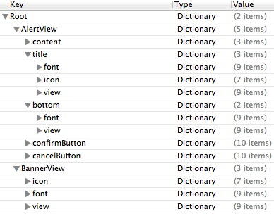
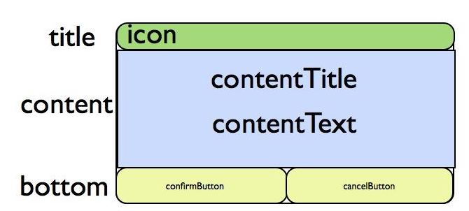
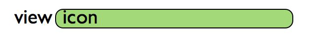

公告
===

##概述
 - 该功能在1.6.1版本以后提供，公告提供了两种形式的接口。1.6.2版本公告处于测试阶段，不建议游戏使用，需要游戏在info中添加配置将公告功能关闭，需要使用公告功能则设置为YES。如下图：

 - 2.0.1i及以后版本支持公告数据定时拉取功能，需要在info中配置如下项：

---

##由MSDK展示界面的公告接口
 - 调用WGShowNotice将使用MSDK配置的一套界面显示当前有效的公告，调用WGHideScrollNotice隐藏展示的滚动公告。
```
Void WGShowNotice (eMSG_NOTICETYPE type, unsigned char *scene);
```
>描述: 显示指定scene当前有效的公告。通过参数type的确定展示哪种公告，如下：
```
typedef enum _eMSG_NOTICETYPE
{
	//所有公告类型
	eMSG_NOTICETYPE_ALL = 0,
	//弹出提示公告
	eMSG_NOTICETYPE_ALERT,
	//滚动公告
    eMSG_NOTICETYPE_SCROLL,
}eMSG_NOTICETYPE;
```
参数: 
1、Type需要展示的公告类型
2、scene 公告场景ID，不能为空。这个参数和公告管理端的“公告栏”对应，只取制定公告栏有效的公告展示。
 - 
```
void WGHideScrollNotice ();
```
>描述: 隐藏展示的滚动公告

##公告数据列表接口
```
std::vector<NoticeInfo> WGGetNoticeData(eMSG_NOTICETYPE type,unsigned char *scene);
```
>描述: 显示指定scene当前有效的公告数据。通过参数type的确定展示哪种公告，如下：
```
typedef enum _eMSG_NOTICETYPE
{
	//所有公告类型
	eMSG_NOTICETYPE_ALL = 0,
	//弹出提示公告
	eMSG_NOTICETYPE_ALERT,
	//滚动公告
    eMSG_NOTICETYPE_SCROLL,
}eMSG_NOTICETYPE;
```
参数: 
2、Type需要展示的公告类型
3、scene 公告场景ID，不能为空。这个参数和公告管理端的“公告栏”对应，只取制定公告栏有效的公告展示。
返回：
1、NoticeInfo的数组，NoticeInfo结构如下：
```
typedef struct
{
    std::string msg_id; //公告id
    std::string open_id; //用户open_id
    std::string msg_content; //公告内容
    std::string msg_title; //公告标题
 	std::string msg_url; //公告跳转链接
  	eMSG_NOTICETYPE msg_type; //公告类型，eMSG_NOTICETYPE
  	std::string msg_scene; //公告展示的场景，管理端后台配置
  	std::string start_time; //公告有效期开始时间
  	std::string end_time; //公告有效期结束时间
	std::string content_url; //网页公告url
	std::vector<PicInfo> picArray; //图片公告图片数据
}NoticeInfo; 
typedef struct
{
	eMSDK_SCREENDIR screenDir;      //横竖屏   1：横屏 2：竖屏
    std::string picPath;    //图片本地路径
    std::string hashValue;  //图片hash值
}PicInfo; 
```

---

## 示例代码
 - 获取公告数据列表接口调用代码示例：
```
WGPlatform *plat = WGPlatform::GetInstance();
std::vector<NoticeInfo> vec = plat->WGGetNoticeData(eMSG_NOTICETYPE_ALERT, (unsigned char *)[scene UTF8String]);
for (int i = 0; i < vec.size(); i++) {
   NoticeInfo info = vec[i];
   NSLog(@"NoticeInfo msgID: %@\nNoticeInfo msgTitle:%@\nNoticeInfo msgContent:%@",
                [NSString stringWithUTF8String: info.msg_id.c_str()],
                [NSString stringWithUTF8String: info.msg_title.c_str()],
                [NSString stringWithUTF8String: info.msg_content.c_str()]);
            }
```

## 常见问题
 - 没有正确导入资源文件导致Crash：
	如果没有将MsdkReources.bundle正确导入工程的”Copy Bundle Resources“，将会在展示公告时出现crash

 - 如果没有在AppDelegate(AppController)创建window属性，会导致调用公告时crash：	
	[AppController window]: unrecognized selector sent to instance 0x17fa7130
	解决方法：在AppDelegate(AppController)增加一个window的property，指向它创建的keywindow

**注意：**

公告的展示界面是通过plist定制的。目前有弹出提示公告有“白底、蓝底、黑底、自定义”四种模版，这些模版及对应的资源文件放在WGPlatformResources.bundle/AnnouncementResources下对应的子目录中。模版的元素和定义说明详见附录。

## 附录
  - 公告plist配置说明
    公告的展示界面是通过plist定制的。目前有弹出提示公告有“白底、蓝底、黑底、自定义”四种模版，这些模版及对应的资源文件放在framework/Resources/AnnouncementResources下对应的子目录中。每个模版的定义元素如下：
    
    其中AlertView节点构建弹出提示公告界面；BannerView节点构建滚动公告界面。
    弹出公告和AlertView节点的对应关系如下图。目前只会设置一个block，所以只有“关闭”按钮：
    
    滚动公告与BannerView节点对应关系如下图。Icon是可选的。
    
    每个节点都是由Font、view、icon元素构成，分别说明如下：
Font节点定制视图文本的属性:

| 项	| 类型	| 说明	| 示例| 
| ------------- |:-------------:|:----:|
| font	| Number	| 字体大小	| 20| 
| fontColor	| string	| 字体颜色	| #ffffff| 
| fontShadow	| number	| 字体阴影	| 0| 
| fontShadowColor	| string	| 阴影颜色	| #ffffff| 
| labelWidth	| Number	| 文本宽度	| 280| 
| labelLeft	| Number	| 文本的X坐标	| 10| 
| labelTop	| Number	| 文本的y坐标	| 10| 
| labelHeight	| Number	| 文本高度	| 30| 
| textAlign	Number	| 文本对齐方式	| 0-左对齐 1-居中 2-右对齐| |

View节点定制视图背景等属性:

| 项	| 类型	| 说明	| 示例| 
| ------------- |:-------------:|:----:|
| backgroudColor	| string	| 背景色	| #ffffff| 
| backgroudColorAlpha	| number	| 背景色透明度	| 0.5(0.0-1.0)| 
| backgroundLeftImage	| string	| 背景图左端	| 可为空| 
| backgroundMidImage	| string	| 背景图拉伸部分 | 文件保存在plist相同目录下| 
| backgroundRightImage	| string	| 背景图右端	| 可为空| 
| viewHeight	| number	| 视图高度	| 40| 
| viewWidth	| number	| 视图宽度	| 200| 
| viewTop	| number	| 视图y坐标（bottom视图里面不设置，则自适应到content视图下）	| 10| 
| viewLeft	| number	| 视图x坐标	| 10| 


Icon节点定制视图中icon的属性：
	
| 项	| 类型	| 说明	| 示例| 
| ------------- |:-------------:|:----:|
| iconPath	| string	| 图片文件名，和plist同一目录	| icon.png| 
| backgroudColor	| string	| 背景色	| #ffffff
| backgroudColorAlpha	| number	| 背景色透明度	| 0.5(0.0-1.0)| 
| viewHeight	| number	| 视图高度	| 30| 
| viewWidth	| number	| 视图宽度	| 30| 
| viewTop	| number	| 视图y坐标	| 10| 
| viewLeft	| number	| 视图x坐标	| 10| 


cancelButton节点定制视图中按钮的属性：
	
| 项	| 类型	| 说明	| 示例| 
| ------------- |:-------------:|:----:|
| titleColor	| string	| 按钮标题颜色	| #ffffff| 
| backgroudColor	| string	| 按钮背景色	| #ffffff| 
| backgroudColorAlpha	| number	| 按钮背景色透明度	| 1| 
| btnImage	| string	| 按钮背景图	| icon.png| 
| selectedBtnImage	| string	| 按钮选中图	| selIcon.png| 
| buttonLeft	| number	| 按钮x坐标	| 10| 
| buttonWidth	| number	| 按钮视图宽度	| 80| 
| buttonHeight	| number	| 按钮视图高度	| 30| 
| buttonTop	| number	| 按钮y坐标（不设置或为0则自适应到底部）	| 10| 
| buttonTitle	| string	| 按钮标题颜色	| #ffffff| 