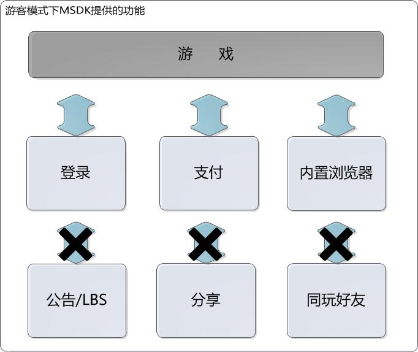

Guest模式
===

##包含的内容和功能 
 - 在MSDK Guest模式下，MSDK现有功能裁剪如下：

---

##登录序列图
 - 在Guest模式下，登录分为注册和登录两个序列。但两个场景的差异性被MSDK屏蔽，游戏不需关心两者的不同。这里只做方案说明：

---

##流程比较
 - OpenID体系和Guest模式流程比较：

---

##需要做的改动
###Step1:如何登录Guest模式
 - 调用如下代码
```ruby
WGPlatform* plat = WGPlatform::GetInstance();
    //如果没有设置OB，请先设置
    MyObserver* ob = new MyObserver();
    plat->WGSetObserver(ob);
    plat->WGSetPermission(eOPEN_ALL);
    plat->WGLogin(ePlatform_Guest);
```

###Step2:onLoginNotify回调
 - 在onLoginNotify返回的LoginRet如下： 
 
如果返回注册错误（eFlag_Guest_RegisterFailed），建议调用WGResetGuestID后再次发起注册请求[增加容错机制]。注册成功后获得的GuestID将被写入到Keychain中，App删除后再安装也不会丢失游客进度。

###Step3:如何支付
 - 支付与之前一致，都是registerPay->pay，参数稍有不同，注意session_id和session_type的传值。
```ruby
registerPay：
 WGPlatform* plat = WGPlatform::GetInstance();
    if (!plat->WGIsSupprotIapPay())
    {
        NSLog(@"不支持iap支付");
        return;
    }
    
    LoginRet ret;
    int retCode = plat->WGGetLoginRecord(ret);
    //    plat->WGRegisterPay();
    std::string openid = ret.open_id;
    std::string paytoken;    
    std::string sessionId;
    std::string sessionType;    
    if (retCode == ePlatform_Guest)
    {
        for(int i=0;i<ret.token.size();i++)
        {
            TokenRet* pToken = &ret.token[i];
            if(pToken->type == eToken_Guest_Access)
            {
                paytoken = pToken->value;
                break;
            }
        }
        sessionId = "hy_gameid";
        sessionType = "st_dummy";
    }
    std::string pf = plat->WGGetPf();
    std::string pfKey = plat->WGGetPfKey();    
    plat->WGRegisterPay(
                        ((unsigned char*)"1450000495"),
                        (unsigned char *)openid.c_str(),
                        (unsigned char *)paytoken.c_str(),
                        (unsigned char *)sessionId.c_str(),
                        (unsigned char *)sessionType.c_str(),
                        NULL
                        );
Pay：
    WGPlatform* plat = WGPlatform::GetInstance();
    if (!plat->WGIsSupprotIapPay())
    {
        NSLog(@"不支持iap支付");
        return;
    }
    LoginRet ret;
    int retCode = plat->WGGetLoginRecord(ret);
    std::string openid = ret.open_id;
    std::string paytoken;
    
    std::string sessionId;
    std::string sessionType;
    if (retCode == ePlatform_Guest)
    {
        for(int i=0;i<ret.token.size();i++)
        {
            TokenRet* pToken = &ret.token[i];
            if(pToken->type == eToken_Guest_Access)
            {
                paytoken = pToken->value;
                break;
            }
        }
        sessionId = "hy_gameid";
        sessionType = "st_dummy";
    }
    
    std::string pf = "desktop_m_qq-10001-iap-10001";//plat->WGGetPf();
    std::string pfKey = "abcdefg";//plat->WGGetPfKey();
    
    plat->WGSetIapEnvirenment((unsigned char*)"test");//test 设置为沙箱环境 release 现网环境[补充注释]
    unsigned char * payItem = (unsigned char*)PayPayitem;
    unsigned char * productId = (unsigned char*)PayProductid;
    
    bool isDepositGameCoin = true;
    uint32_t productType = 0;
    uint32_t quantity = 1;
    unsigned char * zoneId = (unsigned char*)"1";
    unsigned char * varItem = (unsigned char*)"com.lightspeed.weshoothd.600*1";
    
    MyObserver* ob = new MyObserver();
    plat->WGSetObserver(ob);
    
    plat->WGSetIapEnalbeLog(true);
    
    plat->WGPay(
                ((unsigned char*)"1450000495"),
                (unsigned char *)openid.c_str(),
                (unsigned char *)paytoken.c_str(),
                (unsigned char *)sessionId.c_str(),
                (unsigned char *)sessionType.c_str(),
                payItem, productId,
                isDepositGameCoin, productType,
                quantity,
                zoneId,
                varItem,
                (unsigned char*)"dsafasdfa"
                ); 
```

###Step4:调用了不能调用的函数
 - 	在相应的回调会返回eFlag_InvalidOnGuest。

###Step5:如何重置Guest帐号
 - 	在GameServer清除相关数据之后，可以调用如下代码清除MSDK留在终端的Guest帐号数据。下次登录Guest模式将会生成新的Guest帐号。
```ruby
WGPlatform* plat = WGPlatform::GetInstance();
plat->WGResetGuestID();
```