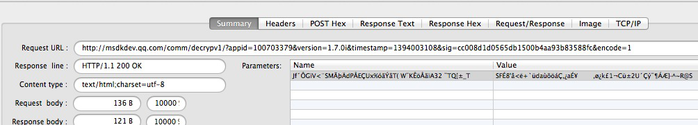
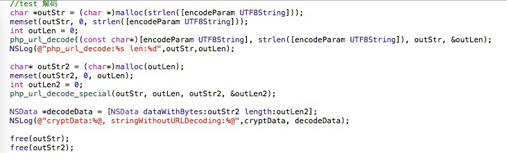
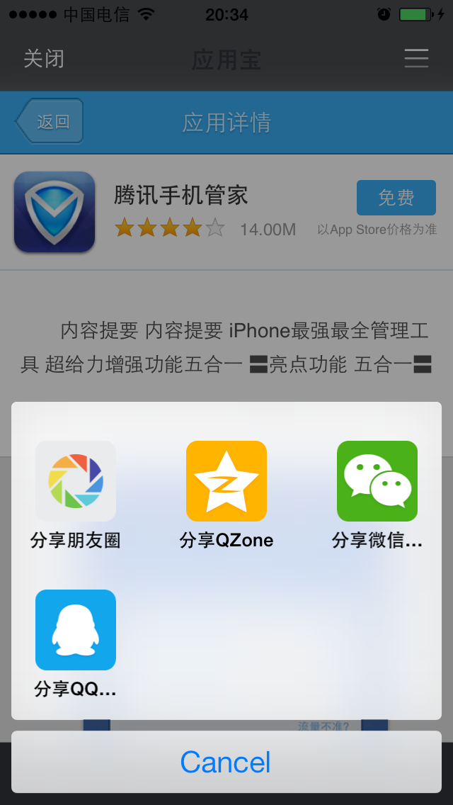

内置浏览器
===

##概述
 - 该功能在1.6.1版本以后提供，需要XCode5.0以上版本进行编译。
调用以下代码，打开指定的url。
```
WGPlatform* plat = WGPlatform::GetInstance();
plat->WGOpenUrl((unsigned char*)[url UTF8String]);
```
---

##使用时的注意事项
 - 浏览器模块是通过xib定制界面的，这个xib放在WGPlatformResources.bundle/目录，xib使用的png等资源文件放在WGPlatformResources.bundle/WebViewResources目录。由于需要兼容iOS7.0，因此需要Xcode5.0及以上版本才能编辑。
 - 手Q分享限制URL长度在512字节之内，因此超长链接需要转成短链。
---

##加密传输登录态参数
  - ### 整体方案
如果游戏登录，通过内置浏览器访问网页时会携带加密后的登录态参数。具体是这么做的：
1.MSDK加密这些参数，传递到页面；
2.页面获取密文后调MSDK后台解密接口获得明文；
3.通过明文中的Token做登录验证。

  - ### URL包含的参数
  - MSDK会在URL后附加的参数如下，请勿传入重复的参数，会导致解密失败：

|参数名|	说明	|值|
|--|--|--|
|timestamp|	请求的时间戳||	
|appid |	游戏ID|	　|
|algorithm|	加密算法标识|	v1|
|msdkEncodeParam|	密文|	　|
|version|	MSDK版本号|	例如1.6.2i|
|sig|	请求本身的签名|	|
|encode|	编码参数|	1|
|openid|	用户授权后平台返回的唯一标识 | | 

 
  - ### 被加密的数据
  - 要加密的登录态参数如下表：

|参数名|	说明|	值|
|--|--|--|
|acctype |	帐号类型|	qq/wx|
|appid 	|游戏ID	　||
|openid |	用户授权后平台返回的唯一标识||
|access_token|	用户授权票据|	　|
|platid 	|终端类型|	0.iOS；1.Android|
 
    
   - 举例说明，假设内置浏览器拉起的URL为http://apps.game.qq.com/ams/gac/index.html，实际截包会看到访问的URL如下：
http://apps.game.qq.com/ams/gac/index.html?sig=***&timestamp=**&appid=***&openid=***&algorithm=v1&msdkEncodeParam=***&version=1.6.2i&encode=1 
   - 其中msdkEncodeParam 传输的实际上是下面参数加密得到的密文（url encode）：
acctype=weixin&appid=100732256&openid=ol7d0jsVhIm3BQwlNG9g2f4puyUg&access_token=OezXcEiiBSKSxW0eoylIeCKi7qrm-
vXrr62qKiSw2otDBgCzzKZZfeBOSv9fplYsIPD844sNIDeZgG3IyarYcGCNe8XuYKHncialLBq0qj9-rVGhoQVkgSYJ8KXr9Rmh8IvdqK3zsXryo37sMJAa9Q&platid=0

- ### 如何解密
- 业务页面获得上述URL，组装请求调用MSDK解密接口。目前解密接口有两种传参方案，业务后台需根据algorithm参数实现并兼容两种加密参数传输 - 方案：
- 在MSDK1.7.1i及之后，加密传参的方案为：（下面URL访问的是MSDK测试环境）
http://msdktest.qq.com/comm/decrypv1/?sig=***&timestamp=**&appid=***&openid=***&algorithm=v2&version=1.7.1i&encode=1
	直接将第一步中得到msdkEncodeParam 里的密文值以Post方式，放在body以Post方式传输，注意不需要加key“msdkEncodeParam=”。
- MSDK1.7.1i之前，加密传参方案如下：（该方案终端已不再使用，但后台需实现以兼容老版本）
http://msdktest.qq.com/comm/decrypv1/?sig=***&timestamp=**&appid=***&openid=***&algorithm=v1&version=1.6.2i&encode=1 
将msdkEncodeParam 里的密文URL Decode，放在body以Post方式传输，注意不需要加key“msdkEncodeParam=”。截包如下：

- ###密文解码代码示例（php版本）
- 代码示例：
```
php
<?php
//var_dump($argv);
$getparam = urldecode($argv[1]);
$postparam = $argv[2];
$algorithm = $argv[3];
//$sUrl = "http://msdktest.qq.com/comm/decrypv1/?" . $getparam;
$sUrl = "http://msdktest.qq.com/comm/decrypv1/?" . $getparam;
//var_dump($sUrl);
//var_dump($postparam);
$curl  =  curl_init();
curl_setopt( $curl, CURLOPT_URL, $sUrl );
curl_setopt( $curl, CURLOPT_RETURNTRANSFER,1 );
curl_setopt( $curl, CURLOPT_CUSTOMREQUEST, "POST" );
$str = $algorithm == "v2" ? $postparam : urldecode(urldecode($postparam));
curl_setopt( $curl, CURLOPT_POSTFIELDS, $str );
try{
	$data = curl_exec($curl);
} catch ( exception $e ){
	print $e->getMessage().$sUrl;
}
curl_close($curl);
print $data;
?>
```
- ###密文解码代码示例（C代码）：
1. 引入下面两个文件：

```
#ifndef URL_H
#define URL_H

#ifdef __cplusplus
extern "C" {
#endif
    int php_url_decode(const char *str, int len, char *out, int *outLen);
    char *php_url_encode(char const *s, int len, int *new_length);
    int php_url_decode_special(const char *str, int len, char *out, int *outLen);
#ifdef __cplusplus
}
#endif
#endif /* URL_H */
```

```
#include <stdlib.h>
#include <string.h>
#include <ctype.h>
#include <sys/types.h>
#include <stdio.h>
#include "UrlCoding.h"
static unsigned char hexchars[] = "0123456789ABCDEF";
static int php_htoi(const char *s)
{
	int value;
	int c;
    
	c = ((unsigned char *)s)[0];
	if (isupper(c))
		c = tolower(c);
	value = (c >= '0' && c <= '9' ? c - '0' : c - 'a' + 10) * 16;
    
	c = ((unsigned char *)s)[1];
	if (isupper(c))
		c = tolower(c);
	value += c >= '0' && c <= '9' ? c - '0' : c - 'a' + 10;
    
	return (value);
}
char *php_url_encode(char const *s, int len, int *new_length)
{
	register unsigned char c;
	unsigned char *to, *start;
	unsigned char const *from, *end;
	
	from = (unsigned char *)s;
	end  = (unsigned char *)s + len;
	start = to = (unsigned char *) calloc(1, 3*len+1);
    
	while (from < end)
	{
		c = *from++;
        
		if (c == ' ')
		{
			*to++ = '+';
		}
		else if ((c < '0' && c != '-' && c != '.') ||
				 (c < 'A' && c > '9') ||
				 (c > 'Z' && c < 'a' && c != '_') ||
				 (c > 'z'))
		{
			to[0] = '%';
			to[1] = hexchars[c >> 4];
			to[2] = hexchars[c & 15];
			to += 3;
		}
		else
		{
			*to++ = c;
		}
	}
	*to = 0;
	if (new_length)
	{
		*new_length = to - start;
	}
	return (char *) start;
}
int php_url_decode(const char *str, int len, char *out, int *outLen)
{
    const char *data = str;
    char *orgOut = out;
	while (len--)
	{
		if (*data == '+')
		{
			*out = ' ';
		}
		else if (*data == '%' && len >= 2 && isxdigit((int) *(data + 1)) && isxdigit((int) *(data + 2)))
		{
			*out = (char) php_htoi(data + 1);
			data += 2;
			len -= 2;
		}
		else
		{
			*out = *data;
		}
		data++;
		out++;
	}
//	*out = '/0';
    *outLen = out - orgOut;
	return *outLen;
}
//专门为WGCommonMethods.h里的encodeForURL实现的解码方法  haywoodfu 2014-04-23
int php_url_decode_special(const char *str, int len, char *out, int *outLen)
{
    const char *data = str;
    char *orgOut = out;
	while (len--)
	{
		if (*data == '+')
		{
			*out = ' ';
		}
		else if (*data == '%' && len >= 2 && isxdigit((int) *(data + 1)) && isxdigit((int) *(data + 2)))
		{
            int value = 0;
            sscanf((data+1), "%2x", &value);
			*out = (char) value;
			data += 2;
			len -= 2;
		}
		else
		{
			*out = *data;
		}
		data++;
		out++;
	}
//	*out = '/0';
    *outLen = out - orgOut;
	return *outLen;
}
```

2. 将传入的字符串encodeParam先后用php_url_decode和php_url_decode_special解码，得到的就是密文


---

##游戏自定义传输参数
游戏可以自行在url后加上key-value参数，作为url的补充信息，类似：http://***.com?key1=value1&key2=value2

---

## 判断App是否安装
- 网页中增加如下JS代码，即可在网页中判断是否安装了对应的App：
```
document.addEventListener('WebViewJavascriptBridgeReady', onBridgeReady, false)
function onBridgeReady(event) {
var bridge = event.bridge
bridge.init(function(message, responseCallback) {
var data = { 'Javascript Responds':'Wee!' }
responseCallback(data)
})
bridge.callHandler('getInstallState', {'packageName':'com.tencent.news','packageUrl' :'qqnews://can_open_me_if_install_and_regeister_this_scheme'
}, function(msg) {
if(msg.indexOf("get_install_state:yes") > -1) {
log("install :腾讯新闻");} 
else {
log("not install :腾讯新闻");
}
})
```

---

##应用内打开App Store详情页
（iOS6.0及以上）点击网页中的itunes链接（http://itunes.apple.com/cn/app/id439638720?mt=8），可以在应用内打开该应用的AppStore详情页。如图：


---

##分享
点击“分享”按钮可将当前页面分享到朋友圈、QZone、微信好友、QQ好友。如下图，请注意手Q分享的URL最大限制在512个字节，如果URL比较长，请使用短链。


---

##通过JS在Safiri中打开指定URL
从MSDK2.7.0版本开始，游戏可在内置浏览器中通过JS方式打开Safiri浏览器并打开指定URL，参数需传递固定接口名称`OpenURLInSafiri`和可变参数data（即要打开的url地址），示例代码如下：

```
var button1 = document.getElementById('buttons').appendChild(document.createElement('button'))
		button1.innerHTML = 'Open URL In Safiri'
		button1.onclick = function(e) {
			e.preventDefault()
			var data = 'http://v.qq.com/iframe/player.html?vid=y0140id0vna&tiny=0&auto=0'
			log('JS sending message', data)
			
			bridge.callHandler('OpenURLInSafiri', data, function(response) {
            	log('JS got response', response);
            });
		}
```
另：调用方式可参考[该网页](http://wiki.dev.4g.qq.com/tmp/page.html)页面源码。

---

##通过JS打开iOS图库、相机获取照片
从MSDK2.7.0版本开始，游戏可在内置浏览器中通过JS方式打开打开iOS图库、相机获取照片，参数需传递固定接口名称`OpenImagePickerController`，返回值为'{"message”:”xxx”,”base64String":“xxx”}'json格式串。其中message字段标识获取照片成功与否，值有'success'和'user cancel'。base64String字段为照片的Base64编码串，message为'success'时该字段有值，message为'user cancel'时该字段无值。示例代码如下：

```
var button2 = document.getElementById('buttons').appendChild(document.createElement('button'))
		button2.innerHTML = 'Open ImagePickerController'
		button2.onclick = function(e) {
			e.preventDefault()
			var data = 'OpenImagePickerController'
			log('JS sending message', data)
			
			bridge.callHandler('OpenImagePickerController', data, function(response) {
                /*
                 response为'{"message”:”xxx”,”base64String":“xxx”}'格式串。
                 其中message字段标识获取照片成功与否，值有'success'和'user cancel'。
                 base64String字段为照片的Base64编码串，message为'success'时该字段有值，message为'user cancel'时该字段无值。
                 */
                var obj = JSON.parse(response);
            	log('JS got response', obj["message"]);
            });
		}
```

另：调用方式可参考[该网页](http://wiki.dev.4g.qq.com/tmp/page.html)页面源码。

---


##常见问题
部分游戏导入framework后会有找不到framework的情况，例如是无法打开内置浏览器，日志输出“no MSDKWebViewService exist”，此时需要在Other link flags增加“-ObjC “或 “-framework MSDKFoundation -framework MSDK -framework MSDKMarketing -framework MSDKXG”，导入相关framework。

---