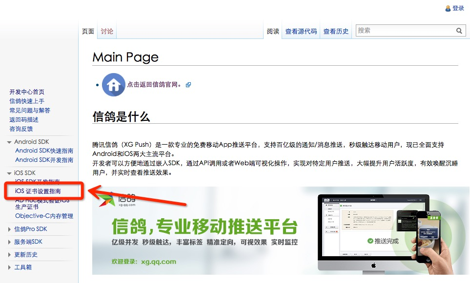
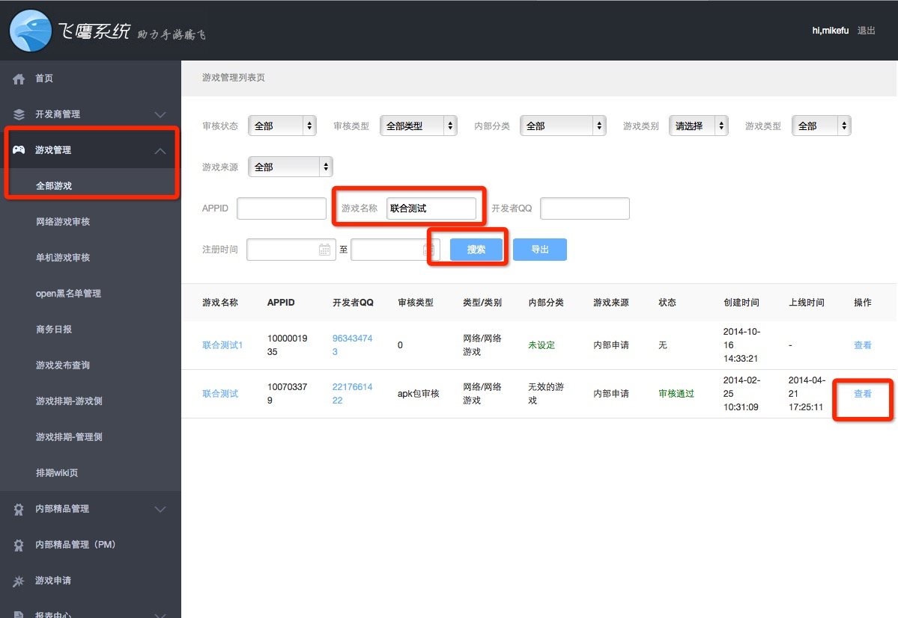
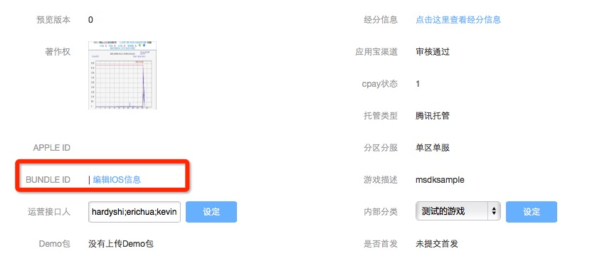
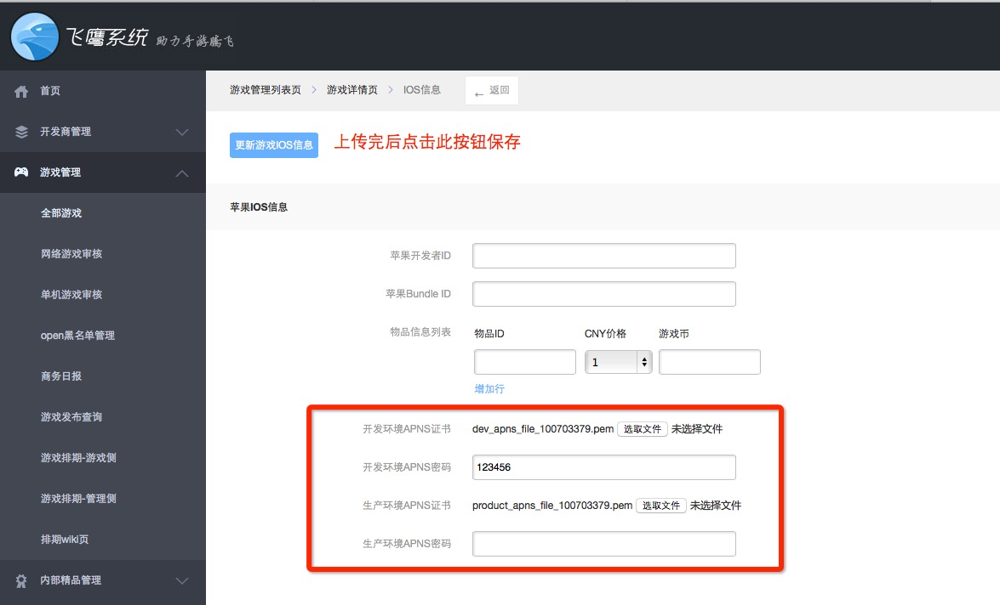
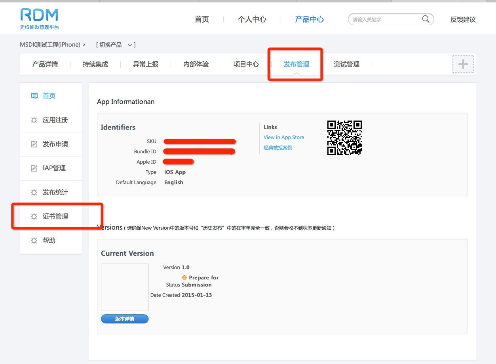

消息推送
===

 > 从2.2版本开始，MSDK接入信鸽推送   [信鸽官网](http://xg.qq.com/)。

##概述

 - 在info.plist中配置推送开关，如下图：

已经接入信鸽推送的游戏在更新MSDK2.3.0时，若想关闭MSDK的信鸽推送，则不配置此开关，或者设置为OFF。其他游戏若接入MSDK的信鸽推送，则必须配置此开关为ON。
在MSDK2.4.0i以上版本，该值已经改为Boolean型，请留意修改Info.plist。

 - MSDK ios 推送依赖苹果APNS实现，需要在developer.apple.com中开通应用的推送功能。并制作推送证书和签名文件(.mobileprovision)。
 - 推送ssl证书：MSDK需要使用此证书向应用发送推送消息，所以需要将此证书及密码交由MSDK。在dev.ied.com配置此证书
 - 签名文件：游戏上线时需要在工程Build PhasesProvisioning Profile中设置此签名文件。
 - 游戏还需要实现UIApplicationDelegate中与推送相关的5个方法：
>*游戏测试MSDK推送功能时，需要使用正式推送证书进行AD Hoc 方式打包进行测试，并请注意切勿使用全量推送方式进行推送！*

##制作上传pem证书
 - 制作证书

按照信鸽官网步骤制作pem证书，[制作步骤](http://developer.xg.qq.com/index.php/IOS_%E8%AF%81%E4%B9%A6%E8%AE%BE%E7%BD%AE%E6%8C%87%E5%8D%97)。

若制作步骤打开无内容可[点击此处](http://developer.xg.qq.com/index.php/Main_Page)，在打开的页面中点击左侧导航栏中iOS SDK->iOS证书设置指南即可，如下图所示：



 - 上传证书
### Step1:
进入[飞鹰系统](http://dev.ied.com)(外网开发者可使用开发者账号登录[http://open.qq.com/](http://open.qq.com/)在消息管理模块进行推送消息设置)，点击左侧导航栏游戏管理->全部游戏,搜索自己的游戏，此处以MSDK为例，如下图所示：



### Step2:
点击上图中的 查看 按钮进入游戏详情页，找到下图所示的信息：



### Step3:
点击上图中的 编辑IOS信息 按钮进入iOS信息页，如下图所示：



分别上传按照信鸽官网步骤制作生成开发环境和生产环境的pem证书即可，证书未设置密码则密码项可不填。最后点击左上角 更新游戏IOS信息 按钮保存。

**注意**

生产环境证书需要在RDM上下载，具体路径：游戏产品->发布管理->证书管理，以MSDK为例如下图所示：



在打开的界面中下载对应的xxx_push.p12文件，打开终端进入到xxx_push.p12文件所在的目录执行以下命令：

```
openssl pkcs12 -in xxx_push.p12 -out xxx_push.pem -nodes
```
将生成的xxx_push.pem文件上传至飞鹰系统即可。

##注册推送
 - 概述

签名文件配置正确才能成功注册推送。
游戏需要didFinishLaunchingWithOptions方法中调用MSDK的WGRegisterAPNSPushNotification方法进行推送注册。
代码示例：
```
- (BOOL)application:(UIApplication *)application didFinishLaunchingWithOptions:(NSDictionary *)launchOptions
{
    …
    [WGApnsInterface WGRegisterAPNSPushNotification:launchOptions];
    …
} 
```

- 2.4.0i及以后版本还可使用如下方式：
```
-(BOOL)application:(UIApplication *)application didFinishLaunchingWithOptions:(NSDictionary *)launchOptions
{
	…
	[MSDKXG WGRegisterAPNSPushNotification:launchOptions];
	…
}
```

---

##注册成功
 - 注册成功游戏会收到didRegisterForRemoteNotificationsWithDeviceToken回调方法，游戏需要在此方法中调用WGSuccessedRegisterdAPNSWithToken方法将deviceToken上报到MSDK。
代码示例：
```
- (void)application:(UIApplication *)application didRegisterForRemoteNotificationsWithDeviceToken:(NSData *)deviceToken
{
    [WGApnsInterface WGSuccessedRegisterdAPNSWithToken:deviceToken];
} 
```

- 2.4.0i及以后版本还可使用如下方式：
```
-(void)application:(UIApplication *)application didRegisterForRemoteNotificationsWithDeviceToken:(NSData *)deviceToken
{
	[MSDKXG WGSuccessedRegisterdAPNSWithToken:deviceToken];
}
```

---

##注册失败
 - 注册失败游戏会收到didFailToRegisterForRemoteNotificationsWithError方法回调，游戏需要调用WGFailedRegisteredAPNS方法通知MSDK注册推送失败。
示例代码：
```
- (void)application:(UIApplication *)application didFailToRegisterForRemoteNotificationsWithError:(NSError *)error
{
    [WGApnsInterface WGFailedRegisteredAPNS];
} 
```

- 2.4.0i及以后版本还可使用如下方式：
```
-(void)application:(UIApplication *)application didFailToRegisterForRemoteNotificationsWithError:(NSError *)error
{
	[MSDKXG WGFailedRegisteredAPNS];
}
```

---


##接收消息
 - 成功注册推送后，应用收到推送消息会进入didReceiveRemoteNotification方法。游戏需要在此方法中调用WGReceivedMSGFromAPNSWithDict方法，将推送消息给MSDK做解析，解析结果通知给游戏。
示例代码：
```
- (void)application:(UIApplication *)application didReceiveRemoteNotification:(NSDictionary *)userInfo
{
    [WGApnsInterface WGReceivedMSGFromAPNSWithDict:userInfo];
} 
```

- 2.4.0i及以后版本还可使用如下方式：
```
-(void)application:(UIApplication *)application didReceiveRemoteNotification:(NSDictionary *)userInfo
{
	[MSDKXG WGReceivedMSGFromAPNSWithDict:userInfo];
}
```

---

##清空badge

 - 应用需要在applicationDidBecomeActive中调用WGCleanBadgeNumber方法将应用桌面图标右上角的推送条目清空。
示例代码：
```
- (void)applicationDidBecomeActive:(UIApplication *)application
{
    [WGApnsInterface WGCleanBadgeNumber];
} 
```

- 2.4.0i及以后版本还可使用如下方式：
```
-(void)applicationDidBecomeActive:(UIApplication *)application
{
	[MSDKXG WGCleanBadgeNumber];
}
```

##添加本地推送
 - ###概述
除了远程推送，游戏还可设置本地推送，接口及其说明如下：

```
	/**
	* 添加本地推送，仅当游戏在后台时有效
	* @param LocalMessage 推送消息结构体，可在MSDKFoundation/MSDKStructs.h中查看定义，其中该接口
	*  必填参数为：
	*  fireDate;		//本地推送触发的时间，格式为yyyy-MM-dd HH:mm:ss
	*  alertBody;		//推送的内容
	*  badge;          //角标的数字
	*  可选参数为：
	*  alertAction;		//替换弹框的按钮文字内容（默认为"启动"）
	*  userInfo;       //自定义参数，可以用来标识推送和增加附加信息
	*  无用参数为：
	*  userInfoKey;		//本地推送在前台推送的标识Key
	*  userInfoValue;  //本地推送在前台推送的标识Key对应的值
	*/
	long WGAddLocalNotification(LocalMessage &localMessage);
```

- ###示例代码
调用代码如下:
```
    //若当前时间为2015-09-17 17:00:00，十秒钟后推送
    LocalMessage message;
    message.fireDate = "2015-09-17 17:00:10";
    message.alertBody = "Local Notification";
    message.badge = 1;
    message.alertAction = "Start";
    KVPair item;
    item.key = "key";
    item.value = "vlaue";
    std::vector<KVPair> userInfo;
    userInfo.push_back(item);
    message.userInfo = userInfo;
    WGPlatform::GetInstance()->WGAddLocalNotification(message);
```
注：该接口需游戏退到后台或进程被杀后才可收到本地推送。

- ###处理本地推送点击事件
用户点击本地推送拉起游戏，游戏若需要根据不同的推送采取不同的处理策略需在AppController(UnityAppController)实现如下代理方法:

```
	- (void)application:(UIApplication *)application didReceiveLocalNotification:(UILocalNotification *)notification
	{
	    // 处理推送消息
	    NSLog(@"收到本地推送消息:%@ %@",notification.alertBody,notification.userInfo);
	    LocalMessage message;
	    message.alertBody = [notification.alertBody cStringUsingEncoding:NSUTF8StringEncoding];
	    std::vector<KVPair> userInfo;
	    for (NSString *key in notification.userInfo.allKeys)
	    {
	        NSString *value = notification.userInfo[key];
	        KVPair item;
	        item.key = [key cStringUsingEncoding:NSUTF8StringEncoding];
	        item.value = [value cStringUsingEncoding:NSUTF8StringEncoding];
	        userInfo.push_back(item);
	    }
	    message.userInfo = userInfo;
	    //游戏可根据该message做出不同的策略。
	}
```

##添加本地前台推送
 - ###概述
默认本地推送游戏在前台运行时不会进行弹窗，通过此接口可实现指定的推送弹窗，接口及其说明如下：

```
    /**
     * 添加本地前台推送，游戏在前台有效
     * @param LocalMessage 推送消息结构体，其中该接口
     *  必填参数为：
     *  alertBody;		//推送的内容
     *  userInfoKey;	//本地推送在前台推送的标识Key
     *  userInfoValue;  //本地推送在前台推送的标识Key对应的值
     *  无用参数为：
     *  fireDate;		//本地推送触发的时间，该接口无需设置，调用完该接口立马展示
     *  badge;          //角标的数字
     *  alertAction;	//替换弹框的按钮文字内容（默认为"启动"）
     *  userInfo;       //自定义参数，可以用来标识推送和增加附加信息
     */
    long WGAddLocalNotificationAtFront(LocalMessage &localMessage);
```

- ###示例代码
调用代码如下:

```
    LocalMessage message;    
    message.alertBody = "Local Notification At Front";
    message.userInfoKey = "FrontKey";
    message.userInfoValue = "FrontValue";
    WGPlatform::GetInstance()->WGAddLocalNotificationAtFront(message);
```
注：该接口无需设置推送时间，调用完接口立马展示且无法被撤销。

##清除未生效本地推送
 - ###概述
对于还未生效的本地推送可以清除，接口及其说明如下：

```
    /**
     * 删除本地前台推送
     * @param LocalMessage 推送消息结构体，其中该接口
     *  必填参数为：
     *  userInfoKey;	//本地推送在前台推送的标识Key
     *  userInfoValue;  //本地推送在前台推送的标识Key对应的值
     *  无用参数为：
     *  fireDate;		//本地推送触发的时间
     *  alertBody;		//推送的内容
     *  badge;          //角标的数字
     *  alertAction;	//替换弹框的按钮文字内容（默认为"启动"）
     *  userInfo;       //自定义参数，可以用来标识推送和增加附加信息
     */
    void WGClearLocalNotification(LocalMessage &localMessage);
```

- ###示例代码
调用代码如下:

```
    LocalMessage message;
    //注：此处的userInfoKey、userInfoValue需和添加推送时的保持一致，否则无法撤销
    message.userInfoKey = "key";
    message.userInfoValue = "value";
    WGPlatform::GetInstance()->WGClearLocalNotification(message);
```

##清空所有本地推送
 - ###概述
清空所有本地推送，接口及其说明如下：

```
    /**
     * 清空所有未生效的本地推送
     */
    void WGClearLocalNotifications();
```

- ###示例代码
调用代码如下:

```
    WGPlatform::GetInstance()->WGClearLocalNotifications();
```
