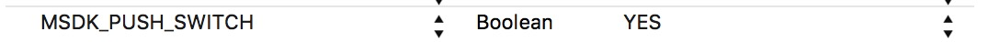

消息推送
===

 > 从2.2版本开始，MSDK接入信鸽推送   [信鸽官网](http://xg.qq.com/)。

##概述

 - 在info.plist中配置推送开关，如下图：

已经接入信鸽推送的游戏在更新MSDK2.3.0时，若想关闭MSDK的信鸽推送，则不配置此开关，或者设置为OFF。其他游戏若接入MSDK的信鸽推送，则必须配置此开关为ON。

 - MSDK ios 推送依赖苹果APNS实现，需要在developer.apple.com中开通应用的推送功能。并制作推送证书和签名文件(.mobileprovision)。
 - 推送ssl证书：MSDK需要使用此证书向应用发送推送消息，所以需要将此证书及密码交由MSDK。在dev.ied.com配置此证书
 - 签名文件：游戏上线时需要在工程Build PhasesProvisioning Profile中设置此签名文件。
 - 游戏还需要实现UIApplicationDelegate中与推送相关的5个方法：
>*游戏测试MSDK推送功能时，需要使用正式推送证书进行AD Hoc 方式打包进行测试，并请注意切勿使用全量推送方式进行推送！*

```ruby
- (BOOL)application:(UIApplication *)application didFinishLaunchingWithOptions:(NSDictionary *)launchOptions;
- (void)application:(UIApplication *)application didRegisterForRemoteNotificationsWithDeviceToken:(NSData *)deviceToken;
- (void)application:(UIApplication *)application didFailToRegisterForRemoteNotificationsWithError:(NSError *)error;
- (void)application:(UIApplication *)application didReceiveRemoteNotification:(NSDictionary *)userInfo;
- (void)applicationDidBecomeActive:(UIApplication *)application;
```

##注册推送
 - 概述中签名文件配置正确才能成功注册推送。
游戏需要didFinishLaunchingWithOptions方法中调用MSDK的WGRegisterAPNSPushNotification方法进行推送注册。
代码示例：
```ruby
- (BOOL)application:(UIApplication *)application didFinishLaunchingWithOptions:(NSDictionary *)launchOptions{
    …
    WGPlatform* plat = WGPlatform::GetInstance();
    plat->WGRegisterAPNSPushNotification(launchOptions);
    …
} 
```
---

##注册成功
 - 注册成功游戏会收到didRegisterForRemoteNotificationsWithDeviceToken回调方法，游戏需要在此方法中调用WGSuccessedRegisterdAPNSWithToken方法将deviceToken上报到MSDK。
代码示例：
```ruby
- (void)application:(UIApplication *)application didRegisterForRemoteNotificationsWithDeviceToken:(NSData *)deviceToken{
    WGPlatform *plat = WGPlatform::GetInstance();
    plat->WGSuccessedRegisterdAPNSWithToken(deviceToken);
} 
```
---

##注册失败
 - 注册失败游戏会收到didFailToRegisterForRemoteNotificationsWithError方法回调，游戏需要调用WGFailedRegisteredAPNS方法通知MSDK注册推送失败。
示例代码：
```ruby
- (void)application:(UIApplication *)application didFailToRegisterForRemoteNotificationsWithError:(NSError *)error{
    WGPlatform *plat = WGPlatform::GetInstance();
    plat->WGFailedRegisteredAPNS();
} 
```
---


##接收消息
 - 成功注册推送后，应用收到推送消息会进入didReceiveRemoteNotification方法。游戏需要在此方法中调用WGReceivedMSGFromAPNSWithDict方法，将推送消息给MSDK做解析，解析结果通知给游戏。
示例代码：
```ruby
- (void)application:(UIApplication *)application didReceiveRemoteNotification:(NSDictionary *)userInfo{
    WGPlatform *plat = WGPlatform::GetInstance();
    plat->WGReceivedMSGFromAPNSWithDict(userInfo);
} 
```
---

##清空badge

 - 应用需要在applicationDidBecomeActive中调用WGCleanBadgeNumber方法将应用桌面图标右上角的推送条目清空。
示例代码：
```ruby
- (void)applicationDidBecomeActive:(UIApplication *)application{
    WGPlatform *plat = WGPlatform::GetInstance();
    plat->WGCleanBadgeNumber();
} 
```