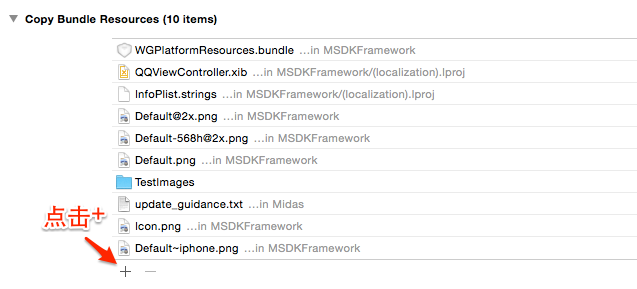
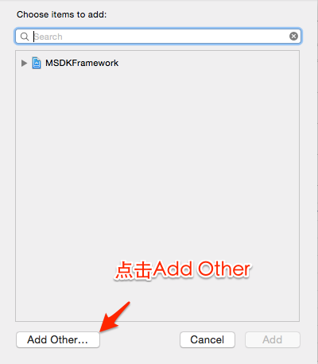

极速接入
======

### Let's Get Started!

> 请确保正在使用最新版本的 Xcode（5.0+），并且面向 iOS 5.1.1 或者更高版本。我们推荐 Xcode 5 和 iOS 6 或以上系统。

---
##Step1:引入依赖库

 * 于`Target->Build Phases->Link Binary With Libraries`添加工程依赖的系统库，如下：
```ruby
libz.dylib
libstdc++.dylib
libz.1.1.3.dylib
libsqlite3.dylib
libxml2.dylib
libstdc++.6.0.9.dylib
CoreTelephony.framework
SystemConfiguration.framework
UIKit.framework
Foundation.framework
CoreGraphics.framework
MobileCoreServices.framewrok
StoreKit.framework
CFNetwork.framewrok
CoreData.framework
Security.framework
CoreLocation.framework
ImageIO.framework
CoreText.framework
QuartzCore.framework
AdSupport.framework【MSDK2.6.0i以后要求】
```
【MSDK2.6.0i以后要求提审时需要在iTC选择相应的项，详见[说明](http://km.oa.com/articles/show/234073)】
---	
##Step2:引入MSDK
* 2.3.4i以及之前的版本:
  - [下载SDK](http://mcloud.ied.com/wiki/MSDK%E4%B8%8B%E8%BD%BD)
  - SDK中头文件、类库文件放置在`WGPlatform.framework`，需要引入到工程设置的`Target->Build Phases->>Link Binary With Libraries`中。
  1. 
  2. 
  3. 
  - SDK中内置浏览器、公告所需的资源文件，放置在`WGPlatformResources.bundle`，需要引入到工程设置的`Target->Build Phases->Build Phases->Copy Bundle Resources`中。
  1. 
  2. 
  3. 

* 2.4.0i及以后为插件化版本，可按需求导入相应的框架，导入方式同2.3.4i。
  1. MSDKFoundation：基础依赖库，若要使用其他库均需先导入该框架。
  2. MSDK:手Q和微信登录、分享功能；
  3. MSDKMarketing：提供交叉营销、内置浏览器功能。公告、内置浏览器所需的资源文件放置在WGPlatformResources.bundle文件中。
  4. MSDKXG：提供信鸽Push功能。
  以上四个组件同时提供C99和C11语言标准，其中**_C11包为C11的版本。
  
    如果只想使用C++接口，只需要导入以下几个头文件即可：
```
<MSDKFoundation/MSDKStructs.h>
<MSDK/WGInterface.h>
<MSDK/WGPlatform.h>
<MSDK/WGPlatformObserver.h>
```  
---
##Step3:配置项
 
  * 在.plist文件中，添加配置项，主要配置项如下。

| Key      |    Type | Value  |备注|相关模块|
| :-------- | --------:| :-- |:--|:---:|
| MSDK_URL  | String |  http://msdktest.qq.com |MSDK测试环境，正式上线前需改为http://msdk.qq.com|所有|
| MSDK_PUSH_URL  | String |  http://pushtest.msdk.qq.com |为MSDK上报信息测试环境，正式上线前需改为http://push.msdk.qq.com|所有|
| QQAppID  | String |  各游戏不同 |手Q的Appid|所有|
| QQAppKey  | String |  各游戏不同 |手Q的AppKey|所有|
| WXAppID  | String |  各游戏不同 |微信的Appid|所有|
| WXAppKey  | String |  各游戏不同 |微信的AppKey|所有|
| CHANNEL_DENGTA  | String |  1001 |iOS系统渠道号|统计|
| MSDK_PUSH_SWITCH  | String |  ON |此为推送功能的开关，若不使用MSDK推送则不需要配置|推送|
| MSDK_XGPUSH_URL  | String |  信鸽推送URL，可以不配置 |信鸽推送URL，不配置则使用默认值|推送|
| MSDK_OfferId  | String |  各游戏不同 |支付所需的OfferId|支付|
| NeedNotice  | Boolean |  是否启用公告功能 |Yes-启用 No（或不配置）-禁用|公告|
| Noticetime  | Number |  公告自动拉取的时间间隔（秒） |默认15分钟|公告|  
| NSLocationWhenInUseUsageDescription  | NSString |  用于iOS8下LBS定位功能 |值可为空|LBS| 
 
  *	在工程设置的`Target->Info->URL Types`中设置URL Scheme，配置如下：
  
| Identifier|    URL Scheme | 示例  | 备注  |
| :-------- | :--------| :--: | :--: |
| weixin  | 游戏的微信AppID |wxcde873f99466f74a | 接入微信必填   |
| tencentopenapi  | 格式：tencent+游戏的QQAppID |tencent100703379|  接入手Q必填，中间无空格   |
| QQ  | 格式：QQ+游戏的QQAppID的16进制 |QQ06009C93 | 接入手Q必填，中间无空格   |
| QQLaunch  | 格式：tencentlaunch+游戏的QQAppID |tencentlaunch100703379|  接入手Q必填，中间无空格   |

   > **注：各游戏配置存在不一致，具体请咨询各游戏与MSDK接口人或RTX联系“连线MSDK”。**
  
---
 ##Step4:实现回调对象
 
  * 全局回调对象处理游戏授权、分享、查询或平台唤起等结果，此对象需要继承并实现`WGPlatformObserver`类中的所有方法。
  * 示例：新建名为MyObserver的全局回调对象，粘贴代码如下：
  * 2.3.4i以及之前的版本:
  ```ruby
//MyObserver.h
//若使用C99编译选项
#import <WGPlatform/WGPlatform.h>
#import <WGPlatform/WGPublicDefine.h>
//若使用C11编译选项
#import <WGPlatform_C11/WGPlatform.h>
#import <WGPlatform_C11/WGPublicDefine.h>
class MyObserver: public WGPlatformObserver,public APMidasInterfaceObserver
{
public:
    void OnLoginNotify(LoginRet& loginRet);//登录回调
    void OnShareNotify(ShareRet& shareRet);//分享回调
    void OnWakeupNotify(WakeupRet& wakeupRet);//平台唤起回调
    void OnRelationNotify(RelationRet& relationRet);//查询关系链相关回调
    void OnLocationNotify(RelationRet &relationRet);//定位相关回调
    void OnLocationGotNotify(LocationRet& locationRet);//定位相关回调
    void OnFeedbackNotify(int flag,std::string desc);//反馈相关回调
    std::string OnCrashExtMessageNotify();//crash时的处理
}
```
```ruby
//MyObserver.mm
#include "MyObserver.h"
void MyObserver::OnLoginNotify(LoginRet& loginRet){}
void MyObserver::OnShareNotify(ShareRet& shareRet){}
void MyObserver::OnWakeupNotify(WakeupRet& wakeupRet){}
void MyObserver::OnRelationNotify(RelationRet &relationRet){}
void MyObserver::OnLocationNotify(RelationRet &relationRet) {}
void MyObserver::OnLocationGotNotify(LocationRet& locationRet){}
void MyObserver::OnFeedbackNotify(int flag,std::string desc){}
std::string MyObserver::OnCrashExtMessageNotify(){return "message";}
```

  * 2.4.0i以及之后的版本:
```ruby
//MyObserver.h
//若使用C99编译选项
#import <MSDK/MSDK.h>
//若使用C11编译选项
#import <MSDK_C11/MSDK.h>
class MyObserver: public WGPlatformObserver,public WGADObserver
{
public:
void OnLoginNotify(LoginRet& loginRet);//登录回调
void OnShareNotify(ShareRet& shareRet);//分享回调
void OnWakeupNotify(WakeupRet& wakeupRet);//平台唤起回调
void OnRelationNotify(RelationRet& relationRet);//查询关系链相关回调
void OnLocationNotify(RelationRet &relationRet);//定位相关回调
void OnLocationGotNotify(LocationRet& locationRet);//定位相关回调
void OnFeedbackNotify(int flag,std::string desc);//反馈相关回调
std::string OnCrashExtMessageNotify();//crash时的处理
void OnADNotify(ADRet& adRet);//广告回调
}
```
```ruby
//MyObserver.mm
#include "MyObserver.h"
void MyObserver::OnLoginNotify(LoginRet& loginRet){}
void MyObserver::OnShareNotify(ShareRet& shareRet){}
void MyObserver::OnWakeupNotify(WakeupRet& wakeupRet){}
void MyObserver::OnRelationNotify(RelationRet &relationRet){}
void MyObserver::OnLocationNotify(RelationRet &relationRet) {}
void MyObserver::OnLocationGotNotify(LocationRet& locationRet){}
void MyObserver::OnFeedbackNotify(int flag,std::string desc){}
std::string MyObserver::OnCrashExtMessageNotify(){return "message";}
void MyObserver::OnADNotify(ADRet& adRet){}
```

---
## Step5:设置全局回调对象

 * 打开 `AppDelegate.mm` 文件，添加下列导入语句到头部：
  * 2.3.4i以及之前的版本:
 ```ruby
//若使用C99编译选项
#import <WGPlatform/WGPlatform.h>
#import "WGPlatform/WGInterface.h"
#import <WGPlatform/WGPublicDefine.h>
//若使用C11编译选项
#import <WGPlatform_C11/WGPlatform.h>
#import "WGPlatform_C11/WGInterface.h"
#import <WGPlatform_C11/WGPublicDefine.h>
#import "MyObserver.h"
```
   * 粘贴如下代码至`application:didFinishLaunchingWithOptions:`
 ```ruby
WGPlatform *plat = WGPlatform::GetInstance();
MyObserver  *pObserver =plat->GetObserver();
MyADObserver *adObserver =(MyADObserver *)plat->GetADObserver();
if(!pObserver){
        pObserver = new MyObserver(); 
        plat -> WGSetObserver(pObserver);
}
```
   * 粘贴如下代码至`application:openURL:sourceApplication:annotation:`
```ruby
WGPlatform* plat = WGPlatform::GetInstance();
MyObserver* ob =(MyObserver *) plat->GetObserver();
        if (!ob) {
            ob = new MyObserver();
            plat->WGSetObserver(ob);
        }
return  [WGInterface  HandleOpenURL:url];
```

  * 2.4.0i以及之后的版本:
```ruby
//若使用C99编译选项
#import <MSDK/MSDK.h>
#import "MyObserver.h"
//若使用C11编译选项
#import <MSDK_C11/MSDK.h>
#import "MyObserver.h"
```
   * 粘贴如下代码至`application:didFinishLaunchingWithOptions:`
```ruby
WGPlatform* plat = WGPlatform::GetInstance();
WGPlatformObserver *ob = plat->GetObserver();
if (!ob)
{
        MyObserver* ob = MyObserver::GetInstance();
        plat->WGSetObserver(ob);
}

或
WGPlatformObserver *ob = [MSDKService getObserver];
if (!ob)
{
        MyObserver* ob = MyObserver::GetInstance();
        [MSDKService setObserver:ob];
}

```
   * 粘贴如下代码至`application:openURL:sourceApplication:annotation:`
```ruby
WGPlatform* plat = WGPlatform::GetInstance();
WGPlatformObserver *ob = plat->GetObserver();
if (!ob)
{
        MyObserver* ob = MyObserver::GetInstance();
        plat->WGSetObserver(ob);
}
return  [WGInterface  HandleOpenURL:url];

或
WGPlatformObserver *ob = [MSDKService getObserver];
if (!ob)
{
        MyObserver* ob = MyObserver::GetInstance();
        [MSDKService setObserver:ob];
}
return [MSDKService handleOpenUrl:url];

```

>**创建对象后，此对象只需被设置一次，重复设置会覆盖，只有最近设置的才能收到回调。建议于游戏初始化时设置全局回调对象。**

---
## Step:6 Good To Go!
###接下来：[QQ接入](QQ.md) [微信接入](WX.md) 
