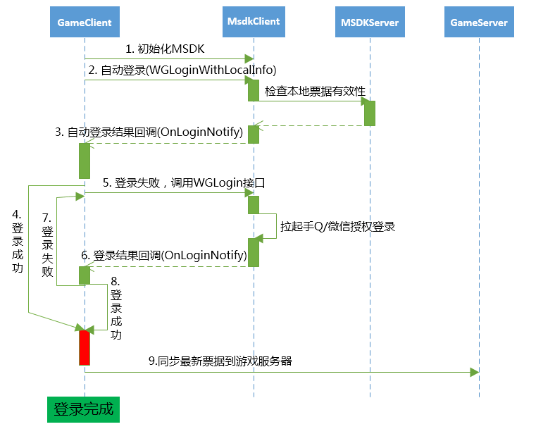

#MSDK票据

##概述

该模块将会对MSDK所有授权相关的模块做一次梳理，包括授权登录、自动登录、快速登录、票据刷新、读取等模块的详细说明。游戏可以先参照该模块熟悉MSDK所有授权相关的模块，然后再根据游戏自己的需求使用对应接口完成授权等功能。

##名词解释、接口说明
	
###登录相关名词解释：
| 名称| 描述 |支持平台| 调用接口 |
|: ------------- :|
| 授权登录 | 游戏通过拉起平台的授权界面，引导用户授权游戏获得登录所需票据| 手Q/微信 | WGLogin |
| 快速登录 | 玩家的操作使平台拉起游戏时会透传登录相关的票据信息从而登录进入游戏。| 手Q| 无 |
| 自动登录 | 游戏启动的时候，直接使用用户上次登录游戏的票据信息登录进入游戏| MSDK 提供功能| WGLoginWithLocalInfo |
| 自动刷新 | MSDK提供自动刷新微信票据接口 | MSDK 提供功能 | 无 |
| 异帐号 | 当前游戏内登录的帐号和平台登录的帐号不一致 | 平台/MSDK均支持| WGSwitchUser |

### 登录相关接口概述

与登录相关的调用接口中`WGGetLoginRecord`，`WGLogout`是同步接口，其他接口都是异步实现，因此通过callback的形式将最终的结果通过OnLoginNotify（LoginRet）来回调给游戏。异帐号相关的接口单独在MSDK的异帐号模块说明。具体如下:

| 名称| 描述 |备注 |
|: ------------- :|
| WGGetLoginRecord | 获取本地保存的当前用户登录票据 |  |
| WGSetPermission | 设置游戏需要用户授权获取的平台信息 | |
| WGLogin | 拉起平台授权登录 |  |
| WGLogout | 清空当前登录帐号的登录信息 |  |
| WGLoginWithLocalInfo | 通过本地保存的登录票据尝试登录|  |
| handleCallback | 处理各个平台唤起 |  |
| WGRefreshWXToken | 通过微信refreshToken刷新获取accessToken |  从MSDK 2.0开始不建议游戏自己刷新微信票据 |

### 推荐登录流程（2.6.0i之前版本）



**步骤说明：**

* 步骤1：启动游戏后首先初始化MSDK。
* 步骤2：调用自动登录接口`WGLoginWithLocalInfo()`，此接口会去MSDK服务端检查本地票据是否有效。
* 步骤3：自动登录接口会通过`OnLoginNotify(LoginRet ret)`将登录结果回调给游戏。通过`ret.flag`判断登录结果，如果为`eFlag_Succ`(0)或`eFlag_WX_RefreshTokenSucc`(2005)则为登录成功，其他为失败。
* 步骤4：登录授权成功，跳到步骤9
* 步骤5：自动登录失败，调用` WGLogin(EPlatform platform)`拉起手Q或微信平台登录授权。
* 步骤6：登录结果通过`OnLoginNotify(LoginRet ret)`回调。通过`ret.flag`判断登录结果，如果为`eFlag_Succ`(0)则为登录成功，其他为失败。
* 步骤7：拉起平台登录授权失败，游戏引导用户重新登录，跳到步骤5。
* 步骤8：登录授权成功。
* 步骤9：同步客户端中最新的票据给游戏服务器。如果游戏服务端需要使用登录票据，**注意一定要在收到登录成功的回调后同步最新票据**，以免服务端使用失效的票据操作。 

###登录相关接口推荐用法

1. 授权登录：直接调用`WGLogin`拉起对应平台的授权
- 游戏启动、游戏从后台切换会前台检查票据是否有效：调用`WGLoginWithLocalInfo`完成票据有效性的验证
- 获取票据：直接调用`WGGetLoginRecord`从本地读取
- 注销登录：直接调用`WGLogout`清空当前用户的登录信息

## 接入登录具体工作（开发必看）

**游戏开发可以按照下面提供的步骤完成MSDK登录模块的接入，降低接入成本和遗漏的处理逻辑。强烈推荐认真了解！！！**

1. 设置需要用户授权的权限：
	- 游戏在MSDK初始化以后要调用手Q权限设置的接口设置需要用户授权给游戏的平台权限。具体方法[点击查看](#设置需要用户授权的权限WGSetPermission)。
- **处理授权登录**：
	1. 在登录按钮的点击事件的处理函数中调用`WGLogin`完成授权登录。具体方法[点击查看](#处理授权登录WGLogin)。
- **处理自动登录**：
	1. 在游戏回到前台之后调用`WGLoginWithLocalInfo`完成游戏被拉起时的自动登录。具体方法[点击查看](#处理自动登录WGLoginWithLocalInfo)。
	- 在AppDelegate的applicationDidEnterBackground里面判断游戏切换到后台的时间，如果超过30分钟，自动调用`WGLoginWithLocalInfo`完成自动登录
		- 对于如何判断游戏切换到后台的时间，游戏可以参考MSDK的demo的做法，在切换的时候记录一个时间戳，返回以后计算时间差
- **处理用户注销**：
	- 在注销按钮的点击事件的处理函数中调用WGLogout完成授权登录。具体方法[点击查看](#处理用户注销WGLogout)
- **处理MSDK的登录回调**：
	- 在游戏对MSDK回调处理的逻辑中增加对于对onLoginNotify的处理。具体方法[点击查看](#处理MSDK的登录回调)
- **处理MSDK的拉起回调**：
	- 在游戏对MSDK回调处理的onWakeUpNotify中增加对平台拉起的处理。具体方法[点击查看](#处理MSDK的拉起回调)
- **处理异帐号逻辑**：
	- 游戏对于异帐号的处理逻辑，具体内容参照[MSDK异帐号接入](diff-account.md#异帐号处理逻辑（开发关注）)
- **其余特殊逻辑处理**：
	- 低内存机器授权过程游戏被杀后的登录方案。具体方法[点击查看](#手Q授权在低内存机器授权过程游戏被杀后的登录方案)
	- MSDK微信票据过期自动刷新机制。具体方法[点击查看](#微信票据自动刷新)
	- 登录数据上报接口调用要求。具体方法[点击查看](#登录数据上报)

##设置需要用户授权的权限WGSetPermission

####概述

游戏在MSDK初始化以后要调用手Q权限设置的接口设置需要用户授权给游戏的平台权限。

####接口声明

	/**
	 * @param permissions ePermission枚举值 或 运算的结果, 表示需要的授权项目
	 * @return void
	 */
	void WGSetPermission(int permissions);

#### 接口调用：

	// 设置拉起QQ时候需要用户授权的项
	WGPlatform.WGSetPermission(WGQZonePermissions.eOPEN_ALL); 

#### 注意事项：

1. 游戏需要在MSDK初始化之后调用该接口，建议接口参数就填**`eOPEN_ALL`**。缺少该项会导致游戏调用部分接口时提示没有权限。


##处理授权登录WGLogin

#### 概述：

**拉起手Q/微信客户端或web页面(手Q未安装)授权，在用户授权以后通过onLoginNotify通知游戏获取到openID、accessToken、payToken、pf、pfkey等登录信息**


####接口声明：

	/**
	 * @param platform 游戏传入的平台类型, 可能值为: ePlatform_QQ, ePlatform_Weixin
	 * @return void
	 *   通过游戏设置的全局回调的OnLoginNotify(LoginRet& loginRet)方法返回数据给游戏
	 */
	void WGLogin(ePlatform platform);

#### 接口调用：

	WGPlatform::GetInstance()->WGLogin(ePlatform_QQ); 

#### 注意事项：

- **通用**：
	- **收不到OnLoginNotify/OnWakeupNotify回调：
		- 请确保AppDelegate的didFinishLaunchingWithOptions函数return YES;
		- info.plist中QQ和微信的appid/appkey配置正确;
		- Url Schemes按照wiki的要求配置;

##处理自动登录WGLoginWithLocalInfo

#### 概述：

此接口用于已经登录过的游戏, 在用户再次进入游戏时使用, 游戏启动时先调用此接口, 此接口会尝试到后台验证票据并通过OnLoginNotify将结果回调给游戏。游戏不再需要处理微信票据刷新, 手Q/微信AccessToken验证等工作。

####接口声明：

	/**
	  *  @since 2.0.0
	  *  此接口用于已经登录过的游戏, 在用户再次进入游戏时使用, 游戏启动时先调用此接口, 此接口会尝试到后台验证票据
	   *  此接口会通过OnLoginNotify将结果回调给游戏, 如果为`eFlag_Succ`(0)或`eFlag_WX_RefreshTokenSucc`(2005)则为登录成功，其他为失败。
	  *  如果本地没有票据或者本地票据验证失败返回的flag为eFlag_Local_Invalid, 游戏接到此flag则引导用户到授权页面授权即可.
	  *  如果本地有票据并且验证成功, 则flag为eFlag_Succ, 游戏接到此flag则可以直接使用sdk提供的票据, 无需再次验证.
	  *  @return void
	  *   Callback: 验证结果通过我OnLoginNotify返回
	  */
 	void WGLoginWithLocalInfo();

####注意事项：

1. 游戏在使用`WGLoginWithLocalInfo`登录以后，获得的票据在无需传到游戏后台去验证有效性，MSDK会验证以后才回调给游戏

##处理用户注销WGLogout

#### 概述：

调用该接口可以清空当前登录帐号的登录信息。

####接口声明：

	/**
	 * @return bool 返回值已弃用, 全都返回true
	 */
	bool WGLogout();

####调用示例：

    WGPlatform.WGLogout();

####注意事项：

1. 游戏**点击注销按钮或者其余弹出登录框的逻辑中都必须要调用WGLogout来清空本地的登录信息**。否则会导致授权失败等问题

##处理MSDK的登录回调

#### 概述：

MSDK的登录回调来自以下几个场景：

- WGLogin授权回来
- WGLoginWithLocalInfo登录回来
- 处理平台拉起以后（如果是带票据拉起）

#### 具体处理：

	OnLoginNotify(LoginRet ret) {
        Logger.d("called");
        switch (ret.flag) {
            case CallbackFlag.eFlag_Succ:
				 CallbackFlag.eFlag_WX_RefreshTokenSucc
            	//授权成功的处理逻辑
				break;
            case CallbackFlag.eFlag_WX_UserCancel:
				 CallbackFlag.eFlag_QQ_UserCancel
				//用户取消授权逻辑
				break;
			case CallbackFlag.eFlag_WX_UserDeny
				//用户拒绝微信授权逻辑
				break;
            case CallbackFlag.eFlag_WX_NotInstall:
				//玩家设备未安装微信客户端逻辑
				break;
			case CallbackFlag.eFlag_QQ_NotInstall:
				//玩家设备未安装QQ客户端逻辑
				break;
            case CallbackFlag.eFlag_WX_NotSupportApi:
				//玩家微信客户端不支持此接口逻辑
				break;
            case CallbackFlag.eFlag_QQ_NotSupportApi:
				//玩家手Q客户端不支持此接口逻辑
				break;
            case CallbackFlag.eFlag_NotInWhiteList
				//玩家账号不在白名单中逻辑
				break;
            default:
                // 其余登录失败逻辑
                break;
        }
    }

#### 注意事项：
**这里仅仅处理了重要的loginNotify的逻辑，完整的回调flag信息请点击查看[回调标识eFlag](const.md#回调标识eFlag)，游戏可以根据自己需要处理**

##处理MSDK的拉起回调

#### 概述

游戏对于平台拉起的处理，主要是处理异帐号相关的逻辑。具体的处理如下

#### 具体处理：

        if (CallbackFlag.eFlag_Succ == ret.flag
                || CallbackFlag.eFlag_AccountRefresh == ret.flag) {
            //代表拉起以后通过本地帐号登录游戏，处理逻辑与onLoginNotify的一致
            
        } else if (CallbackFlag.eFlag_UrlLogin == ret.flag) {
            // MSDK会尝试去用拉起账号携带票据验证登录，结果在OnLoginNotify中回调，游戏此时等待onLoginNotify的回调

        } else if (ret.flag == CallbackFlag.eFlag_NeedSelectAccount) {
            // 当前游戏存在异账号，游戏需要弹出提示框让用户选择需要登录的账号

        } else if (ret.flag == CallbackFlag.eFlag_NeedLogin) {
            // 没有有效的票据，无法登录游戏，此时游戏调用WGLogout登出游戏让用户重新登录

        } else {
            //默认的处理逻辑建议游戏调用WGLogout登出游戏让用户重新登录
        }

##处理异帐号逻辑

异帐号相关的模块可以参照[MSDK异帐号接入](diff-account.md#异帐号处理逻辑（开发关注）)

##其余特殊逻辑处理

### 手Q授权在低内存机器授权过程游戏被杀后的登录方案

由于目前大部分游戏占用内存很大，因此在授权过程中，当拉起手Q授权时，会触发iOS的内存回收机制将后台的游戏进程杀掉导致游戏手Q授权没有没有进入游戏。游戏需要在AppDelegate中增加以下代码来保证被杀以后依然可以带票据拉起进入游戏。
```ruby
- (BOOL)application:(UIApplication *)application openURL:(NSURL *)url sourceApplication:(NSString *)sourceApplication annotation:(id)annotation
{
    NSLog(@"!!!!!!!!!!!!!!!!!!!!!!!!!!!!!!!!!!!!!!!!!!!!!!!!!url == %@",url);
    WGPlatform* plat = WGPlatform::GetInstance();
    WGPlatformObserver *ob = plat->GetObserver();
    if (!ob) {
        MyObserver* ob = new MyObserver();
        ob->setViewcontroller(self.viewController);
        plat->WGSetObserver(ob);
    }
	//没有实现广告功能可不设置WGADObserver
    WGADObserver *adOb = plat->GetADObserver();
    if (!adOb) {
        MyAdObserver *adObserver = new MyAdObserver();
        plat->WGSetADObserver(adObserver);
    }
     return  [WGInterface  HandleOpenURL:url];
}
```
### 微信票据自动刷新

1. MSDK2.0.0版本开始, 会再游戏运行期间定时验证并刷新微信票据, 如果需要刷新,MSDK会自动刷新完成, 并通过OnLoginNotify通知游戏, flag为eFlag_WX_RefreshTokenSucc和eFlag_WX_RefreshTokenFail（已经包含在onLoginNotify的回调中）。
- **游戏接到新的票据以后需要同步更新游戏客户端保存的票据和服务器的票据, 以保证之后能使用新票据完成后续流程。**
- 如果游戏不需要微信票据自动刷新功能，在`info.plist`中，将`AutoRefreshToken`设为`NO`即可。

## 其余接口列表

###WGGetLoginRecord

#### 概述：

调用该接口可以获取到当前的帐号登录信息。

####接口声明：

	/**
	 * @param loginRet 返回的记录
	 * @return 返回值为平台id, 类型为ePlatform, 返回ePlatform_None表示没有登录记录
	 *   loginRet.platform(类型为ePlatform)表示平台id, 可能值为ePlatform_QQ, ePlatform_Weixin, ePlatform_None.
	 *   loginRet.flag(类型为eFlag)表示当前本地票据的状态, 可能值及说明如下:
	 *     eFlag_Succ: 授权票据有效
	 *     eFlag_QQ_AccessTokenExpired: 手Q accessToken已经过期, 显示授权界面, 引导用户重新授权
	 *     eFlag_WX_AccessTokenExpired: 微信accessToken票据过期，需要调用WGRefreshWXToken刷新
	 *     eFlag_WX_RefreshTokenExpired: 微信refreshToken, 显示授权界面, 引导用户重新授权
	 *   ret.token是一个Vector<TokenRet>, 其中存放的TokenRet有type和value, 通过遍历Vector判断type来读取需要的票据. 
     *
	 */
	int WGGetLoginRecord(LoginRet& loginRet);

####调用示例：

    LoginRet ret = new LoginRet();
    WGPlatform.WGGetLoginRecord(ret);

如果获取的LoginRet中的flag为eFlag_Succ则可认为登录有效，可读取有效的票据信息。其中token可以按如下方式获取：

微信平台：

    NSString *accessToken = "";
    NSString *refreshToken = "";
    for (int i = 0; i < loginRet.token.size(); i++) {
             if (loginRet.token.at(i).type == eToken_WX_Access) {
                 accessToken = [NSString stringWithCString:loginRet.token.at(i).value.c_str() encoding:NSUTF8StringEncoding];
             } else if (loginRet.token.at(i).type == eToken_WX_Refresh) {
                 payToken = [NSString stringWithCString:loginRet.token.at(i).value.c_str() encoding:NSUTF8StringEncoding];
             }
    }

QQ平台：

    NSString *accessToken = "";
    NSString *payToken = "";
    for (int i = 0; i < loginRet.token.size(); i++) {
        if (loginRet.token.at(i).type == eToken_QQ_Access) {
            accessToken = [NSString stringWithCString:loginRet.token.at(i).value.c_str() encoding:NSUTF8StringEncoding];
        } else if (loginRet.token.at(i).type == eToken_QQ_Pay) {
            payToken = [NSString stringWithCString:loginRet.token.at(i).value.c_str() encoding:NSUTF8StringEncoding];
        }
    }

#### 注意事项：

无

##常见问题

1. 支付时提示paytoken过期，则需要拉起登录界面重新授权后方能支付。paytoken过期以后必须重新授权。

## MSDK2.6.0i以后的票据自动刷新流程
**概述**

MSDK2.6.0i以后，在支持之前版本登录流程的基础上，优化新流程。游戏只需要关注'WGLogin' 'WGGetLoginRecord'即可完成登录和票据处理：

* 游戏需要登录票据时的调用逻辑：
  
  `如果'WGGetLoginRecord'返回非0，此时调用WGLogin() （不需要附加平台参数），然后在onLoginNotify处理票据异步刷新后的结果`
* 在需要使用本地票据登录时，不再需要调用'WGLoginWithLocalInfo'，改为调用WGLogin() ,然后等待onLoginNotify的结果。
* MSDK内部的票据定时刷新逻辑：
  

**新的调用步骤说明：**

* 步骤1：启动游戏后首先初始化MSDK。
* 步骤2：调用自动登录接口`WGLogin() （不需要附加平台参数）`，此接口会去MSDK服务端检查本地票据是否有效。
* 步骤3：自动登录接口会通过`OnLoginNotify(LoginRet ret)`将登录结果回调给游戏。通过`ret.flag`判断登录结果，如果为`eFlag_Succ`(0)则为登录成功，其他为失败。
* 步骤4：登录授权成功，跳到步骤9
* 步骤5：自动登录失败，调用` WGLogin(EPlatform platform)`拉起手Q或微信平台登录授权。
* 步骤6：登录结果通过`OnLoginNotify(LoginRet ret)`回调。通过`ret.flag`判断登录结果，如果为`eFlag_Succ`(0)则为登录成功，其他为失败。
* 步骤7：拉起平台登录授权失败，游戏引导用户重新登录，跳到步骤5。
* 步骤8：登录授权成功。
* 步骤9：同步客户端中最新的票据给游戏服务器。如果游戏服务端需要使用登录票据，**注意一定要在收到登录成功的回调后同步最新票据**，以免服务端使用失效的票据操作。 
