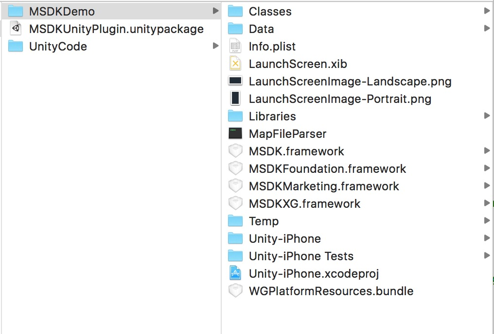

MSDK(iOS) for Unity3D 接入
===

## 概述

MSDK的Unity3D版本是使用Unity3D引擎对MSDK的接口的C#封装。使用此版本游戏可直接在C#层调用MSDK的接口，减少手机平台相关的操作。

MSDK(iOS)的Unity发布包(zip)主要包含`UnityCode`、`MSDKDemo`及`MSDKUnityPlugin.unityPackage`。如下图所示：

其中`UnityCode`是调用MSDK的C#接口的Unity3D示例工程，可参考`Assets\MSDKDemo.cs`了解MSDK接口的调用。`MSDKDemo`是UnityCode导出为Xcode工程后的MSDK示例工程。`MSDKUnityPlugin.unityPackage`是此版本的Unity资源包，包含MSDK的C#接口。

## 接入配置

### Step1:引入C#接口

在Unity3D的IDE中打开游戏工程，双击`MSDKUnityPlugin.unityPackage`，选择需要的文件导入，如下图：

**注意：**
导入过程文件如果已经存在不会进行覆盖，所以更新版本时，请务必先删除插件的内容

### Step2:挂载脚本

选择第一个或主场景(Scene)，新建一个空游戏对象(GameObject)，命名为MSDKMessage。打开Plugins目录，将MSDKMessage.cs脚本文件拖动到新建的游戏对象上进行脚本挂接。

### Step3:接口调用

在Unity3D中，与MSDK有关的部分放在Assets/Plugins/iOS文件夹下：

MSDK API都封装在MSDKConnector类，回调都封装在MSDKMessage类。在"UnityCode"中`MSDKDemo.cs`是对MSDK的C#接口的调用示例，游戏可参考此类时行C#接口调用。

现在以QQ登陆为例，演示如何调用MSDK API与处理回调：

    // MSDKConnector的命名空间
    using MSDKConnector;
    // MSDKConnector类采用单例设计
    MSDKConector.Instance.Login(2);      // 登陆QQ
    
接下来处理登陆回调（在MSDKMessage里，该登陆回调方法命名为OnLoginNotify)

	/// 

	///  登陆回调
	/// 

	/// <param name="jsonRet">Json ret.</param>
	void OnLoginNotify(string jsonRet)
	{
		Debug.Log ("\n\nUnity Receive Message From iOS\n\n OnLoginNotify = " + jsonRet);
		//JSON解析后根据flag进行下一步操作。
	}

### Step4:导出为Xcode工程，copy接口文件

将Unity工程导出为Xcode工程，从MSDKDemo/Classes/NeedFiles/中copy下图中的四个文件至Xcode工程中。

### Step5:接入MSDK各framework

按需接入MSDK各个framework。

