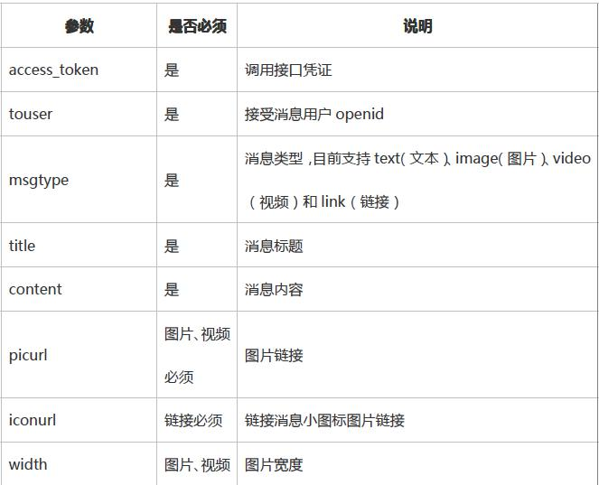

# 3.微信接口 #

## 3.1auth服务 ##

　　实现微信Oauth授权登录相关功能

### 3.1.1 /auth/refresh_token ###

#### 3.1.1.1接口说明 ####

　　　由于access_token拥有较短的有效期(2小时)，当access_token超时后，可以使用refresh_token进行刷新，refresh_token拥有较长的有效期30天，refresh_token失效后，需要重新登录。 
　　　url中带上msdkExtInfo=xxx（请求序列号），可以在后回内容中，将msdkExtInfo原数据带回来，即可实现纯异常请求。msdkExtInfo为可选参数。

#### 3.1.1.2输入参数说明 ####

| 参数名称| 类型|描述|
| ------------- |:-------------:|:-----|
| appid|string| 应用在平台的唯一id |
| refreshToken|string|填写通过前端登录获取到的refreshToken参数 |

#### 3.1.1.3输出参数说明 ####

| 参数名称| 描述|
| ------------- |:-----|
| ret|返回码  0：正确，其它：失败 |
| msg|ret非0，则表示“错误码，错误提示”，详细注释参见第5节|
| accessToken|接口调用凭证 |
| expiresIn|accessToken接口调用凭证过期时间，单位秒 |
| refreshToken|用户刷新accessToken用 |
| openid|普通用户唯一标识（微信平台） |
| scope|用户授权的作用域，使用逗号（,）分隔，作用域详细信息见下表。作用域名称	作用	默认状态 snsapi_friend	授权时默认不勾选	授权获取用户好友资料 snsapi_message	授权时默认不勾选	授权获取用户发微信资格 snsapi_userinfo	授权时默认勾选	授权获取用户个人资料 |

#### 3.1.1.4 接口调用说明 ####

| 参数名称| 描述|
| ------------- |:-----|
| url|http://msdktest.qq.com/auth/refresh_token/ |
| URI|?timestamp=**&appid=**&sig=**&openid=**&encode=1|
| 格式|JSON |
| 请求方式|POST  |

#### 3.1.1.5 请求示例 ####

	POST /auth/refresh_token/?timestamp=*&appid=**&sig=***&openid=**&encode=1 HTTP/1.0
	Host:$domain
	Content-Type: application/x-www-form-urlencoded
	Content-Length: 198
	
	{
	    "appid": "wxcde873f99466f74a",
	    "refreshToken": "OezXcEiiBSKSxW0eoylIeLl3C6OgXeyrDnhDI73sCBJPLafWudG-idTVMbKesBkhBO_ZxFWN4zlXCpCHpYcrXFXf2RE2ETF5F7lhiPkxA9ewAu90r3JLXpM1T4nfr9Iz184ZB0G7br72EfycDenriw"
	}
	
	//返回结果
	{
	    "ret": 0,
	    "msg": "success",
	    "accessToken": "OezXcEiiBSKSxW0eoylIeLl3C6OgXeyrDnhDI73sCBJYyBcXKXYWTlxU_BAMfu7Rzsr51Nu-CarhcPT6zYlD9FrWRzuA0ccQMgrTGqpao2AnzoP_nZ6CrBdwZ3VEQcqDPNZ-wLIvK998t3s2ecEM4Q",
	    "expiresIn": 7200,
	    "refreshToken": "OezXcEiiBSKSxW0eoylIeLl3C6OgXeyrDnhDI73sCBJYyBcXKXYWTlxU_BAMfu7Rzsr51Nu-CarhcPT6zYlD9D8IrNu9lm2w4XfMqS3j9OJgjv_8L1vvSkTjBt0q7X5foYiJOhVaNx6tDGzFkJw0vw",
	    "openid": "oGRTijrV0l67hDGN7dstOl8CphN0",
	    "scope": "snsapi_friend,snsapi_message,snsapi_userinfo,"
	}

### 3.1.2 /auth/check_token ###

#### 3.1.2.1接口说明 ####

微信检验授权凭证(access_token)是否有效。
url中带上msdkExtInfo=xxx（请求序列号），可以在后回内容中，将msdkExtInfo原数据带回来，即可实现纯异常请求。msdkExtInfo为可选参数。

#### 3.1.2.2输入参数说明 ####

| 参数名称| 类型|描述|
| ------------- |:-------------:|:-----|
| accessToken|string|登录态 |
| openid|string|用户在某个应用的唯一标识 |

#### 3.1.2.3输出参数说明 ####

| 参数名称| 描述|
| ------------- |:-----|
| ret|返回码  0：正确，其它：失败 | 
| msg|ret非0，则表示“错误码，错误提示”，详细注释参见第5节|

#### 3.1.2.4 接口调用说明 ####

| 参数名称| 描述|
| ------------- |:-----|
| url|http://msdktest.qq.com/auth/check_token/ |
| URI|?timestamp=**&appid=**&sig=**&openid=**&encode=1|
| 格式|JSON |
| 请求方式|POST  |

#### 3.1.2.5 请求示例 ####
	
	POST /auth/check_token/?timestamp=*&appid=**&sig=***&openid=**&encode=1 HTTP/1.0
	Host:$domain
	Content-Type: application/x-www-form-urlencoded
	Content-Length: 198
	
	{
	    "accessToken": "OezXcEiiBSKSxW0eoylIeLl3C6OgXeyrDnhDI73sCBJPLafWudG-idTVMbKesBkhBO_ZxFWN4zlXCpCHpYcrXNG6Vs-cocorhdT5Czj_23QF6D1qH8MCldg0BSMdEUnsaWcFH083zgWJcl_goeBUSQ",
	    "openid": "oGRTijiaT-XrbyXKozckdNHFgPyc"
	}
	
	//返回结果
	{"ret":0,"msg":"ok"}

## 3.2 Share服务 ##
提供微信的定向分享能力

### 3.2.1/share/upload_wx ###

#### 3.2.1.1 接口说明 ####

上传图片到微信获取media_id，给/share/wx接口的输入参数thumb_media_id使用，如分享时使用默认图片（app注册时上传的icon）则不需要调用该接口，thumb_media_id=""即可。（该接口不用每次分享的时候都调用，只有在分享时要更换图片时调用一次获取到media_id即可，后面调用/share/wx接口时直接填写已获取到的media_id）

#### 3.2.1.2 输入参数说明 ####

| 参数名称| 类型|描述|
| ------------- |:-------------:|:-----|
| flag|int| 默认填1，使用secret登录 |
| appid|string|应用唯一标识 |
| secret|string|填写appkey |
| access_token|string|默认为空"" |
| type|string|媒体文件类型，默认为缩略图（thumb） |
| filename|string|文件名称 |
| filelength|int|文件二进制流长度，以字节为单位，最大64KB|
| content_type|string|文件类型，请使用如下类型如："image/jpeg"或"image/jpg" |
| binary|string|文件的二进制流，用urlencode转码，例(php语言)：
	$filename = 'b.jpg';
	$image = './image/'.$filename;
	$handle = fopen($image,'r');
	$filelength = filesize($image);//字节数
	$contents=fread($handle,filesize($image));
	$binary = rawurlencode($contents);
	Java中注意编码为：“ISO-8859-1”， 如URLEncoder.encode(new String(bs, "ISO-8859-1"), "ISO-8859-1"); |

#### 3.2.1.3 输出参数说明 ####

| 参数名称| 描述|
| ------------- |:-----|
| ret|返回码  0：正确，其它：失败 |
| msg|ret非0，则表示“错误码，错误提示”，详细注释参见第5节|
| type|媒体文件类型，现有缩略图（thumb）） |
| media_id|媒体文件上传后获取的唯一标识，此ID用于微信分享接口的参 |
| created_at|媒体文件上传时间|
| access_token|调用接口凭证 |
| expire|忽略此参数|

#### 3.2.1.4 接口调用说明 ####

| 参数名称| 描述|
| ------------- |:-----|
| url|http://msdktest.qq.com/share/upload_wx/ |
| URI|?timestamp=**&appid=**&sig=**&openid=**&encode=1|
| 格式|JSON |
| 请求方式|POST  |

#### 3.2.1.5 请求示例 ####

	POST /share/upload_wx/?timestamp=*&appid=**&sig=***&openid=**&encode=1 HTTP/1.0
	Host:$domain
	Content-Type: application/x-www-form-urlencoded
	Content-Length: 198
	
	{"flag":1,"appid":"wx6f15c6c03a84433d","secret":"bf159627552fa6bc8473d492c5b3e06d","access_token":"","type":"thumb","filename":"b.jpg","filelength":65050,"content_type":"image\/jpeg","binary":"%FF%D8%FF%E0%00%10JFIF%00%01%01%01%00%60%00%60%00%00%FF%DB%00C%00%03%02%02%03%02%02%03%03%03%03%04%03%03%04%05%08%05%05%04%04%05%0A%07%07%06%08%0C%0A%0C%0C%0B%0A%0B%0B%0D%0E%12%10%0D%0E%11%0E%0B%0B%10%16%10%11%13%14%15%15%15%0C%0F%17%18%16%14%18%12%14%15%14%FF%DB%00C%01%03%04%04%05%04%05%09%05%05%09%14%0D%0B%0D%14%14%14%...."}
	
	//返回结果
	{
	    "ret": 0,
	    "msg": "success",
	    "type": "thumb",
	    "media_id": "CAUmtmwCq6jSGWaypYRzJRpErL-vUZj8UPeU8UupzyMFGGpmOnkeUDGLLI9RiTqN",
	    "created_at": "1379579554",
	    "access_token": "avl-4_K9aZ7MY88Tb-FKfCt3LNvsFkkCXGErRmX7tn19iqw0p45nGjB76tdRfhfi-7oWAQr8ZbvwC1EuWx_f8m5-A0kNNhEC7HAaePUokAtb6xGgRGyyAkoftjlk42sp4OSVJCgkuwWvithft4a00Q",
	    "expire": ’’
	}

### 3.2.2/share/wx ###

#### 3.2.2.1接口说明 ####
　　　将分享消息发送给微信好友（只能发送给安装了相同游戏的好友）。

#### 3.2.2.2输入参数说明 ####

| 参数名称| 类型|描述|
| ------------- |:-------------:|:-----|
| openid|string|用户在某个应用的唯一标识 |
| fopenid|string| 分享到的好友openid |
| access_token|string|登录态 |
| extinfo|string|第三方程序自定义简单数据，微信会回传给第三方程序处理，长度限制2k, 客户端点击的时候可以获取到这个字段。|
| title|string|应用消息标题 |
| description|string|应用消息描述 |
| media_tag_name|string|区分游戏消息类型，用于数据统计 |
| thumb_media_id|string|默认为空:该参数为空，分享时使用的图片为在微信平台注册时使用的图片；如需要更换分享时的图片，该media_id 通过/share/upload_wx接口获取 |

#### 3.2.2.3输出参数说明 ####

| 参数名称| 描述|
| ------------- |:-----|
| ret|返回码  0：正确，其它：失败 |
| msg|ret非0，则表示“错误码，错误提示”，详细注释参见第5节|

#### 3.2.2.4 接口调用说明 ####

| 参数名称| 描述|
| ------------- |:-----|
| url|http://msdktest.qq.com/share/wx/ |
| URI|?timestamp=**&appid=**&sig=**&openid=**&encode=1|
| 格式|JSON |
| 请求方式|POST  |

#### 3.2.2.5 请求示例 ####

	POST /share/wx/?timestamp=*&appid=**&sig=***&openid=**&encode=1 HTTP/1.0
	Host:$domain
	Content-Type: application/x-www-form-urlencoded
	Content-Length: 198
	{
	    "openid": "oGRTijrV0l67hDGN7dstOl8CphN0",
	    "fopenid": "oGRTijrV0l67hDGN7dstOl8CphN0",
	    "access_token": "OezXcEiiBSKSxW0eoylIeLl3C6OgXeyrDnhDI73sCBJYyBcXKXYWTlxU_BAMfu7Rzsr51Nu-CarhcPT6zYlD9FrWRzuA0ccQMgrTGqpao2BZMgzJc8KWgXT8uGw242GeNigmf9VQCouPmZ9ciBE4MA",
	    "extinfo": "extinfo",
	    "title": "to myself",
	    "description": "test by hunter",
	    "media_tag_name": "media_tag_name",
	    "thumb_media_id": ""
	}
	
	//返回结果
	{"ret":0,"msg":"success"}

#### 3.2.2.6 分享截图示例 ####

### 3.2.3/share/wxgame（该接口暂不对外） ### ###

#### 3.2.3.1 接口说明 ####

将消息发送给授权同一开发者账号的好友，消息将在游戏中心呈现。
消息分为展示模块（支持文本、图片、视频和链接）和按钮模块（支持拉起游戏、打开
排名版和打开链接）。通过接口请求即可构造消息请求。

#### 3.2.3.2输入参数说明 ####

| 参数名称| 类型|描述|
| ------------- |:-------------:|:-----|
| appid|string| 应用在平台的唯一id |
| openid|string|用户在某个应用的唯一标识 |
| access_token|string|登录态 |
| touser|string|接收方openid |
| msgtype|string|消息类型，目前支持text（文本）、image（图片）、video（视频）和link（链接） |
| title|string|登录态 |
| content|string|消息内容，对应text,image,video,link的内容 |
| type_info|struct|类型参数 |
| button|struct|按钮效果 |
请求示例中的参数说明：

#### 3.2.3.3输出参数说明 ####

| 参数名称| 描述|
| ------------- |:-----|
| ret|返回码  0：正确，其它：失败 |
| msg|ret非0，则表示“错误码，错误提示”，详细注释参见第5节|

#### 3.2.3.4 接口调用说明 ####

| 参数名称| 描述|
| ------------- |:-----|
| url|http://msdktest.qq.com/share/wxgame/ |
| URI|?timestamp=**&appid=**&sig=**&openid=**&encode=1|
| 格式|JSON |
| 请求方式|POST  |

3.2.3.5 请求示例

	POST /share/wxgame/?timestamp=*&appid=**&sig=***&openid=**&encode=1 HTTP/1.0
	Host:$domain
	Content-Type: application/x-www-form-urlencoded
	Content-Length: 198
	//发送文本类型消息，按钮为跳转排行版
	{
	    "access_token": "OezXcEiiBSKSxW0eoylIeLl3C6OgXeyrDnhDI73sCBJYyBcXKXYWTlxU_BAMfu7Rzsr51Nu-CarhcPT6zYlD9FrWRzuA0ccQMgrTGqpao2B9F0OYlWIOzWjd_GdcKvIZX4PQn0Qs651yNntCvTeIUg",
	    "openid": "oGRTijrV0l67hDGN7dstOl8CphN0",
	    "appid": "wxd477edab60670232",
	    "touser": "OPENID",
	    "msgtype": "text",
	    "title": "TITLE",
	    "content": "CONTENT",
	    "button": {
	        "type": "rank",
	        "name": "BUTTON_NAME",
	        "rankview": {
	            "title": "RANK_TITLE",
	            "button_name": "LAUNCH_GAME",
	            "message_ext": "MESSAGE_EXT"
	        }
	    }
	}
	//发送图片类型消息，按钮为跳转排行版
	{
	    "access_token": "OezXcEiiBSKSxW0eoylIeLl3C6OgXeyrDnhDI73sCBJYyBcXKXYWTlxU_BAMfu7Rzsr51Nu-CarhcPT6zYlD9FrWRzuA0ccQMgrTGqpao2B9F0OYlWIOzWjd_GdcKvIZX4PQn0Qs651yNntCvTeIUg",
	    "openid": "oGRTijrV0l67hDGN7dstOl8CphN0",
	    "appid": "wxd477edab60670232",
	    "touser": "OPENID",
	    "msgtype": "image",
	    "title": "TITLE",
	    "content": "CONTENT",
	    "type_info": {
	        "picurl": "PICURL",
	        "width": 180,
	        "height": 180
	    },
	    "button": {
	        "type": "rank",
	        "name": "BUTTON_NAME",
	        "rankview": {
	            "title": "RANK_TITLE",
	            "button_name": "LAUNCH_GAME",
	            "message_ext": "MESSAGE_EXT"
	        }
	    }
	}
	//发送视频类型消息，按钮为打开链接
	{
	    "access_token": "OezXcEiiBSKSxW0eoylIeLl3C6OgXeyrDnhDI73sCBJYyBcXKXYWTlxU_BAMfu7Rzsr51Nu-CarhcPT6zYlD9FrWRzuA0ccQMgrTGqpao2B9F0OYlWIOzWjd_GdcKvIZX4PQn0Qs651yNntCvTeIUg",
	    "openid": "oGRTijrV0l67hDGN7dstOl8CphN0",
	    "appid": "wxd477edab60670232",
	    "touser": "OPENID",
	    "msgtype": "video",
	    "title": "TITLE",
	    "content": "CONTENT",
	    "type_info": {
	        "picurl": "PICURL",
	        "width": 300,
	        "height": 300,
	        "mediaurl": "http://v.youku.com/v_show/id_XNjc0NTA4MzM2.html?f=21949327&ev=2"
	    },
	    "button": {
	        "type": "web",
	        "name": "BUTTON_NAME",
	        "webview": {
	            "url": "http://www.qq.com/"
	        }
	    }
	}
	//发送链接类型消息，按钮为打开游戏
	{
	    "access_token": "OezXcEiiBSKSxW0eoylIeLl3C6OgXeyrDnhDI73sCBJYyBcXKXYWTlxU_BAMfu7Rzsr51Nu-CarhcPT6zYlD9FrWRzuA0ccQMgrTGqpao2B9F0OYlWIOzWjd_GdcKvIZX4PQn0Qs651yNntCvTeIUg",
	    "openid": "oGRTijrV0l67hDGN7dstOl8CphN0",
	    "appid": "wxd477edab60670232",
	    "touser": "ocfbNjkN8WfPRFlTx4cLU-jNiXKU",
	    "msgtype": "link",
	    "title": "优酷的一条链接",
	    "content": "这是一个屌炸天的链接",
	    "type_info": {
	        "url": "http://www.youku.com/",
	        "iconurl": "http://tp4.sinaimg.cn/1949746771/180/5635873654/1"
	    },
	    "button": {
	        "type": "app",
	        "name": "启动",
	        "app": {
	            "message_ext": "ext"
	        }
	    }
	}
	
	//返回结果
	{"ret":0,"msg":"success"}

## 3.3.Relation服务 ##

　提供查询微信个人和好友账号基本信息的服务。

### 3.3.1 /relation/wxfriends_profile ###

#### 3.3.1.1接口说明 ####
　获取微信个人及同玩好友基本信息。

***PS：此接口是将/relation/wxprofile&/relation/wxfriends两个接口合并后的新接口，即只需请求一次即可拿到同玩好友的基本信息，不需要先获取到好友列表再去请求好友的个人信息。与合并前的接口共存，推荐使用此接口来获取同玩好友信息。***

#### 3.3.1.2输入参数说明 ####

| 参数名称| 类型|描述|
| ------------- |:-------------:|:-----|
| accessToken|string|登录态 |
| openid|string|用户在某个应用的唯一标识 |

#### 3.3.1.3输出参数说明 ####

| 参数名称| 描述|
| ------------- |:-----|
| ret|返回码  0：正确，其它：失败 |
| msg|ret非0，则表示“错误码，错误提示”，详细注释参见第5节|
| lists|微信同玩好友个人信息列表，类型`vector<WXInfo>`|
| privilege|用户特权信息，json 数组，如微信沃卡用户为（chinaunicom）只返回首位openid对应的沃卡信息，其后的openid无法获取到沃卡信息。 |
| country|国家 |
| language|语言 |

	struct WXInfo {
		string          nickName;       //昵称
		int             sex;            //性别1男2女
		string          picture;        //用户头像URL,必须在URL后追加以下参数/0，/132，/96，/64，这样可以分别获得不同规格的图片：原始图片(/0)、132*132(/132)、96*96(/96)、64*64(/64)、46*46(/46)
		string          provice;        //省份
		string          city;           //城市
		string          openid;        //用户标识
	};

#### 3.3.1.4 接口调用说明 ####

| 参数名称| 描述|
| ------------- |:-----|
| url|http://msdktest.qq.com/relation/wxfriends_profile/ |
| URI|?timestamp=**&appid=**&sig=**&openid=**&encode=1|
| 格式|JSON |
| 请求方式|POST  |

#### 3.3.1.5 请求示例 ####

	POST /relation/wxfriends_profile/?timestamp=1380018062&appid=wxcde873f99466f74a&sig=dc5a6330d54682c88846b1294fbd5fde&openid=A3284A812E%20CA15269F85AE1C2D94EB37&encode=1
	
	{
	    "accessToken": "OezXcEiiBSKSxW0eoylIeLl3C6OgXeyrDnhDI73sCBJYyBcXKXYWTlxU_BAMfu7Rzsr51Nu-CarhcPT6zYlD9FrWRzuA0ccQMgrTGqpao2DJrEqoT5SW76pqG7N3Mh6ZI79VLoFSM7wdVpS4bz61Vg",
	    "openid": "oGRTijrV0l67hDGN7dstOl8CphN0"
	}
	
	//返回结果
	{
	    "country": "CN",
	    "language": "zh_CN",
	    "ret": 0,
	    "msg": "success",
	    "lists": [{
	        "nickName": "ufo",
	        "sex": 1,
	        "picture": "http:\/\/wx.qlogo.cn\/mmhead\/LwcbhAmMnZBAqZyUkv1z3qJibczZRdrZRkTgcNnqKqovicmDxLmyffdQ",
	        "provice": "",
	        "city": "Shenzhen",
	        "openid": "oy6-ljl-aYH1tl3L2clpVhhVXHtY"
	    },
	    {
	        "nickName": "\u8054\u901atest",
	        "sex": 2,
	        "picture": "",
	        "provice": "",
	        "city": "",
	        "openid": "oy6-ljtb1PKnNtRKlouJAj952hlg"
	    },
	    {
	        "nickName": "ila",
	        "sex": 2,
	        "picture": "http:\/\/wx.qlogo.cn\/mmhead\/Q3auHgzwzM5wrVe0CbkibUDWDvJpgzt1W4QicbXF09SPo1rLO8Glff5Q",
	        "provice": "",
	        "city": "",
	        "openid": "oy6-ljqJeurpVex1kyRAZl5blq3U"
	    },
	    {
	        "nickName": "KDS\u9648\u5c0f\u4eae\u5f88\u5c4c\u4e1d",
	        "sex": 1,
	        "picture": "http:\/\/wx.qlogo.cn\/mmhead\/HS9jXWzBezdQrNojlmPvvQlwhGJcrN923nrJCSmv2rk",
	        "provice": "",
	        "city": "Yangpu",
	        "openid": "oy6-ljrzoW6jjxS2jI2LHZvGdsqA"
	    },
	    {
	        "nickName": "Lewis",
	        "sex": 1,
	        "picture": "http:\/\/wx.qlogo.cn\/mmhead\/zreQPiaCicYfReYeU0sicsc92cfBdMejRFsicXK1fZibP7aM",
	        "provice": "",
	        "city": "Po",
	        "openid": "oy6-ljoHSdnupQFMgHNTWoqSXXVg"
	    }],
	    "privilege": []
	}

### 3.3.2/relation/wxprofile(仅供精品游戏使用) ###

#### 3.3.2.1接口说明 ####

获取微信帐号个人基本资料。

#### 3.3.2.2输入参数说明 ####

| 参数名称| 类型|描述|
| ------------- |:-------------:|:-----|
| accessToken|string|登录态 |
| openids|`vector<string>`|`vector<string>`类型，需要拉取的openid账号列表(如果想获取当前登录用户的沃卡信息，请将用户openid放在首位，因为只有首位的openid才能获取到沃卡信息，其后的openid无法获取到沃卡信息。) |

#### 3.3.2.3输出参数说明 ####

| 参数名称| 描述|
| ------------- |:-----|
| ret|返回码  0：正确，其它：失败 |
| msg|ret非0，则表示“错误码，错误提示”，详细注释参见第5节|
| lists|信息列表`vector<WXInfo>`类型|
| privilege|用户特权信息，json 数组，如微信沃卡用户为（chinaunicom）只返回首位openid对应的沃卡信息，其后的openid无法获取到沃卡信息。|

	struct WXInfo {
		string          nickName;       //昵称
		int             sex;           //性别1男2女,用户未填则默认1男
		string          picture;        //用户头像URL,必须在URL后追加以下参数/0，/132，/96，/64，这样可以分别获得不同规格的图片：原始图片(/0)、132*132(/132)、96*96(/96)、64*64(/64)、46*46(/46)
		string          provice;        //省份
		string          city;           //城市
		string          openid;        //用户标识
		string          country        //国家
		string          language      //语言
	};

#### 3.3.2.4 接口调用说明 ####

| 参数名称| 描述|
| ------------- |:-----|
| url|http://msdktest.qq.com/relation/wxprofile/ |
| URI|?timestamp=**&appid=**&sig=**&openid=**&encode=1|
| 格式|JSON |
| 请求方式|POST  |

#### 3.3.2.5 请求示例 ####

	POST /relation/wxprofile/?timestamp=*&appid=**&sig=***&openid=**&encode=1 HTTP/1.0
	Host:$domain
	Content-Type: application/x-www-form-urlencoded
	Content-Length: 198
	{
	    "accessToken": "OezXcEiiBSKSxW0eoylIeLl3C6OgXeyrDnhDI73sCBJYyBcXKXYWTlxU_BAMfu7Rzsr51Nu-CarhcPT6zYlD9FrWRzuA0ccQMgrTGqpao2Ccq_dcbciAvC8frI3gYk5d2p6pDFy-bOqyPTNysUxOQg",
	    "openids": ["oGRTijrV0l67hDGN7dstOl8CphN0", "oGRTijlTxQPrvr-H5-pgoZMhZgog"]
	}
	
	//返回结果
	{
	    "country": "CN",
	    "language": "zh_CN",
	    "lists": [
	        {
	            "city": "Shenzhen",
	            "nickName": "憨特",
	            "openid": "oGRTijrV0l67hDGN7dstOl8CphN0",
	            "picture": "http://wx.qlogo.cn/mmhead/RpIhxf6qwjeF1QA6YxVvE8El3ySJHWCJia63TePjLSIc",
	            "provice": "",
	            "sex": 1
	        },
	        {
	            "city": "Zhongshan",
	            "nickName": "WeGame测试",
	            "openid": "oGRTijlTxQPrvr-H5-pgoZMhZgog",
	            "picture": "",
	            "provice": "",
	            "sex": 2
	        }
	    ],
	    "msg": "success",
	    "privilege": [],
	    "ret": 0
	}

### 3.3.3/relation/wxfriends ###

#### 3.3.3.1 接口说明 ####

获取微信同玩好友的openid列表，获取列表后可用/relation/wxprofile接口批量查询好友基本信息。

#### 3.3.3.2输入参数说明 ####

| 参数名称| 类型|描述|
| ------------- |:-------------:|:-----|
| accessToken|string|登录态 |
| openid|string|用户在某个应用的唯一标识 |

#### 3.3.3.3输出参数说明 ####

| 参数名称| 描述|
| ------------- |:-----|
| ret|返回码  0：正确，其它：失败 |
| msg|ret非0，则表示“错误码，错误提示”，详细注释参见第5节|
| openids|好友列表 vector<string>类型 |

#### 3.3.3.4 接口调用说明 ####

| 参数名称| 描述|
| ------------- |:-----|
| url|http://msdktest.qq.com/relation/wxfriends/ |
| URI|?timestamp=**&appid=**&sig=**&openid=**&encode=1|
| 格式|JSON |
| 请求方式|POST  |

#### 3.3.3.5 请求示例 ####

	POST 
	/relation/wxfriends/?timestamp=*&appid=**&sig=**&openid=**&encode=1 HTTP/1.0
	Host:$domain
	Content-Type: application/x-www-form-urlencoded
	Content-Length: 198

	{
	    "openid": "oGRTijiaT-XrbyXKozckdNHFgPyc",
	    "accessToken": "OezXcEiiBSKSxW0eoylIeLl3C6OgXeyrDnhDI73sCBJPLafWudG-idTVMbKesBkhaKJhRmjhioMlDM_zBq_SxfYO2jdJKzAR6DSHL5-02O6oATRKHf57K-teO6bPsB1RHjH5Z0I1TzMn4DllSYrf3Q"
	}
	
	//返回结果
	{
	    "ret": 0,
	    "msg": "success",
	    "openids": ["oy6-ljtb1PKnNtRKlouJAj952hlg", "oy6-ljrzoW6jjxS2jI2LHZvGdsqA", "oy6-ljqJeurpVex1kyRAZl5blq3U", "oy6-ljoHSdnupQFMgHNTWoqSXXVg", "oy6-ljl-aYH1tl3L2clpVhhVXHtY"]
	}

### 3.3.4/relation/wxuserinfo(非精品业务使用) ###

### 3.3.4.1 接口说明 ###

获取微信的个人信息

#### 3.3.4.2输入参数说明 ####

| 参数名称| 类型|描述|
| ------------- |:-------------:|:-----|
| appid|string| 应用在平台的唯一id |
| accessToken|string|登录态 |
| openid|string|用户在某个应用的唯一标识 |

#### 3.3.4.3输出参数说明 ####

| 参数名称| 描述|
| ------------- |:-----|
| ret|返回码  0：正确，其它：失败 |
| msg|ret非0，则表示“错误码，错误提示”，详细注释参见第5节|
| nickname|昵称 |
| picture|`用户头像URL,必须在URL后追加以下参数/0，/132，/96，/64`，这样可以分别获得不同规格的图片:原始图片(/0)、132*132(/132)、96*96(/96)、64*64(/64)、46*46(/46) |
| province|省份 |
| city|城市 |
| country|国家|
| sex|性别1男2女,用户未填则默认1男,0表示未知 |
| unionid|用户统一标识。针对一个微信开放平台帐号下的应用，同一用户的unionid是唯一的。 |
| privilege|用户特权信息，json 数组，如微信沃卡用户为（chinaunicom）只返回首位openid对应的沃卡信息，其后的openid无法获取到沃卡信息。|
| language|语言(有可能为空)|
| gpsCity|通过GPS获得的城市|
| openid|用户在应用的唯一标识|

#### 3.3.4.4 接口调用说明 ####

| 参数名称| 描述|
| ------------- |:-----|
| url|http://msdktest.qq.com/relation/wxuserinfo/ |
| URI|?timestamp=**&appid=**&sig=**&openid=**&encode=1|
| 格式|JSON |
| 请求方式|POST  |

#### 3.3.4.5 请求示例 ####

	POST /relation/wxuserinfo/?timestamp=*&appid=**&sig=***&openid=**&encode=1 HTTP/1.0
	Host:$domain
	Content-Type: application/x-www-form-urlencoded
	Content-Length: 198
	
	{
		"appid": "wxcde873f99466f74a",
		"openid": "oGRTijrV0l67hDGN7dstOl8CphN0",
		"accessToken": "OezXcEiiBSKSxW0eoylIeLl3C6OgXeyrDnhDI73sCBJYyBcXKXYWTlxU_BAMfu7Rzsr51Nu-CarhcPT6zYlD9FrWRzuA0ccQMgrTGqpao2C-TqXCXdT-DZ44iKkidglb5Q9jQbXnMPrSTck_DUdGMg"
	}
	
	//返回结果
	{
		"city": "Shenzhen",
		"country": "CN",
		"msg": "success",
		"nickname": "憨特",
		"picture": "http://wx.qlogo.cn/mmopen/uQDECzzFUic3xMCxSqQwsgXZqgCB2MtscmicF20OGZiaKia6fMlqOLuGjlibiaUnVPk0GoGwkKWv2MIa8e4BSwXRHn7ia7zRn1bVz9E/0",
		"privilege": [],
		"province": "Guangdong",
		"ret": 0,
		"sex": "1",
		"unionid": "o1A_BjhwQHB2BUyasZ_Lb2rkkOpE"
	}

## 3.4.Profile服务 ##

### 3.4.1/profile/wxscore ###

#### 3.4.1.1接口说明 ####

上报玩家成就到微信平台，在微信游戏中心显示好友排行（立即生效）。

#### 3.4.1.2输入参数说明 ####

| 参数名称| 类型|描述|
| ------------- |:-------------:|:-----|
| appid|string| 应用在平台的唯一id |
| openid|string|用户在某个应用的唯一标识 |
| grantType|string|授权类型，默认使用：“client_credential” |
| score|string|分数值 |
| expires|string|超时时间，unix时间戳，0时标识永不超时|
***（请注意输入参数的类型，参考1.5）***

#### 3.4.1.3输出参数说明 ####

| 参数名称| 描述|
| ------------- |:-----|
| ret|返回码  0：正确，其它：失败 |
| msg|ret非0，则表示“错误码，错误提示”，详细注释参见第5节|

#### 3.4.1.4 接口调用说明 ####

| 参数名称| 描述|
| ------------- |:-----|
| url|http://msdktest.qq.com/profile/wxscore/ |
| URI|?timestamp=**&appid=**&sig=**&openid=**&encode=1|
| 格式|JSON |
| 请求方式|POST  |

#### 3.4.1.5 请求示例 ####

	POST http://msdktest.qq.com/profile/wxscore/?timestamp=1380018062&appid=wxcde873f99466f74a&sig=dc5a6330d54682c88846b1294fbd5fde&openid=A3284A812E%20CA15269F85AE1C2D94EB37&encode=1
	
	{
	    "appid": "wxcde873f99466f74a",
	    "grantType": "client_credential",
	    "openid": "oGRTijrV0l67hDGN7dstOl8CphN0",
	    "score": "1000000",
	    "expires": "12345612312"
	}
	
	//返回结果
	{
	    "msg": "success",
	    "ret": 0
	}

#### 3.4.1.6 效果展示 ####

### 3.4.2/profile/wxbattle_report ###

#### 3.4.2.1接口说明 ####

上报战斗信息到微信游戏中心

#### 3.4.2.2输入参数说明 ####

| 参数名称| 类型|描述|
| ------------- |:-------------:|:-----|
| appid|string| 应用在平台的唯一id |
| openid|string|用户在某个应用的唯一标识 |
| json|json对象|战斗json数据 |

	//战斗json数据
	{
	    "baseinfo": { //游戏基础信息
	        "gamename": "xxx",//游戏名称;
	        "platid": 0,//平台id ios:0, android:1
	        "partitionid": 2,//分区ID，默认填0
	        "roleid": "",//角色ID字符串
	        "level": 2 //用户游戏等级
	    },
	    "battleinfo": {//对战信息
	        "score": 1,//分数
	        "modeid": 0,//游戏模式 1:经典模式 2
	        "acttime": "2014-09-24 13:10:45"//对战时间 2014-09-24 13:10:45
	    }
	}

***（请注意输入参数的类型，参考1.5）***

#### 3.4.2.3输出参数说明 ####

| 参数名称| 描述|
| ------------- |:-----|
| ret|返回码  0：正确，其它：失败 |
| msg|ret非0，则表示“错误码，错误提示”，详细注释参见第5节|

#### 3.4.2.4 接口调用说明 ####

| 参数名称| 描述|
| ------------- |:-----|
| url|http://msdktest.qq.com/profile/wxbattle_report/ |
| URI|?timestamp=**&appid=**&sig=**&openid=**&encode=1|
| 格式|JSON |
| 请求方式|POST  |

#### 3.4.2.5 请求示例 ####

	POST http://msdktest.qq.com/profile/wxbattle_report/?timestamp=1380018062&appid=wxcde873f99466f74a&sig=dc5a6330d54682c88846b1294fbd5fde&openid=A3284A812E%20CA15269F85AE1C2D94EB37&encode=1
	
	{
	    "appid": "wxcde873f99466f74a",
	    "openid": "oGRTijrV0l67hDGN7dstOl8CphN0",
		"json":{
		    "baseinfo": { 
		        "gamename": "xxx",
		        "platid": 0,
		        "partitionid": 2,
		        "roleid": "hunter",
		        "level": 2 
		    },
		    "battleinfo": {
		        "score": 1,
		        "modeid": 0,
		        "acttime": "2014-09-24 13:10:45"
		    }
		}
	}
	
	//返回结果
	{
	    "msg": "success",
	    "ret": 0
	}

### 3.4.3/profile/wxget_vip ###

#### 3.4.3.1接口说明 ####

获取微信特权

#### 3.4.3.2输入参数说明 ####

| 参数名称| 类型|描述|
| ------------- |:-------------:|:-----|
| appid|string| 应用在平台的唯一id |
| openid|string|用户在某个应用的唯一标识 |
| accessToken|string|请求用户登录态 |
| json|json对象|请求json,内容为：{"optype":1}, "optype:1"：表示获取自己和同玩好友, 暂时没有其他值 |

***（请注意输入参数的类型，参考1.5）***

#### 3.4.3.3输出参数说明 ####

| 参数名称| 描述|
| ------------- |:-----|
| ret|返回码  0：正确，其它：失败 |
| msg|ret非0，则表示“错误码，错误提示”，详细注释参见第5节|
| data|特权信息 `vipinfo`|

	{
	    "vipinfo": [	//vipinfo数组中第一条记录默认为请求者，好友排在其后；若没有数据，则data为空
						//logo_url及logo_faceurl参数暂时不可用，无需关注
	        {
	            "openid": "xxx",
	            "level": 1,			//等级
	            "score": 310,		//积分
	            "nick": "VIP1",		//vip名称
	            "logo_url": "xxxx", //vip logo图片url
	            "logo_faceurl": "xxx" //用于嵌入头像的vip logo图片url
	        },
	        {
	            "openid": "xxx",
	            "level": 0,
	            "score": 0,
	            "nick": "VIP0",
	            "logo_url": "xxxx",
	            "logo_faceurl": "xxx"
	        }
	    ]
	}

#### 3.4.3.4 接口调用说明 ####

| 参数名称| 描述|
| ------------- |:-----|
| url|http://msdktest.qq.com/profile/wxget_vip/ |
| URI|?timestamp=**&appid=**&sig=**&openid=**&encode=1|
| 格式|JSON |
| 请求方式|POST  |

#### 3.4.3.5 请求示例 ####

	POST http://msdktest.qq.com/profile/wxget_vip?timestamp=1380018062&appid=wxcde873f99466f74a&sig=dc5a6330d54682c88846b1294fbd5fde&openid=A3284A812E%20CA15269F85AE1C2D94EB37&encode=1
	
	{
	    "appid": "wxcde873f99466f74a",
	    "openid": "oGRTijrV0l67hDGN7dstOl8CphN0",
	    "accessToken": "OezXcEiiBSKSxW0eoylIeLl3C6OgXeyrDnhDI73sCBJYyBcXKXYWTlxU_BAMfu7Rzsr51Nu-CarhcPT6zYlD9FrWRzuA0ccQMgrTGqpao2C-TqXCXdT-DZ44iKkidglb5Q9jQbXnMPrSTck_DUdGMg",
	    "json": {
	        "optype": 1
	    }
	}
	
	//返回结果
	{
	    "msg": "success",
	    "ret": 0,
		"data":{
		    "vipinfo": [
		        {
		            "openid": "xxx",
		            "level": 1,			
		            "score": 310,		
		            "nick": "VIP1",		
		            "logo_url": "xxxx", 
		            "logo_faceurl": "xxx" 
		        },
		        {
		            "openid": "xxx",
		            "level": 0,
		            "score": 0,
		            "nick": "VIP0",
		            "logo_url": "xxxx",
		            "logo_faceurl": "xxx"
		        }
		    ]
		}
	}

